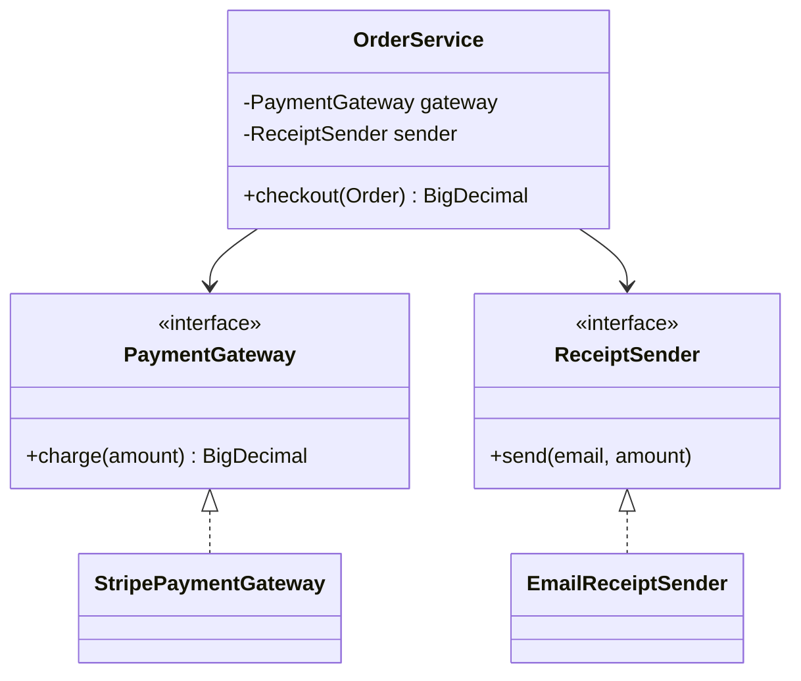

# Dependency injection pattern

**Dependency injection hands a class its collaborators from the outside, instead of letting the class create them itself, so you can swap collaborators without editing the class.**

## The problem

You're building the order flow for a coffee shop app. `OrderService` needs to charge a card and send a receipt. Without dependency injection, it builds its own collaborators:

```java
public class OrderService {
    public BigDecimal checkout(Order order) {
        StripePaymentGateway gateway = new StripePaymentGateway("secret-key-123");
        BigDecimal charged = gateway.charge(order.total());
        EmailReceiptSender sender = new EmailReceiptSender("smtp.shop.com");
        sender.send(order.customerEmail(), charged);
        return charged;
    }
}
```

This code has three issues:

- `OrderService` is tied to Stripe and to email; switching payment providers means editing this class.
- You can't test `checkout` without hitting a real payment API and a real mail server.
- The API key and SMTP host are buried inside a method instead of configured once.

## The idea

Dependency injection (DI) means a class receives its dependencies through its constructor (or, less often, a setter) rather than constructing them itself. The class depends on an interface, and something else decides which implementation to hand it.

That "something else" is usually a small piece of code called the composition root, often just `main`, that builds every object graph once and wires it together. A DI framework (Spring, Guice) can do this wiring for you, but the idea works with plain constructors too.



*`OrderService` never builds a gateway or sender; the composition root passes them in.*

## How it works

1. Define an interface for each collaborator the class needs (`PaymentGateway`, `ReceiptSender`).
2. Write one or more implementations of each interface.
3. Give the dependent class a constructor that takes the interfaces as parameters.
4. In one place (the composition root), construct the implementations and pass them to the constructor.
5. Never call `new` for a dependency from inside business logic.

## Example

`Order` is a plain record. Money is a `BigDecimal`, never a `double`, since binary floating-point can't represent amounts like 4.50 exactly:

```java
public record Order(String customerEmail, BigDecimal total) {}
```

The interfaces and one real implementation each:

```java
public interface PaymentGateway {
    BigDecimal charge(BigDecimal amount);
}

public interface ReceiptSender {
    void send(String email, BigDecimal amount);
}

public class StripePaymentGateway implements PaymentGateway {
    private final String apiKey;
    public StripePaymentGateway(String apiKey) { this.apiKey = apiKey; }

    public BigDecimal charge(BigDecimal amount) {
        // call out to Stripe with apiKey
        return amount;
    }
}

public class EmailReceiptSender implements ReceiptSender {
    private final String smtpHost;
    public EmailReceiptSender(String smtpHost) { this.smtpHost = smtpHost; }

    public void send(String email, BigDecimal amount) {
        // send a receipt email through smtpHost
    }
}
```

A fake implementation for tests, with no network calls:

```java
public class FakePaymentGateway implements PaymentGateway {
    public BigDecimal lastCharged;

    public BigDecimal charge(BigDecimal amount) {
        lastCharged = amount;
        return amount;
    }
}
```

`OrderService` takes both dependencies through its constructor:

```java
public class OrderService {
    private final PaymentGateway gateway;
    private final ReceiptSender sender;

    public OrderService(PaymentGateway gateway, ReceiptSender sender) {
        this.gateway = gateway;
        this.sender = sender;
    }

    public BigDecimal checkout(Order order) {
        BigDecimal charged = gateway.charge(order.total());
        sender.send(order.customerEmail(), charged);
        return charged;
    }
}
```

The composition root wires the real objects together in one place:

```java
public class Main {
    public static void main(String[] args) {
        PaymentGateway gateway = new StripePaymentGateway(System.getenv("STRIPE_KEY"));
        ReceiptSender sender = new EmailReceiptSender("smtp.shop.com");
        OrderService orders = new OrderService(gateway, sender);

        orders.checkout(new Order("cust@example.com", new BigDecimal("4.50")));
    }
}
```

- `OrderService` never mentions Stripe, email, or an API key.
- A test builds `new OrderService(new FakePaymentGateway(), fakeSender)` and asserts on `lastCharged`.
- Only `Main` knows how the real objects are constructed.

DI is not the same idea as the dependency inversion principle, even though the names overlap. Dependency inversion says depend on abstractions, not concrete classes. DI is one technique for satisfying that: it supplies the abstraction's implementation from outside, at construction time.

An alternative you'll see in older code is the service locator: a class asks a global registry for its dependencies (`Locator.get(PaymentGateway.class)`). It solves the same construction problem, but it hides what a class needs behind a lookup instead of declaring it in the constructor, which makes dependencies harder to see and to test.

## When to use it

- A class depends on something with more than one implementation (a real gateway and a fake one).
- You want to unit test a class without touching a database, network, or filesystem.
- The dependency's configuration (keys, hosts, timeouts) belongs in one place, not scattered across classes.

## When not to use it

- A stateless helper with no side effects and no alternate implementation, such as a math utility.
- A tiny script where one composition root and one implementation will ever exist; wiring adds no value there.

## Trade-offs

| Benefit | Cost |
|---|---|
| Classes are easy to test with fakes | Constructors grow longer as dependencies grow |
| Swapping an implementation touches one place | Object graphs can get hard to trace without a framework |
| Configuration lives in the composition root, not scattered | Overuse turns simple classes into interfaces for no reason |

## Common mistakes

| ✅ Do | ❌ Don't |
|---|---|
| Pass dependencies through the constructor | Call `new` for a dependency inside a business method |
| Depend on an interface | Depend on a concrete class like `StripePaymentGateway` |
| Build the object graph in one composition root | Scatter object construction across many classes |
| Inject only what a class actually uses | Inject a large "god object" with everything in it |

## Related topics

- [Repository pattern](repository-pattern.md)
- [MVC pattern](mvc-pattern.md)
- [Specification pattern](specification-pattern.md)
- [Separation of concerns](../principles/separation-of-concerns.md)

## Key takeaways

- A class receives its dependencies from outside instead of constructing them.
- A composition root, often `main`, is the one place that wires real implementations together.
- DI makes unit testing easy: pass in a fake instead of a real dependency.
- DI is a technique, not the dependency inversion principle itself; don't confuse the two.
