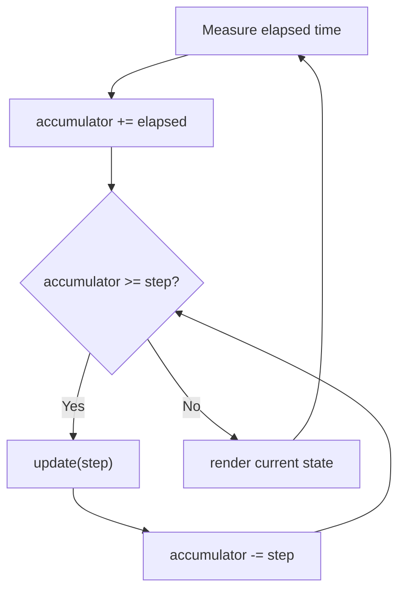

# Game loop pattern

**The game loop pattern runs a game's update and render steps over and over at a steady rate, so gameplay moves at the same speed regardless of how fast the machine draws frames.**

## The problem

You're building a simple game where a ball falls under gravity. A naive first version updates position once per rendered frame:

```java
public class FallingBallGame {
    private double y = 0;
    private double velocity = 0;

    public void runFrame() {
        velocity += 9.8;   // gravity, applied once per frame
        y += velocity;
        render(y);
    }
}
```

This code has three issues:

- On a fast machine that renders 200 frames per second, the ball falls eight times faster than on one that renders 25 frames per second.
- There's no separation between "how the world changes" and "how it's drawn," so testing the physics means also rendering.
- A slow frame (the OS pauses the process for 200ms) causes a visible jump instead of a smooth catch-up.

## The idea

A game loop separates two steps: `update`, which advances game state by a fixed slice of time, and `render`, which draws the current state. The loop measures real elapsed time and calls `update` as many times as needed to keep game time in sync with real time, using a fixed timestep (for example, 1/60th of a second) so physics behaves the same regardless of frame rate.

An accumulator tracks leftover time between frames. Each iteration adds the frame's elapsed time to the accumulator, then drains it in fixed-size steps, calling `update` once per step. Rendering happens once per loop iteration, using whatever state `update` left behind.



*Update runs in fixed steps drained from the accumulator; render runs once per loop pass.*

## How it works

1. Pick a fixed timestep, such as 1/60 second, small enough that physics looks smooth.
2. Each loop pass, measure how much real time has elapsed since the last pass.
3. Add that elapsed time to an accumulator.
4. While the accumulator holds at least one timestep, call `update(step)` and subtract the step from the accumulator.
5. After draining the accumulator, call `render()` once with the latest state.
6. Repeat until the game exits.

A variable timestep, where you pass the actual elapsed time straight into `update`, is simpler but makes physics depend on frame rate: a big lag spike can make an object tunnel through a wall in one giant step. The fixed-step accumulator avoids that by always stepping the same small amount.

## Example

The world holds physics state and knows how to advance by one fixed step:

```java
public class BallWorld {
    private double y = 0;
    private double velocity = 0;
    private static final double GRAVITY = 9.8;

    public void update(double stepSeconds) {
        velocity += GRAVITY * stepSeconds;
        y += velocity * stepSeconds;
        if (y < 0) { y = 0; velocity = 0; } // hit the ground
    }

    public double y() { return y; }
}
```

The loop drives `update` and `render` at a fixed rate:

```java
public class GameLoop {
    private static final double STEP_SECONDS = 1.0 / 60.0;

    public void run(BallWorld world, Renderer renderer) {
        long previous = System.nanoTime();
        double accumulator = 0.0;

        while (!renderer.shouldClose()) {
            long now = System.nanoTime();
            accumulator += (now - previous) / 1_000_000_000.0;
            previous = now;

            double maxCatchUp = STEP_SECONDS * 5;
            if (accumulator > maxCatchUp) {
                accumulator = maxCatchUp; // avoid a death spiral after a long pause
            }

            while (accumulator >= STEP_SECONDS) {
                world.update(STEP_SECONDS);
                accumulator -= STEP_SECONDS;
            }

            renderer.render(world.y());
        }
    }
}

public interface Renderer {
    void render(double ballY);
    boolean shouldClose();
}
```

- `BallWorld.update` takes a fixed step, so a test can call it 60 times and assert on `y()` without any timing or rendering.
- The inner `while` loop can run zero, one, or several times per pass, depending on how much time actually elapsed.
- `renderer.render` only ever sees the latest state; it never drives game logic.

## When to use it

- Real-time simulations or games where state must advance at a consistent rate.
- Any loop where "how fast the machine runs" shouldn't change "how fast the simulation runs."
- Systems that mix cheap per-frame work (rendering) with more expensive, rate-sensitive work (physics, AI ticks).

## When not to use it

- Turn-based or event-driven systems with no continuous simulation; a request-response or state machine model fits better.
- A UI that only redraws on user input, with no ongoing state that changes on its own.

## Trade-offs

| Benefit | Cost |
|---|---|
| Game speed is independent of frame rate | Slightly more code than a naive per-frame update |
| Physics is deterministic and testable without a renderer | A very slow machine can spend all its time catching up ("spiral of death") without a cap |
| Smooth handling of frame-rate variation | Requires picking a sensible fixed step up front |

## Common mistakes

| ✅ Do | ❌ Don't |
|---|---|
| Apply gravity and movement per fixed step | Multiply movement by the raw frame time every frame |
| Keep `update` free of rendering calls | Call `render` from inside `update` |
| Cap the accumulator drain to avoid a death spiral | Let a huge lag spike trigger thousands of catch-up updates |
| Test `update` directly with a fixed step | Test physics only by watching the rendered game run |

## Related topics

- [MVC pattern](mvc-pattern.md)
- [Thread pool pattern](thread-pool-pattern.md)

## Key takeaways

- A game loop separates `update` (game state) from `render` (drawing).
- A fixed timestep with an accumulator keeps simulation speed independent of frame rate.
- A variable timestep is simpler but makes physics unstable under lag spikes.
- Cap how much the accumulator can drain per pass to avoid a death spiral on slow frames.
