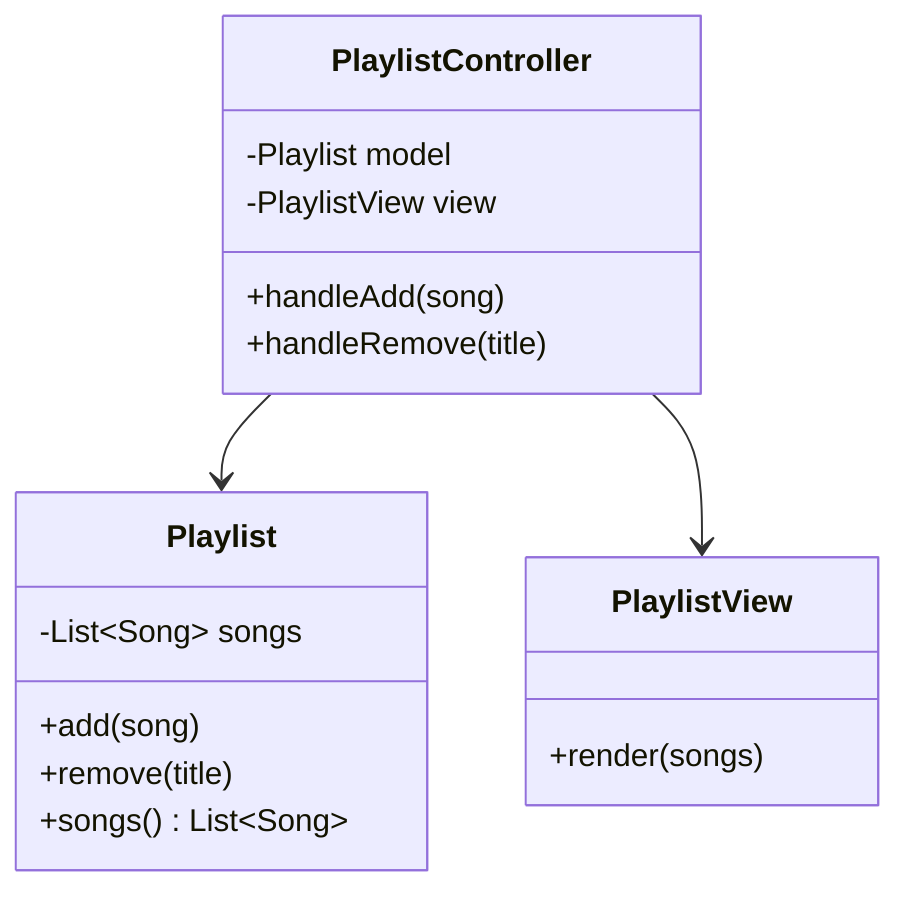

# MVC pattern

**MVC (model-view-controller) splits an app into data (model), display (view), and input handling (controller), so a change to one doesn't ripple into the others.**

## The problem

You're building a music player app. A screen shows the current playlist and reacts to button clicks. Without MVC, one class does everything:

```java
public class PlaylistScreen {
    private List<Song> songs = new ArrayList<>();

    public void onAddButtonClicked(Song song) {
        songs.add(song);
        System.out.println("Playlist (" + songs.size() + " songs):");
        for (Song s : songs) {
            System.out.println("- " + s.title() + " by " + s.artist());
        }
    }

    public void onRemoveButtonClicked(String title) {
        songs.removeIf(s -> s.title().equals(title));
        // ... repeat the same printing code
    }
}
```

This code has three issues:

- Playlist data, the rules for changing it, and the printing logic are all in one class.
- You can't test the playlist logic without triggering a print to the console.
- Adding a second view, like a mobile widget, means copying the button-handling code.

## The idea

MVC separates three responsibilities. The model holds data and the rules for changing it. The view displays the model's state. The controller takes input and decides how the model should change.

The controller is the only one that changes the model. The view only reads from the model, or listens for changes to it. Neither the model nor the view calls back into the controller directly.



*The controller updates the model; the view reads the model but never changes it.*

## How it works

1. The model holds state and enforces rules about that state. It knows nothing about controllers or views.
2. The view renders the model's current state. It has no logic beyond formatting.
3. The controller receives input events (a click, an API call, a keypress).
4. The controller calls methods on the model to change state.
5. The controller tells the view to refresh, or the view observes the model and refreshes on its own.

## Example

The model holds the playlist and its rules:

```java
public class Playlist {
    private final List<Song> songs = new ArrayList<>();

    public void add(Song song) {
        if (songs.contains(song)) {
            throw new IllegalArgumentException("Song already in playlist");
        }
        songs.add(song);
    }

    public void remove(String title) {
        songs.removeIf(s -> s.title().equals(title));
    }

    public List<Song> songs() {
        return List.copyOf(songs);
    }
}

public record Song(String title, String artist) {}
```

The view only knows how to render a list of songs:

```java
public class PlaylistView {
    public void render(List<Song> songs) {
        System.out.println("Playlist (" + songs.size() + " songs):");
        for (Song s : songs) {
            System.out.println("- " + s.title() + " by " + s.artist());
        }
    }
}
```

The controller wires input to the model, then refreshes the view:

```java
public class PlaylistController {
    private final Playlist model;
    private final PlaylistView view;

    public PlaylistController(Playlist model, PlaylistView view) {
        this.model = model;
        this.view = view;
    }

    public void handleAdd(Song song) {
        model.add(song);
        view.render(model.songs());
    }

    public void handleRemove(String title) {
        model.remove(title);
        view.render(model.songs());
    }
}
```

- `Playlist` enforces "no duplicate songs" and doesn't know a view exists.
- `PlaylistView` has no business rules, only formatting.
- A test creates a `Playlist` and calls `add` directly, with no controller or view involved.
- Adding a `PlaylistWidgetView` for a second screen needs no change to `Playlist` or `PlaylistController`.

## When to use it

- The app has a UI, whether a desktop window, a web page, or a CLI screen.
- You want to unit test business rules without rendering anything.
- You expect more than one view of the same data (web and mobile, or a summary and a detail view).

## When not to use it

- A short script with one input and one output; the split adds files without adding clarity.
- A pure data pipeline with no user-facing screen and no need to react to input.

## Trade-offs

| Benefit | Cost |
|---|---|
| Business rules are testable without a UI | More classes for a simple screen |
| Multiple views can share one model | Controller can grow large if it absorbs formatting logic too |
| Changing the display doesn't touch the model | Team must agree on where a given piece of logic belongs |

## Common mistakes

| ✅ Do | ❌ Don't |
|---|---|
| Let the controller be the only path to change the model | Let the view call `model.add()` directly |
| Keep validation rules inside the model | Put validation in the controller |
| Keep the view free of business logic | Format currency or dates by checking business rules in the view |
| Let one model support several views | Duplicate model state inside each view |

## Related topics

- [Repository pattern](repository-pattern.md)
- [Dependency injection pattern](dependency-injection-pattern.md)
- [Separation of concerns](../principles/separation-of-concerns.md)

## Key takeaways

- The model holds data and rules; the view displays it; the controller connects input to changes.
- Only the controller changes the model; the view only reads it.
- Splitting these roles lets you test rules without a UI and reuse a model across views.
- Skip MVC for scripts with no real display or input to separate.
