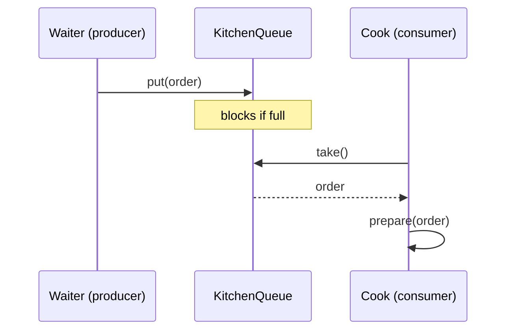

# Producer-consumer pattern

**The producer-consumer pattern connects threads that create work to threads that perform it through a shared queue, so the two sides run at their own pace instead of calling each other directly.**

## The problem

You're building the kitchen flow for a restaurant order system. Waiters take orders and cooks prepare them. A naive version has waiters call the cook directly:

```java
public class Waiter {
    private final Cook cook;
    public Waiter(Cook cook) { this.cook = cook; }

    public void takeOrder(Order order) {
        cook.prepare(order); // blocks the waiter until the dish is done
    }
}
```

This code has three issues:

- The waiter is stuck waiting for the cook to finish one dish before taking the next order.
- Nothing coordinates multiple waiters and multiple cooks; they'd need to know about each other directly.
- There's no way to smooth out bursts: ten orders at once means ten simultaneous direct calls.

## The idea

Producers create items of work and put them on a shared queue. Consumers take items off the same queue and process them. Neither side calls the other directly; the queue is the only thing they share.

A bounded, blocking queue does double duty: it hands off work safely between threads, and it applies backpressure. When the queue is full, producers block until a consumer makes room, which naturally slows down production instead of piling up unbounded work in memory.



*Producers and consumers never call each other; they only share the queue.*

## How it works

1. Create a bounded `BlockingQueue<T>` shared between producers and consumers.
2. A producer thread calls `queue.put(item)`, which blocks if the queue is full.
3. A consumer thread calls `queue.take()`, which blocks if the queue is empty.
4. Multiple producers and multiple consumers can share the same queue safely; the queue itself handles the coordination.
5. To shut down cleanly, producers stop and each consumer receives a poison pill, a sentinel value that tells it to exit its loop instead of waiting forever.

## Example

`Order` is a plain record:

```java
public record Order(String id, String dish) {}
```

The queue is shared, bounded, and holds `Order` items:

```java
public class KitchenQueue {
    static final Order POISON_PILL = new Order("__stop__", null);
    private final BlockingQueue<Order> queue = new ArrayBlockingQueue<>(20);

    public void put(Order order) throws InterruptedException {
        queue.put(order); // blocks when the queue holds 20 orders
    }

    public Order take() throws InterruptedException {
        return queue.take(); // blocks when the queue is empty
    }
}
```

A waiter is a producer that submits orders without waiting for them to be cooked:

```java
public class Waiter implements Runnable {
    private final KitchenQueue queue;
    private final List<Order> incomingOrders;

    public Waiter(KitchenQueue queue, List<Order> incomingOrders) {
        this.queue = queue;
        this.incomingOrders = incomingOrders;
    }

    public void run() {
        try {
            for (Order order : incomingOrders) {
                queue.put(order);
            }
        } catch (InterruptedException e) {
            Thread.currentThread().interrupt();
        }
    }
}
```

A cook is a consumer that loops until it sees the poison pill:

```java
public class Cook implements Runnable {
    private final KitchenQueue queue;

    public Cook(KitchenQueue queue) { this.queue = queue; }

    public void run() {
        try {
            while (true) {
                Order order = queue.take();
                if (order == KitchenQueue.POISON_PILL) {
                    queue.put(order); // let other cooks see it too, then stop
                    return;
                }
                prepare(order);
            }
        } catch (InterruptedException e) {
            Thread.currentThread().interrupt();
        }
    }

    private void prepare(Order order) {
        // cook the dish
    }
}
```

- `Waiter.run` never blocks on cooking; it only blocks briefly if the kitchen queue is full.
- Several `Cook` instances can read from the same `KitchenQueue` without any manual locking.
- `ArrayBlockingQueue`'s bound (20) is the backpressure: a busy kitchen slows down how fast waiters can submit new orders.
- On `InterruptedException`, both classes call `Thread.currentThread().interrupt()` to restore the interrupt flag instead of swallowing it.

## When to use it

- Work arrives at a different rate than it can be processed, and you want to smooth out bursts.
- You want to add more producers or more consumers without changing how the other side works.
- You need backpressure so a fast producer can't overwhelm memory with unprocessed work.

## When not to use it

- The producer needs the result immediately, as with a request-response call; a direct call or a `Future` fits better.
- There's exactly one producer and one consumer with no concurrency to manage; a plain method call is simpler.

## Trade-offs

| Benefit | Cost |
|---|---|
| Producers and consumers scale independently | An unbounded queue can hide a slow consumer until memory runs out |
| A bounded queue gives free backpressure | Producers can block, which needs handling (timeout, or accept the wait) |
| No direct coupling between the two sides | Shutdown needs a clear signal (poison pill or a shutdown flag) |

## Common mistakes

| ✅ Do | ❌ Don't |
|---|---|
| Use a bounded `BlockingQueue` for backpressure | Use an unbounded queue and hope consumers keep up |
| Signal shutdown with a poison pill or flag | Kill consumer threads abruptly mid-task |
| Call `Thread.currentThread().interrupt()` on `InterruptedException` | Swallow `InterruptedException` silently |
| Let the queue be the only shared state | Have producers and consumers call each other's methods directly |

## Related topics

- [Thread pool pattern](thread-pool-pattern.md)
- [Game loop pattern](game-loop-pattern.md)
- [How to handle concurrency scenarios](../tips/handle-concurrency.md)

## Key takeaways

- Producers and consumers coordinate only through a shared queue, never through direct calls.
- A bounded `BlockingQueue` gives you thread-safe handoff and backpressure in one structure.
- Use a poison pill or an explicit flag to shut consumers down cleanly.
- Always restore the interrupt flag after catching `InterruptedException`.
