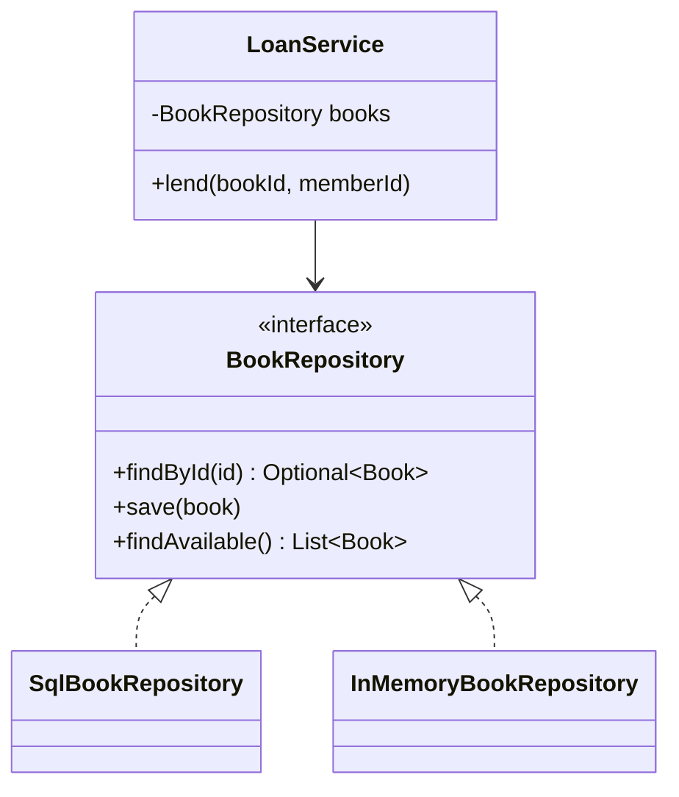

# Repository pattern

**The repository pattern puts all data access for one type of object behind a collection-like interface, so the rest of your code doesn't know where the data lives.**

## The problem

You're building a library app. The `LoanService` needs to find books, check their status, and save changes. Without a repository, the service talks to the database directly:

```java
public class LoanService {
    private final Connection connection;

    public void lend(String bookId, String memberId) throws SQLException {
        PreparedStatement query = connection.prepareStatement(
            "SELECT id, title, available FROM books WHERE id = ?");
        query.setString(1, bookId);
        ResultSet row = query.executeQuery();
        if (!row.next() || !row.getBoolean("available")) {
            throw new IllegalStateException("Book not available");
        }
        PreparedStatement update = connection.prepareStatement(
            "UPDATE books SET available = false WHERE id = ?");
        update.setString(1, bookId);
        update.executeUpdate();
        // ... record the loan
    }
}
```

This code has three issues:

- The business rule ("you can only lend an available book") is mixed with SQL.
- You can't test `lend` without a real database.
- If you move from SQL to a document store, you rewrite every service.

## The idea

A repository acts like an in-memory collection of domain objects. You ask it for a `Book` by ID, and you hand it a `Book` to save. How it stores the book is its own business.

The service depends on a `BookRepository` interface. One class implements it with SQL, another with a `HashMap` for tests. The service code stays the same.



*The service depends on the interface; each storage option is a separate implementation.*

## How it works

1. Define a domain class, such as `Book`, with no database code in it.
2. Define a repository interface with methods named in domain terms: `findById`, `findAvailable`, `save`.
3. Write one implementation per storage option.
4. Pass the repository into services through the constructor.
5. Keep business rules in the services or domain classes, never in the repository.

## Example

The domain class and the interface:

```java
public class Book {
    private final String id;
    private final String title;
    private boolean available = true;

    public Book(String id, String title) {
        this.id = id;
        this.title = title;
    }

    public void checkOut() {
        if (!available) throw new IllegalStateException("Book not available");
        available = false;
    }

    public String getId() { return id; }
    public boolean isAvailable() { return available; }
}

public interface BookRepository {
    Optional<Book> findById(String id);
    List<Book> findAvailable();
    void save(Book book);
}
```

An in-memory implementation, useful for tests and prototypes:

```java
public class InMemoryBookRepository implements BookRepository {
    private final Map<String, Book> store = new ConcurrentHashMap<>();

    public Optional<Book> findById(String id) {
        return Optional.ofNullable(store.get(id));
    }

    public List<Book> findAvailable() {
        return store.values().stream().filter(Book::isAvailable).toList();
    }

    public void save(Book book) {
        store.put(book.getId(), book);
    }
}
```

The service now reads like the business rule it enforces:

```java
public class LoanService {
    private final BookRepository books;

    public LoanService(BookRepository books) {
        this.books = books;
    }

    public void lend(String bookId, String memberId) {
        Book book = books.findById(bookId)
            .orElseThrow(() -> new IllegalArgumentException("No such book"));
        book.checkOut();
        books.save(book);
    }
}
```

- `LoanService` has no SQL and no storage details.
- The "must be available" rule lives in `Book.checkOut()`, where it belongs.
- A test creates `new LoanService(new InMemoryBookRepository())` and runs in milliseconds.

## When to use it

- Your domain logic is more than simple create, read, update, and delete.
- You want to unit test services without a database.
- You expect to change or mix storage options (SQL, cache, remote API).
- Several services load and save the same type of object.

## When not to use it

- A small script or a pure CRUD app where the framework already gives you data access.
- Your ORM already provides repositories (for example, Spring Data). Adding your own layer on top only duplicates it.

## Trade-offs

| Benefit | Cost |
|---|---|
| Business logic is free of storage code | One more interface and class per aggregate |
| Services are easy to test with fakes | Complex queries can be awkward to express as methods |
| Storage can change without touching services | Risk of a "leaky" repository that exposes SQL concepts |

## Common mistakes

| ✅ Do | ❌ Don't |
|---|---|
| Name methods in domain terms: `findOverdueLoans()` | Name methods after tables: `selectFromLoansWhereDue()` |
| Return domain objects | Return `ResultSet` or database rows |
| Keep one repository per aggregate root | Create a generic repository for every table |
| Keep business rules in domain classes | Put validation logic inside `save()` |

## Related topics

- [Dependency injection pattern](dependency-injection-pattern.md)
- [Specification pattern](specification-pattern.md)
- [Separation of concerns](../principles/separation-of-concerns.md)

## Key takeaways

- A repository makes storage look like a simple collection of domain objects.
- Services depend on the repository interface, not on a database.
- Swap in an in-memory implementation to test business logic quickly.
- Keep repositories focused on storage; business rules belong elsewhere.
