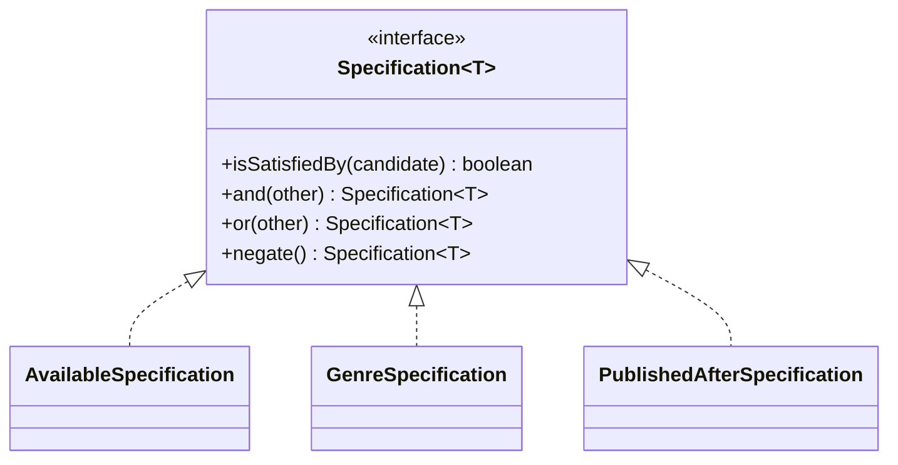

# Specification pattern

**The specification pattern wraps a business rule in its own object with an `isSatisfiedBy` check, so you can name, combine, and reuse filtering logic instead of writing it inline.**

## The problem

You're building search for a library catalog. A member wants available fiction books published after 2015. Without a specification, the filter lives inline wherever it's needed:

```java
public List<Book> search(List<Book> books) {
    List<Book> result = new ArrayList<>();
    for (Book b : books) {
        if (b.isAvailable() && b.genre() == Genre.FICTION && b.year() > 2015) {
            result.add(b);
        }
    }
    return result;
}
```

This code has three issues:

- The rule "available fiction after 2015" has no name; you can't reuse or test it on its own.
- A slightly different search (nonfiction, or after 2010) means copying and editing the condition.
- The condition can't be reused to explain a rejection, like "why isn't this book showing up?"

## The idea

A specification is an object with one method, `isSatisfiedBy(candidate)`, that returns true or false. Each specification represents one named rule. Specifications combine with `and`, `or`, and `not` to build compound rules without writing new classes for every combination.

This is close to `Predicate<T>` in Java, and for simple, one-off filters, a `Predicate` is enough. A specification adds a name for the rule, a place to put reusable domain logic, and, in some designs, a way to translate the same rule into a database query instead of only filtering in memory.



*Each rule is its own class; `and`/`or`/`negate` combine them without new classes.*

## How it works

1. Define a `Specification<T>` interface with `isSatisfiedBy(T candidate)`.
2. Add default methods `and`, `or`, and `negate` that combine specifications.
3. Write one class per named business rule.
4. Combine specifications at the call site to express compound rules.
5. Use the combined specification to filter a list, or to guard a single object before an action.

## Example

`Book` is the type the rules apply to:

```java
public class Book {
    private final String title;
    private final Genre genre;
    private final int year;
    private final boolean available;

    public Book(String title, Genre genre, int year, boolean available) {
        this.title = title;
        this.genre = genre;
        this.year = year;
        this.available = available;
    }

    public boolean isAvailable() { return available; }
    public Genre genre() { return genre; }
    public int year() { return year; }
}

public enum Genre { FICTION, NONFICTION }
```

The interface, with combinators as default methods:

```java
public interface Specification<T> {
    boolean isSatisfiedBy(T candidate);

    default Specification<T> and(Specification<T> other) {
        return candidate -> this.isSatisfiedBy(candidate) && other.isSatisfiedBy(candidate);
    }

    default Specification<T> or(Specification<T> other) {
        return candidate -> this.isSatisfiedBy(candidate) || other.isSatisfiedBy(candidate);
    }

    default Specification<T> negate() {
        return candidate -> !this.isSatisfiedBy(candidate);
    }
}
```

Named specifications for the library's rules:

```java
public class AvailableSpecification implements Specification<Book> {
    public boolean isSatisfiedBy(Book book) {
        return book.isAvailable();
    }
}

public class GenreSpecification implements Specification<Book> {
    private final Genre genre;
    public GenreSpecification(Genre genre) { this.genre = genre; }

    public boolean isSatisfiedBy(Book book) {
        return book.genre() == genre;
    }
}

public class PublishedAfterSpecification implements Specification<Book> {
    private final int year;
    public PublishedAfterSpecification(int year) { this.year = year; }

    public boolean isSatisfiedBy(Book book) {
        return book.year() > year;
    }
}
```

Combining them replaces the inline condition:

```java
public class BookSearch {
    public List<Book> search(List<Book> books, Specification<Book> spec) {
        return books.stream().filter(spec::isSatisfiedBy).toList();
    }
}

// usage
Specification<Book> availableFictionSince2015 =
    new AvailableSpecification()
        .and(new GenreSpecification(Genre.FICTION))
        .and(new PublishedAfterSpecification(2015));

List<Book> results = new BookSearch().search(books, availableFictionSince2015);
```

- Each rule has a name: `AvailableSpecification`, `GenreSpecification`.
- A nonfiction search reuses `AvailableSpecification` and swaps in a different `GenreSpecification`.
- Each specification is unit-testable on its own, with a single `Book` and no list.

## When to use it

- The same business rule shows up in more than one place (search, validation, alerts).
- Rules combine in different ways depending on context (staff search vs. member search).
- You want each rule named and testable on its own.

## When not to use it

- A one-off filter used in a single place. A `Predicate<Book>` built with a lambda does the same job with less code:
  `books.stream().filter(b -> b.isAvailable() && b.genre() == Genre.FICTION).toList()`.
- You need to translate rules into a SQL `WHERE` clause. Plain specifications only filter in-memory objects; querying a database well usually needs a separate query object or your ORM's own criteria API.

## Trade-offs

| Benefit | Cost |
|---|---|
| Rules are named, reusable, and independently testable | One class per rule adds files for simple checks |
| Rules combine without new classes for every combination | Combined specifications can be slow over large in-memory lists |
| Business logic reads like the rule it enforces | Doesn't replace a real query layer for large datasets |

## Common mistakes

| ✅ Do | ❌ Don't |
|---|---|
| Name a specification after the business rule | Name it after its implementation, like `BooleanCheck1` |
| Keep each specification focused on one rule | Cram several unrelated checks into one specification |
| Reuse specifications across search, validation, and alerts | Copy the same condition into each feature |
| Use `Predicate` for a rule used exactly once | Build a full specification class for a single inline check |

## Related topics

- [Repository pattern](repository-pattern.md)
- [Dependency injection pattern](dependency-injection-pattern.md)

## Key takeaways

- A specification wraps one business rule behind `isSatisfiedBy`.
- `and`, `or`, and `negate` combine rules without new classes.
- For a single inline filter, a plain `Predicate<T>` is simpler and just as clear.
- Specifications filter in-memory objects; they aren't a substitute for a query layer.
