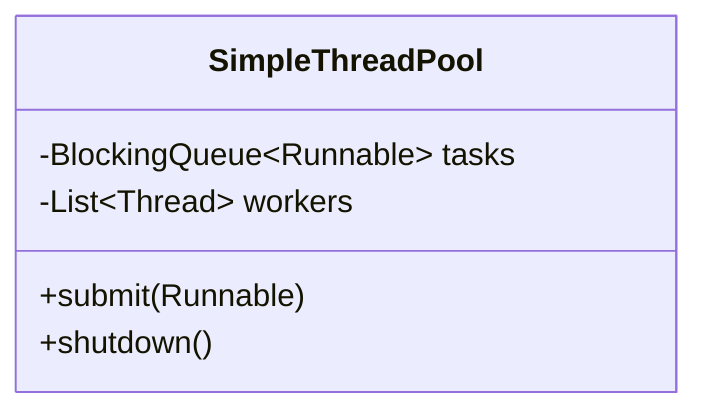

# Thread pool pattern

**A thread pool keeps a fixed set of worker threads that pull tasks from a shared queue, so you reuse threads instead of creating a new one for every task.**

## The problem

You're building the backend for a coffee shop's online ordering system. Each incoming order triggers work: charge the card, send a confirmation, update inventory. `Order` is a simple record with the order's details. A naive version spins up a new thread per order:

```java
public record Order(String id) {}

public class OrderHandler {
    public void handle(Order order) {
        new Thread(() -> process(order)).start();
    }

    private void process(Order order) {
        // charge card, send confirmation, update inventory
    }
}
```

This code has three issues:

- Creating an OS thread is expensive; a burst of 10,000 orders creates 10,000 threads and can crash the process.
- Nothing limits how much work runs at once, so the database and payment API get overwhelmed together.
- There's no way to apply backpressure; every order is accepted no matter how busy the system already is.

## The idea

A thread pool starts a fixed number of worker threads once, up front. Each worker repeatedly takes a task off a shared queue and runs it, then goes back for the next one. Submitting a task means adding it to the queue, not starting a thread.

The pool bounds concurrency: only as many tasks run at once as there are workers. A bounded queue in front of the pool adds backpressure, and a rejection policy decides what happens when both the workers and the queue are full.



*Workers are started once; `submit` only adds to the shared queue.*

## How it works

1. On startup, create N worker threads, where N is chosen based on the workload.
2. Each worker loops: take a task from the shared queue, run it, repeat.
3. `submit(task)` adds the task to the queue instead of starting a thread.
4. If the queue is bounded and full, a rejection policy decides: block the caller, drop the task, or run it on the caller's thread.
5. On shutdown, stop accepting new tasks, let queued tasks drain, then join the worker threads.

Pool sizing depends on the kind of work. CPU-bound tasks (compression, image resizing) benefit from a pool size close to the number of CPU cores, since more threads than cores just adds context-switching. I/O-bound tasks (network calls, database queries) can use a larger pool, since threads spend most of their time waiting, not competing for the CPU.

## Example

A minimal hand-built pool, to show the mechanism:

```java
public class SimpleThreadPool {
    private final BlockingQueue<Runnable> tasks = new LinkedBlockingQueue<>();
    private final List<Thread> workers = new ArrayList<>();
    private volatile boolean shuttingDown = false;

    public SimpleThreadPool(int size) {
        for (int i = 0; i < size; i++) {
            Thread worker = new Thread(this::workLoop, "worker-" + i);
            worker.start();
            workers.add(worker);
        }
    }

    private void workLoop() {
        while (!shuttingDown || !tasks.isEmpty()) {
            try {
                Runnable task = tasks.poll(200, TimeUnit.MILLISECONDS);
                if (task != null) task.run();
            } catch (InterruptedException e) {
                Thread.currentThread().interrupt();
                return;
            }
        }
    }

    public void submit(Runnable task) {
        if (shuttingDown) throw new IllegalStateException("Pool is shutting down");
        tasks.add(task);
    }

    public void shutdown() {
        shuttingDown = true;
        for (Thread worker : workers) {
            try {
                worker.join();
            } catch (InterruptedException e) {
                Thread.currentThread().interrupt();
            }
        }
    }
}
```

- Workers are started once in the constructor, not per task.
- `submit` only enqueues; the caller returns immediately.
- `shutdown` stops accepting new work, lets queued tasks finish, then joins every worker thread.

In real code, don't hand-roll this. Use `java.util.concurrent`:

```java
ExecutorService pool = Executors.newFixedThreadPool(8);

pool.submit(() -> process(order));

// on shutdown
pool.shutdown();
pool.awaitTermination(30, TimeUnit.SECONDS);
```

`ExecutorService` doesn't implement `AutoCloseable` until JDK 19, so on Java 17 call `shutdown()` and `awaitTermination()` explicitly instead of try-with-resources. For control over the queue size and rejection behavior, construct a `ThreadPoolExecutor` directly:

```java
ThreadPoolExecutor pool = new ThreadPoolExecutor(
    4, 8, 60, TimeUnit.SECONDS,
    new ArrayBlockingQueue<>(100),
    new ThreadPoolExecutor.CallerRunsPolicy());
```

`CallerRunsPolicy` makes the submitting thread run the task itself when the queue is full, which slows down whoever is submitting instead of dropping work.

## When to use it

- The app handles many short-lived, similar tasks (requests, orders, jobs).
- Unbounded thread creation risks exhausting memory or OS thread limits.
- You want a single place to control concurrency limits and backpressure.

## When not to use it

- A handful of long-running, distinct background tasks; a few dedicated threads are clearer than a pool.
- Tasks that must run in strict order; a pool's workers pick up tasks independently, with no ordering guarantee.

## Trade-offs

| Benefit | Cost |
|---|---|
| Reuses threads instead of creating one per task | Wrong pool size hurts throughput (too few) or wastes memory (too many) |
| Bounds concurrency and memory use | A misconfigured rejection policy can silently drop work |
| One place to tune size, queue, and rejection behavior | Debugging requires understanding which worker ran which task |

## Common mistakes

| ✅ Do | ❌ Don't |
|---|---|
| Reuse a fixed pool for many small tasks | Create a new `Thread` per task |
| Size CPU-bound pools near the core count | Use a huge pool for CPU-bound work |
| Use a bounded queue with a rejection policy | Use an unbounded queue that can grow without limit |
| Call `shutdown()` then `awaitTermination()` on Java 17 | Assume `ExecutorService` is `AutoCloseable` before JDK 19 |

## Related topics

- [Producer-consumer pattern](producer-consumer-pattern.md)
- [Game loop pattern](game-loop-pattern.md)
- [How to handle concurrency scenarios](../tips/handle-concurrency.md)

## Key takeaways

- A thread pool starts workers once and reuses them for every submitted task.
- A bounded queue plus a rejection policy gives you backpressure instead of unbounded growth.
- Size the pool to the workload: cores for CPU-bound, larger for I/O-bound.
- Prefer `Executors` or `ThreadPoolExecutor` over hand-rolling a pool in real code.
