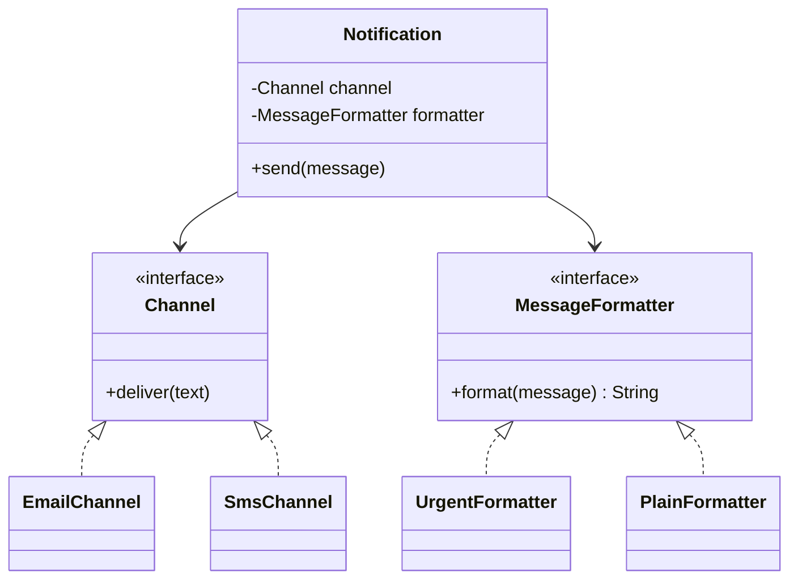

# Composing objects principle

**The composing objects principle says to build behavior by combining small objects through references, instead of extending a base class for every new combination — "favor composition over inheritance."**

## The problem

You're building a notification service. It starts with email, then grows:

```java
public class Notification {
    public void send(String message) { System.out.println("Email: " + message); }
}

public class SmsNotification extends Notification {
    @Override
    public void send(String message) { System.out.println("SMS: " + message); }
}

public class UrgentSmsNotification extends SmsNotification {
    @Override
    public void send(String message) { System.out.println("URGENT SMS: " + message.toUpperCase()); }
}

public class UrgentEmailNotification extends Notification {
    @Override
    public void send(String message) { System.out.println("URGENT EMAIL: " + message.toUpperCase()); }
}
```

Every new combination of channel and urgency needs a new subclass. Add push notifications and a "retry" behavior, and the subclass count multiplies: `UrgentPushNotification`, `RetryingSmsNotification`, `RetryingUrgentEmailNotification`. Two problems show up:

- The class hierarchy grows faster than the actual number of behaviors.
- A shared base class change (say, a new required field) can break every subclass — the fragile base class problem.

## The idea

Instead of inheriting behavior, compose it. Each behavior — the channel, the urgency, the retry policy — becomes its own small object. A notification holds references to the ones it needs and delegates to them.

Inheritance models a rigid "is-a" relationship fixed at compile time. Composition models "has-a" and lets you assemble behavior at runtime, by choosing which objects to plug in. You get the same combinations with objects, not with a subclass per combination.



*`Notification` holds a channel and a formatter; new combinations need no new class.*

## How it works

1. Identify the independent behaviors hidden in your subclasses (here: delivery channel, urgency formatting).
2. Define an interface for each behavior.
3. Write one small implementation per variant of each behavior.
4. Give the main class fields that hold these interfaces, set through its constructor.
5. Delegate to the fields instead of overriding methods in subclasses.

## Example

Define the two behaviors as interfaces with focused implementations:

```java
public interface Channel {
    void deliver(String text);
}

public class EmailChannel implements Channel {
    public void deliver(String text) { System.out.println("Email: " + text); }
}

public class SmsChannel implements Channel {
    public void deliver(String text) { System.out.println("SMS: " + text); }
}

public interface MessageFormatter {
    String format(String message);
}

public class PlainFormatter implements MessageFormatter {
    public String format(String message) { return message; }
}

public class UrgentFormatter implements MessageFormatter {
    public String format(String message) { return "URGENT: " + message.toUpperCase(); }
}
```

`Notification` composes the two behaviors instead of extending anything:

```java
public class Notification {
    private final Channel channel;
    private final MessageFormatter formatter;

    public Notification(Channel channel, MessageFormatter formatter) {
        this.channel = channel;
        this.formatter = formatter;
    }

    public void send(String message) {
        channel.deliver(formatter.format(message));
    }
}
```

Any combination is one line, with no new class:

```java
Notification urgentSms = new Notification(new SmsChannel(), new UrgentFormatter());
Notification plainEmail = new Notification(new EmailChannel(), new PlainFormatter());
urgentSms.send("Server is down");
```

- Adding push notifications means one new `Channel` implementation, not a subclass per urgency level.
- Adding a retry policy means a third interface, composed the same way — no combinatorial growth.
- Each piece is independently testable: verify `UrgentFormatter.format` without touching delivery at all.

## When to use it

- You find yourself creating a subclass for every combination of two or more independent behaviors.
- Behavior needs to change at runtime (swap the channel per user preference), not just at compile time.
- You want to test one behavior without instantiating the whole hierarchy.

## When not to use it

- The behavior truly is a fixed, single-axis specialization with no combinations (a `Circle` is-a `Shape`, and nothing else varies).
- Introducing interfaces for a single, never-changing variant adds ceremony with no payoff.

## Trade-offs

| Benefit | Cost |
|---|---|
| New combinations need no new class | More interfaces and small classes upfront |
| Behavior can change at runtime | Wiring the right objects together takes more constructor calls |
| Each behavior is testable in isolation | Slightly less obvious "what does this object do" without reading its fields |

## Common mistakes

| ✅ Do | ❌ Don't |
|---|---|
| Extract independent behaviors into interfaces | Create a subclass for every combination of behaviors |
| Inject behavior objects through the constructor | Override methods to change one small piece of behavior |
| Use inheritance for a true, fixed "is-a" relationship | Use inheritance just to reuse a few lines of code |
| Keep each behavior interface small and focused | Build one interface with every possible method |

## Related topics

- [Separation of concerns](separation-of-concerns.md)
- [Coupling and cohesion](coupling-and-cohesion.md)
- [Repository pattern](../patterns/repository-pattern.md)

## Key takeaways

- Composition combines small objects through references; inheritance fixes behavior at compile time.
- Watch for subclass counts growing with each new combination — that's the signal to switch.
- Extract each independent behavior into its own interface and inject it.
- Reserve inheritance for genuine, single-axis "is-a" relationships.
