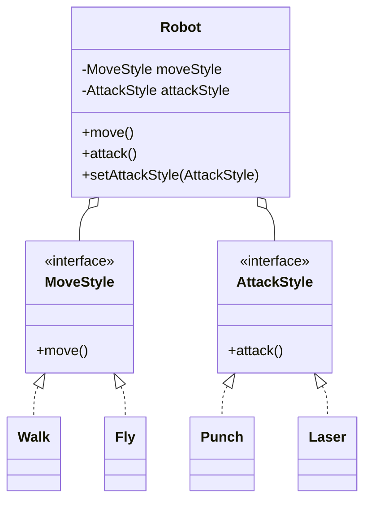

# Composition over inheritance

**Inheritance says an object *is a* kind of something. Composition says it *has a* part that does the job. Composition is usually safer, because you can combine and swap parts instead of being locked into one family tree.**

## The problem with inheritance

You're building a game with robots. You start with inheritance:

```java
class Robot {
    void move() { System.out.println("Walking"); }
    void attack() { System.out.println("Punching"); }
}

class LaserRobot extends Robot {
    @Override void attack() { System.out.println("Firing laser"); }
}

class FlyingRobot extends Robot {
    @Override void move() { System.out.println("Flying"); }
}
```

That works so far. Then the designer asks for a **flying robot with a laser**.

- `FlyingLaserRobot extends FlyingRobot` means you copy the laser code from `LaserRobot`.
- `FlyingLaserRobot extends LaserRobot` means you copy the flying code instead.
- Java lets a class extend only one parent, so you can't take from both.

Now add swimming and a sword. With inheritance, you need a class for every combination:

```
3 ways to move × 3 ways to attack = 9 classes
4 × 4 = 16 classes
```

A second problem: a robot can't change how it attacks while the game is running. Its behavior is fixed by the class it was created from.

## The composition fix

Break the robot into parts. Each part is a small interface:

```java
interface MoveStyle   { void move(); }
interface AttackStyle { void attack(); }

class Walk  implements MoveStyle   { public void move()   { System.out.println("Walking"); } }
class Fly   implements MoveStyle   { public void move()   { System.out.println("Flying"); } }
class Punch implements AttackStyle { public void attack() { System.out.println("Punching"); } }
class Laser implements AttackStyle { public void attack() { System.out.println("Firing laser"); } }
```

The robot **has** a move style and an attack style, and hands the work to them:

```java
class Robot {
    private MoveStyle moveStyle;
    private AttackStyle attackStyle;

    Robot(MoveStyle moveStyle, AttackStyle attackStyle) {
        this.moveStyle = moveStyle;
        this.attackStyle = attackStyle;
    }

    void move()   { moveStyle.move(); }
    void attack() { attackStyle.attack(); }

    void setAttackStyle(AttackStyle newStyle) { this.attackStyle = newStyle; }
}
```



*The robot holds two parts and delegates to them; each part has its own small family of implementations.*

Build any combination without writing a new class:

```java
Robot basic       = new Robot(new Walk(), new Punch());
Robot flyingLaser = new Robot(new Fly(),  new Laser());   // the combination that was hard before

flyingLaser.move();    // Flying
flyingLaser.attack();  // Firing laser

basic.setAttackStyle(new Laser());   // picks up a laser gun mid-game
basic.attack();        // Firing laser
```

## What changed

| | Inheritance | Composition |
|---|---|---|
| Relationship | Robot **is a** LaserRobot | Robot **has a** Laser |
| New combination | New subclass | Pass different parts to the constructor |
| 4 moves × 4 attacks | 16 classes | 8 small classes |
| Change behavior at runtime | Not possible | Call a setter |
| Adding a sword | Touches the class tree | One new `Sword implements AttackStyle` |

## A second trap: inheriting things you can't do

```java
class Bird { void fly() { ... } }
class Penguin extends Bird {
    @Override void fly() { throw new UnsupportedOperationException(); }
}
```

Code that loops over `List<Bird>` and calls `fly()` crashes on a penguin. The subclass breaks the parent's promise, which is a Liskov Substitution Principle (LSP) violation. With composition, a penguin gets `Swim` as its move style, and nothing ever calls a `fly()` it can't do.

## When inheritance is still fine

Use inheritance when all three of these are true:

1. It's truly an "is a" relationship that will never change. A `SavingsAccount` is a `BankAccount`.
2. The child can do **everything** the parent promises, with no exceptions thrown.
3. The hierarchy is shallow: one or two levels.

If any of these is false, use composition.

## How to remember it

- Inheritance: the robot is born with fixed abilities.
- Composition: the robot is built from parts you can plug in and swap.

This is how the Strategy pattern works: `MoveStyle` and `AttackStyle` are strategies. The parking lot article does the same with `PricingStrategy`.

## Related topics

- [Composing objects principle](composing-objects-principle.md)
- [When to use principles and patterns](../when-to-use-what.md)
- [Design a parking lot](../questions/design-parking-lot.md)
