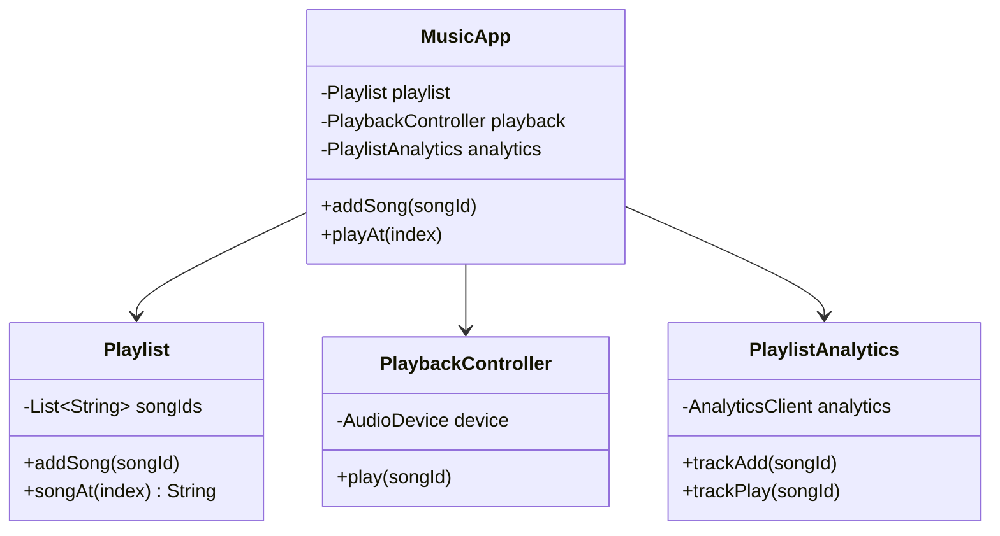

# Coupling and cohesion

**Coupling measures how tightly one class depends on another; cohesion measures how well a class's own members belong together. Good design keeps coupling low and cohesion high.**

## The problem

You're building a music app. A `Playlist` class tracks songs, but it also handles audio playback and sends analytics events:

```java
public class Playlist {
    private final List<String> songIds = new ArrayList<>();
    private final AudioDevice device = new AudioDevice();
    private final AnalyticsClient analytics = new AnalyticsClient("prod-key");

    public void addSong(String songId) {
        songIds.add(songId);
        analytics.track("song_added", songId);
    }

    public void play(int index) {
        device.load(songIds.get(index));
        device.start();
        analytics.track("song_played", songIds.get(index));
    }
}
```

`AudioDevice` loads and starts playback; `AnalyticsClient` sends a named event to a metrics backend:

```java
public class AudioDevice {
    public void load(String songId) { /* ... */ }
    public void start() { /* ... */ }
}

public class AnalyticsClient {
    public AnalyticsClient(String apiKey) { /* ... */ }
    public void track(String event, String songId) { /* ... */ }
}
```

Two problems hide here:

- **Coupling:** `Playlist` constructs `AudioDevice` and `AnalyticsClient` itself. You can't test it without a real audio device or a live analytics key.
- **Cohesion:** the class holds song order, playback control, and event tracking. These are three unrelated jobs living in one class, so a change to any one of them risks breaking the others.

## The idea

Coupling is about relationships *between* classes: how much one class knows about another's internals, and how hard it is to change one without changing the other. Low coupling means classes interact through small, stable interfaces.

Cohesion is about consistency *within* a class: whether its fields and methods all work toward the same purpose. High cohesion means you can describe a class's job in one short sentence, and every method serves that sentence.

The two usually move together. A class with low cohesion (doing several unrelated jobs) tends to pull in dependencies for each job, which raises coupling. Splitting it into cohesive pieces naturally reduces how much any one piece depends on.



*`MusicApp` composes the three focused classes; none of them depend on each other.*

## How it works

1. For each class, write a one-sentence description of its job. If the sentence has "and" in it, the class likely does too much.
2. Move fields and methods that don't fit the sentence into a new class.
3. Depend on other classes through constructor parameters, not by constructing them internally.
4. Depend on interfaces or small method sets, not on another class's full implementation.
5. Re-check: can you change `PlaybackController` without touching `Playlist`? If not, coupling is still too high.

## Example

Split playback and analytics out of `Playlist`, and inject dependencies instead of creating them:

```java
public class Playlist {
    private final List<String> songIds = new ArrayList<>();

    public void addSong(String songId) { songIds.add(songId); }
    public String songAt(int index) { return songIds.get(index); }
    public int size() { return songIds.size(); }
}

public class PlaybackController {
    private final AudioDevice device;
    public PlaybackController(AudioDevice device) { this.device = device; }

    public void play(String songId) {
        device.load(songId);
        device.start();
    }
}

public class PlaylistAnalytics {
    private final AnalyticsClient analytics;
    public PlaylistAnalytics(AnalyticsClient analytics) { this.analytics = analytics; }

    public void trackAdd(String songId) { analytics.track("song_added", songId); }
    public void trackPlay(String songId) { analytics.track("song_played", songId); }
}
```

A coordinator ties them together for the app's "play song" action:

```java
public class MusicApp {
    private final Playlist playlist;
    private final PlaybackController playback;
    private final PlaylistAnalytics analytics;

    public MusicApp(Playlist playlist, PlaybackController playback, PlaylistAnalytics analytics) {
        this.playlist = playlist;
        this.playback = playback;
        this.analytics = analytics;
    }

    public void addSong(String songId) {
        playlist.addSong(songId);
        analytics.trackAdd(songId);
    }

    public void playAt(int index) {
        String songId = playlist.songAt(index);
        playback.play(songId);
        analytics.trackPlay(songId);
    }
}
```

- `Playlist` now only tracks song order — one sentence, one job, high cohesion.
- `MusicApp` depends on `PlaybackController` and `PlaylistAnalytics` through their constructors, so tests can pass in fakes.
- Swapping the analytics provider means changing one constructor argument, not editing `Playlist`.

## When to use it

- A class's fields split into groups that never interact with each other.
- Testing a class requires setting up unrelated dependencies (a database, a network client) just to check one piece of logic.
- Two classes change together so often that a change in one always forces a change in the other.

## When not to use it

- A small, single-purpose utility class where splitting further adds no clarity.
- Very early prototyping, where the shape of the design is still unclear and premature splitting slows you down.

## Trade-offs

| Benefit | Cost |
|---|---|
| Classes are easier to read, name, and test | More classes and constructor wiring |
| Changes stay local, reducing regression risk | Requires judgment to draw the line correctly |
| Dependencies are explicit and swappable | Over-decoupling can scatter simple logic across files |

## Common mistakes

| ✅ Do | ❌ Don't |
|---|---|
| Depend on interfaces passed into the constructor | Construct dependencies with `new` inside business logic |
| Give a class one clear responsibility | Add "and also" fields to an existing class for convenience |
| Split when two jobs can change independently | Split classes with no independent reason to change |
| Check cohesion with a one-sentence description | Judge cohesion only by line count |

## Related topics

- [Separation of concerns](separation-of-concerns.md)
- [Composing objects principle](composing-objects-principle.md)
- [Repository pattern](../patterns/repository-pattern.md)

## Key takeaways

- Coupling is about how much classes depend on each other; cohesion is about how focused one class is.
- Low coupling and high cohesion tend to improve together.
- Inject dependencies instead of constructing them inside business logic.
- A class you can't summarize in one sentence probably needs to be split.
