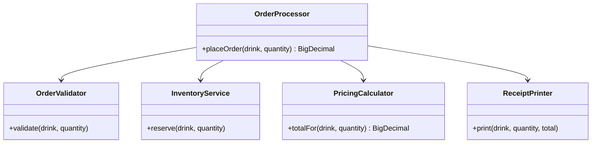

# Separation of concerns

**Separation of concerns means each part of a program handles one job — input, business rules, storage, or output — and stays ignorant of the others.**

## The problem

You're building the order screen for a coffee shop app. One method takes the order, checks stock, calculates the price, and prints a receipt:

```java
public class OrderProcessor {
    public BigDecimal placeOrder(String drink, int quantity, Map<String, Integer> stock) {
        if (drink == null || quantity <= 0) {
            throw new IllegalArgumentException("Invalid order");
        }
        if (stock.getOrDefault(drink, 0) < quantity) {
            throw new IllegalStateException("Out of stock: " + drink);
        }
        stock.put(drink, stock.get(drink) - quantity);

        BigDecimal price = drink.equals("latte") ? new BigDecimal("4.50") : new BigDecimal("3.00");
        BigDecimal total = price.multiply(BigDecimal.valueOf(quantity));
        BigDecimal grandTotal = total.add(total.multiply(new BigDecimal("0.08")));

        System.out.println("Receipt: " + quantity + "x " + drink);
        System.out.println("Total: " + grandTotal);
        return grandTotal;
    }
}
```

This one method mixes validation, inventory rules, pricing, and formatting. Every change ripples through the same block:

- A new tax rule means editing the same method that checks stock.
- You can't test pricing without also feeding it stock data.
- Printing to the console is hardcoded; you can't reuse this for a receipt email.

## The idea

Separation of concerns splits a program along its responsibilities, so each piece changes for one reason. A validator only validates. A pricing calculator only prices. A printer only formats output. None of them knows how the others work.

This isn't about class count. A single class can violate the principle even with 50 tiny methods, if those methods mix unrelated jobs. The test is whether a change to one concern — say, adding loyalty discounts — forces you to touch code that has nothing to do with discounts.



*`OrderProcessor` coordinates four focused collaborators; none of them call each other.*

## How it works

1. List the distinct jobs a piece of code does: validating input, enforcing business rules, talking to storage, formatting output.
2. Give each job its own class or method with a name that states the job.
3. Pass data between them through simple parameters or return values, not shared mutable state.
4. Let a thin coordinator (like a service or controller) call them in order.
5. Keep unrelated jobs from knowing about each other's internals.

## Example

Split the coffee shop order into focused pieces:

```java
public class OrderValidator {
    public void validate(String drink, int quantity) {
        if (drink == null || quantity <= 0) {
            throw new IllegalArgumentException("Invalid order");
        }
    }
}

public class InventoryService {
    private final Map<String, Integer> stock;
    public InventoryService(Map<String, Integer> stock) { this.stock = stock; }

    public void reserve(String drink, int quantity) {
        if (stock.getOrDefault(drink, 0) < quantity) {
            throw new IllegalStateException("Out of stock: " + drink);
        }
        stock.put(drink, stock.get(drink) - quantity);
    }
}

public class PricingCalculator {
    private final Map<String, BigDecimal> prices;
    public PricingCalculator(Map<String, BigDecimal> prices) { this.prices = prices; }

    public BigDecimal totalFor(String drink, int quantity) {
        BigDecimal subtotal = prices.get(drink).multiply(BigDecimal.valueOf(quantity));
        return subtotal.add(subtotal.multiply(new BigDecimal("0.08")));
    }
}

public class ReceiptPrinter {
    public void print(String drink, int quantity, BigDecimal total) {
        System.out.println("Receipt: " + quantity + "x " + drink);
        System.out.println("Total: " + total);
    }
}
```

A thin coordinator wires the pieces together:

```java
public class OrderProcessor {
    private final OrderValidator validator;
    private final InventoryService inventory;
    private final PricingCalculator pricing;
    private final ReceiptPrinter printer;

    public OrderProcessor(OrderValidator validator, InventoryService inventory,
                          PricingCalculator pricing, ReceiptPrinter printer) {
        this.validator = validator;
        this.inventory = inventory;
        this.pricing = pricing;
        this.printer = printer;
    }

    public BigDecimal placeOrder(String drink, int quantity) {
        validator.validate(drink, quantity);
        inventory.reserve(drink, quantity);
        BigDecimal total = pricing.totalFor(drink, quantity);
        printer.print(drink, quantity, total);
        return total;
    }
}
```

- Each class has one reason to change: a new discount rule only touches `PricingCalculator`.
- You can unit test `PricingCalculator` with a plain `Map`, no stock or validation involved.
- Swapping console output for an email receipt only means writing a new `ReceiptPrinter`; nothing else changes.

## When to use it

- The logic mixes at least two of: input checking, business rules, storage, and presentation.
- You expect one part (pricing, formatting) to change more often than the rest.
- You want to unit test one concern without setting up the others.

## When not to use it

- A tiny script or a one-off method that will never be reused or extended.
- Splitting adds more indirection than the code's complexity justifies — three lines don't need three classes.

## Trade-offs

| Benefit | Cost |
|---|---|
| Each piece is easy to understand and test alone | More classes and interfaces to navigate |
| Changes stay local to one concern | A coordinator is needed to wire pieces together |
| Pieces are reusable in new contexts | Over-splitting can hide the overall flow |

## Common mistakes

| ✅ Do | ❌ Don't |
|---|---|
| Name a class after the one job it does | Name a class `OrderManager` and let it do everything |
| Pass data through method parameters | Share a mutable field between unrelated classes |
| Keep formatting out of business logic | Print or log from inside a pricing method |
| Split when a change touches unrelated code | Split every three-line method out of habit |

## Related topics

- [Coupling and cohesion](coupling-and-cohesion.md)
- [Composing objects principle](composing-objects-principle.md)
- [Repository pattern](../patterns/repository-pattern.md)

## Key takeaways

- Separation of concerns means one part of the code changes for one reason.
- Split by responsibility (validate, decide, store, present), not by line count.
- A thin coordinator wires the focused pieces together.
- Watch for a change that forces edits in unrelated code — that's a sign concerns are mixed.
