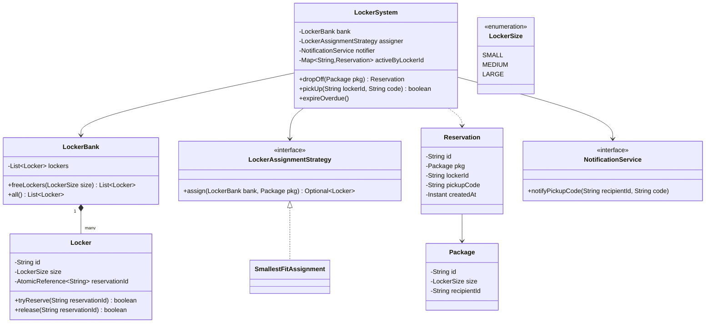
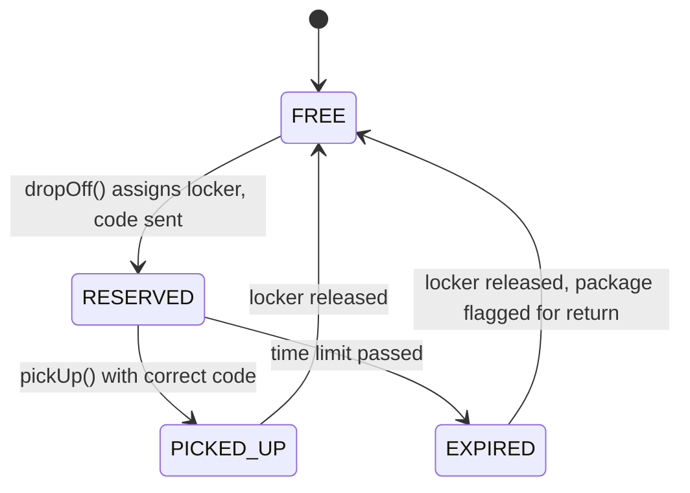

# Design a package locker system like Amazon Locker

**A package locker system reserves a locker for a courier to drop off a package, and gives the customer a code to pick it up later.**

## Requirements

### Functional requirements

1. A locker bank has lockers of different sizes: small, medium, large.
2. When a package arrives for delivery, the system reserves the smallest locker that fits it.
3. On drop-off, the system generates a pickup code and notifies the customer.
4. The customer opens the locker by entering the pickup code; the locker unlocks and becomes empty again.
5. If a package isn't picked up within a time limit, the system expires the reservation and frees the locker.

### Non-functional requirements

- Two couriers dropping off at the same time must never be assigned the same locker.
- A pickup code must not open any locker other than the one it was issued for.
- Adding a new locker size or a new notification channel shouldn't change the reservation logic.

### Out of scope

- Physical hardware integration (motor control, real door sensors).
- Payment or subscription handling for locker rental.

## Clarifying questions to ask

| Question | Assumption we make |
|---|---|
| What happens if no locker of the right size is free? | The system reports failure; the courier tries another location. |
| How is the pickup code generated? | Random 6-digit code, unique among currently active reservations. |
| What happens on expiry? | The locker is freed and the package flagged for return to the carrier; customer notified. |
| Can one locker hold multiple small packages? | No, one package per locker regardless of size, to keep the model simple. |

## Core entities

| Entity | Responsibility |
|---|---|
| `Locker` | Knows its size and holds at most one package at a time |
| `LockerBank` | A physical location holding many lockers |
| `Package` | The item to be stored: id, size, recipient |
| `Reservation` | Links a package to a locker with a pickup code and expiry time |
| `LockerAssignmentStrategy` | Decides which free locker to use for a package |
| `NotificationService` | Sends the pickup code to the customer |
| `LockerSystem` | Entry point: drop off, pick up, and expire reservations |

## Class diagram



*`LockerSystem` is the facade; locker choice and notification are pluggable strategies, same shape as the parking lot design.*

## Key flows



*A locker only leaves RESERVED through a correct pickup or an expiry sweep, never both at once.*

## Design patterns used

| Pattern | Where | Why |
|---|---|---|
| Strategy | `LockerAssignmentStrategy`, `NotificationService` | Change sizing rules or notification channel without touching `LockerSystem` |
| Facade | `LockerSystem` | Couriers and customers only call drop-off and pick-up |
| State (implicit) | Reservation lifecycle | RESERVED, PICKED_UP, EXPIRED are explicit, mutually exclusive outcomes |

## Implementation

`LockerSize`, `Package`, and `Reservation` are the shared value types:

```java
public enum LockerSize { SMALL, MEDIUM, LARGE }

public record Package(String id, LockerSize size, String recipientId) {}

public record Reservation(String id, Package pkg, String lockerId, String pickupCode, Instant createdAt) {
    public boolean isExpired(Duration limit) {
        return Duration.between(createdAt, Instant.now()).compareTo(limit) > 0;
    }
}
```

A locker claims itself atomically, the same trick used for parking spots:

```java
public class Locker {
    private final String id;
    private final LockerSize size;
    private final AtomicReference<String> reservationId = new AtomicReference<>();

    public Locker(String id, LockerSize size) { this.id = id; this.size = size; }

    public boolean tryReserve(String resId) {
        return reservationId.compareAndSet(null, resId);
    }

    public boolean release(String resId) {
        return reservationId.compareAndSet(resId, null);
    }

    public boolean isFree() { return reservationId.get() == null; }
    public LockerSize size() { return size; }
    public String id() { return id; }
}

public class LockerBank {
    private final List<Locker> lockers;
    public LockerBank(List<Locker> lockers) { this.lockers = lockers; }

    public List<Locker> freeLockers(LockerSize size) {
        return lockers.stream()
            .filter(l -> l.size() == size && l.isFree())
            .toList();
    }

    public List<Locker> all() { return lockers; }
}
```

The assignment strategy picks the smallest locker that still fits the package:

```java
public interface LockerAssignmentStrategy {
    Optional<Locker> assign(LockerBank bank, Package pkg);
}

public class SmallestFitAssignment implements LockerAssignmentStrategy {
    public Optional<Locker> assign(LockerBank bank, Package pkg) {
        for (LockerSize size : LockerSize.values()) {
            if (size.ordinal() < pkg.size().ordinal()) continue;
            for (Locker locker : bank.freeLockers(size)) {
                if (locker.tryReserve(pkg.id())) return Optional.of(locker);
            }
        }
        return Optional.empty();
    }
}

public interface NotificationService {
    void notifyPickupCode(String recipientId, String code);
}
```

`LockerSystem` ties reservation, notification, and expiry together:

```java
public class LockerSystem {
    private final LockerBank bank;
    private final LockerAssignmentStrategy assigner;
    private final NotificationService notifier;
    private final Map<String, Reservation> activeByLockerId = new ConcurrentHashMap<>();
    private final Duration pickupLimit;

    public LockerSystem(LockerBank bank, LockerAssignmentStrategy assigner,
                         NotificationService notifier, Duration pickupLimit) {
        this.bank = bank;
        this.assigner = assigner;
        this.notifier = notifier;
        this.pickupLimit = pickupLimit;
    }

    public Reservation dropOff(Package pkg) {
        Locker locker = assigner.assign(bank, pkg)
            .orElseThrow(() -> new IllegalStateException("No locker free for " + pkg.size()));
        String code = generateCode();
        Reservation reservation = new Reservation(
            UUID.randomUUID().toString(), pkg, locker.id(), code, Instant.now());
        activeByLockerId.put(locker.id(), reservation);
        notifier.notifyPickupCode(pkg.recipientId(), code);
        return reservation;
    }

    public boolean pickUp(String lockerId, String code) {
        Reservation reservation = activeByLockerId.get(lockerId);
        if (reservation == null || !reservation.pickupCode().equals(code)) return false;

        Locker locker = bank.all().stream()
            .filter(l -> l.id().equals(lockerId)).findFirst().orElseThrow();
        boolean released = locker.release(reservation.pkg().id());
        if (released) activeByLockerId.remove(lockerId);
        return released;
    }

    public void expireOverdue() {
        activeByLockerId.forEach((lockerId, reservation) -> {
            if (reservation.isExpired(pickupLimit)) {
                bank.all().stream()
                    .filter(l -> l.id().equals(lockerId)).findFirst()
                    .ifPresent(l -> l.release(reservation.pkg().id()));
                activeByLockerId.remove(lockerId);
            }
        });
    }

    private String generateCode() {
        return String.valueOf(100000 + new Random().nextInt(900000));
    }
}
```

## Handling concurrency

- **Two couriers dropping off at once.** `Locker.tryReserve` uses `compareAndSet`, so only one drop-off wins a given locker; the losing thread's strategy moves to the next candidate locker.
- **Pickup racing with expiry.** Both `pickUp` and `expireOverdue` call `locker.release(reservationId)`, which uses `compareAndSet` internally, so only one of them succeeds if they run at the same moment; the loser's release call returns `false` and does nothing.
- **Wrong pickup code.** `pickUp` compares the code before touching the locker, so a bad guess never affects reservation state. Rate-limiting guesses is a good extension but out of scope here.

## Extending the design

**How do you support oversized packages that need two adjacent lockers?**
Add a `combine` step in a new `LockerAssignmentStrategy` that atomically reserves two adjacent free lockers together, rolling back both if either `tryReserve` fails.

**How do you notify by SMS today and push notification later?**
Add a new `NotificationService` implementation; `LockerSystem` depends only on the interface, so no other class changes.

**How would you support QR-code pickup instead of a typed code?**
Keep `pickupCode` as the underlying value, but generate a QR image encoding it. `pickUp` still validates the same string once the code is scanned and decoded.

**How do you handle a courier dropping off before the customer's preferred pickup window?**
Add a `scheduledFor` field to `Reservation`, and have `NotificationService` delay the pickup-code message until that time instead of sending it immediately in `dropOff`.

## Key takeaways

- Reuse the same atomic-claim pattern (`compareAndSet` on a single reference) for any "grab one shared resource" problem, lockers included.
- Keep locker sizing behind a strategy so new sizes or bundling rules don't touch the core flow.
- Model the reservation lifecycle explicitly: RESERVED, PICKED_UP, EXPIRED, each reachable from only one prior state.
- Let both the happy path (pickup) and the failure path (expiry) share the same atomic release, so only one ever wins a race.
