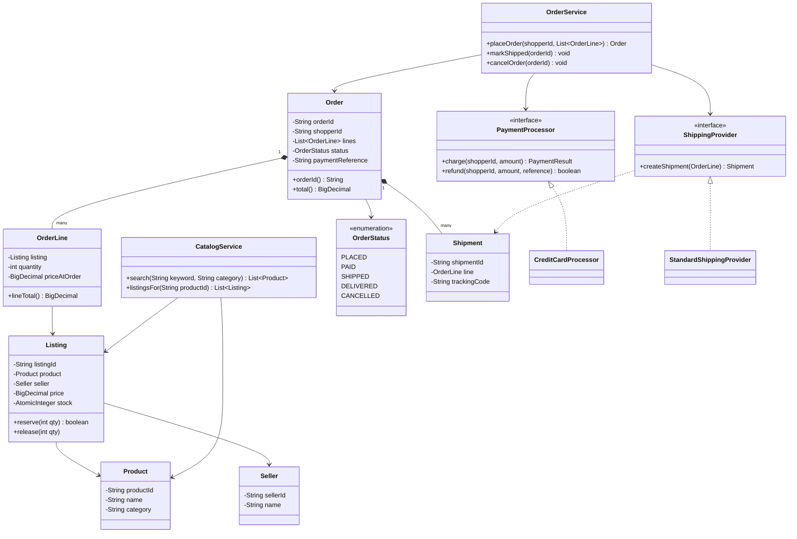
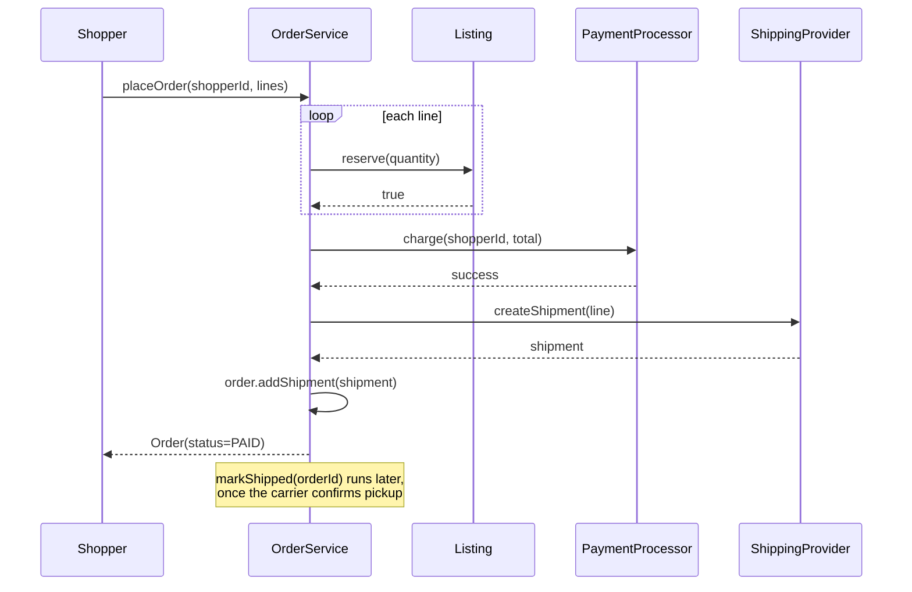

# Design an online store like Amazon

**An online store lets many sellers list products, lets shoppers search and buy them, and tracks orders from payment through delivery.**

## Requirements

### Functional requirements

1. A seller can list a product with a price and stock count. Several sellers can sell the same kind of product as separate listings.
2. A shopper can search products by keyword and category (`CatalogService.search`), and view a product's listings sorted by price.
3. A shopper can place an order for one or more listings. The store reserves stock, charges payment, and creates a shipment.
4. An order moves through a fixed set of stages: placed, paid, shipped, delivered, or cancelled.
5. A shopper can cancel an order before it ships. Cancelling releases the reserved stock.

### Non-functional requirements

- Two shoppers ordering the last unit of a listing must never both succeed.
- The catalog is read far more often than it's written; searches must stay fast under load.
- New payment providers and shipping carriers must plug in without changing order logic.
- The system should scale to many sellers and products without a redesign.

### Out of scope

- Search ranking and recommendation algorithms. We assume a search index exists and return matches.
- Actual payment gateway integration and carrier APIs. We model them behind interfaces.

## Clarifying questions to ask

| Question | Assumption we make |
|---|---|
| Can one order contain items from multiple sellers? | Yes, but each item ships from its own seller as a separate shipment. |
| Is stock reserved at "add to cart" or at order placement? | At order placement, held for a short window until payment completes. |
| Do we need real-time inventory sync across warehouses? | No, one stock count per listing is enough for this design. |
| What happens if payment fails after stock is reserved? | The reservation is released and the order is marked cancelled. |

## Core entities

| Entity | Responsibility |
|---|---|
| `Product` | Shared catalog description (name, category, brand) |
| `Listing` | One seller's offer of a product: price and stock |
| `Seller` | Owns listings |
| `CatalogService` | Searches products and lists their listings |
| `Order` | A shopper's purchase, made of one or more `OrderLine`s |
| `OrderLine` | A listing, quantity, and price at order time |
| `PaymentProcessor` | Charges and refunds a shopper for an order |
| `ShippingProvider` | Creates a shipment for an order line |
| `Shipment` | Tracks delivery state for one order line |
| `OrderService` | Entry point: place, pay, cancel orders |

## Class diagram



*`Order` aggregates `OrderLine`s that each point at a seller's `Listing`; payment and shipping are injected interfaces.*

## Key flows



*Stock is reserved per line before payment; a failed charge triggers release of every reservation made so far. The order stays `PAID`, not `SHIPPED`, until pickup is confirmed, so it can still be cancelled with a refund in between.*

## Design patterns used

| Pattern | Where | Why |
|---|---|---|
| Strategy | `PaymentProcessor`, `ShippingProvider` | Swap payment gateways or carriers without touching `OrderService` |
| State | `OrderStatus` and its transitions in `Order` | Encodes which moves are legal (placed to paid, paid to shipped, and so on) |
| Facade | `OrderService` | Shoppers and the UI call one method instead of coordinating stock, payment, and shipping |
| Observer (extension) | Shipment status updates notifying the shopper | Not implemented in the base code below; see "Extending the design" for how a listener would attach to `Shipment` |

## Implementation

`Product`, `Seller`, and `Listing` model the catalog. Money is `BigDecimal`, never `double`, so totals don't drift from rounding. Stock reservation is atomic on the listing itself:

```java
public record Product(String productId, String name, String category) {}
public record Seller(String sellerId, String name) {}

public class Listing {
    private final String listingId;
    private final Product product;
    private final Seller seller;
    private final BigDecimal price;
    private final AtomicInteger stock;

    public Listing(String listingId, Product product, Seller seller, BigDecimal price, int stock) {
        this.listingId = listingId;
        this.product = product;
        this.seller = seller;
        this.price = price;
        this.stock = new AtomicInteger(stock);
    }

    public boolean reserve(int qty) {
        return stock.getAndUpdate(cur -> cur >= qty ? cur - qty : cur) >= qty;
    }
    public void release(int qty) { stock.addAndGet(qty); }
    public BigDecimal price() { return price; }
    public String listingId() { return listingId; }
    public Product product() { return product; }
}
```

`CatalogService` answers the search requirement; it reads from listings without touching stock:

```java
public class CatalogService {
    private final List<Product> products;
    private final Map<String, List<Listing>> listingsByProductId;

    public CatalogService(List<Product> products, Map<String, List<Listing>> listingsByProductId) {
        this.products = products;
        this.listingsByProductId = listingsByProductId;
    }

    public List<Product> search(String keyword, String category) {
        return products.stream()
            .filter(p -> category == null || p.category().equals(category))
            .filter(p -> keyword == null || p.name().toLowerCase().contains(keyword.toLowerCase()))
            .toList();
    }

    public List<Listing> listingsFor(String productId) {
        return listingsByProductId.getOrDefault(productId, List.of()).stream()
            .sorted(Comparator.comparing(Listing::price))
            .toList();
    }
}
```

`OrderLine` and `Order` capture what was bought and at what price, with a state machine for status:

```java
public class OrderLine {
    private final Listing listing;
    private final int quantity;
    private final BigDecimal priceAtOrder;

    public OrderLine(Listing listing, int quantity) {
        this.listing = listing;
        this.quantity = quantity;
        this.priceAtOrder = listing.price();
    }
    public BigDecimal lineTotal() { return priceAtOrder.multiply(BigDecimal.valueOf(quantity)); }
    public Listing listing() { return listing; }
    public int quantity() { return quantity; }
}

public enum OrderStatus { PLACED, PAID, SHIPPED, DELIVERED, CANCELLED }

public class Order {
    private final String orderId;
    private final String shopperId;
    private final List<OrderLine> lines;
    private final List<Shipment> shipments = new ArrayList<>();
    private volatile OrderStatus status = OrderStatus.PLACED;
    private volatile String paymentReference;

    public Order(String orderId, String shopperId, List<OrderLine> lines) {
        this.orderId = orderId;
        this.shopperId = shopperId;
        this.lines = lines;
    }

    public BigDecimal total() {
        return lines.stream().map(OrderLine::lineTotal).reduce(BigDecimal.ZERO, BigDecimal::add);
    }

    public synchronized void transitionTo(OrderStatus next) {
        boolean legal = switch (status) {
            case PLACED -> next == OrderStatus.PAID || next == OrderStatus.CANCELLED;
            case PAID -> next == OrderStatus.SHIPPED || next == OrderStatus.CANCELLED;
            case SHIPPED -> next == OrderStatus.DELIVERED;
            default -> false;
        };
        if (!legal) throw new IllegalStateException("Cannot go from " + status + " to " + next);
        status = next;
    }
    public void addShipment(Shipment shipment) { shipments.add(shipment); }
    public void paymentReference(String reference) { this.paymentReference = reference; }
    public String paymentReference() { return paymentReference; }
    public List<OrderLine> lines() { return lines; }
    public OrderStatus status() { return status; }
    public String orderId() { return orderId; }
    public String shopperId() { return shopperId; }
}
```

Payment and shipping are interfaces so providers can change independently. Cancelling a paid order must reverse the charge, so `PaymentProcessor` has both a `charge` and a `refund`:

```java
public record PaymentResult(boolean success, String reference) {}

public interface PaymentProcessor {
    PaymentResult charge(String shopperId, BigDecimal amount);
    boolean refund(String shopperId, BigDecimal amount, String reference);
}

public record Shipment(String shipmentId, OrderLine line, String trackingCode) {}

public interface ShippingProvider {
    Shipment createShipment(OrderLine line);
}
```

A concrete provider on each side shows how the interfaces get implemented:

```java
public class CreditCardProcessor implements PaymentProcessor {
    private final Map<String, BigDecimal> ledger = new ConcurrentHashMap<>();

    public PaymentResult charge(String shopperId, BigDecimal amount) {
        ledger.merge(shopperId, amount, BigDecimal::add);
        return new PaymentResult(true, UUID.randomUUID().toString());
    }

    public boolean refund(String shopperId, BigDecimal amount, String reference) {
        ledger.merge(shopperId, amount.negate(), BigDecimal::add);
        return true;
    }
}

public class StandardShippingProvider implements ShippingProvider {
    public Shipment createShipment(OrderLine line) {
        return new Shipment(UUID.randomUUID().toString(), line, "TRACK-" + UUID.randomUUID());
    }
}
```

`OrderService` coordinates reservation, payment, and rollback on failure:

```java
public class OrderService {
    private final PaymentProcessor payment;
    private final ShippingProvider shipping;
    private final Map<String, Order> orders = new ConcurrentHashMap<>();

    public OrderService(PaymentProcessor payment, ShippingProvider shipping) {
        this.payment = payment;
        this.shipping = shipping;
    }

    public Order placeOrder(String shopperId, List<OrderLine> lines) {
        List<OrderLine> reserved = new ArrayList<>();
        for (OrderLine line : lines) {
            if (!line.listing().reserve(line.quantity())) {
                reserved.forEach(r -> r.listing().release(r.quantity()));
                throw new IllegalStateException("Out of stock: " + line.listing().listingId());
            }
            reserved.add(line);
        }
        Order order = new Order(UUID.randomUUID().toString(), shopperId, lines);
        PaymentResult result = payment.charge(shopperId, order.total());
        if (!result.success()) {
            reserved.forEach(r -> r.listing().release(r.quantity()));
            order.transitionTo(OrderStatus.CANCELLED);
            throw new IllegalStateException("Payment failed for order " + order.orderId());
        }
        order.paymentReference(result.reference());
        order.transitionTo(OrderStatus.PAID);
        lines.forEach(line -> order.addShipment(shipping.createShipment(line)));
        orders.put(order.orderId(), order);
        return order;
    }

    // Called when the carrier confirms pickup. Only PAID orders can move to SHIPPED,
    // so an order cancelled while still PAID never reaches this state.
    public void markShipped(String orderId) {
        orders.get(orderId).transitionTo(OrderStatus.SHIPPED);
    }

    public void cancelOrder(String orderId) {
        Order order = orders.get(orderId);
        if (order == null) throw new IllegalArgumentException("Unknown order: " + orderId);
        boolean wasPaid = order.status() == OrderStatus.PAID;
        order.transitionTo(OrderStatus.CANCELLED);
        order.lines().forEach(l -> l.listing().release(l.quantity()));
        if (wasPaid) {
            payment.refund(order.shopperId(), order.total(), order.paymentReference());
        }
    }
}
```

## Handling concurrency

- **Two shoppers order the last unit.** `Listing.reserve` uses `AtomicInteger.getAndUpdate`, so the decrement and the check happen as one atomic step; only one caller sees a value that lets the reservation succeed.
- **Partial reservation on a multi-line order.** `placeOrder` tracks which lines it already reserved and releases exactly those if a later line, or payment, fails. No line is left double-reserved or silently dropped.
- **Concurrent status transitions on one order.** `transitionTo` is `synchronized` on the `Order` instance, so a cancel racing a shipment update can't leave the order in an invalid combination of states.
- **Catalog reads under load.** Listings are read far more than written; keep search results on a read replica or cache and only touch the primary `Listing` row for the atomic reserve/release calls.

## Extending the design

**How do you support order-level discounts across multiple sellers?**
Add a `PricingStrategy` that `OrderService` calls with the full line list before charging, similar to the coupon strategy in a shopping cart design. Keep the discount out of `OrderLine`, since a line's price should still reflect what the seller charged.

**How do you handle a seller who cancels an unshipped line?**
Add a `cancelLine(orderId, listingId)` method that releases that line's stock and refunds its portion via `PaymentProcessor`, without moving the whole order to `CANCELLED` if other lines already shipped.

**How would you scale product search to millions of listings?**
Keep `Listing` rows in the primary datastore for reservation, but sync a denormalized, searchable copy into a search index (like an inverted index or a managed search service). Reads go to the index; writes to stock still go through `Listing`.

**How do you support returns after delivery?**
Add a `RETURN_REQUESTED` and `REFUNDED` state to `OrderStatus`, and a `ReturnService` that reverses payment through `PaymentProcessor` and puts stock back via `Listing.release`.

## Key takeaways

- Separate the catalog (`Product`) from a seller's offer of it (`Listing`), so many sellers can sell one product.
- Make stock reservation atomic at the listing level; that's the only place two orders can actually collide.
- Model order progress as an explicit state machine so illegal jumps, like shipped straight to placed, are impossible.
- Keep payment and shipping behind interfaces; they are the parts most likely to change providers over time.
