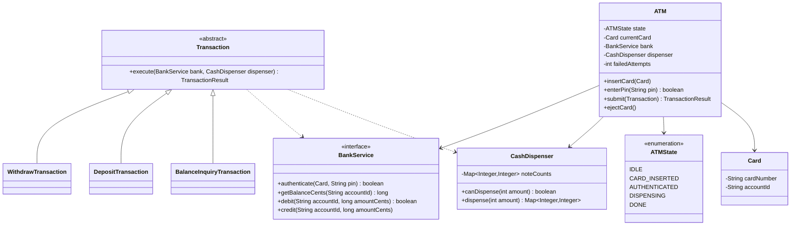
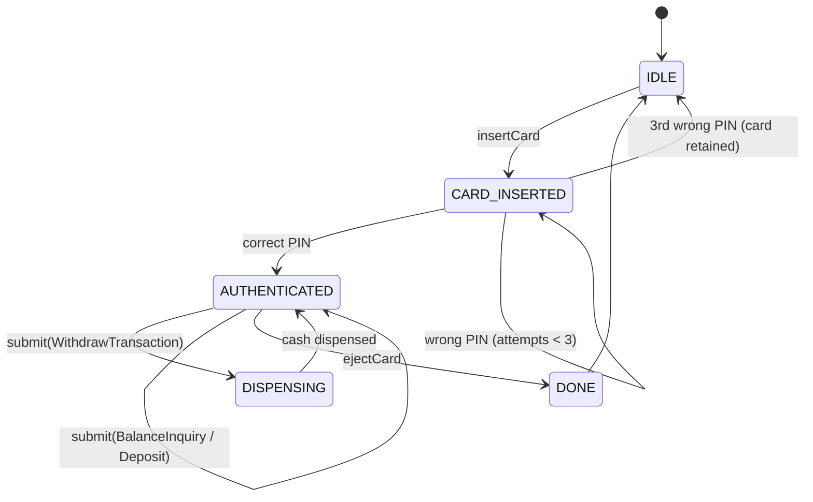

# Design an ATM

**An ATM authenticates a card and PIN, then lets the customer check balance, withdraw cash, or deposit funds, while tracking its own cash inventory.**

## Requirements

### Functional requirements

1. A customer inserts a card and enters a PIN. The system authenticates against the bank account.
2. After 3 failed PIN attempts, the card is retained and the session ends.
3. An authenticated customer can check balance, withdraw cash, or deposit cash.
4. A withdrawal must not exceed the account balance or the ATM's available cash, and is dispensed in available denominations.
5. The ATM tracks how many notes of each denomination it holds and updates the count after each dispense.
6. Each transaction produces a receipt with the result and remaining balance.

### Non-functional requirements

- The ATM operates as a single machine serving one customer session at a time, but its cash inventory and the bank's account balance must stay consistent under retries and timeouts.
- Adding a new transaction type (for example, transfer) shouldn't require changing existing transaction classes.
- The session flow should be easy to reason about: idle, card inserted, authenticated, transaction, done.

### Out of scope

- Physical hardware drivers (card reader, cash dispenser motors).
- Multi-bank interchange networks; assume one bank owns the ATM and the accounts.

## Clarifying questions to ask

| Question | Assumption we make |
|---|---|
| What happens if the ATM runs out of a denomination mid-withdrawal? | The dispense algorithm only commits if the full amount can be made from available notes. |
| Is the PIN checked locally or against a remote bank service? | Modeled as a `BankService` interface; assume it's a remote call. |
| Can a customer do multiple transactions in one session? | Yes, until they choose to end the session or the card is ejected. |
| What denominations does the ATM stock? | 100, 500, 2000 (or an equivalent set), configurable per machine. |

## Core entities

| Entity | Responsibility |
|---|---|
| `Card` | Holds card number and linked account ID |
| `Account` | Bank-side balance; debited or credited via `BankService` |
| `CashDispenser` | Tracks note inventory and computes/dispenses a denomination breakdown |
| `BankService` | External interface for authentication and balance updates |
| `Transaction` | A single withdraw, deposit, or balance-check request |
| `ATMState` | Enum/state machine for the session lifecycle |
| `ATM` | Entry point: drives the session through its states |

## Class diagram



*`Transaction` subclasses each implement `execute`; `ATM` doesn't branch on transaction type.*

## Key flows



*A session moves from card insertion through authentication into a loop of transactions, ending on ejection.*

## Design patterns used

| Pattern | Where | Why |
|---|---|---|
| State | `ATMState` | Makes valid transitions explicit; a withdrawal can't be submitted before authentication |
| Strategy / polymorphism | `Transaction` subclasses | Add a new transaction type by adding a class, not by editing `ATM` |
| Facade | `ATM` | The customer-facing surface is a handful of methods; bank calls and dispensing stay internal |

## Implementation

Core value types and the bank-facing interface:

```java
public record Card(String cardNumber, String accountId) {}

public interface BankService {
    boolean authenticate(Card card, String pin);
    long getBalanceCents(String accountId);
    boolean debit(String accountId, long amountCents);
    void credit(String accountId, long amountCents);
}

public enum ATMState { IDLE, CARD_INSERTED, AUTHENTICATED, DISPENSING, DONE }
public record TransactionResult(boolean success, String message, long newBalanceCents) {}
```

`CashDispenser` tracks notes and computes a greedy denomination breakdown:

```java
public class CashDispenser {
    private final TreeMap<Integer, Integer> noteCounts;

    public CashDispenser(Map<Integer, Integer> initial) {
        this.noteCounts = new TreeMap<>(Comparator.reverseOrder());
        this.noteCounts.putAll(initial);
    }

    public boolean canDispense(int amount) {
        return breakdown(amount) != null;
    }

    public synchronized Map<Integer, Integer> dispense(int amount) {
        Map<Integer, Integer> plan = breakdown(amount);
        if (plan == null) throw new IllegalStateException("Cannot dispense " + amount);
        plan.forEach((denom, count) -> noteCounts.merge(denom, -count, Integer::sum));
        return plan;
    }

    private Map<Integer, Integer> breakdown(int amount) {
        Map<Integer, Integer> plan = new LinkedHashMap<>();
        int remaining = amount;
        for (Map.Entry<Integer, Integer> entry : noteCounts.entrySet()) {
            int denom = entry.getKey();
            int available = entry.getValue();
            int notesNeeded = Math.min(remaining / denom, available);
            if (notesNeeded > 0) {
                plan.put(denom, notesNeeded);
                remaining -= notesNeeded * denom;
            }
        }
        return remaining == 0 ? plan : null;
    }
}
```

`Transaction` is an abstract base; each subclass implements its own effect:

```java
public abstract class Transaction {
    protected final String accountId;
    protected final long amountCents;

    protected Transaction(String accountId, long amountCents) {
        this.accountId = accountId;
        this.amountCents = amountCents;
    }

    public abstract TransactionResult execute(BankService bank, CashDispenser dispenser);
}

public class WithdrawTransaction extends Transaction {
    public WithdrawTransaction(String accountId, long amountCents) { super(accountId, amountCents); }

    public TransactionResult execute(BankService bank, CashDispenser dispenser) {
        if (!dispenser.canDispense((int) amountCents)) {
            return new TransactionResult(false, "ATM cannot dispense this amount", bank.getBalanceCents(accountId));
        }
        if (!bank.debit(accountId, amountCents)) {
            return new TransactionResult(false, "Insufficient funds", bank.getBalanceCents(accountId));
        }
        dispenser.dispense((int) amountCents);
        return new TransactionResult(true, "Withdrawal successful", bank.getBalanceCents(accountId));
    }
}

public class DepositTransaction extends Transaction {
    public DepositTransaction(String accountId, long amountCents) { super(accountId, amountCents); }

    public TransactionResult execute(BankService bank, CashDispenser dispenser) {
        bank.credit(accountId, amountCents);
        return new TransactionResult(true, "Deposit successful", bank.getBalanceCents(accountId));
    }
}

public class BalanceInquiryTransaction extends Transaction {
    public BalanceInquiryTransaction(String accountId) { super(accountId, 0L); }

    public TransactionResult execute(BankService bank, CashDispenser dispenser) {
        return new TransactionResult(true, "Balance retrieved", bank.getBalanceCents(accountId));
    }
}
```

`ATM` drives the session state machine:

```java
public class ATM {
    private final BankService bank;
    private final CashDispenser dispenser;
    private ATMState state = ATMState.IDLE;
    private Card currentCard;
    private int failedAttempts = 0;

    public ATM(BankService bank, CashDispenser dispenser) {
        this.bank = bank;
        this.dispenser = dispenser;
    }

    public void insertCard(Card card) {
        if (state != ATMState.IDLE) throw new IllegalStateException("Card already in use");
        currentCard = card;
        state = ATMState.CARD_INSERTED;
        failedAttempts = 0;
    }

    public boolean enterPin(String pin) {
        if (state != ATMState.CARD_INSERTED) throw new IllegalStateException("Insert card first");
        if (bank.authenticate(currentCard, pin)) {
            state = ATMState.AUTHENTICATED;
            return true;
        }
        failedAttempts++;
        if (failedAttempts >= 3) {
            state = ATMState.IDLE; // card retained; ejectCard() is not called
            currentCard = null;
        }
        return false;
    }

    public TransactionResult submit(Transaction transaction) {
        if (state != ATMState.AUTHENTICATED) throw new IllegalStateException("Not authenticated");
        state = ATMState.DISPENSING;
        TransactionResult result = transaction.execute(bank, dispenser);
        state = ATMState.AUTHENTICATED;
        return result;
    }

    public void ejectCard() {
        state = ATMState.DONE;
        currentCard = null;
        state = ATMState.IDLE;
    }
}
```

## Handling concurrency

- **A single ATM, one session at a time.** `insertCard` throws if a session is already active, so the state machine itself prevents two overlapping sessions on one physical machine.
- **Cash inventory race with the bank debit.** `dispense` is `synchronized`, and `WithdrawTransaction` debits the account first, dispenses second. If the process crashes between debit and dispense, the bank has a debit with no cash given; log the transaction ID before debiting and reconcile against dispenser logs during recovery.
- **Multiple ATMs against the same account.** `BankService.debit` must itself be atomic (a compare-and-set on balance, or a database transaction) on the bank side, since two ATMs could submit withdrawals for the same account concurrently.
- **Note count underflow.** `canDispense` and `dispense` both run under the same lock in a real implementation to avoid a check-then-act gap between checking availability and decrementing counts.

## Extending the design

**How would you add a funds transfer between two accounts?**
Add a `TransferTransaction extends Transaction` that calls `bank.debit` on the source and `bank.credit` on the destination. No existing class changes.

**How would you support multiple ATMs sharing a central cash-monitoring service?**
Have each `ATM` report its `CashDispenser` counts to a central service after each dispense, so low-cash alerts don't require polling every machine.

**How would you handle a network failure mid-withdrawal (debit succeeds, ATM loses connection before dispensing)?**
Give each transaction an idempotency key. On reconnect, the ATM checks the bank for a matching completed transaction ID before retrying, so it never double-debits.

## Key takeaways

- Model the session as an explicit state machine; it prevents illegal actions like withdrawing before authentication.
- Keep transaction types as small polymorphic classes so adding one doesn't touch the others.
- Debit-then-dispense ordering, with idempotency keys, keeps the bank and the dispenser consistent across failures.
- Synchronize the cash dispenser's check-and-decrement to avoid a race on note counts.
