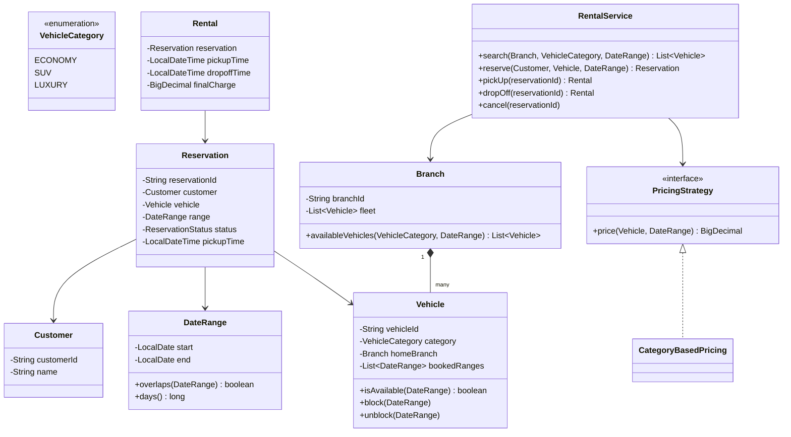
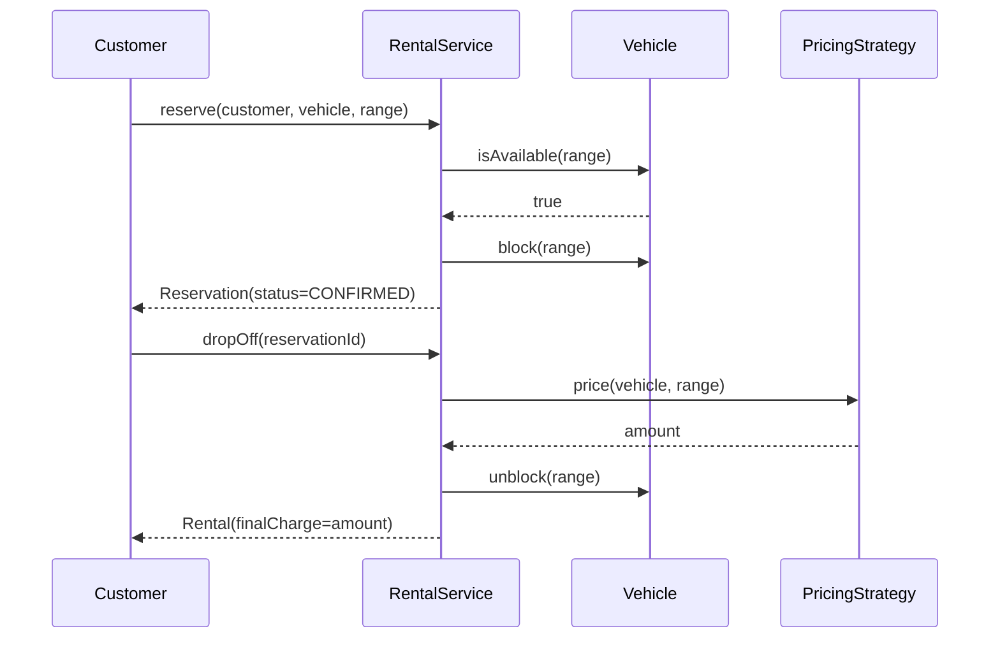

# Design a car rental system

**A car rental system lets a customer search for available vehicles at a branch, reserve one for a date range, and checks it out and back in.**

## Requirements

### Functional requirements

1. The company has multiple branches. Each branch has a fleet of vehicles of different categories (economy, SUV, luxury).
2. A customer can search for available vehicles at a branch for a given date range.
3. A customer can reserve a vehicle, which blocks it from being reserved by someone else for the overlapping dates.
4. At pickup, a reservation becomes an active rental. At drop-off, the system calculates the final charge and frees the vehicle for its next reservation.
5. A customer can cancel a reservation before pickup.

### Non-functional requirements

- Two customers must never get a confirmed reservation for the same vehicle on overlapping dates.
- Pricing rules (by category, by season, by rental length) must plug in without changing reservation logic.
- Vehicle availability search must stay reasonably fast as the fleet grows.

### Out of scope

- Driver's license verification and insurance add-ons.
- Payment processing details; we model a final chargeable amount only.

## Clarifying questions to ask

| Question | Assumption we make |
|---|---|
| Can a vehicle move between branches? | Yes, but only via a drop-off at a different branch, handled as returning it there. |
| Is pricing per day or per hour? | Per day, rounded up. |
| What happens on a late return? | A late fee is added; out of scope to model the fee schedule itself. |
| Can a customer have multiple active reservations? | Yes, no limit in this design. |

## Core entities

| Entity | Responsibility |
|---|---|
| `Vehicle` | A single car: category, branch, and its own booking calendar |
| `Branch` | Holds a fleet of vehicles |
| `Customer` | The person reserving and renting |
| `Reservation` | A confirmed date-range hold on a vehicle |
| `Rental` | The active checkout of a reservation, from pickup to drop-off |
| `PricingStrategy` | Calculates the charge for a rental |
| `RentalService` | Entry point: search, reserve, pick up, drop off, cancel |

## Class diagram



*A `Vehicle` tracks its own booked date ranges, so availability checks and blocking don't need a separate calendar object.*

## Key flows



*Reserving blocks the date range immediately; drop-off prices the rental and frees the vehicle for future dates.*

## Design patterns used

| Pattern | Where | Why |
|---|---|---|
| Strategy | `PricingStrategy` | Swap category, seasonal, or length-based pricing without editing `RentalService` |
| State | `ReservationStatus` transitions | Confirmed, active, completed, and cancelled are explicit and checked before each move |
| Facade | `RentalService` | Search, reserve, pick up, and drop off all go through one entry point |

## Implementation

`DateRange` centralizes overlap logic so it isn't duplicated across `Vehicle` and pricing code:

```java
public record DateRange(LocalDate start, LocalDate end) {
    public boolean overlaps(DateRange other) {
        return start.isBefore(other.end()) && other.start().isBefore(end());
    }
    public long days() { return Math.max(1, ChronoUnit.DAYS.between(start, end)); }
}

public enum VehicleCategory { ECONOMY, SUV, LUXURY }
public record Customer(String customerId, String name) {}
```

`Vehicle` owns a list of booked ranges and checks or blocks them under a lock, so two reservations can't overlap:

```java
public class Vehicle {
    private final String vehicleId;
    private final VehicleCategory category;
    private volatile Branch homeBranch;
    private final List<DateRange> bookedRanges = new ArrayList<>();

    public Vehicle(String vehicleId, VehicleCategory category, Branch homeBranch) {
        this.vehicleId = vehicleId;
        this.category = category;
        this.homeBranch = homeBranch;
    }

    public synchronized boolean isAvailable(DateRange range) {
        return bookedRanges.stream().noneMatch(r -> r.overlaps(range));
    }

    public synchronized boolean block(DateRange range) {
        if (!isAvailable(range)) return false;
        bookedRanges.add(range);
        return true;
    }

    public synchronized void unblock(DateRange range) { bookedRanges.remove(range); }
    public VehicleCategory category() { return category; }
    public String vehicleId() { return vehicleId; }
    public Branch homeBranch() { return homeBranch; }
    public void homeBranch(Branch branch) { this.homeBranch = branch; }
}

public class Branch {
    private final String branchId;
    private final List<Vehicle> fleet;

    public Branch(String branchId, List<Vehicle> fleet) { this.branchId = branchId; this.fleet = fleet; }

    public List<Vehicle> availableVehicles(VehicleCategory category, DateRange range) {
        return fleet.stream()
            .filter(v -> v.category() == category && v.isAvailable(range))
            .toList();
    }
}
```

`Reservation` and `Rental` model the booking lifecycle, with status transitions guarded in one place:

```java
public enum ReservationStatus { CONFIRMED, ACTIVE, COMPLETED, CANCELLED }

public class Reservation {
    private final String reservationId;
    private final Customer customer;
    private final Vehicle vehicle;
    private final DateRange range;
    private volatile ReservationStatus status = ReservationStatus.CONFIRMED;
    private volatile LocalDateTime pickupTime;

    public Reservation(String reservationId, Customer customer, Vehicle vehicle, DateRange range) {
        this.reservationId = reservationId;
        this.customer = customer;
        this.vehicle = vehicle;
        this.range = range;
    }

    public synchronized void moveTo(ReservationStatus next) {
        boolean legal = switch (status) {
            case CONFIRMED -> next == ReservationStatus.ACTIVE || next == ReservationStatus.CANCELLED;
            case ACTIVE -> next == ReservationStatus.COMPLETED;
            default -> false;
        };
        if (!legal) throw new IllegalStateException("Cannot go from " + status + " to " + next);
        if (next == ReservationStatus.ACTIVE) pickupTime = LocalDateTime.now();
        status = next;
    }
    public Vehicle vehicle() { return vehicle; }
    public DateRange range() { return range; }
    public String reservationId() { return reservationId; }
    public ReservationStatus status() { return status; }
    public LocalDateTime pickupTime() { return pickupTime; }
}

public record Rental(Reservation reservation, LocalDateTime pickupTime,
                      LocalDateTime dropoffTime, BigDecimal finalCharge) {}
```

`PricingStrategy` and `RentalService` tie search, reservation, and pricing together:

```java
public interface PricingStrategy {
    BigDecimal price(Vehicle vehicle, DateRange range);
}

public class CategoryBasedPricing implements PricingStrategy {
    private final Map<VehicleCategory, BigDecimal> dailyRate;
    public CategoryBasedPricing(Map<VehicleCategory, BigDecimal> dailyRate) { this.dailyRate = dailyRate; }
    public BigDecimal price(Vehicle vehicle, DateRange range) {
        return dailyRate.get(vehicle.category()).multiply(BigDecimal.valueOf(range.days()));
    }
}

public class RentalService {
    private final PricingStrategy pricing;
    private final Map<String, Reservation> reservations = new ConcurrentHashMap<>();

    public RentalService(PricingStrategy pricing) { this.pricing = pricing; }

    public List<Vehicle> search(Branch branch, VehicleCategory category, DateRange range) {
        return branch.availableVehicles(category, range);
    }

    public Reservation reserve(Customer customer, Vehicle vehicle, DateRange range) {
        if (!vehicle.block(range)) throw new IllegalStateException("Vehicle no longer available");
        Reservation reservation = new Reservation(UUID.randomUUID().toString(), customer, vehicle, range);
        reservations.put(reservation.reservationId(), reservation);
        return reservation;
    }

    public void pickUp(String reservationId) {
        reservations.get(reservationId).moveTo(ReservationStatus.ACTIVE);
    }

    public Rental dropOff(String reservationId) {
        Reservation reservation = reservations.get(reservationId);
        BigDecimal amount = pricing.price(reservation.vehicle(), reservation.range());
        reservation.moveTo(ReservationStatus.COMPLETED);
        reservation.vehicle().unblock(reservation.range());
        return new Rental(reservation, reservation.pickupTime(), LocalDateTime.now(), amount);
    }

    public void cancel(String reservationId) {
        Reservation reservation = reservations.get(reservationId);
        reservation.moveTo(ReservationStatus.CANCELLED);
        reservation.vehicle().unblock(reservation.range());
    }
}
```

## Handling concurrency

- **Two customers reserve the same vehicle for overlapping dates.** `Vehicle.block` is `synchronized` and re-checks `isAvailable` before adding the range, so the check and the write happen atomically. The loser's `reserve` call throws and the customer sees another available car.
- **Cancel and pick-up race on the same reservation.** `Reservation.moveTo` is `synchronized` and validates the current status before switching, so a cancel that arrives after pickup already started is rejected rather than silently freeing an active rental's vehicle.
- **Search scans the whole fleet.** `availableVehicles` is O(fleet size × booked ranges). For a large fleet, index vehicles by category and branch, and store booked ranges in a sorted structure per vehicle to binary-search for overlaps.

## Extending the design

**How do you support one-way rentals (pick up at branch A, drop off at branch B)?**
Add a `dropoffBranch` field to `Reservation`, and on `dropOff`, move the `Vehicle` reference from its `homeBranch`'s fleet to the drop-off branch's fleet instead of just unblocking it.

**How do you add loyalty discounts?**
Wrap `CategoryBasedPricing` in a `LoyaltyDiscountPricing` decorator that reduces the computed price by the customer's discount tier. `RentalService` doesn't change.

**How would you handle vehicle maintenance blocking availability?**
Add a `MaintenanceWindow` that behaves like a `DateRange` block a staff member creates directly on `Vehicle`, using the same `block`/`unblock` methods reservations use, so availability checks automatically account for it.

## Key takeaways

- Keep the date-overlap logic in one `DateRange` type; every availability check reuses it.
- Let each `Vehicle` guard its own booked ranges with a lock, so contention is per-vehicle, not fleet-wide.
- Model reservation and rental as separate objects: a reservation is a promise, a rental is the fact of the vehicle being out.
- Push pricing behind a strategy so seasonal or loyalty rules don't touch the reservation flow.
