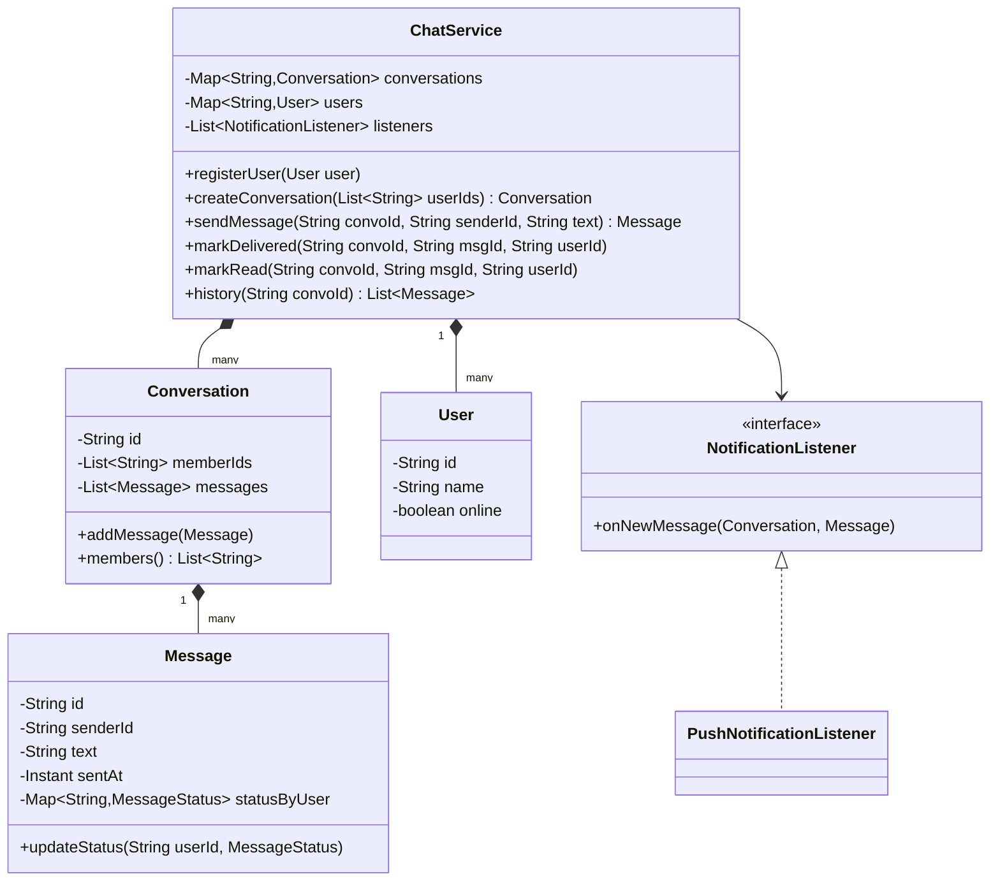
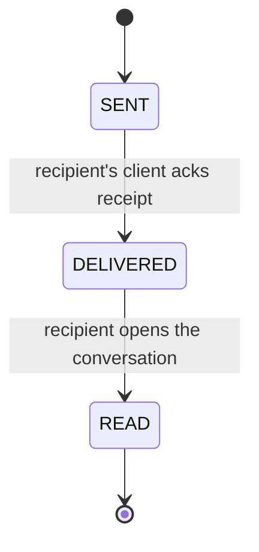

# Design a chat application

**A chat application lets users send text messages to one other user or to a group, and shows each message's delivery and read status.**

## Requirements

### Functional requirements

1. A user can start a one-on-one conversation or a group conversation with several users.
2. A user can send a text message to a conversation; every member of that conversation receives it.
3. Each message tracks its status: sent, delivered, and read, per recipient.
4. A user can fetch the message history of a conversation, in order.
5. A user can be online or offline; offline users get messages when they reconnect.

### Non-functional requirements

- Sending a message must not block on a slow or offline recipient.
- Two devices of the same user sending at once must not corrupt conversation history ordering.
- Adding a new message type (image, file) shouldn't require changing the delivery pipeline.

### Out of scope

- End-to-end encryption and key management.
- Push notification infrastructure and network transport (WebSocket framing, etc).

## Clarifying questions to ask

| Question | Assumption we make |
|---|---|
| Group size limit? | Small to medium groups, up to a few hundred members. |
| Message ordering guarantee? | Messages within one conversation are shown in the order the server received them. |
| Do we need read receipts per group member? | Yes, tracked per recipient, not just one status for the whole message. |
| How do offline users get missed messages? | Messages always land in conversation history; a reconnecting client re-fetches history and the missed messages get marked delivered then. |

## Core entities

| Entity | Responsibility |
|---|---|
| `User` | Represents a chat participant and their online status |
| `Conversation` | Holds member list and message history, one-on-one or group |
| `Message` | Immutable content plus sender, timestamp, and per-recipient status |
| `MessageStatus` | Enum: SENT, DELIVERED, READ per recipient |
| `NotificationListener` | Notified when a new message arrives, for pushing to online clients |
| `ChatService` | Entry point: creates conversations, sends messages, fetches history |

## Class diagram



*`ChatService` is the facade; `Conversation` owns ordered history, and `Message` tracks its own per-recipient status.*

## Key flows



*Each recipient tracks a message's status independently: one member's READ doesn't affect another member's DELIVERED.*

## Design patterns used

| Pattern | Where | Why |
|---|---|---|
| Observer | `NotificationListener` | Push new messages to online clients without `ChatService` knowing about sockets |
| Facade | `ChatService` | Clients call one service for conversations, sending, and status updates |
| Factory method | `ChatService.createConversation` | Builds a one-on-one or group `Conversation` from the same entry point |

## Implementation

The status enum and message hold per-recipient state in one map:

```java
public enum MessageStatus { SENT, DELIVERED, READ }

public class User {
    private final String id;
    private final String name;
    private volatile boolean online;

    public User(String id, String name) { this.id = id; this.name = name; }

    public String id() { return id; }
    public boolean isOnline() { return online; }
    public void setOnline(boolean online) { this.online = online; }
}

public class Message {
    private final String id;
    private final String senderId;
    private final String text;
    private final Instant sentAt;
    private final Map<String, MessageStatus> statusByUser = new ConcurrentHashMap<>();

    public Message(String senderId, String text, List<String> recipientIds) {
        this.id = UUID.randomUUID().toString();
        this.senderId = senderId;
        this.text = text;
        this.sentAt = Instant.now();
        for (String r : recipientIds) statusByUser.put(r, MessageStatus.SENT);
    }

    public void updateStatus(String userId, MessageStatus status) {
        statusByUser.merge(userId, status, (old, next) ->
            next.ordinal() > old.ordinal() ? next : old); // status only moves forward
    }

    public String id() { return id; }
    public String senderId() { return senderId; }
    public String text() { return text; }
    public Instant sentAt() { return sentAt; }
}
```

`Conversation` appends messages under a lock so history order matches arrival order:

```java
public class Conversation {
    private final String id;
    private final List<String> memberIds;
    private final List<Message> messages = new ArrayList<>();
    private final Object historyLock = new Object();

    public Conversation(String id, List<String> memberIds) {
        this.id = id;
        this.memberIds = memberIds;
    }

    public void addMessage(Message msg) {
        synchronized (historyLock) {
            messages.add(msg);
        }
    }

    public List<Message> history() {
        synchronized (historyLock) {
            return List.copyOf(messages);
        }
    }

    public List<String> members() { return memberIds; }
    public String id() { return id; }
}
```

`NotificationListener` decouples message delivery from how a client is reached:

```java
public interface NotificationListener {
    void onNewMessage(Conversation conversation, Message message);
}

public class PushNotificationListener implements NotificationListener {
    private final Map<String, User> users;

    public PushNotificationListener(Map<String, User> users) {
        this.users = users;
    }

    public void onNewMessage(Conversation conversation, Message message) {
        for (String userId : conversation.members()) {
            if (userId.equals(message.senderId())) continue;
            User user = users.get(userId);
            if (user != null && user.isOnline()) {
                // ponytail: pretend push here; real transport is out of scope
                message.updateStatus(userId, MessageStatus.DELIVERED);
            }
        }
    }
}
```

`ChatService` is the single entry point clients call:

```java
public class ChatService {
    private final Map<String, Conversation> conversations = new ConcurrentHashMap<>();
    private final Map<String, User> users = new ConcurrentHashMap<>();
    private final List<NotificationListener> listeners;

    public ChatService(List<NotificationListener> listeners) { this.listeners = listeners; }

    public void registerUser(User user) { users.put(user.id(), user); }

    public Conversation createConversation(List<String> memberIds) {
        Conversation convo = new Conversation(UUID.randomUUID().toString(), memberIds);
        conversations.put(convo.id(), convo);
        return convo;
    }

    public Message sendMessage(String convoId, String senderId, String text) {
        Conversation convo = requireConversation(convoId);
        List<String> recipients = convo.members().stream()
            .filter(id -> !id.equals(senderId)).toList();
        Message msg = new Message(senderId, text, recipients);
        convo.addMessage(msg);
        listeners.forEach(l -> l.onNewMessage(convo, msg));
        return msg;
    }

    public void markDelivered(String convoId, String msgId, String userId) {
        updateStatus(convoId, msgId, userId, MessageStatus.DELIVERED);
    }

    public void markRead(String convoId, String msgId, String userId) {
        updateStatus(convoId, msgId, userId, MessageStatus.READ);
    }

    private void updateStatus(String convoId, String msgId, String userId, MessageStatus status) {
        requireConversation(convoId).history().stream()
            .filter(m -> m.id().equals(msgId))
            .findFirst()
            .ifPresent(m -> m.updateStatus(userId, status));
    }

    public List<Message> history(String convoId) {
        return requireConversation(convoId).history();
    }

    private Conversation requireConversation(String convoId) {
        Conversation convo = conversations.get(convoId);
        if (convo == null) throw new IllegalArgumentException("Unknown conversation: " + convoId);
        return convo;
    }
}
```

## Handling concurrency

- **Two devices of the same user send at once.** `Conversation.addMessage` appends under `historyLock`, so history order matches the order messages actually arrived at the service, regardless of client timing.
- **Status updates racing with a read.** `statusByUser.merge` only advances a status forward (SENT → DELIVERED → READ), so a late DELIVERED ack can't overwrite an already-recorded READ.
- **Fan-out to notification listeners.** `listeners.forEach` runs after the message is durably added to history, so a slow listener delays notification, not the write itself. For many listeners, submit each to an executor instead of calling inline.
- **Unknown conversation id.** `requireConversation` centralizes the lookup and throws instead of letting a `null` propagate into a `NullPointerException` a few calls later.

## Extending the design

**How do you add support for image and file messages?**
Turn `Message` into an interface or add a `MessageType` enum with a `content` field that holds either text or a file reference. `Conversation` and `ChatService` don't change.

**How do you support typing indicators?**
Add a lightweight `TypingEvent` published through the same `NotificationListener` mechanism, without storing it in message history.

**How would you scale to millions of conversations?**
Shard `Conversation` storage by conversation id across multiple nodes, and replace the in-memory map with a database plus a cache for active conversations.

**How do you handle a user in two conversations at once trying to read history consistently?**
Each `Conversation` has its own lock, so reads and writes to different conversations never contend with each other.

## Key takeaways

- Separate `Message` content from per-recipient `MessageStatus` so each member's delivery state is independent.
- Keep history append-only and behind a lock so ordering survives concurrent senders.
- Use the observer pattern to decouple message storage from client notification.
- A status should only move forward; guard updates so a stale ack can't downgrade it.
