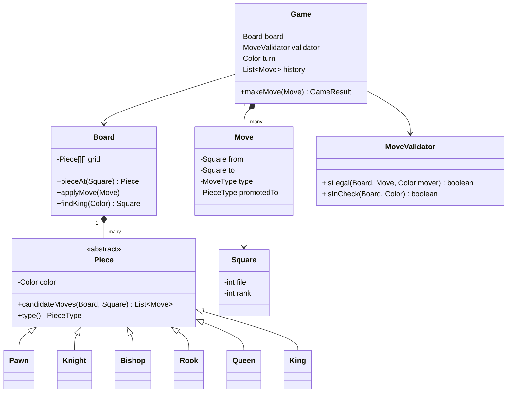
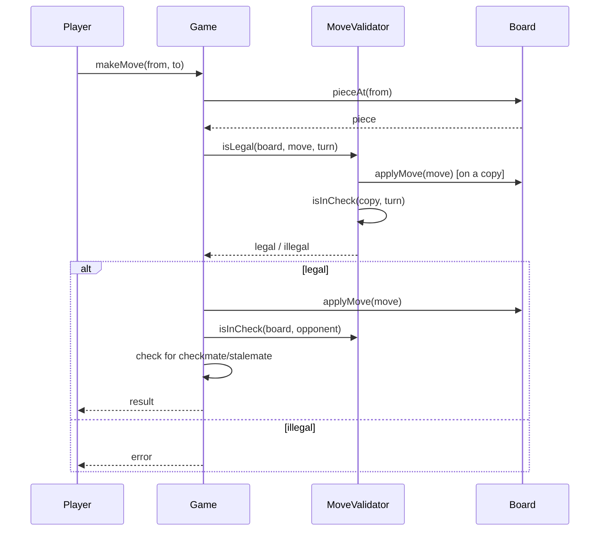

# Design a chess game

**A chess game tracks an 8x8 board, enforces each piece's movement rules, and detects check, checkmate, and stalemate.**

## Requirements

### Functional requirements

1. The board has 8x8 squares with the standard starting position for both players.
2. Each piece type (pawn, knight, bishop, rook, queen, king) moves and captures by its own rule.
3. A move is legal only if it doesn't leave the mover's own king in check.
4. The system detects check, checkmate, and stalemate after each move.
5. Special moves are supported: castling, en passant, and pawn promotion.
6. Players alternate turns; a move attempt out of turn is rejected.

### Non-functional requirements

- Adding a new piece variant (for a chess variant) shouldn't require changes to the board or game loop.
- Move validation must be deterministic and side-effect free until a move is committed.
- The design should support replaying a game from a list of moves.

### Out of scope

- A chess engine that suggests or ranks moves.
- Time controls (clocks) and online matchmaking.

## Clarifying questions to ask

| Question | Assumption we make |
|---|---|
| Do we support all special moves (castling, en passant, promotion)? | Yes, all three. |
| How is a draw by repetition or 50-move rule handled? | Out of scope; only checkmate and stalemate end the game. |
| Is move input in algebraic notation? | Input is `(fromSquare, toSquare)` coordinates; notation is a separate formatting concern. |
| Can a player resign or offer a draw? | Yes, modeled as explicit `Game` actions. |

## Core entities

| Entity | Responsibility |
|---|---|
| `Piece` | Abstract base; knows its color and how it can move |
| `Board` | Holds an 8x8 grid of pieces and answers "what's at this square" |
| `Square` | Immutable coordinate (file, rank) |
| `Move` | Records from-square, to-square, and special-move metadata |
| `MoveValidator` | Checks a candidate move is legal given the board state |
| `Game` | Entry point: tracks turn, move history, and game result |

## Class diagram



*Each piece knows its own move shape; `MoveValidator` layers check-safety on top.*

## Key flows



*A move is tried on a scratch copy of the board to confirm it doesn't self-check before it's committed.*

## Design patterns used

| Pattern | Where | Why |
|---|---|---|
| Template method / polymorphism | `Piece` subclasses | Each piece overrides `candidateMoves`; `Board` and `Game` never branch on piece type |
| Strategy | `MoveValidator` | Isolates check/checkmate rules so a variant (like Chess960) can swap them |
| Memento (extension) | `Move` history in `Game` | The append-only list already enables replay; restoring to a past state (undo) is one more step, covered under Extending the design |

## Implementation

Small value types anchor the model. `Square` and `Move` are immutable records:

```java
public enum Color { WHITE, BLACK }
public enum MoveType { NORMAL, CASTLE, EN_PASSANT, PROMOTION }

public record Square(int file, int rank) {
    public boolean onBoard() { return file >= 0 && file < 8 && rank >= 0 && rank < 8; }
}

public record Move(Square from, Square to, MoveType type, PieceType promotedTo) {
    public static Move normal(Square from, Square to) {
        return new Move(from, to, MoveType.NORMAL, null);
    }
}

public enum PieceType { PAWN, KNIGHT, BISHOP, ROOK, QUEEN, KING }
```

`Piece` is abstract; each subclass supplies its own move shape. Knight is a simple example:

```java
public abstract class Piece {
    protected final Color color;
    protected Piece(Color color) { this.color = color; }

    public Color color() { return color; }
    public abstract PieceType type();
    public abstract List<Move> candidateMoves(Board board, Square from);
}

public class Knight extends Piece {
    private static final int[][] OFFSETS = {
        {1, 2}, {2, 1}, {-1, 2}, {-2, 1}, {1, -2}, {2, -1}, {-1, -2}, {-2, -1}
    };
    public Knight(Color color) { super(color); }
    public PieceType type() { return PieceType.KNIGHT; }

    public List<Move> candidateMoves(Board board, Square from) {
        List<Move> moves = new ArrayList<>();
        for (int[] o : OFFSETS) {
            Square to = new Square(from.file() + o[0], from.rank() + o[1]);
            if (to.onBoard() && board.canLandOn(to, color)) moves.add(Move.normal(from, to));
        }
        return moves;
    }
}
```

`Board` holds the grid and applies moves. Its constructor is shown empty here; a real one populates the standard starting position (pawns on rank 2/7, back ranks by piece type) before returning. `Board` also offers a `copy` so the validator can test moves safely:

```java
public class Board {
    private final Piece[][] grid = new Piece[8][8];

    public Piece pieceAt(Square s) { return grid[s.file()][s.rank()]; }
    public boolean canLandOn(Square s, Color mover) {
        Piece occupant = pieceAt(s);
        return occupant == null || occupant.color() != mover;
    }

    public void applyMove(Move move) {
        Piece piece = pieceAt(move.from());
        grid[move.from().file()][move.from().rank()] = null;
        grid[move.to().file()][move.to().rank()] = piece;
        // Castling/en passant rook or pawn side-effects go here, omitted for brevity.
    }

    public Square findKing(Color color) {
        for (int f = 0; f < 8; f++)
            for (int r = 0; r < 8; r++) {
                Piece p = grid[f][r];
                if (p != null && p.type() == PieceType.KING && p.color() == color) return new Square(f, r);
            }
        throw new IllegalStateException("King missing for " + color);
    }

    public Board copy() {
        Board clone = new Board();
        for (int f = 0; f < 8; f++) System.arraycopy(this.grid[f], 0, clone.grid[f], 0, 8);
        return clone;
    }
}
```

`MoveValidator` checks legality by trying the move on a copy and rejecting self-check:

```java
public class MoveValidator {
    public boolean isLegal(Board board, Move move, Color mover) {
        Piece piece = board.pieceAt(move.from());
        if (piece == null || piece.color() != mover) return false;
        boolean isCandidate = piece.candidateMoves(board, move.from()).stream()
            .anyMatch(m -> m.to().equals(move.to()));
        if (!isCandidate) return false;

        Board trial = board.copy();
        trial.applyMove(move);
        return !isInCheck(trial, mover);
    }

    public boolean isInCheck(Board board, Color color) {
        Square kingSquare = board.findKing(color);
        for (int f = 0; f < 8; f++)
            for (int r = 0; r < 8; r++) {
                Piece p = board.pieceAt(new Square(f, r));
                if (p != null && p.color() != color) {
                    boolean threatens = p.candidateMoves(board, new Square(f, r)).stream()
                        .anyMatch(m -> m.to().equals(kingSquare));
                    if (threatens) return true;
                }
            }
        return false;
    }
}
```

`Game` drives turns and detects the end of the game:

```java
public class Game {
    private final Board board = new Board();
    private final MoveValidator validator = new MoveValidator();
    private final List<Move> history = new ArrayList<>();
    private Color turn = Color.WHITE;

    public GameResult makeMove(Move move) {
        if (!validator.isLegal(board, move, turn)) {
            throw new IllegalArgumentException("Illegal move");
        }
        board.applyMove(move);
        history.add(move);
        Color opponent = (turn == Color.WHITE) ? Color.BLACK : Color.WHITE;

        boolean opponentInCheck = validator.isInCheck(board, opponent);
        boolean opponentHasMoves = hasAnyLegalMove(opponent);
        turn = opponent;

        if (opponentInCheck && !opponentHasMoves) return GameResult.CHECKMATE;
        if (!opponentInCheck && !opponentHasMoves) return GameResult.STALEMATE;
        return GameResult.IN_PROGRESS;
    }

    private boolean hasAnyLegalMove(Color color) {
        for (int f = 0; f < 8; f++)
            for (int r = 0; r < 8; r++) {
                Piece p = board.pieceAt(new Square(f, r));
                if (p != null && p.color() == color) {
                    for (Move m : p.candidateMoves(board, new Square(f, r))) {
                        if (validator.isLegal(board, m, color)) return true;
                    }
                }
            }
        return false;
    }
}

public enum GameResult { IN_PROGRESS, CHECKMATE, STALEMATE }
```

## Handling concurrency

- A single game is normally played by two players taking alternating turns, so there's no real race on `board` or `turn` within one game.
- If moves arrive over a network, serialize each `makeMove` call per game (a lock or a single-threaded actor per `Game` instance) so two near-simultaneous submissions can't both apply.
- `Board.copy()` in `MoveValidator` avoids mutating live state during validation, so validation itself never corrupts the real board even under retries.

## Extending the design

**How would you support a chess variant like Chess960 (randomized back rank)?**
Change only the board setup step that places starting pieces. `Piece`, `MoveValidator`, and `Game` don't reference starting positions, so they're unaffected.

**How would you add move notation (like "Nf3") for display or replay?**
Add a `NotationFormatter` that reads `Game.history` and formats each `Move` using the piece type and disambiguation rules. Keep it separate from `Move` itself.

**How would you support "undo"?**
Since `history` is a full list of moves, rebuild the board by replaying moves 0 to n-1 from a fresh `Board`, or store a lightweight snapshot per move for O(1) undo.

## Key takeaways

- Let each `Piece` subclass own its move shape; keep the board and game loop piece-agnostic.
- Validate moves on a scratch copy of the board to catch self-check without special-casing.
- Model special moves (castle, en passant, promotion) as `Move` metadata, not new classes.
- Keep a full move history so replay and undo come for free.
