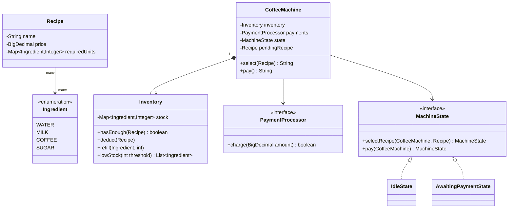
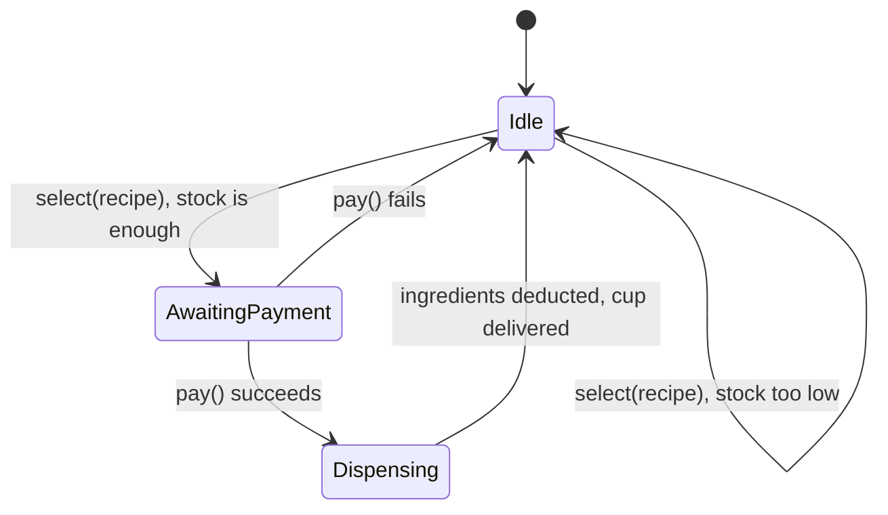

# Design a coffee vending machine

**A coffee vending machine lets a user pick a recipe, checks it has enough ingredients, takes payment, and dispenses the drink.**

## Requirements

### Functional requirements

1. The machine offers a fixed menu of recipes (for example, espresso, latte, cappuccino), each needing set quantities of ingredients such as water, milk, coffee, and sugar.
2. When a user selects a recipe, the machine checks whether every ingredient has enough stock.
3. The user pays the recipe's price. We only track that payment was accepted; we don't model card or cash hardware.
4. On successful payment, the machine dispenses the drink and deducts the used ingredients from stock.
5. An admin can refill any ingredient and see which ingredients are running low.

### Non-functional requirements

- The machine has one dispensing unit, so only one drink brews at a time, even if several users interact with it around the same moment.
- Two users can't both be charged for the last cup of an ingredient that only one recipe can still be made with.
- Adding a new recipe doesn't require changing the state machine or the inventory code.

### Out of scope

- Actual hardware control (heaters, pumps, motors).
- A real payment gateway. We assume a `PaymentProcessor.charge(amount)` call that returns success or failure.
- A touchscreen UI.

## Clarifying questions to ask

| Question | Assumption we make |
|---|---|
| Can two people select a drink at the exact same time? | Yes, but only one can proceed to dispensing; the machine is single-slot. |
| What happens if an ingredient runs low mid-selection? | The check happens again right before dispensing, not just at selection time. |
| Is payment required before or after checking stock? | Stock is checked first, so we don't charge a user for an unavailable drink. |
| Can recipes be added or changed without a code deploy? | For this design, recipes are defined in code but held in one place, so adding one is a small, isolated change. |

## Core entities

| Entity | Responsibility |
|---|---|
| `Ingredient` | One stockable item (water, milk, coffee, sugar) |
| `Recipe` | Name, price, and the quantity of each ingredient it needs |
| `Inventory` | Tracks available quantity per ingredient; checks and deducts stock |
| `PaymentProcessor` | Charges the user; returns success or failure |
| `MachineState` | The current stage the machine is in, and what actions are valid |
| `CoffeeMachine` | Entry point: holds inventory, recipes, and the current state |

## Class diagram



*`CoffeeMachine` delegates every action to its current `MachineState`, which decides what happens next and which state follows.*

## Key flows



*The machine only leaves `Idle` after confirming stock, and only reaches `Dispensing` after payment succeeds. `Dispensing` runs synchronously inside `pay()` and isn't a separate `MachineState` class, since nothing needs to observe the machine mid-brew.*

## Design patterns used

| Pattern | Where | Why |
|---|---|---|
| State | `MachineState` and its implementations | Which actions are valid depends only on the current stage, not scattered `if` checks |
| Observer | `Inventory` notifies listeners when stock crosses a low threshold | An admin dashboard can react without `Inventory` knowing who's listening |
| Builder | `Recipe` construction | A recipe has several optional ingredients; a builder keeps construction readable |

## Implementation

The ingredient enum and a recipe built with a small builder:

```java
public enum Ingredient { WATER, MILK, COFFEE, SUGAR }

public class Recipe {
    private final String name;
    private final BigDecimal price;
    private final Map<Ingredient, Integer> requiredUnits;

    private Recipe(String name, BigDecimal price, Map<Ingredient, Integer> requiredUnits) {
        this.name = name;
        this.price = price;
        this.requiredUnits = requiredUnits;
    }

    public static class Builder {
        private final Map<Ingredient, Integer> units = new EnumMap<>(Ingredient.class);
        private String name; private BigDecimal price;
        public Builder(String name, BigDecimal price) { this.name = name; this.price = price; }
        public Builder needs(Ingredient i, int units) { this.units.put(i, units); return this; }
        public Recipe build() { return new Recipe(name, price, units); }
    }

    public String name() { return name; }
    public BigDecimal price() { return price; }
    public Map<Ingredient, Integer> requiredUnits() { return requiredUnits; }
}
```

`Inventory` guards stock checks and deductions behind a lock, and notifies listeners on low stock:

```java
public class Inventory {
    private final Map<Ingredient, Integer> stock;
    private final List<Consumer<Ingredient>> lowStockListeners = new ArrayList<>();
    private final int lowThreshold;
    private final Object lock = new Object();

    public Inventory(Map<Ingredient, Integer> initialStock, int lowThreshold) {
        this.stock = new EnumMap<>(initialStock);
        this.lowThreshold = lowThreshold;
    }

    public boolean hasEnough(Recipe recipe) {
        synchronized (lock) {
            return recipe.requiredUnits().entrySet().stream()
                .allMatch(e -> stock.getOrDefault(e.getKey(), 0) >= e.getValue());
        }
    }

    public void deduct(Recipe recipe) {
        synchronized (lock) {
            for (var e : recipe.requiredUnits().entrySet()) {
                int remaining = stock.merge(e.getKey(), -e.getValue(), Integer::sum);
                if (remaining <= lowThreshold) notifyLow(e.getKey());
            }
        }
    }

    public void refill(Ingredient ingredient, int units) {
        synchronized (lock) { stock.merge(ingredient, units, Integer::sum); }
    }

    public void onLowStock(Consumer<Ingredient> listener) { lowStockListeners.add(listener); }
    private void notifyLow(Ingredient i) { lowStockListeners.forEach(l -> l.accept(i)); }

    public List<Ingredient> lowStock(int threshold) {
        synchronized (lock) {
            return stock.entrySet().stream()
                .filter(e -> e.getValue() <= threshold)
                .map(Map.Entry::getKey)
                .toList();
        }
    }
}
```

The state interface and its two implementations carry the actual workflow logic:

```java
public interface MachineState {
    MachineState selectRecipe(CoffeeMachine machine, Recipe recipe);
    MachineState pay(CoffeeMachine machine);
}

public class IdleState implements MachineState {
    public MachineState selectRecipe(CoffeeMachine machine, Recipe recipe) {
        if (!machine.inventory().hasEnough(recipe)) return this;
        machine.setPendingRecipe(recipe);
        return new AwaitingPaymentState();
    }
    public MachineState pay(CoffeeMachine machine) { return this; }
}

public class AwaitingPaymentState implements MachineState {
    public MachineState selectRecipe(CoffeeMachine machine, Recipe recipe) { return this; }
    public MachineState pay(CoffeeMachine machine) {
        Recipe recipe = machine.pendingRecipe();
        if (!machine.payments().charge(recipe.price())) return new IdleState();
        // "Dispensing" happens right here, synchronously, before the machine returns to Idle.
        machine.inventory().deduct(recipe);
        machine.dispenseCup(recipe);
        return new IdleState();
    }
}
```

`CoffeeMachine` is a thin coordinator that holds state and delegates to it:

```java
public class CoffeeMachine {
    private final Inventory inventory;
    private final PaymentProcessor payments;
    private MachineState state = new IdleState();
    private Recipe pendingRecipe;

    public CoffeeMachine(Inventory inventory, PaymentProcessor payments) {
        this.inventory = inventory;
        this.payments = payments;
    }

    public synchronized String select(Recipe recipe) {
        MachineState before = state;
        state = state.selectRecipe(this, recipe);
        boolean accepted = state != before;
        return accepted ? "Recipe selected, pay " + recipe.price() : "Not available right now";
    }

    public synchronized String pay() {
        state = state.pay(this);
        return "Done";
    }

    void dispenseCup(Recipe recipe) { /* signal the physical unit; out of scope */ }
    void setPendingRecipe(Recipe r) { this.pendingRecipe = r; }
    Recipe pendingRecipe() { return pendingRecipe; }
    Inventory inventory() { return inventory; }
    PaymentProcessor payments() { return payments; }
}
```

## Handling concurrency

- **Two users select a drink at once.** `CoffeeMachine.select` and `pay` are `synchronized`, so only one caller changes `state` at a time. The second caller either gets `AwaitingPaymentState` already occupied and is told to wait, or sees updated stock.
- **Stock deducted while another check runs.** `Inventory.hasEnough` and `deduct` share the same lock, so a check and a deduction never interleave and give a false "enough stock" answer.
- **Low-stock notification during a burst of orders.** The check happens right after each deduction under the same lock, so the listener never sees a stale count.

## Extending the design

**How do you add a "double shot" customization?**
Add an optional `Map<Ingredient, Integer> extras` to the selection call, and have `IdleState` merge it into the required units before checking stock. `Recipe` itself stays unchanged.

**How do you support a loyalty discount?**
Wrap `PaymentProcessor` with a `DiscountedPaymentProcessor` that reduces the amount before charging. `CoffeeMachine` doesn't change.

**How would you support two dispensing units working at once?**
Move `state` from a single field into a small pool of `CoffeeMachine` instances (or dispensing slots), each with its own state and lock, sharing one `Inventory`.

## Key takeaways

- Model the workflow as a state machine: what's valid depends on whether the machine is idle, awaiting payment, or dispensing.
- Check stock before charging, and deduct stock only after payment succeeds, to avoid charging for a drink you can't make.
- Put stock checks and deductions behind one lock so concurrent orders can't both claim the last unit of an ingredient.
- Keep recipes as plain data so adding a drink never touches the state machine.
