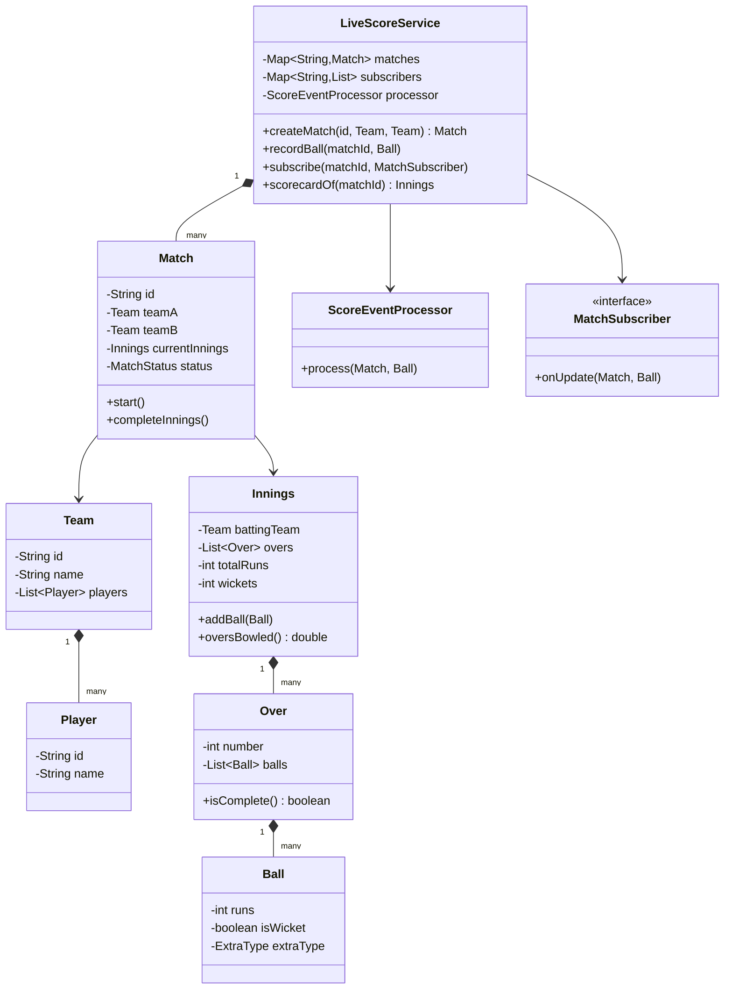
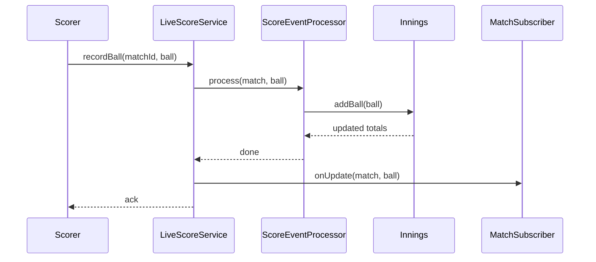

# Design a live cricket score service like Cricinfo

**A live cricket score service records ball-by-ball events for many matches at once and pushes score updates to subscribed clients in real time.**

## Requirements

### Functional requirements

1. The system tracks multiple matches at the same time, each with two teams and a list of players.
2. A scorer records each ball: runs scored, extras, wicket, or a plain dot ball.
3. The system computes the running score, overs bowled, and wickets fallen for the current innings.
4. Clients can subscribe to a match and receive an update after every ball.
5. The system shows the current scorecard: runs, wickets, and overs bowled for the innings in progress.

### Non-functional requirements

- Many matches run concurrently. A slow update to one match must not delay another.
- Thousands of clients can subscribe to a single popular match; pushing updates must scale to that fan-out.
- Adding a new event type (for example, a review or an injury break) shouldn't change the scoring logic for existing events.

### Out of scope

- Video or audio streaming of the match
- Ball-tracking or wagon-wheel visualization data
- User accounts and authentication for subscribers

## Clarifying questions to ask

| Question | Assumption we make |
|---|---|
| Is this limited-overs or does it need to support Test cricket? | Limited-overs (a fixed over count); mention multi-day/multi-innings as an extension. |
| Can a scorer correct a mistaken ball entry? | Out of scope; assume each ball entry is final once submitted. |
| How fast must subscribers see an update after a ball? | A few seconds is acceptable; this isn't a betting feed. |
| Who records the ball — one official scorer per match? | Yes, one scorer per match, so no conflict on who submits an event. |

## Core entities

| Entity | Responsibility |
|---|---|
| `Player` | Holds a player's name and role |
| `Team` | Holds a team's name and players |
| `Ball` | Records the outcome of one delivery |
| `Over` | Holds the balls bowled in one over |
| `Innings` | Holds overs, running score, and wickets for one team's turn to bat |
| `Match` | Holds both innings, teams, and current status |
| `ScoreEventProcessor` | Applies a `Ball` event and updates the innings |
| `MatchSubscriber` | Interface for anything that wants live updates |
| `LiveScoreService` | Entry point: record a ball, subscribe, get scorecard |

## Class diagram



*`LiveScoreService` routes every ball through `ScoreEventProcessor` and then notifies subscribers of that match.*

## Key flows



*Each ball updates the innings first, then fans out to every subscriber of that match.*

## Design patterns used

| Pattern | Where | Why |
|---|---|---|
| Observer | `MatchSubscriber` | Any number of clients get pushed updates without `LiveScoreService` knowing who they are |
| State | `MatchStatus` (`SCHEDULED` → `LIVE` → `COMPLETED`) | Encodes which operations are valid at each stage of a match |
| Strategy (extension) | Handling different `ExtraType` values | Below, `Ball.countsTowardOver` is a plain conditional; move per-extra-type math into one `ExtraRule` implementation per type when the rules grow |

## Implementation

`Player` and `Team` are simple holders for the match's participants:

```java
public record Player(String id, String name) {}

public class Team {
    private final String id;
    private final String name;
    private final List<Player> players;

    public Team(String id, String name, List<Player> players) {
        this.id = id;
        this.name = name;
        this.players = players;
    }

    public String name() { return name; }
}
```

Balls and overs are simple records; `Innings` owns the running totals:

```java
public enum ExtraType { NONE, WIDE, NO_BALL, BYE, LEG_BYE }
public enum MatchStatus { SCHEDULED, LIVE, COMPLETED }

public record Ball(int runs, boolean isWicket, ExtraType extraType) {
    public boolean countsTowardOver() { return extraType != ExtraType.WIDE && extraType != ExtraType.NO_BALL; }
}

public class Over {
    private final int number;
    private final List<Ball> balls = new ArrayList<>();

    public Over(int number) { this.number = number; }

    public void add(Ball ball) { balls.add(ball); }

    public boolean isComplete() {
        return balls.stream().filter(Ball::countsTowardOver).count() >= 6;
    }
}
```

`Innings` accumulates runs and wickets and manages which over is current:

```java
public class Innings {
    private final Team battingTeam;
    private final List<Over> overs = new ArrayList<>();
    private int totalRuns = 0;
    private int wickets = 0;

    public Innings(Team battingTeam) {
        this.battingTeam = battingTeam;
        overs.add(new Over(0));
    }

    public synchronized void addBall(Ball ball) {
        totalRuns += ball.runs() + (ball.extraType() == ExtraType.WIDE || ball.extraType() == ExtraType.NO_BALL ? 1 : 0);
        if (ball.isWicket()) wickets++;
        Over current = overs.get(overs.size() - 1);
        current.add(ball);
        if (current.isComplete() && wickets < 10) {
            overs.add(new Over(overs.size()));
        }
    }

    public double oversBowled() {
        Over last = overs.get(overs.size() - 1);
        return overs.size() - 1 + (last.isComplete() ? 1 : 0);
    }

    public int totalRuns() { return totalRuns; }
    public int wickets() { return wickets; }
}
```

`Match` holds both teams, the current innings, and its status:

```java
public class Match {
    private final String id;
    private final Team teamA;
    private final Team teamB;
    private Innings currentInnings;
    private MatchStatus status = MatchStatus.SCHEDULED;

    public Match(String id, Team teamA, Team teamB) {
        this.id = id;
        this.teamA = teamA;
        this.teamB = teamB;
        this.currentInnings = new Innings(teamA);
    }

    public void start() { status = MatchStatus.LIVE; }
    public void completeInnings() { status = MatchStatus.COMPLETED; }
    public Innings currentInnings() { return currentInnings; }
    public MatchStatus status() { return status; }
    public String id() { return id; }
}
```

`ScoreEventProcessor` is the seam for rules that vary by event type, and `LiveScoreService` wires everything together:

```java
public class ScoreEventProcessor {
    public void process(Match match, Ball ball) {
        if (match.status() != MatchStatus.LIVE) {
            throw new IllegalStateException("Match isn't live");
        }
        match.currentInnings().addBall(ball);
        if (match.currentInnings().wickets() == 10) {
            match.completeInnings();
        }
    }
}

public interface MatchSubscriber {
    void onUpdate(Match match, Ball ball);
}

public class LiveScoreService {
    private final Map<String, Match> matches = new ConcurrentHashMap<>();
    private final Map<String, List<MatchSubscriber>> subscribers = new ConcurrentHashMap<>();
    private final ScoreEventProcessor processor = new ScoreEventProcessor();

    public Match createMatch(String id, Team teamA, Team teamB) {
        Match match = new Match(id, teamA, teamB);
        match.start();
        matches.put(id, match);
        return match;
    }

    public void recordBall(String matchId, Ball ball) {
        Match match = matches.get(matchId);
        processor.process(match, ball);
        for (MatchSubscriber sub : subscribers.getOrDefault(matchId, List.of())) {
            sub.onUpdate(match, ball);
        }
    }

    public void subscribe(String matchId, MatchSubscriber subscriber) {
        subscribers.computeIfAbsent(matchId, k -> new CopyOnWriteArrayList<>()).add(subscriber);
    }

    public Innings scorecardOf(String matchId) {
        return matches.get(matchId).currentInnings();
    }
}
```

- `createMatch` starts the match immediately so `recordBall` never hits an unregistered match ID.
- `Innings.addBall` is `synchronized` because a single scorer submits balls sequentially, but the read side (scorecard queries) can happen concurrently.
- `ScoreEventProcessor` checks match status before applying a ball, so events can't land on a completed match.
- Notifying subscribers happens after the state update, so a subscriber never sees a stale total mixed with a new ball event.

## Handling concurrency

- **Independent matches.** Each `Match` and its `Innings` are separate objects behind a `ConcurrentHashMap`, so scoring match A never blocks scoring match B.
- **One scorer per match, but concurrent reads.** `Innings.addBall` is `synchronized` to protect the write path; reads of `totalRuns()`/`wickets()` are cheap field reads and safe enough for a live display that tolerates a ball's worth of staleness.
- **Fan-out to thousands of subscribers.** `CopyOnWriteArrayList` fits because subscriptions change rarely compared to how often the list is iterated (every ball). For very large fan-out, move the push itself to an async queue so a slow subscriber connection doesn't delay `recordBall`.
- **Duplicate ball submission from a retry.** Not handled above; in practice, tag each `Ball` with a sequence number and reject one that's already been applied to that innings.

## Extending the design

**How do you track the current batting pair (striker and non-striker)?**
Add a `Batsman` entity with runs and balls faced, and a `strikerId`/`nonStrikerId` pair on `Innings`. Update them in `addBall` and swap strike on odd runs and at the end of an over.

**How do you support Test cricket with two innings per team?**
Add a list of `Innings` to `Match` instead of one, and add a rule for when the second innings starts (follow-on or normal declaration).

**How do you add DRS review events without touching scoring logic?**
Introduce a `ReviewEvent` type alongside `Ball` and give `ScoreEventProcessor` a second `process(Match, ReviewEvent)` method; `Innings` stays untouched.

**How would you compute run rate and required run rate for a chase?**
Add a `RunRateCalculator` that reads `Innings.totalRuns()` and `oversBowled()`; keep it outside `Innings` so it can change independently.

**How do you scale to millions of subscribers across all matches?**
Replace direct subscriber notification with a pub-sub system (for example, a message broker per match topic) so `LiveScoreService` publishes once and delivery scales separately.

## Key takeaways

- Keep the write path (`Innings.addBall`) narrow and synchronized; keep matches independent of each other.
- Push updates through an observer interface so the scoring core doesn't know about client fan-out.
- Model match status as a state machine to reject invalid operations like scoring a completed match.
- Separate "what happened on this ball" (`Ball`) from "what it means for the score" (`ScoreEventProcessor`), so new event types are additive.
