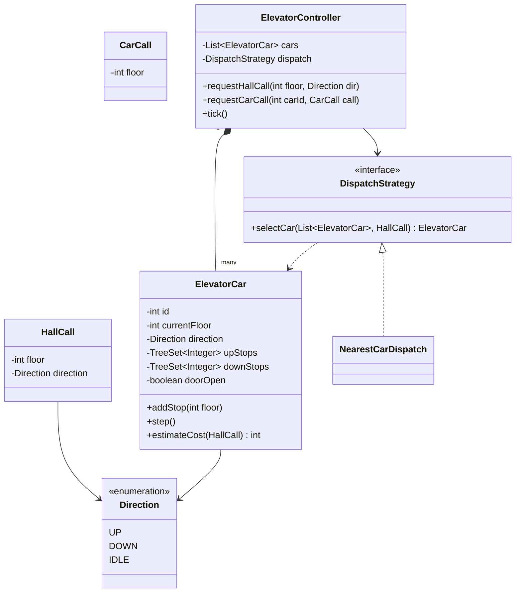
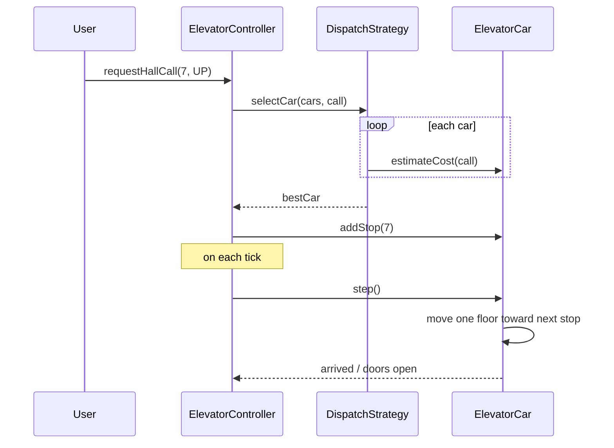

# Design an elevator system

**An elevator system routes multiple elevator cars across a building's floors, assigning each new request to the car that can serve it best.**

## Requirements

### Functional requirements

1. The building has multiple floors and multiple elevator cars.
2. A user on a floor presses up or down (a hall call). A user inside a car presses a destination floor (a car call).
3. The system assigns each hall call to one car and moves that car toward the requested floor.
4. Each car serves calls along its current direction before reversing, rather than jumping around.
5. Doors open when a car stops at a requested floor, and close after a delay before the car moves again.

### Non-functional requirements

- Hall call assignment must not double-book two cars for the same request in a way that wastes capacity.
- Adding a new dispatch policy (for example, "nearest car" vs "least busy") shouldn't require changing the car or door logic.
- The system should keep working correctly if a car is offline for maintenance.

### Out of scope

- Weight sensors and overload handling.
- Fire/emergency recall modes.

## Clarifying questions to ask

| Question | Assumption we make |
|---|---|
| How many cars and floors? | Small building scale: a handful of cars, tens of floors. |
| Does a car change direction only after serving all calls in its current direction? | Yes, the classic SCAN/elevator algorithm. |
| Can a hall call be reassigned after being accepted by a car? | Not in this version; assignment is final once accepted. |
| Is dispatch centralized or per-car? | Centralized `Dispatcher` assigns hall calls to cars. |

## Core entities

| Entity | Responsibility |
|---|---|
| `ElevatorCar` | Tracks current floor, direction, door state, and its own call queue |
| `HallCall` | A pickup request from a floor, with direction |
| `CarCall` | A destination request made from inside a car |
| `Direction` | Enum: UP, DOWN, IDLE |
| `DispatchStrategy` | Picks the best car for a hall call |
| `ElevatorController` | Entry point: receives calls and coordinates all cars |

## Class diagram



*`DispatchStrategy` picks a car; each `ElevatorCar` independently manages its own stop queue.*

## Key flows



*The controller asks every car its cost for a call, assigns to the cheapest, then each car moves independently on each tick.*

## Design patterns used

| Pattern | Where | Why |
|---|---|---|
| Strategy | `DispatchStrategy` | Swap "nearest car" for "least busy" or zone-based dispatch without touching `ElevatorCar` |
| State | `Direction` plus door state in `ElevatorCar` | Keeps movement and door transitions explicit |
| Observer (extension) | Car arrival notifying floor displays | Floor indicators update without `ElevatorCar` knowing about the display |

## Implementation

Core types. `ElevatorCar` keeps upward and downward stops in sorted sets, so it always knows its next stop in its current direction:

```java
public enum Direction { UP, DOWN, IDLE }
public record HallCall(int floor, Direction direction) {}
public record CarCall(int floor) {}

public class ElevatorCar {
    private final int id;
    private int currentFloor;
    private Direction direction = Direction.IDLE;
    private final TreeSet<Integer> upStops = new TreeSet<>();
    private final TreeSet<Integer> downStops = new TreeSet<>();
    private boolean doorOpen = false;

    public ElevatorCar(int id, int startFloor) {
        this.id = id;
        this.currentFloor = startFloor;
    }

    public synchronized void addStop(int floor) {
        if (floor > currentFloor) {
            upStops.add(floor);
            if (direction == Direction.IDLE) direction = Direction.UP;
        } else if (floor < currentFloor) {
            downStops.add(floor);
            if (direction == Direction.IDLE) direction = Direction.DOWN;
        } else {
            doorOpen = true;
        }
    }

    public synchronized void step() {
        if (doorOpen) { doorOpen = false; return; } // door closes before moving again
        if (direction == Direction.UP && !upStops.isEmpty()) {
            currentFloor++;
            if (upStops.contains(currentFloor)) { upStops.remove(currentFloor); doorOpen = true; }
            if (upStops.isEmpty()) direction = downStops.isEmpty() ? Direction.IDLE : Direction.DOWN;
        } else if (direction == Direction.DOWN && !downStops.isEmpty()) {
            currentFloor--;
            if (downStops.contains(currentFloor)) { downStops.remove(currentFloor); doorOpen = true; }
            if (downStops.isEmpty()) direction = upStops.isEmpty() ? Direction.IDLE : Direction.UP;
        }
    }

    public synchronized int estimateCost(HallCall call) {
        boolean movingTowardCall =
            (direction == Direction.UP && call.floor() >= currentFloor) ||
            (direction == Direction.DOWN && call.floor() <= currentFloor) ||
            direction == Direction.IDLE;
        int distance = Math.abs(call.floor() - currentFloor);
        return movingTowardCall ? distance : distance + 2 * totalStops();
    }

    private int totalStops() { return upStops.size() + downStops.size(); }
    public int currentFloor() { return currentFloor; }
    public Direction direction() { return direction; }
    public int id() { return id; }
}
```

`DispatchStrategy` picks the car with the lowest estimated cost:

```java
public interface DispatchStrategy {
    ElevatorCar selectCar(List<ElevatorCar> cars, HallCall call);
}

public class NearestCarDispatch implements DispatchStrategy {
    public ElevatorCar selectCar(List<ElevatorCar> cars, HallCall call) {
        return cars.stream()
            .min(Comparator.comparingInt(car -> car.estimateCost(call)))
            .orElseThrow(() -> new IllegalStateException("No cars available"));
    }
}
```

`ElevatorController` is the entry point that wires calls to cars and drives the simulation loop:

```java
public class ElevatorController {
    private final List<ElevatorCar> cars;
    private final DispatchStrategy dispatch;

    public ElevatorController(List<ElevatorCar> cars, DispatchStrategy dispatch) {
        this.cars = cars;
        this.dispatch = dispatch;
    }

    public void requestHallCall(int floor, Direction direction) {
        HallCall call = new HallCall(floor, direction);
        ElevatorCar chosen = dispatch.selectCar(cars, call);
        chosen.addStop(floor);
    }

    public void requestCarCall(int carId, CarCall call) {
        cars.stream()
            .filter(c -> c.id() == carId)
            .findFirst()
            .orElseThrow(() -> new IllegalArgumentException("Unknown car " + carId))
            .addStop(call.floor());
    }

    public void tick() {
        for (ElevatorCar car : cars) car.step();
    }
}
```

## Handling concurrency

- **Two hall calls assigned to the same car at once.** `ElevatorCar.addStop` and `estimateCost` are `synchronized`, so the controller's assignment loop reads a consistent cost per car even if calls come in concurrently.
- **Assignment race across cars.** Between `estimateCost` calls for different cars in `selectCar` and the eventual `addStop`, another thread could add a stop to the chosen car, changing its true cost. This is acceptable: the cost estimate only needs to be good, not exact, since a slightly suboptimal assignment doesn't break correctness.
- **`tick()` running concurrently with call requests.** Each car's `step()` and `addStop()` share the same per-car lock, so a car never moves and receives a new stop in an inconsistent way. Run `tick()` on a single scheduler thread to avoid two ticks overlapping on the same car.
- **A car going offline mid-route.** The controller should remove an offline car from `cars` and redistribute its pending stops as new hall calls to the remaining cars.

## Extending the design

**How would you add a "least busy" dispatch policy instead of nearest car?**
Add a `LeastBusyDispatch implements DispatchStrategy` that scores by `totalStops()` instead of distance. Swap it into `ElevatorController`'s constructor; no other class changes.

**How would you handle peak "lobby rush" traffic more efficiently?**
Add a time-of-day aware `DispatchStrategy` that reserves one or more cars to shuttle directly between the lobby and upper floors during rush windows.

**How would you support double-deck elevators (two cabins per shaft)?**
Model each cabin as its own `ElevatorCar` sharing a shaft constraint object that ensures the two cabins never occupy adjacent floors improperly; `DispatchStrategy` treats them as two candidates with a shared constraint check.

## Key takeaways

- Each `ElevatorCar` manages its own up/down stop queues independently; the controller only assigns calls.
- Put the car-selection rule behind `DispatchStrategy` so dispatch policy can evolve without touching car movement.
- Synchronize per car, not globally, so cars can move and accept calls independently.
- Treat a car's cost estimate as a heuristic; small inaccuracies under concurrent assignment are fine.
