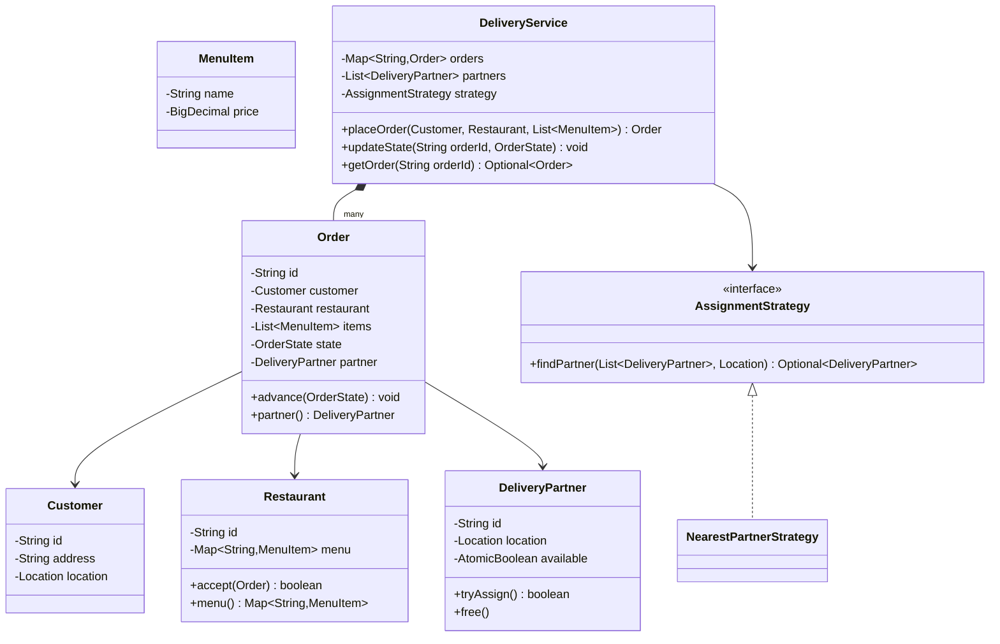
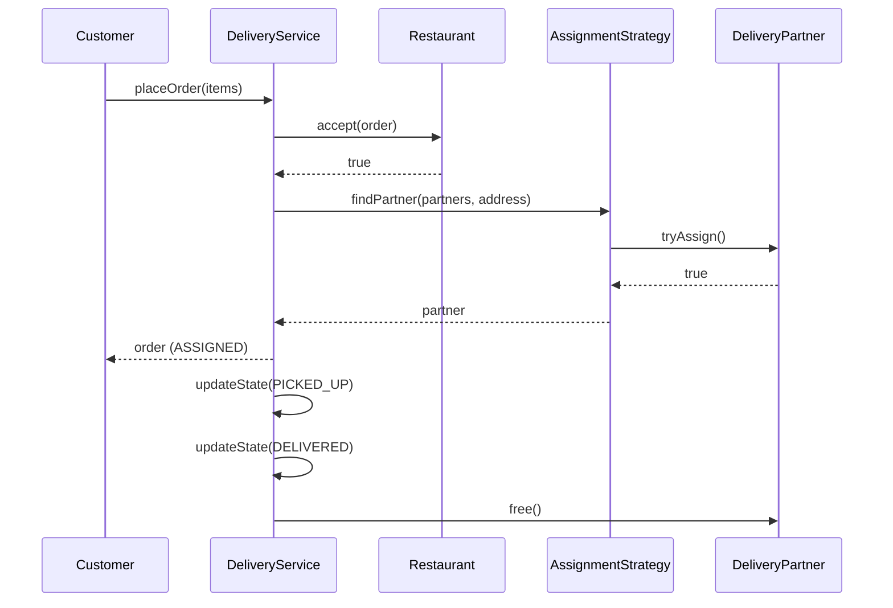

# Design an online food delivery service

**A food delivery service lets a customer browse restaurant menus, place an order, and track a delivery partner who picks up and delivers the food.**

## Requirements

### Functional requirements

1. A customer browses restaurants near their location and views a menu.
2. A customer places an order with one or more menu items and a delivery address.
3. The system finds a nearby available delivery partner and assigns the order.
4. The order moves through states: placed, accepted by restaurant, picked up, delivered.
5. A customer can view the current state and the assigned delivery partner.

### Non-functional requirements

- Many orders are placed at the same time; assignment must not double-book a delivery partner.
- Order state changes must be consistent even if two updates arrive together.
- The system should support adding new assignment rules (nearest partner, least busy) without rewriting the order flow.

### Out of scope

- Payment processing and refunds.
- Route optimization and map rendering.

## Clarifying questions to ask

| Question | Assumption we make |
|---|---|
| Can a customer order from more than one restaurant at once? | No. One order maps to one restaurant. |
| How is a delivery partner chosen? | Nearest available partner, swappable via a strategy. |
| What happens if no partner is available? | The order stays in `PLACED` and retries assignment on a timer. |
| Can a restaurant reject an order? | Yes. This cancels the order and notifies the customer. |

## Core entities

| Entity | Responsibility |
|---|---|
| `MenuItem` | Holds name and price for a dish |
| `Restaurant` | Holds a menu and accepts or rejects orders |
| `Customer` | Places orders and holds a delivery address |
| `DeliveryPartner` | Holds location and availability |
| `Order` | Tracks items, state, and the assigned partner |
| `AssignmentStrategy` | Picks a delivery partner for an order |
| `DeliveryService` | Entry point: places orders and updates state |

## Class diagram



*`DeliveryService` owns orders and asks the strategy for a partner; `Order` tracks its own state.*

## Key flows



*Placing an order reserves a restaurant slot and a partner before the order becomes trackable.*

## Design patterns used

| Pattern | Where | Why |
|---|---|---|
| Strategy | `AssignmentStrategy` | Swap partner-selection rules without touching `DeliveryService` |
| State | `OrderState` transitions in `Order` | Keeps valid transitions in one place |
| Observer (extension) | Customer notifications on state change | Decouples notification from the order flow; see "Extending the design" |

## Implementation

The state enum defines valid transitions so an order can't skip steps:

```java
public enum OrderState {
    PLACED, ACCEPTED, ASSIGNED, PICKED_UP, DELIVERED, CANCELLED;

    private static final Map<OrderState, Set<OrderState>> NEXT = Map.of(
        PLACED, Set.of(ACCEPTED, CANCELLED),
        ACCEPTED, Set.of(ASSIGNED, CANCELLED),
        ASSIGNED, Set.of(PICKED_UP, CANCELLED),
        PICKED_UP, Set.of(DELIVERED)
    );

    public boolean canMoveTo(OrderState next) {
        return NEXT.getOrDefault(this, Set.of()).contains(next);
    }
}
```

Core records and a restaurant that accepts orders and exposes its menu:

```java
public record MenuItem(String name, BigDecimal price) {}
public record Location(double lat, double lon) {}
public record Customer(String id, String address, Location location) {}

public class Restaurant {
    private final String id;
    private final Map<String, MenuItem> menu;
    private volatile boolean open = true;

    public Restaurant(String id, Map<String, MenuItem> menu) {
        this.id = id;
        this.menu = menu;
    }

    public boolean accept(Order order) { return open; }
    public Map<String, MenuItem> menu() { return menu; }
    public String id() { return id; }
}

public class DeliveryPartner {
    private final String id;
    private Location location;
    private final AtomicBoolean available = new AtomicBoolean(true);

    public DeliveryPartner(String id, Location location) {
        this.id = id;
        this.location = location;
    }

    public boolean tryAssign() { return available.compareAndSet(true, false); }
    public void free() { available.set(true); }
    public boolean isAvailable() { return available.get(); }
    public Location location() { return location; }
    public String id() { return id; }
}
```

`Order` guards its own state transitions:

```java
public class Order {
    private final String id;
    private final Customer customer;
    private final Restaurant restaurant;
    private final List<MenuItem> items;
    private volatile OrderState state = OrderState.PLACED;
    private volatile DeliveryPartner partner;

    public Order(String id, Customer customer, Restaurant restaurant, List<MenuItem> items) {
        this.id = id;
        this.customer = customer;
        this.restaurant = restaurant;
        this.items = items;
    }

    public synchronized void advance(OrderState next) {
        if (!state.canMoveTo(next)) {
            throw new IllegalStateException("Cannot move from " + state + " to " + next);
        }
        state = next;
    }

    public synchronized void assignPartner(DeliveryPartner p) {
        this.partner = p;
        advance(OrderState.ASSIGNED);
    }

    public OrderState state() { return state; }
    public DeliveryPartner partner() { return partner; }
    public String id() { return id; }
}
```

The strategy picks the nearest free partner, and the service ties the flow together:

```java
public interface AssignmentStrategy {
    Optional<DeliveryPartner> findPartner(List<DeliveryPartner> partners, Location dest);
}

public class NearestPartnerStrategy implements AssignmentStrategy {
    public Optional<DeliveryPartner> findPartner(List<DeliveryPartner> partners, Location dest) {
        return partners.stream()
            .filter(DeliveryPartner::isAvailable)
            .sorted(Comparator.comparingDouble(p -> distance(p.location(), dest)))
            .filter(DeliveryPartner::tryAssign)
            .findFirst();
    }

    private double distance(Location a, Location b) {
        return Math.hypot(a.lat() - b.lat(), a.lon() - b.lon());
    }
}

public class DeliveryService {
    private final Map<String, Order> orders = new ConcurrentHashMap<>();
    private final List<DeliveryPartner> partners;
    private final AssignmentStrategy strategy;

    public DeliveryService(List<DeliveryPartner> partners, AssignmentStrategy strategy) {
        this.partners = partners;
        this.strategy = strategy;
    }

    public Order placeOrder(Customer customer, Restaurant restaurant, List<MenuItem> items) {
        Order order = new Order(UUID.randomUUID().toString(), customer, restaurant, items);
        orders.put(order.id(), order);
        if (!restaurant.accept(order)) {
            order.advance(OrderState.CANCELLED);
            return order;
        }
        order.advance(OrderState.ACCEPTED);
        strategy.findPartner(partners, customer.location())
            .ifPresentOrElse(order::assignPartner, () -> {});
        return order;
    }

    public void updateState(String orderId, OrderState state) {
        Order order = orders.get(orderId);
        if (order == null) throw new IllegalArgumentException("Unknown order");
        order.advance(state);
    }

    public Optional<Order> getOrder(String orderId) {
        return Optional.ofNullable(orders.get(orderId));
    }
}
```

## Handling concurrency

- **Two orders racing for the same partner.** `tryAssign` uses `compareAndSet`, so only one order wins; the strategy skips to the next partner for the other.
- **Concurrent state updates on one order.** `advance` is `synchronized` per order instance, and it checks `canMoveTo` before writing, so a stale update can't overwrite a later one.
- **Order lookup under load.** `ConcurrentHashMap` gives lock-free reads for the common case of checking order status.
- **Retry when no partner is free.** Keep unassigned orders in a delay queue and re-run `findPartner` on a schedule instead of blocking the placing thread.

## Extending the design

**How do you support order batching for one delivery partner?**
Add a `BatchAssignmentStrategy` that groups orders by pickup proximity before calling `tryAssign`. `Order` and `DeliveryService` don't change.

**How do you add real-time partner location tracking?**
Add a `LocationUpdate` event and an observer on `DeliveryPartner` that publishes to a tracking topic. The order flow stays the same.

**How do you let a restaurant toggle itself closed at busy times?**
`Restaurant` already checks its `open` flag inside `accept`. Add a `setOpen(boolean)` method so restaurant staff can flip it, and reject new orders immediately without changing `DeliveryService`.

## Key takeaways

- Model the order as an explicit state machine so invalid transitions fail fast.
- Push partner selection behind a strategy interface since it's the rule most likely to change.
- Make partner assignment atomic (`compareAndSet`) to avoid double-booking without a global lock.
- Keep `DeliveryService` a thin coordinator; the interesting logic lives in `Order` and the strategies.
