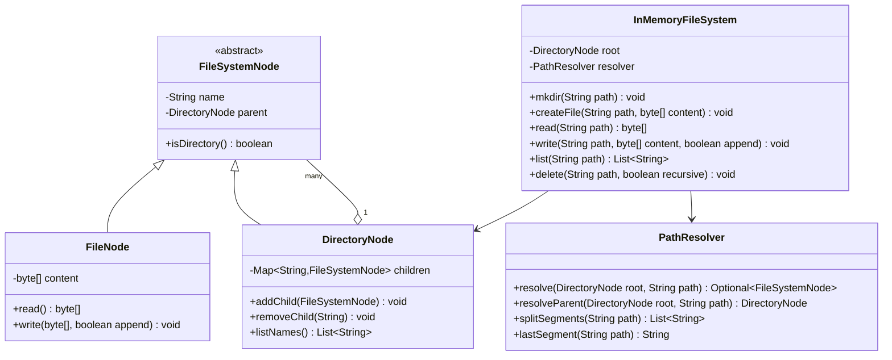
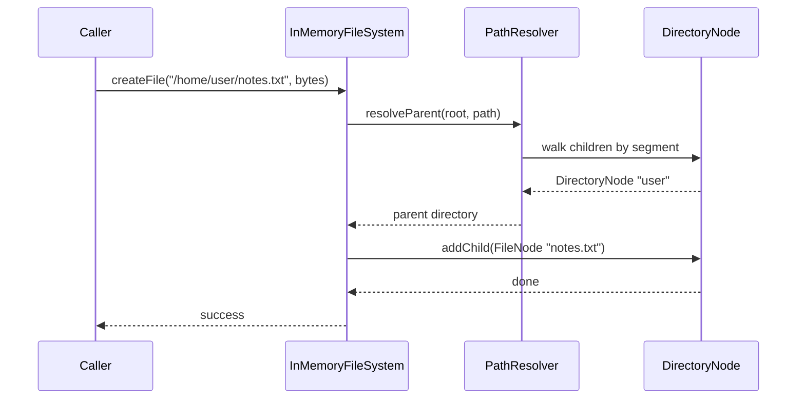

# Design an in-memory file system

**An in-memory file system supports creating directories and files, writing and reading file content, and listing a directory's contents, all held in memory.**

## Requirements

### Functional requirements

1. Create a directory at a given path, including any missing parent directories.
2. Create a file at a given path with initial content.
3. Read a file's content and write (append or overwrite) to it.
4. List the names of entries directly inside a directory.
5. Delete a file or an empty directory; deleting a non-empty directory requires a recursive flag.

### Non-functional requirements

- Paths are absolute and use `/` as a separator, like `/home/user/notes.txt`.
- Two threads must not corrupt the tree when creating or deleting concurrently.
- Adding a new entry type (for example, a symbolic link) shouldn't require rewriting path resolution.

### Out of scope

- Persistence to real disk.
- File permissions and multi-user ownership.

## Clarifying questions to ask

| Question | Assumption we make |
|---|---|
| Can a file and directory share the same name in one folder? | No, names are unique within a directory regardless of type. |
| What happens if you write to a path whose parent doesn't exist? | Throw an error; the caller must create parents first (or pass a flag). |
| Is content binary or text? | Treat it as a byte array; text is UTF-8 encoded bytes. |
| Should `list` be recursive? | No, only direct children; add a separate walk for recursive listing. |

## Core entities

| Entity | Responsibility |
|---|---|
| `FileSystemNode` | Base type for anything in the tree (name, parent) |
| `FileNode` | Holds file content as bytes |
| `DirectoryNode` | Holds child nodes by name |
| `PathResolver` | Walks a path string down the tree to a node |
| `InMemoryFileSystem` | Entry point: create, read, write, list, delete |

## Class diagram



*`DirectoryNode` composes the tree; `PathResolver` walks it so `InMemoryFileSystem` never parses paths directly.*

## Key flows



*Creating a file resolves the parent directory first, then adds the new node as a child.*

## Design patterns used

| Pattern | Where | Why |
|---|---|---|
| Composite | `FileSystemNode`, `FileNode`, `DirectoryNode` | Treats files and directories uniformly as tree nodes |
| Facade | `InMemoryFileSystem` | Callers use path strings and never walk the tree themselves |
| Strategy (extension) | A pluggable node type (e.g., symlink) | New entry types implement `FileSystemNode` without changing the resolver's core walk |

## Implementation

The node hierarchy models files and directories as a composite tree:

```java
public abstract class FileSystemNode {
    protected String name;
    protected DirectoryNode parent;

    protected FileSystemNode(String name, DirectoryNode parent) {
        this.name = name;
        this.parent = parent;
    }

    public abstract boolean isDirectory();
    public String name() { return name; }
    public DirectoryNode parent() { return parent; }
}

public class FileNode extends FileSystemNode {
    private byte[] content;
    private final Object lock = new Object();

    public FileNode(String name, DirectoryNode parent, byte[] content) {
        super(name, parent);
        this.content = content;
    }

    public boolean isDirectory() { return false; }

    public byte[] read() {
        synchronized (lock) { return content.clone(); }
    }

    public void write(byte[] data, boolean append) {
        synchronized (lock) {
            content = append ? concat(content, data) : data.clone();
        }
    }

    private byte[] concat(byte[] a, byte[] b) {
        byte[] result = Arrays.copyOf(a, a.length + b.length);
        System.arraycopy(b, 0, result, a.length, b.length);
        return result;
    }
}

public class DirectoryNode extends FileSystemNode {
    private final Map<String, FileSystemNode> children = new ConcurrentHashMap<>();

    public DirectoryNode(String name, DirectoryNode parent) {
        super(name, parent);
    }

    public boolean isDirectory() { return true; }

    public void addChild(FileSystemNode node) {
        if (children.putIfAbsent(node.name(), node) != null) {
            throw new IllegalStateException("Already exists: " + node.name());
        }
    }

    public void removeChild(String name) { children.remove(name); }
    public FileSystemNode getChild(String name) { return children.get(name); }
    public List<String> listNames() { return new ArrayList<>(children.keySet()); }
    public boolean isEmpty() { return children.isEmpty(); }
}
```

`PathResolver` splits a path into segments and walks the tree, creating parents on demand for `mkdir`:

```java
public class PathResolver {
    public Optional<FileSystemNode> resolve(DirectoryNode root, String path) {
        FileSystemNode current = root;
        for (String segment : splitSegments(path)) {
            if (!(current instanceof DirectoryNode dir)) return Optional.empty();
            current = dir.getChild(segment);
            if (current == null) return Optional.empty();
        }
        return Optional.of(current);
    }

    public DirectoryNode resolveParent(DirectoryNode root, String path) {
        List<String> segments = splitSegments(path);
        DirectoryNode current = root;
        for (int i = 0; i < segments.size() - 1; i++) {
            FileSystemNode child = current.getChild(segments.get(i));
            if (!(child instanceof DirectoryNode dir)) {
                throw new IllegalArgumentException("Not a directory: " + segments.get(i));
            }
            current = dir;
        }
        return current;
    }

    public String lastSegment(String path) {
        List<String> segments = splitSegments(path);
        return segments.get(segments.size() - 1);
    }

    public List<String> splitSegments(String path) {
        return Arrays.stream(path.split("/"))
            .filter(s -> !s.isEmpty())
            .toList();
    }
}
```

`InMemoryFileSystem` combines the resolver and the tree behind a small path-based API:

```java
public class InMemoryFileSystem {
    private final DirectoryNode root = new DirectoryNode("", null);
    private final PathResolver resolver = new PathResolver();

    public void mkdir(String path) {
        DirectoryNode current = root;
        for (String segment : resolver.splitSegments(path)) {
            FileSystemNode child = current.getChild(segment);
            if (child == null) {
                DirectoryNode newDir = new DirectoryNode(segment, current);
                current.addChild(newDir);
                child = newDir;
            }
            if (!(child instanceof DirectoryNode dir)) {
                throw new IllegalArgumentException("Path component is a file: " + segment);
            }
            current = dir;
        }
    }

    public void createFile(String path, byte[] content) {
        DirectoryNode parent = resolver.resolveParent(root, path);
        parent.addChild(new FileNode(resolver.lastSegment(path), parent, content));
    }

    public byte[] read(String path) {
        return asFile(path).read();
    }

    public void write(String path, byte[] content, boolean append) {
        asFile(path).write(content, append);
    }

    public List<String> list(String path) {
        FileSystemNode node = resolver.resolve(root, path).orElseThrow();
        if (!(node instanceof DirectoryNode dir)) throw new IllegalArgumentException("Not a directory");
        return dir.listNames();
    }

    public void delete(String path, boolean recursive) {
        DirectoryNode parent = resolver.resolveParent(root, path);
        FileSystemNode node = parent.getChild(resolver.lastSegment(path));
        if (node == null) throw new IllegalArgumentException("Not found: " + path);
        if (node instanceof DirectoryNode dir && !dir.isEmpty() && !recursive) {
            throw new IllegalStateException("Directory not empty: " + path);
        }
        parent.removeChild(node.name());
    }

    private FileNode asFile(String path) {
        FileSystemNode node = resolver.resolve(root, path).orElseThrow();
        if (node instanceof FileNode file) return file;
        throw new IllegalArgumentException("Not a file: " + path);
    }
}
```

## Handling concurrency

- **Two threads creating a child with the same name.** `DirectoryNode.addChild` uses `putIfAbsent` on a `ConcurrentHashMap`, so only one creation wins; the other gets an exception.
- **Reading a file while it's being written.** `FileNode` synchronizes reads and writes on its own lock and returns a defensive copy from `read`, so a reader never sees a half-written array.
- **Deleting a node while another thread walks into it.** `removeChild` and `getChild` on `ConcurrentHashMap` are individually safe, but a delete racing a resolve can still return a node that's about to vanish; treat a `NullPointerException` during a walk as "not found" or add a per-directory read-write lock for stronger guarantees.
- **Concurrent `mkdir` creating overlapping paths.** Because each directory level uses `putIfAbsent`, two threads creating `/a/b/c` at once safely converge on the same tree without duplicate directories.

## Extending the design

**How do you add symbolic links?**
Add a `SymlinkNode extends FileSystemNode` holding a target path. Update `PathResolver.resolve` to follow a symlink when it encounters one, with a hop limit to avoid cycles.

**How do you support file size quotas per directory?**
Add a `sizeLimit` field to `DirectoryNode` and check cumulative child size in `addChild` and `FileNode.write`, walking up to parents to update running totals.

**How do you make this persist to real disk on shutdown?**
Add a `Snapshotter` that walks the tree depth-first and serializes each node; on startup, rebuild the tree from the serialized form. `FileSystemNode` and its subclasses don't need to change.

## Key takeaways

- Model files and directories as a composite tree so path operations recurse naturally.
- Keep path parsing in one place (`PathResolver`) instead of scattering `split("/")` calls.
- Scope locks to the node being changed (a file's content, a directory's children), not the whole tree.
- New node types (symlinks, quotas) extend the base class without touching the resolver's core contract.
