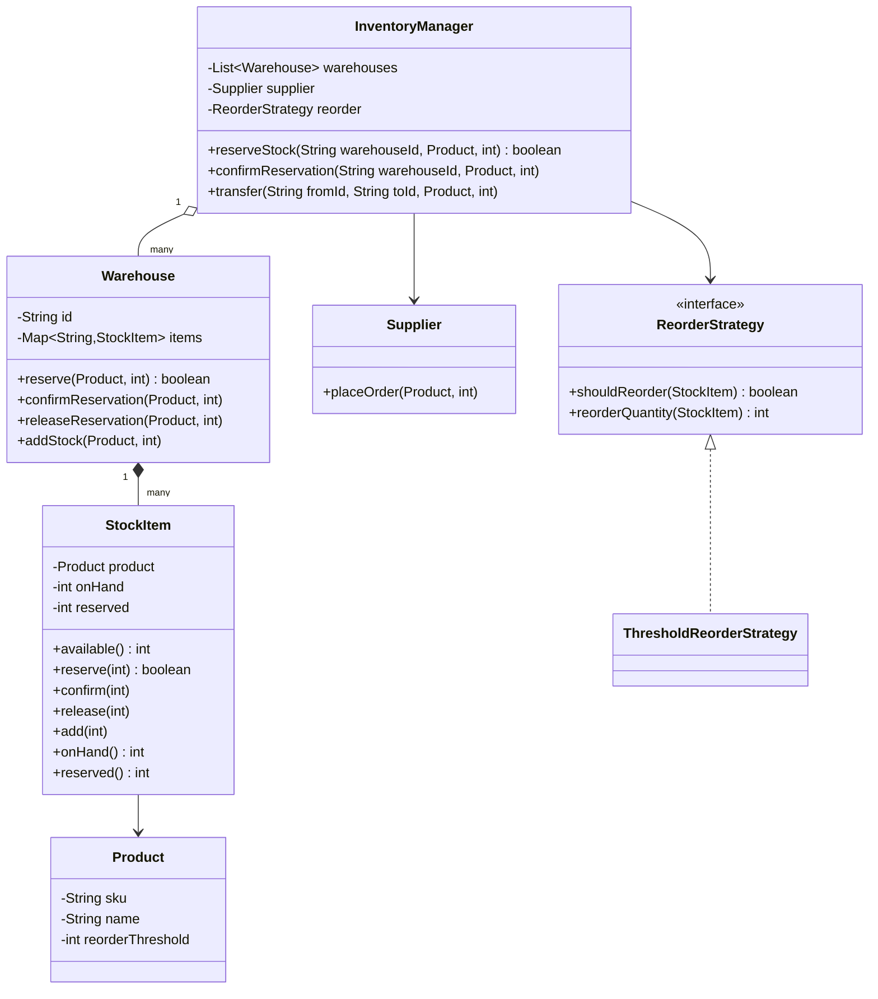
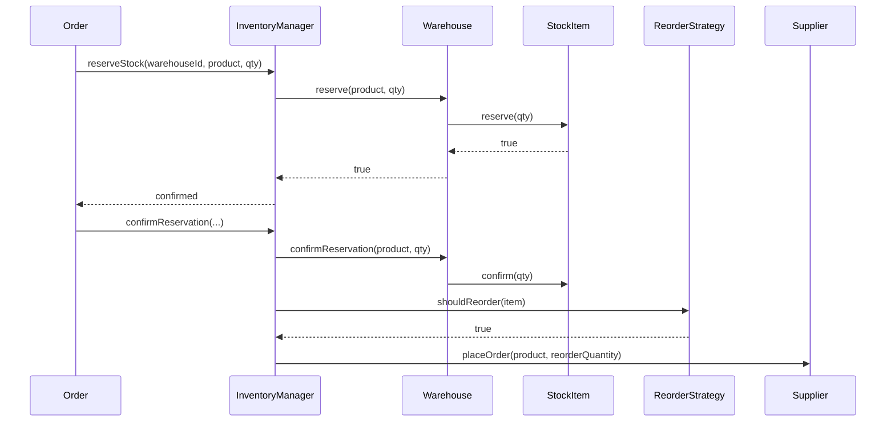

# Design an inventory management system

**An inventory management system tracks how many units of each product sit in each warehouse, reserves stock for orders, and reorders from a supplier when stock runs low.**

## Requirements

### Functional requirements

1. The system tracks stock quantity for each product in each warehouse.
2. When an order is placed, the system reserves the requested quantity from a warehouse so it can't be sold twice, then confirms or releases the reservation.
3. Stock can be transferred between two warehouses.
4. When a product's stock in a warehouse falls below its reorder threshold, the system automatically creates a purchase order to a supplier.
5. The system reports current stock and reserved quantity per product per warehouse.

### Non-functional requirements

- Many orders can reserve stock for the same product at the same time; the total reserved can never exceed what's on hand.
- Adding a new reorder rule (fixed threshold, or based on recent sales velocity) shouldn't change `Warehouse` or the reservation code.
- Reporting reads shouldn't block reservations for long.

### Out of scope

- Supplier communication protocol (EDI, API format). We assume a `Supplier.placeOrder(product, quantity)` call.
- Pricing and billing.
- Demand forecasting beyond a simple threshold check.

## Clarifying questions to ask

| Question | Assumption we make |
|---|---|
| Can an order draw stock from more than one warehouse? | No, for simplicity: one order reserves from one chosen warehouse. |
| What happens if a reservation is never confirmed? | Out of scope for expiry; we assume the caller explicitly confirms or releases it. |
| Who chooses the reorder quantity? | The `ReorderStrategy` decides both when to reorder and how much. |
| Should transfers go through the reservation mechanism? | Yes, a transfer reserves and deducts from the source, then adds to the destination. |

## Core entities

| Entity | Responsibility |
|---|---|
| `Product` | SKU, name, and reorder threshold |
| `StockItem` | On-hand and reserved quantity of one product in one warehouse |
| `Warehouse` | Holds `StockItem`s and exposes reserve, confirm, release, and add operations |
| `Supplier` | Accepts purchase orders for a product |
| `ReorderStrategy` | Decides whether and how much to reorder after a deduction |
| `InventoryManager` | Entry point: coordinates warehouses, reservations, and reordering |

## Class diagram



*`InventoryManager` never touches a `StockItem` directly; it always goes through `Warehouse`, which owns the locking.*

## Key flows



*Confirming a reservation deducts on-hand stock and gives the reorder strategy a chance to trigger a purchase order.*

## Design patterns used

| Pattern | Where | Why |
|---|---|---|
| Strategy | `ReorderStrategy` | Swap threshold-based reordering for a sales-velocity model without touching `Warehouse` |
| Facade | `InventoryManager` | Callers reserve, confirm, and transfer through one interface without knowing about `StockItem` locking |

## Implementation

`Product` and `StockItem` hold quantities and enforce that a reservation can't exceed what's available:

```java
public record Product(String sku, String name, int reorderThreshold) {}

public class StockItem {
    private final Product product;
    private int onHand;
    private int reserved;

    public StockItem(Product product, int onHand) { this.product = product; this.onHand = onHand; }

    public synchronized int available() { return onHand - reserved; }

    public synchronized boolean reserve(int qty) {
        if (available() < qty) return false;
        reserved += qty;
        return true;
    }

    public synchronized void confirm(int qty) {
        reserved -= qty;
        onHand -= qty;
    }

    public synchronized void release(int qty) { reserved -= qty; }
    public synchronized void add(int qty) { onHand += qty; }
    public synchronized int onHand() { return onHand; }
    public synchronized int reserved() { return reserved; }
    public Product product() { return product; }
}
```

`Warehouse` maps products to stock items and forwards calls, keeping locking inside `StockItem`:

```java
public class Warehouse {
    private final String id;
    private final Map<String, StockItem> items = new ConcurrentHashMap<>();

    public Warehouse(String id) { this.id = id; }

    public void stock(Product product, int initialQty) {
        items.put(product.sku(), new StockItem(product, initialQty));
    }

    public boolean reserve(Product product, int qty) {
        return items.get(product.sku()).reserve(qty);
    }

    public void confirmReservation(Product product, int qty) {
        items.get(product.sku()).confirm(qty);
    }

    public void releaseReservation(Product product, int qty) {
        items.get(product.sku()).release(qty);
    }

    public void addStock(Product product, int qty) {
        items.get(product.sku()).add(qty);
    }

    public StockItem itemFor(Product product) { return items.get(product.sku()); }
    public String id() { return id; }
}
```

The reorder strategy and `InventoryManager` complete the picture:

```java
public interface ReorderStrategy {
    boolean shouldReorder(StockItem item);
    int reorderQuantity(StockItem item);
}

public class ThresholdReorderStrategy implements ReorderStrategy {
    public boolean shouldReorder(StockItem item) {
        return item.onHand() < item.product().reorderThreshold();
    }
    public int reorderQuantity(StockItem item) {
        return item.product().reorderThreshold() * 2 - item.onHand();
    }
}

public class InventoryManager {
    private final Map<String, Warehouse> warehouses = new HashMap<>();
    private final Supplier supplier;
    private final ReorderStrategy reorder;

    public InventoryManager(List<Warehouse> list, Supplier supplier, ReorderStrategy reorder) {
        list.forEach(w -> warehouses.put(w.id(), w));
        this.supplier = supplier;
        this.reorder = reorder;
    }

    public boolean reserveStock(String warehouseId, Product product, int qty) {
        return warehouses.get(warehouseId).reserve(product, qty);
    }

    public void confirmReservation(String warehouseId, Product product, int qty) {
        Warehouse wh = warehouses.get(warehouseId);
        wh.confirmReservation(product, qty);
        maybeReorder(wh, product);
    }

    public void transfer(String fromId, String toId, Product product, int qty) {
        Warehouse from = warehouses.get(fromId);
        if (!from.reserve(product, qty)) throw new IllegalStateException("Not enough stock to transfer");
        from.confirmReservation(product, qty);
        maybeReorder(from, product);
        warehouses.get(toId).addStock(product, qty);
    }

    // Shared by confirmReservation and transfer, since both deduct on-hand stock from a warehouse.
    private void maybeReorder(Warehouse wh, Product product) {
        StockItem item = wh.itemFor(product);
        if (reorder.shouldReorder(item)) supplier.placeOrder(product, reorder.reorderQuantity(item));
    }
}
```

## Handling concurrency

- **Two orders reserve the last units of a product at once.** `StockItem.reserve` is `synchronized` and checks `available()` before adding to `reserved`, so only one of two competing reservations for the last unit succeeds.
- **Reservation and confirmation race with a transfer.** Both paths call the same `synchronized` methods on `StockItem`, so on-hand and reserved counts stay consistent no matter which order the calls interleave in.
- **High read volume for reporting.** `available()` and `onHand()` take the same lock but return immediately, so reads are quick; for very high read traffic, keep a separate eventually-consistent read replica instead of reading the live `StockItem`.

## Extending the design

**How do you support reserving from multiple warehouses for one order?**
Add an `OrderFulfillmentStrategy` that splits the requested quantity across warehouses ranked by proximity or available stock, then calls `reserve` on each in turn, rolling back on partial failure.

**How do you reorder based on sales velocity instead of a fixed threshold?**
Write a `VelocityReorderStrategy` that looks at recent confirmed deductions instead of `product().reorderThreshold()`. `InventoryManager` doesn't change.

**How would you avoid placing duplicate purchase orders for the same low-stock item?**
Track an "order pending" flag on `StockItem`, set when a purchase order is placed and cleared when the supplier's stock arrives, and check it in `shouldReorder`.

## Key takeaways

- Separate on-hand and reserved quantities so a reservation never oversells stock that's already promised.
- Keep locking at the `StockItem` level, not a global lock, so unrelated products never block each other.
- Trigger reordering as a side effect of confirmed deductions, behind a strategy interface.
- Route every stock change through `Warehouse`, never letting callers touch `StockItem` directly.
