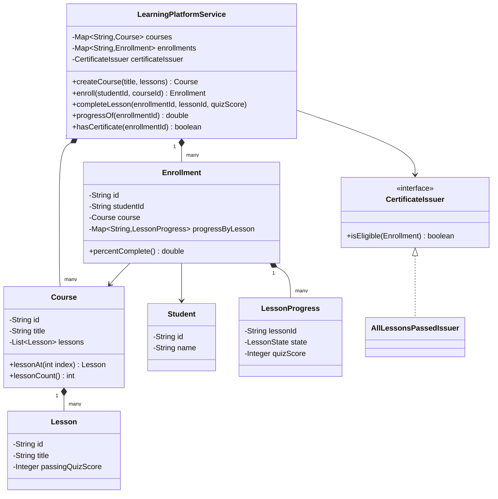
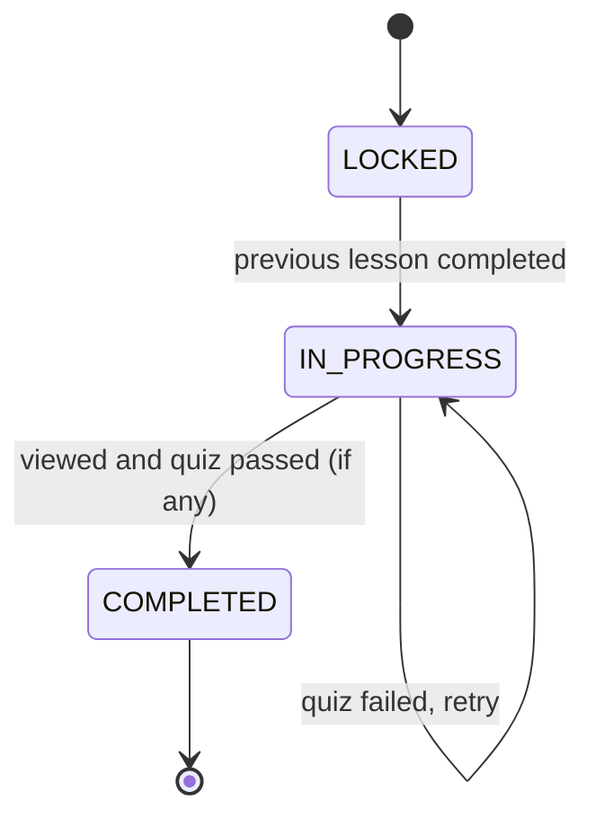

# Design a learning platform

**A learning platform lets instructors publish courses made of lessons, and lets students enroll, track progress, and earn a certificate on completion.**

## Requirements

### Functional requirements

1. An instructor creates a course made of an ordered list of lessons.
2. A student enrolls in a course.
3. A student marks a lesson as complete; lessons must be completed in order.
4. The platform tracks each student's progress percentage per course.
5. When a student completes every lesson, the platform issues a certificate.

### Non-functional requirements

- Progress updates happen often (every lesson finished); reads of progress must be cheap.
- Adding a new completion rule (for example, a quiz score threshold) shouldn't change the enrollment or lesson classes.
- The design should support many students progressing through the same course independently.

### Out of scope

- Video streaming and playback infrastructure
- Payment for course purchase
- Course search and recommendation

## Clarifying questions to ask

| Question | Assumption we make |
|---|---|
| Must lessons be completed strictly in order? | Yes, a lesson unlocks only after the previous one is complete. |
| Can a student re-enroll after finishing a course? | Out of scope; assume one active enrollment per student per course. |
| Does completion require a quiz score, or just viewing? | Model both: a lesson can optionally have a quiz with a passing score. |
| Who can edit a published course? | Only the instructor who created it; not needed in the core design. |

## Core entities

| Entity | Responsibility |
|---|---|
| `Course` | Holds the ordered list of lessons |
| `Lesson` | Holds content and an optional quiz passing score |
| `Student` | Represents the learner |
| `Enrollment` | Tracks one student's progress through one course |
| `LessonProgress` | Tracks the completion state of one lesson for one student |
| `CertificateIssuer` | Decides when an enrollment qualifies for a certificate |
| `LearningPlatformService` | Entry point: enroll, complete lesson, check progress |

## Class diagram



*`Enrollment` holds per-lesson progress; `CertificateIssuer` decides eligibility separately from progress tracking.*

## Key flows



*A lesson moves from locked to in-progress once its predecessor is done, then to completed once its quiz (if any) is passed.*

## Design patterns used

| Pattern | Where | Why |
|---|---|---|
| State | `LessonState` transitions inside `LessonProgress` | Encodes valid lesson transitions instead of scattering `if` checks |
| Strategy | `CertificateIssuer` | Certificate rules (all lessons vs. minimum score) change without touching `Enrollment` |
| Observer (extension) | Certificate check after each `completeLesson` call | Below, the service checks eligibility inline; wire it as a real listener if other services (for example, a mailer) also need to react to completion |

## Implementation

`Course` and `Lesson` are simple, since content structure rarely changes at runtime:

```java
public record Student(String id, String name) {}

public record Lesson(String id, String title, Integer passingQuizScore) {
    public boolean hasQuiz() { return passingQuizScore != null; }
}

public class Course {
    private final String id;
    private final String title;
    private final List<Lesson> lessons;

    public Course(String id, String title, List<Lesson> lessons) {
        this.id = id;
        this.title = title;
        this.lessons = lessons;
    }

    public String id() { return id; }
    public Lesson lessonAt(int index) { return lessons.get(index); }
    public int lessonCount() { return lessons.size(); }
    public int indexOf(String lessonId) {
        return IntStream.range(0, lessons.size())
            .filter(i -> lessons.get(i).id().equals(lessonId))
            .findFirst().orElseThrow();
    }
}
```

`LessonState` and `LessonProgress` model the state machine from the diagram:

```java
public enum LessonState { LOCKED, IN_PROGRESS, COMPLETED }

public class LessonProgress {
    private final String lessonId;
    private LessonState state;
    private Integer quizScore;

    public LessonProgress(String lessonId, LessonState state) {
        this.lessonId = lessonId;
        this.state = state;
    }

    public void unlock() {
        if (state == LessonState.LOCKED) state = LessonState.IN_PROGRESS;
    }

    public void complete(Integer quizScore, Integer passingScore) {
        if (state != LessonState.IN_PROGRESS) {
            throw new IllegalStateException("Lesson " + lessonId + " isn't unlocked yet");
        }
        if (passingScore != null && (quizScore == null || quizScore < passingScore)) {
            throw new IllegalArgumentException("Quiz score below passing threshold");
        }
        this.quizScore = quizScore;
        this.state = LessonState.COMPLETED;
    }

    public LessonState state() { return state; }
}
```

`Enrollment` tracks progress per lesson and computes the percentage:

```java
public class Enrollment {
    private final String id;
    private final String studentId;
    private final Course course;
    private final Map<String, LessonProgress> progressByLesson = new LinkedHashMap<>();

    public Enrollment(String id, String studentId, Course course) {
        this.id = id;
        this.studentId = studentId;
        this.course = course;
        for (int i = 0; i < course.lessonCount(); i++) {
            Lesson lesson = course.lessonAt(i);
            LessonState initial = i == 0 ? LessonState.IN_PROGRESS : LessonState.LOCKED;
            progressByLesson.put(lesson.id(), new LessonProgress(lesson.id(), initial));
        }
    }

    public void completeLesson(String lessonId, Integer quizScore) {
        Lesson lesson = course.lessonAt(course.indexOf(lessonId));
        progressByLesson.get(lessonId).complete(quizScore, lesson.passingQuizScore());
        int next = course.indexOf(lessonId) + 1;
        if (next < course.lessonCount()) {
            progressByLesson.get(course.lessonAt(next).id()).unlock();
        }
    }

    public double percentComplete() {
        long done = progressByLesson.values().stream()
            .filter(p -> p.state() == LessonState.COMPLETED).count();
        return 100.0 * done / progressByLesson.size();
    }

    public boolean allCompleted() { return percentComplete() == 100.0; }
    public String id() { return id; }
    public String studentId() { return studentId; }
}
```

`CertificateIssuer` and `LearningPlatformService` tie the pieces together:

```java
public interface CertificateIssuer {
    boolean isEligible(Enrollment enrollment);
}

public class AllLessonsPassedIssuer implements CertificateIssuer {
    public boolean isEligible(Enrollment enrollment) { return enrollment.allCompleted(); }
}

public class LearningPlatformService {
    private final Map<String, Course> courses = new ConcurrentHashMap<>();
    private final Map<String, Enrollment> enrollments = new ConcurrentHashMap<>();
    private final CertificateIssuer certificateIssuer;
    private final Set<String> issuedCertificates = ConcurrentHashMap.newKeySet();

    public LearningPlatformService(CertificateIssuer certificateIssuer) {
        this.certificateIssuer = certificateIssuer;
    }

    public Course createCourse(String title, List<Lesson> lessons) {
        Course course = new Course(UUID.randomUUID().toString(), title, lessons);
        courses.put(course.id(), course);
        return course;
    }

    public Enrollment enroll(String studentId, String courseId) {
        Course course = courses.get(courseId);
        Enrollment enrollment = new Enrollment(UUID.randomUUID().toString(), studentId, course);
        enrollments.put(enrollment.id(), enrollment);
        return enrollment;
    }

    public void completeLesson(String enrollmentId, String lessonId, Integer quizScore) {
        Enrollment enrollment = enrollments.get(enrollmentId);
        synchronized (enrollment) {
            enrollment.completeLesson(lessonId, quizScore);
            if (certificateIssuer.isEligible(enrollment)) {
                issuedCertificates.add(enrollmentId);
            }
        }
    }

    public double progressOf(String enrollmentId) {
        return enrollments.get(enrollmentId).percentComplete();
    }

    public boolean hasCertificate(String enrollmentId) {
        return issuedCertificates.contains(enrollmentId);
    }
}
```

- `LessonProgress.complete` rejects skipping ahead or completing a locked lesson.
- `Enrollment.completeLesson` unlocks the next lesson only after the current one succeeds.
- `CertificateIssuer` is checked after every completion, but the rule itself is swappable.

## Handling concurrency

- **Two requests complete the same lesson at once.** `synchronized (enrollment)` in `completeLesson` serializes updates per enrollment, so the unlock-and-complete step can't be interleaved.
- **Different students in the same course.** Each has a separate `Enrollment`, so there's no shared mutable state between them; no cross-student locking is needed.
- **Certificate issued twice.** `issuedCertificates` is a `ConcurrentHashMap`-backed set; `add` is idempotent, so a duplicate eligibility check has no effect.
- **Course content edited while students are enrolled.** Out of scope here, but in practice you'd version courses so in-progress enrollments keep referencing the lesson list they started with.

## Extending the design

**How do you support optional lessons that don't block progress?**
Add an `isOptional` flag to `Lesson`. Exclude optional lessons from the unlock chain and from the percentage calculation, or count them separately.

**How do you add a minimum time-spent requirement per lesson?**
Add a `minSecondsWatched` field to `Lesson` and check it inside `LessonProgress.complete`, alongside the quiz score check.

**How do you support multiple certificate types (completion vs. distinction)?**
Add more `CertificateIssuer` implementations, such as one requiring an average quiz score above 90, and let `LearningPlatformService` check a list of issuers instead of one.

**How would you let students resume on a different device?**
`Enrollment` is already the single source of progress truth; as long as it's persisted centrally rather than cached per device, resuming elsewhere just means reloading the same `Enrollment`.

## Key takeaways

- Model lesson completion as a state machine, not a boolean, so ordering rules live in one place.
- Keep progress data in `Enrollment`, separate from the static `Course` structure.
- Put certificate eligibility behind a `CertificateIssuer` strategy so rules can evolve independently.
- Lock at the enrollment level, not globally, since students progress independently of each other.
