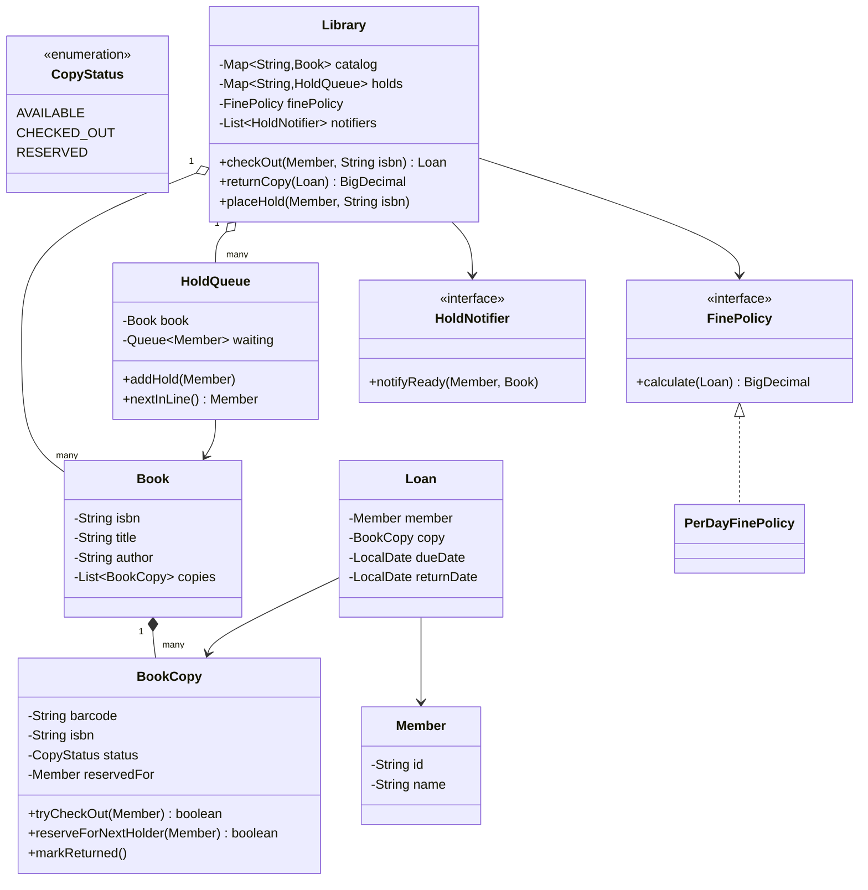
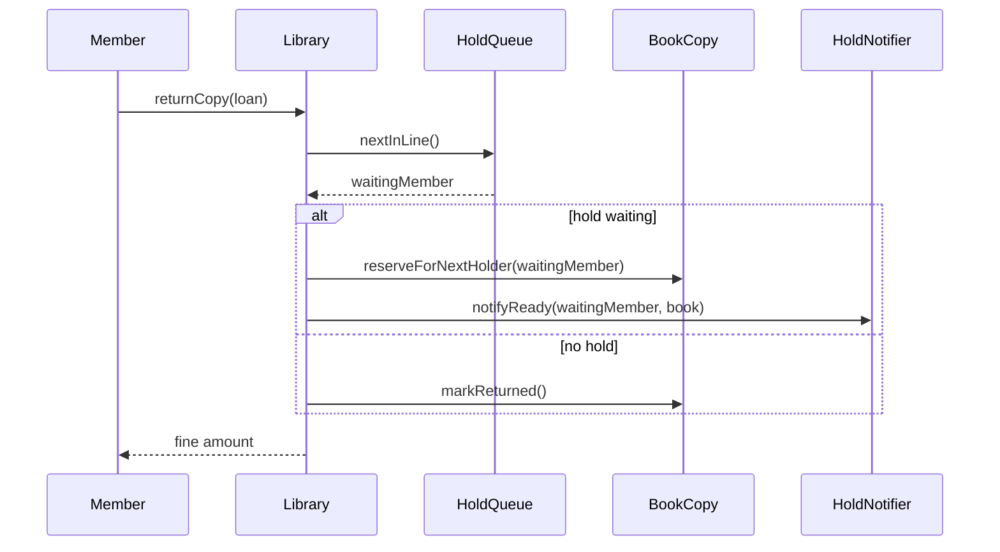

# Design a library management system

**A library management system lets members search the catalog, check out and return book copies, and get notified when a held book becomes available.**

## Requirements

### Functional requirements

1. The catalog lists books by title, author, and ISBN. Each book can have several physical copies.
2. A member checks out an available copy, which creates a loan with a due date.
3. When a copy is returned, the system computes a fine if it's late, based on days overdue.
4. If every copy of a book is checked out, a member can place a hold. When a copy is returned, the system offers it to the next member in the hold queue.
5. A member can search the catalog by title or author and see how many copies are currently available.

### Non-functional requirements

- Two members can't check out the same physical copy at the same time.
- Adding a new fine policy (flat rate, capped, membership-tier discount) shouldn't require changing `Loan` or `Library`.
- Hold queues are served in the order members joined them.

### Out of scope

- Payment collection for fines.
- Interlibrary loans between branches.
- Digital/e-book lending.

## Clarifying questions to ask

| Question | Assumption we make |
|---|---|
| Is a "book" the same as a "copy"? | No. A `Book` is the catalog entry; a `BookCopy` is one physical, barcoded item. |
| What happens when a held copy is returned? | It's reserved for the next member in the hold queue for a limited pickup window; out of scope for the pickup timer itself. |
| How is the fine calculated? | A per-day rate past the due date, behind a swappable policy. |
| Can a member hold a book that has an available copy? | No, holds only apply when every copy is checked out. |

## Core entities

| Entity | Responsibility |
|---|---|
| `Book` | Catalog entry: title, author, ISBN |
| `BookCopy` | One physical copy: barcode, its book's ISBN, and status |
| `Member` | A library user who can borrow and hold books |
| `Loan` | Records a copy borrowed by a member, checkout date, and due date |
| `HoldQueue` | Members waiting for a book, in order |
| `FinePolicy` | Calculates the fine for a late return |
| `Library` | Entry point: checkout, return, hold, and search |

## Class diagram



*`Library` is the only class members and staff interact with; it hides catalog lookup, copy selection, and hold queues.*

## Key flows



*Returning a copy checks the hold queue first; if someone is waiting, the copy moves straight from checked-out to reserved, skipping the available state entirely.*

## Design patterns used

| Pattern | Where | Why |
|---|---|---|
| State | `CopyStatus` transitions inside `BookCopy` | A copy's valid next status depends only on its current one |
| Strategy | `FinePolicy` | Swap fine calculation rules without touching `Library` or `Loan` |
| Observer | `HoldNotifier` implementations registered on `Library`, called when a copy becomes ready for a waiting member | Decouples "a copy became free for you" from how that's delivered (email, app push, and so on) |

## Implementation

`BookCopy` claims itself atomically, the same idea as a parking spot:

```java
public enum CopyStatus { AVAILABLE, CHECKED_OUT, RESERVED }

public class BookCopy {
    private final String barcode;
    private final String isbn;
    private final AtomicReference<CopyStatus> status = new AtomicReference<>(CopyStatus.AVAILABLE);
    private final AtomicReference<Member> reservedFor = new AtomicReference<>();

    public BookCopy(String barcode, String isbn) { this.barcode = barcode; this.isbn = isbn; }

    // Succeeds for a plain available copy, or for the member it's reserved for.
    public boolean tryCheckOut(Member member) {
        Member reserved = reservedFor.get();
        if (reserved != null) {
            if (!reserved.equals(member)) return false;
            boolean claimed = status.compareAndSet(CopyStatus.RESERVED, CopyStatus.CHECKED_OUT);
            if (claimed) reservedFor.set(null);
            return claimed;
        }
        return status.compareAndSet(CopyStatus.AVAILABLE, CopyStatus.CHECKED_OUT);
    }

    // Moves straight from checked-out to reserved so no other thread can claim it as available in between.
    public boolean reserveForNextHolder(Member member) {
        boolean claimed = status.compareAndSet(CopyStatus.CHECKED_OUT, CopyStatus.RESERVED);
        if (claimed) reservedFor.set(member);
        return claimed;
    }

    public void markReturned() { status.compareAndSet(CopyStatus.CHECKED_OUT, CopyStatus.AVAILABLE); }
    public String barcode() { return barcode; }
    public String isbn() { return isbn; }
    public CopyStatus status() { return status.get(); }
}
```

`Book` groups copies and finds the first one it can claim; `Loan` is a simple record of the borrow:

```java
public class Book {
    private final String isbn;
    private final String title;
    private final String author;
    private final List<BookCopy> copies;

    public Book(String isbn, String title, String author, List<BookCopy> copies) {
        this.isbn = isbn; this.title = title; this.author = author; this.copies = copies;
    }

    public Optional<BookCopy> claimCopyFor(Member member) {
        return copies.stream().filter(c -> c.tryCheckOut(member)).findFirst();
    }

    public long availableCount() {
        return copies.stream().filter(c -> c.status() == CopyStatus.AVAILABLE).count();
    }

    public String isbn() { return isbn; }
    public String title() { return title; }
    public String author() { return author; }
}

public class Loan {
    private final Member member;
    private final BookCopy copy;
    private final LocalDate checkoutDate;
    private final LocalDate dueDate;
    private LocalDate returnDate;

    public Loan(Member member, BookCopy copy, LocalDate checkoutDate, LocalDate dueDate) {
        this.member = member; this.copy = copy; this.checkoutDate = checkoutDate; this.dueDate = dueDate;
    }

    public void markReturned(LocalDate date) { this.returnDate = date; }
    public Member member() { return member; }
    public BookCopy copy() { return copy; }
    public LocalDate dueDate() { return dueDate; }
    public LocalDate returnDate() { return returnDate; }
}
```

The hold queue, fine policy, and `Library` tie everything together:

```java
public class HoldQueue {
    private final Book book;
    private final Queue<Member> waiting = new ConcurrentLinkedQueue<>();

    public HoldQueue(Book book) { this.book = book; }
    public void addHold(Member member) { waiting.add(member); }
    public Member nextInLine() { return waiting.poll(); }
    public Book book() { return book; }
}

public interface FinePolicy {
    BigDecimal calculate(Loan loan);
}

public class PerDayFinePolicy implements FinePolicy {
    private final BigDecimal ratePerDay;
    public PerDayFinePolicy(BigDecimal ratePerDay) { this.ratePerDay = ratePerDay; }

    public BigDecimal calculate(Loan loan) {
        long lateDays = Math.max(0, ChronoUnit.DAYS.between(loan.dueDate(), loan.returnDate()));
        return ratePerDay.multiply(BigDecimal.valueOf(lateDays));
    }
}

public interface HoldNotifier {
    void notifyReady(Member member, Book book);
}

public class Library {
    private final Map<String, Book> catalog;
    private final Map<String, HoldQueue> holds = new ConcurrentHashMap<>();
    private final FinePolicy finePolicy;
    private final List<HoldNotifier> notifiers;

    public Library(Map<String, Book> catalog, FinePolicy finePolicy, List<HoldNotifier> notifiers) {
        this.catalog = catalog;
        this.finePolicy = finePolicy;
        this.notifiers = notifiers;
    }

    public Loan checkOut(Member member, String isbn) {
        Book book = catalog.get(isbn);
        BookCopy copy = book.claimCopyFor(member)
            .orElseThrow(() -> new IllegalStateException("No copies available"));
        return new Loan(member, copy, LocalDate.now(), LocalDate.now().plusDays(14));
    }

    public BigDecimal returnCopy(Loan loan) {
        loan.markReturned(LocalDate.now());
        Book book = catalog.get(loan.copy().isbn());
        HoldQueue queue = holds.get(loan.copy().isbn());
        Member next = queue == null ? null : queue.nextInLine();
        if (next != null) {
            loan.copy().reserveForNextHolder(next);
            notifiers.forEach(n -> n.notifyReady(next, book));
        } else {
            loan.copy().markReturned();
        }
        return finePolicy.calculate(loan);
    }

    public void placeHold(Member member, String isbn) {
        Book book = catalog.get(isbn);
        if (book.availableCount() > 0) throw new IllegalStateException("Copies are available; no hold needed");
        holds.computeIfAbsent(isbn, k -> new HoldQueue(book)).addHold(member);
    }
}
```

## Handling concurrency

- **Two members check out the last copy at once.** `tryCheckOut` uses `compareAndSet`, so only one succeeds; the other sees `AVAILABLE` (or `RESERVED` for someone else) already gone and moves to the next copy or gets "no copies available."
- **A copy is returned while a hold is being added.** `HoldQueue` uses a `ConcurrentLinkedQueue`, so `addHold` and `nextInLine` never corrupt the queue even if they run at the same moment on different threads.
- **A copy is checked out by someone else right as it's being handed to a hold.** `reserveForNextHolder` moves the status straight from `CHECKED_OUT` to `RESERVED` with a single `compareAndSet`. There's no intermediate `AVAILABLE` state, so no other member can claim the copy in between.
- **Two returns for the same loan.** `markReturned` and `reserveForNextHolder` both use `compareAndSet` against `CHECKED_OUT`, so a duplicate return call fails silently on the second attempt instead of double-processing the copy; wrap `Loan` itself in a similar guard to also avoid computing a second fine.

## Extending the design

**How do you support renewing a loan?**
Add a `renew(Loan)` method to `Library` that checks the hold queue is empty for that book, then pushes `dueDate` forward. If someone is holding the book, renewal is refused.

**How do you add a membership-tier discount on fines?**
Wrap `PerDayFinePolicy` in a `TieredFinePolicy` that reduces the result based on `Member`'s tier. `Library` still just calls `finePolicy.calculate(loan)`.

**How would you support multiple branches with their own copies?**
Add a `Branch` that owns its own list of `BookCopy` per book, and let `Library` route a checkout to the member's home branch first, falling back to others.

## Key takeaways

- Separate the catalog entry (`Book`) from the physical item (`BookCopy`), since only the copy has a checkout state.
- Make copy claiming atomic with compare-and-set, avoiding a lock across the whole catalog.
- Keep fine calculation behind a strategy interface, since pricing rules change more often than the checkout flow.
- Serve hold queues in arrival order, and check them on every return before treating a copy as generally available.
