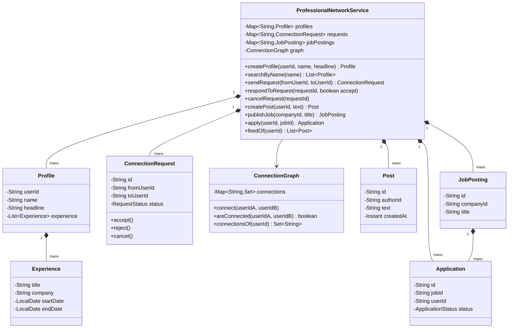
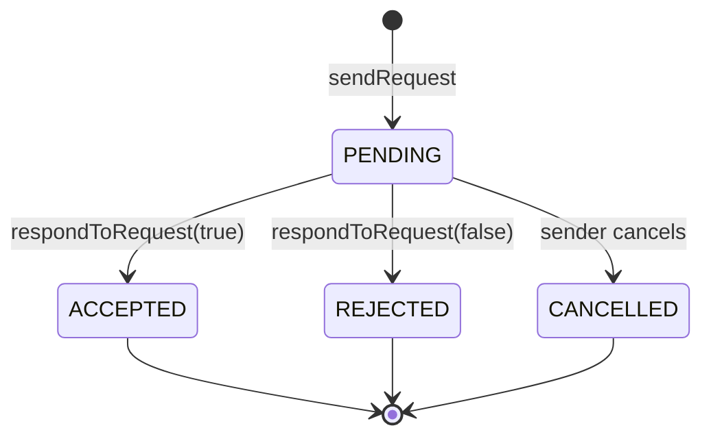

# Design a professional network like LinkedIn

**A professional network lets users build a profile with work experience, connect with other users by mutual consent, and post updates that connections see in a feed.**

## Requirements

### Functional requirements

1. A user creates a profile with a headline and a list of work experience entries.
2. A user sends a connection request to another user; the request must be accepted before they're connected.
3. A connected user can post an update; the post appears in the feed of their connections.
4. A company can publish a job posting; a user can apply to it.
5. A user can search other profiles by name.

### Non-functional requirements

- Connections require mutual consent, unlike a one-way follow, so requests need their own lifecycle.
- The system should support a large number of pending requests without slowing down accepting one.
- Adding a new profile section (for example, certifications) shouldn't require changing the connection or feed logic.

### Out of scope

- Full-text or fuzzy search ranking
- Messaging between connections
- Resume parsing for job applications

## Clarifying questions to ask

| Question | Assumption we make |
|---|---|
| Can a user cancel a pending request they sent? | Yes, the sender can cancel while it's still pending. |
| Can a rejected request be sent again? | Yes, after rejection either side can send a new request. |
| Does everyone see every connection's post, like a full feed? | Yes, for the base design; ranking is an extension. |
| Can a user apply to the same job twice? | No, one application per user per job. |

## Core entities

| Entity | Responsibility |
|---|---|
| `Profile` | Holds a user's headline and work experience |
| `ConnectionRequest` | Tracks the lifecycle of one connection request |
| `ConnectionGraph` | Holds confirmed connections between users |
| `Post` | Holds a status update from a user |
| `JobPosting` | Holds a job opening from a company |
| `Application` | Records that a user applied to a job posting |
| `ProfessionalNetworkService` | Entry point: connect, post, apply, search |

## Class diagram



*`ConnectionRequest` and `ConnectionGraph` are separate: one is a short-lived workflow, the other is the resulting durable relationship.*

## Key flows



*A connection request moves from pending to exactly one terminal state; only an accepted request creates an entry in `ConnectionGraph`.*

## Design patterns used

| Pattern | Where | Why |
|---|---|---|
| State | `ConnectionRequest` status transitions | Keeps accept/reject/cancel rules in one place instead of scattered checks |
| Observer (extension) | Notifying a user when their request is accepted | Not wired up below; add a listener hook on `ConnectionRequest.accept()` so the requester doesn't have to poll |
| Facade | `ProfessionalNetworkService` | Callers use one entry point instead of coordinating requests, graph, and posts directly |

## Implementation

`Profile` and `Experience` are straightforward value holders:

```java
public record Experience(String title, String company, LocalDate startDate, LocalDate endDate) {}

public class Profile {
    private final String userId;
    private final String name;
    private String headline;
    private final List<Experience> experience = new ArrayList<>();

    public Profile(String userId, String name, String headline) {
        this.userId = userId;
        this.name = name;
        this.headline = headline;
    }

    public void addExperience(Experience e) { experience.add(e); }
    public List<Experience> experience() { return List.copyOf(experience); }
    public String userId() { return userId; }
    public String name() { return name; }
}
```

`Post`, `JobPosting`, and `Application` are simple records used by the service below:

```java
public record Post(String id, String authorId, String text, Instant createdAt) {}
public record JobPosting(String id, String companyId, String title) {}
public enum ApplicationStatus { SUBMITTED }
public record Application(String id, String jobId, String userId, ApplicationStatus status) {}
```

`ConnectionRequest` enforces its own state machine, so invalid transitions throw instead of silently corrupting state:

```java
public enum RequestStatus { PENDING, ACCEPTED, REJECTED, CANCELLED }

public class ConnectionRequest {
    private final String id;
    private final String fromUserId;
    private final String toUserId;
    private RequestStatus status = RequestStatus.PENDING;

    public ConnectionRequest(String id, String fromUserId, String toUserId) {
        this.id = id;
        this.fromUserId = fromUserId;
        this.toUserId = toUserId;
    }

    public synchronized void accept() {
        requirePending();
        status = RequestStatus.ACCEPTED;
    }

    public synchronized void reject() {
        requirePending();
        status = RequestStatus.REJECTED;
    }

    public synchronized void cancel() {
        requirePending();
        status = RequestStatus.CANCELLED;
    }

    private void requirePending() {
        if (status != RequestStatus.PENDING) {
            throw new IllegalStateException("Request " + id + " is already " + status);
        }
    }

    public RequestStatus status() { return status; }
    public String id() { return id; }
    public String fromUserId() { return fromUserId; }
    public String toUserId() { return toUserId; }
}
```

`ConnectionGraph` stores only confirmed, two-way connections:

```java
public class ConnectionGraph {
    private final Map<String, Set<String>> connections = new ConcurrentHashMap<>();

    public void connect(String userIdA, String userIdB) {
        connections.computeIfAbsent(userIdA, k -> ConcurrentHashMap.newKeySet()).add(userIdB);
        connections.computeIfAbsent(userIdB, k -> ConcurrentHashMap.newKeySet()).add(userIdA);
    }

    public boolean areConnected(String userIdA, String userIdB) {
        return connections.getOrDefault(userIdA, Set.of()).contains(userIdB);
    }

    public Set<String> connectionsOf(String userId) {
        return connections.getOrDefault(userId, Set.of());
    }
}
```

`ProfessionalNetworkService` ties profiles, requests, the graph, posts, and jobs together. It rejects a duplicate pending request between the same pair, and a duplicate application to the same job:

```java
public class ProfessionalNetworkService {
    private final Map<String, Profile> profiles = new ConcurrentHashMap<>();
    private final Map<String, ConnectionRequest> requests = new ConcurrentHashMap<>();
    private final Map<String, JobPosting> jobPostings = new ConcurrentHashMap<>();
    private final Set<String> applicationKeys = ConcurrentHashMap.newKeySet();
    private final ConnectionGraph graph = new ConnectionGraph();
    private final Map<String, Post> posts = new ConcurrentHashMap<>();

    public Profile createProfile(String userId, String name, String headline) {
        Profile profile = new Profile(userId, name, headline);
        profiles.put(userId, profile);
        return profile;
    }

    public List<Profile> searchByName(String name) {
        String lower = name.toLowerCase();
        return profiles.values().stream()
            .filter(p -> p.name().toLowerCase().contains(lower))
            .toList();
    }

    public ConnectionRequest sendRequest(String fromUserId, String toUserId) {
        boolean alreadyPending = requests.values().stream().anyMatch(r ->
            r.status() == RequestStatus.PENDING
            && Set.of(r.fromUserId(), r.toUserId()).equals(Set.of(fromUserId, toUserId)));
        if (alreadyPending || graph.areConnected(fromUserId, toUserId)) {
            throw new IllegalStateException("Request already pending or already connected");
        }
        ConnectionRequest request = new ConnectionRequest(UUID.randomUUID().toString(), fromUserId, toUserId);
        requests.put(request.id(), request);
        return request;
    }

    public void respondToRequest(String requestId, boolean accept) {
        ConnectionRequest request = requests.get(requestId);
        if (request == null) throw new IllegalArgumentException("Unknown request " + requestId);
        if (accept) {
            request.accept();
            graph.connect(request.fromUserId(), request.toUserId());
        } else {
            request.reject();
        }
    }

    public void cancelRequest(String requestId) {
        ConnectionRequest request = requests.get(requestId);
        if (request == null) throw new IllegalArgumentException("Unknown request " + requestId);
        request.cancel();
    }

    public Post createPost(String userId, String text) {
        Post post = new Post(UUID.randomUUID().toString(), userId, text, Instant.now());
        posts.put(post.id(), post);
        return post;
    }

    public JobPosting publishJob(String companyId, String title) {
        JobPosting job = new JobPosting(UUID.randomUUID().toString(), companyId, title);
        jobPostings.put(job.id(), job);
        return job;
    }

    public Application apply(String userId, String jobId) {
        if (!applicationKeys.add(userId + ":" + jobId)) {
            throw new IllegalStateException("Already applied to this job");
        }
        return new Application(UUID.randomUUID().toString(), jobId, userId, ApplicationStatus.SUBMITTED);
    }

    public List<Post> feedOf(String userId) {
        Set<String> connectionIds = graph.connectionsOf(userId);
        return posts.values().stream()
            .filter(p -> connectionIds.contains(p.authorId()))
            .sorted(Comparator.comparing(Post::createdAt).reversed())
            .toList();
    }
}
```

- `sendRequest` blocks a second pending request between the same pair and blocks requesting an existing connection.
- `respondToRequest` and `cancelRequest` both reject an unknown request ID instead of throwing a `NullPointerException`.
- Only `respondToRequest(true)` writes to `ConnectionGraph`; rejection and cancellation never touch it.
- `apply` uses `applicationKeys.add` as an atomic check-and-insert, so a duplicate application fails cleanly.
- `feedOf` only includes posts from confirmed connections, unlike a one-way follow feed.

## Handling concurrency

- **Both users send a request to each other at the same moment.** The `alreadyPending` check and `requests.put` aren't atomic together, so a race is possible; guard it with a per-pair lock (for example, keyed on the sorted pair of user IDs) or a unique constraint at the storage layer.
- **Accept and cancel racing on the same request.** `ConnectionRequest`'s methods are `synchronized` on the request instance, so only one transition wins; the other throws `IllegalStateException`, which the service treats as "already handled."
- **Two applications to the same job from the same user at once.** `apply` uses `applicationKeys.add`, which is atomic on a `ConcurrentHashMap`-backed set, so only one of the two concurrent calls succeeds.
- **Feed read during connection graph update.** `ConnectionGraph` uses `ConcurrentHashMap` with per-entry sets, so a reader sees either the old or new connection set, never a partially updated one.

## Extending the design

**How do you add profile recommendations ("people you may know")?**
Add a `RecommendationStrategy` that looks at second-degree connections in `ConnectionGraph` (connections of connections, excluding existing ones).

**How do you rank the feed instead of showing it by time?**
Same as the social network case: put ranking behind a `FeedGenerationStrategy` and inject it into `ProfessionalNetworkService` in place of the time-sorted filter.

**How do you support company pages that users can follow without connecting?**
Add a separate one-way `FollowGraph` for company pages, distinct from `ConnectionGraph`, and merge both sources in `feedOf`.

**How would you notify a user when their request is accepted?**
Add an observer hook to `ConnectionRequest.accept()` that publishes an event; a `NotificationService` subscribes without `ConnectionRequest` knowing about it.

## Key takeaways

- Model a two-way connection as a request workflow plus a separate confirmed-connection store; don't conflate the two.
- Give the request its own state machine so accept/reject/cancel rules can't be bypassed.
- Guard check-then-act operations (duplicate request, duplicate application) with per-key locking, not a global lock.
- Keep the feed, search, and jobs features as independent read paths over the same core data.
