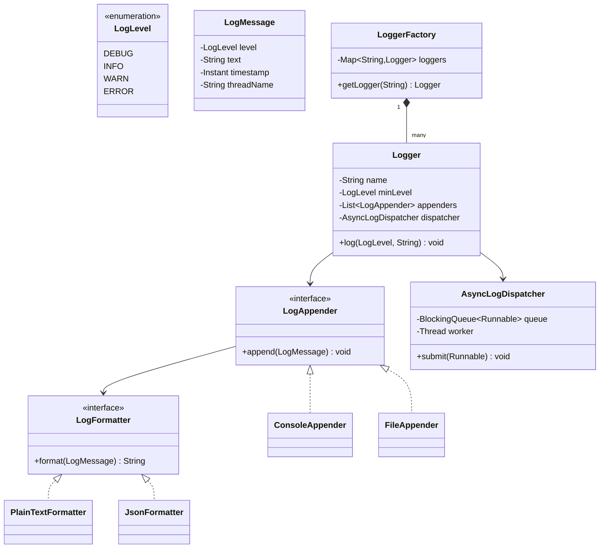
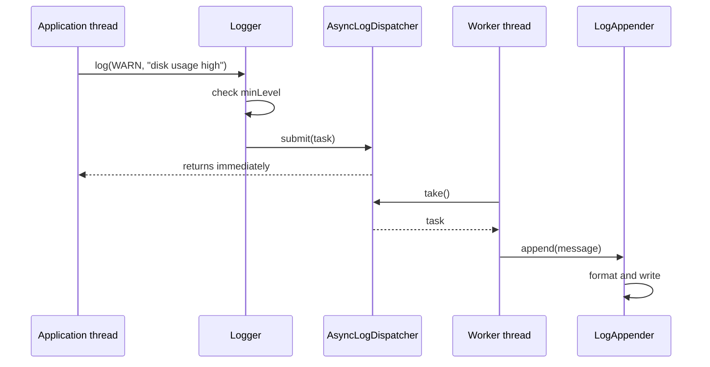

# Design a logging framework

**A logging framework lets application code emit messages at a severity level and routes each message to one or more destinations, such as a console or a file.**

## Requirements

### Functional requirements

1. Application code logs a message with a level: `DEBUG`, `INFO`, `WARN`, or `ERROR`.
2. Each logger has a minimum level; messages below it are dropped.
3. A message can be sent to multiple destinations (console, file, network) at once.
4. Each destination formats the message independently (plain text, JSON).
5. Logging must not block the calling thread for long, even if a destination is slow.

### Non-functional requirements

- Many threads log concurrently; log lines must not interleave mid-line in a destination.
- Adding a new destination or format shouldn't require changing existing logger code.
- Losing a log line under extreme load is acceptable; blocking the application is not.

### Out of scope

- Log rotation policies and retention.
- Distributed log aggregation across services.

## Clarifying questions to ask

| Question | Assumption we make |
|---|---|
| Is logging synchronous or asynchronous? | Asynchronous, via a background writer thread and a queue. |
| Can each logger have different destinations? | Yes, destinations are configured per logger. |
| What happens when the queue is full? | Drop the oldest or newest message; we drop the newest and count it. |
| Do we need per-destination log levels? | Yes, a destination can filter independently of the logger. |

## Core entities

| Entity | Responsibility |
|---|---|
| `LogLevel` | Orders severities and compares against a threshold |
| `LogMessage` | Immutable record of level, text, timestamp, and thread |
| `LogFormatter` | Turns a `LogMessage` into a string |
| `LogAppender` | Writes a formatted message to one destination |
| `Logger` | Filters by level and fans a message out to appenders |
| `AsyncLogDispatcher` | Queues messages and writes them on a background thread |
| `LoggerFactory` | Creates and caches loggers by name |

## Class diagram



*`Logger` filters by level and hands the message to the dispatcher, which fans it out to appenders off the caller's thread.*

## Key flows



*The calling thread only enqueues; a dedicated worker thread does the actual formatting and I/O.*

## Design patterns used

| Pattern | Where | Why |
|---|---|---|
| Strategy | `LogFormatter` | Swap plain text and JSON output without touching appenders |
| Decorator (extension) | Wrapping an appender to add filtering or buffering | Add behavior to an appender without subclassing; see "Extending the design" |
| Singleton | `LoggerFactory` | One factory caches loggers by name across the app |
| Producer-consumer | `AsyncLogDispatcher` | Decouples the fast producer (app thread) from slow consumers (I/O) |

## Implementation

The level enum and an immutable message record:

```java
public enum LogLevel {
    DEBUG, INFO, WARN, ERROR;

    public boolean isAtLeast(LogLevel threshold) {
        return this.ordinal() >= threshold.ordinal();
    }
}

public record LogMessage(LogLevel level, String text, Instant timestamp, String threadName) {}
```

Formatters turn a message into text; appenders write formatted text somewhere:

```java
public interface LogFormatter {
    String format(LogMessage message);
}

public class PlainTextFormatter implements LogFormatter {
    public String format(LogMessage m) {
        return "[%s] %s (%s): %s".formatted(m.timestamp(), m.level(), m.threadName(), m.text());
    }
}

public class JsonFormatter implements LogFormatter {
    public String format(LogMessage m) {
        return "{\"time\":\"%s\",\"level\":\"%s\",\"thread\":\"%s\",\"message\":\"%s\"}"
            .formatted(m.timestamp(), m.level(), m.threadName(), m.text());
    }
}

public interface LogAppender {
    void append(LogMessage message);
}

public class ConsoleAppender implements LogAppender {
    private final LogFormatter formatter;
    public ConsoleAppender(LogFormatter formatter) { this.formatter = formatter; }

    public void append(LogMessage message) {
        System.out.println(formatter.format(message));
    }
}

public class FileAppender implements LogAppender {
    private final LogFormatter formatter;
    private final BufferedWriter writer;

    public FileAppender(LogFormatter formatter, Path path) throws IOException {
        this.formatter = formatter;
        this.writer = Files.newBufferedWriter(path, StandardOpenOption.CREATE, StandardOpenOption.APPEND);
    }

    public synchronized void append(LogMessage message) {
        try {
            writer.write(formatter.format(message));
            writer.newLine();
            writer.flush();
        } catch (IOException e) {
            throw new UncheckedIOException(e);
        }
    }
}
```

The dispatcher runs a single worker thread pulling from a bounded queue, so one slow appender doesn't block the app:

```java
public class AsyncLogDispatcher {
    private final BlockingQueue<Runnable> queue;
    private final Thread worker;
    private volatile boolean running = true;

    public AsyncLogDispatcher(int capacity) {
        this.queue = new LinkedBlockingQueue<>(capacity);
        this.worker = new Thread(this::processLoop, "log-worker");
        this.worker.setDaemon(true);
        this.worker.start();
    }

    public void submit(Runnable task) {
        if (!queue.offer(task)) {
            // ponytail: queue full drops the newest message; swap for a metric-backed
            // ring buffer if silent drops become a problem
        }
    }

    private void processLoop() {
        while (running) {
            try {
                queue.take().run();
            } catch (InterruptedException e) {
                Thread.currentThread().interrupt();
            }
        }
    }

    public void shutdown() { running = false; worker.interrupt(); }
}
```

`Logger` checks the level, then hands off to the dispatcher for each appender:

```java
public class Logger {
    private final String name;
    private final LogLevel minLevel;
    private final List<LogAppender> appenders;
    private final AsyncLogDispatcher dispatcher;

    public Logger(String name, LogLevel minLevel, List<LogAppender> appenders, AsyncLogDispatcher dispatcher) {
        this.name = name;
        this.minLevel = minLevel;
        this.appenders = appenders;
        this.dispatcher = dispatcher;
    }

    public void log(LogLevel level, String text) {
        if (!level.isAtLeast(minLevel)) return;
        LogMessage message = new LogMessage(level, text, Instant.now(), Thread.currentThread().getName());
        for (LogAppender appender : appenders) {
            dispatcher.submit(() -> appender.append(message));
        }
    }
}

public class LoggerFactory {
    private static final Map<String, Logger> loggers = new ConcurrentHashMap<>();
    private static AsyncLogDispatcher dispatcher = new AsyncLogDispatcher(10_000);

    public static Logger getLogger(String name) {
        return loggers.computeIfAbsent(name, n ->
            new Logger(n, LogLevel.INFO, List.of(new ConsoleAppender(new PlainTextFormatter())), dispatcher));
    }
}
```

## Handling concurrency

- **Multiple threads calling `log` at once.** `Logger.log` builds an immutable `LogMessage` and submits it; there's no shared mutable state on the hot path.
- **Interleaved output from concurrent writers.** All writes go through the single dispatcher worker thread, so appenders see one message at a time and never interleave partial lines.
- **Queue overflow under bursty load.** `LinkedBlockingQueue` with a fixed capacity backs off with `offer` instead of blocking the caller; drops are counted rather than silent in a production version.
- **Slow appender (e.g., network).** Because a single worker serializes all appenders, a slow one delays others. For high fan-out, give each appender its own dispatcher.

## Extending the design

**How do you add log rotation for `FileAppender`?**
Wrap the writer with a check on file size or date at write time, and roll over to a new file. `LogAppender`'s interface doesn't change.

**How do you support structured logging with key-value fields?**
Add a `Map<String, Object> fields` to `LogMessage` and a `StructuredLogFormatter` that serializes them. Existing formatters ignore the new field.

**How do you rate-limit noisy log lines?**
Add a decorator implementing `LogAppender` that wraps a real appender and drops repeats of the same message within a time window.

## Key takeaways

- Separate filtering (`Logger`), formatting (`LogFormatter`), and writing (`LogAppender`) into distinct roles.
- Decouple the calling thread from I/O with a bounded queue and a background worker.
- Prefer dropping messages over blocking the application when the queue is full.
- New destinations and formats are new classes, not changes to `Logger`.
