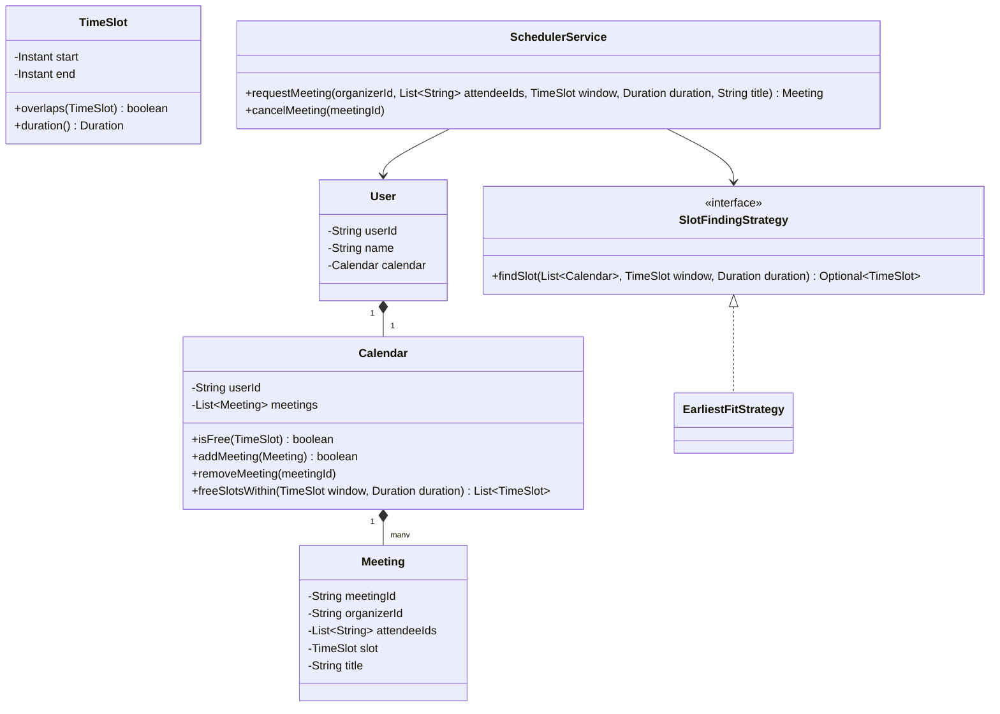
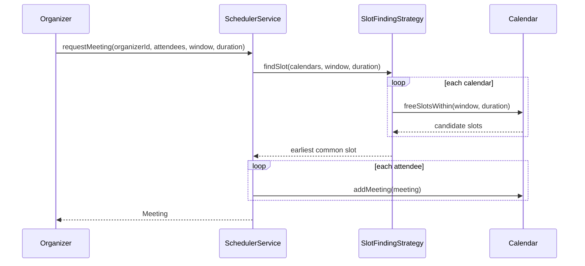

# Design a meeting scheduler

**A meeting scheduler finds a free time slot across several people's calendars and books a meeting that fits everyone.**

## Requirements

### Functional requirements

1. Each user has a calendar made of `Meeting` entries with a start and end time.
2. A user can request a meeting with a list of attendees, a duration, and a search window (for example, "sometime this week").
3. The system finds the earliest slot inside the search window where every attendee is free.
4. Booking a meeting adds it to every attendee's calendar. No attendee can end up with two overlapping meetings.
5. A user can cancel a meeting, which removes it from every attendee's calendar.

### Non-functional requirements

- Two organizers booking meetings for the same attendee at the same time must not both succeed if they'd overlap.
- Free/busy lookups should stay fast even as a user's calendar grows to thousands of meetings.
- Support for recurring meetings should plug in without redesigning the booking flow.

### Out of scope

- Time zone conversion UI; we assume all times are normalized to UTC before reaching the scheduler.
- Room or resource booking; we only schedule people.

## Clarifying questions to ask

| Question | Assumption we make |
|---|---|
| Can a meeting have optional attendees who don't block scheduling? | Not in this version; every attendee is required. |
| What granularity do we search at? | 15-minute increments. |
| What happens if no slot fits the window? | Return no result; the caller decides whether to widen the window. |
| Are recurring meetings in scope? | Out of scope for the base design; addressed as an extension. |

## Core entities

| Entity | Responsibility |
|---|---|
| `User` | Person with a `Calendar` |
| `TimeSlot` | A start and end instant |
| `Meeting` | A booked event: organizer, attendees, time slot |
| `Calendar` | One user's meetings; checks free/busy and inserts meetings |
| `SlotFindingStrategy` | Finds a common free slot across calendars |
| `SchedulerService` | Entry point: request a meeting, cancel a meeting |

## Class diagram



*Each `User` owns one `Calendar`; the scheduler asks a strategy to find a slot free across all attendees' calendars.*

## Key flows



*The strategy intersects each attendee's free slots before the service commits the meeting to every calendar.*

## Design patterns used

| Pattern | Where | Why |
|---|---|---|
| Strategy | `SlotFindingStrategy` | Swap "earliest fit" for "most balanced" or "prefer afternoons" without touching `SchedulerService` |
| Facade | `SchedulerService` | Callers request and cancel meetings without touching individual calendars |
| Value object | `TimeSlot` | Overlap and duration logic lives in one place, reused by calendars and strategies |

## Implementation

`TimeSlot` centralizes overlap checks so `Calendar` and the strategy share one definition of "conflict":

```java
public record TimeSlot(Instant start, Instant end) {
    public boolean overlaps(TimeSlot other) {
        return start.isBefore(other.end()) && other.start().isBefore(end());
    }
    public Duration duration() { return Duration.between(start, end); }
}

public record Meeting(String meetingId, String organizerId, List<String> attendeeIds,
                       TimeSlot slot, String title) {}
```

`Calendar` guards its own meeting list and computes free gaps within a search window:

```java
public class Calendar {
    private final String userId;
    private final List<Meeting> meetings = new ArrayList<>();

    public Calendar(String userId) { this.userId = userId; }

    public synchronized boolean isFree(TimeSlot slot) {
        return meetings.stream().noneMatch(m -> m.slot().overlaps(slot));
    }

    public synchronized boolean addMeeting(Meeting meeting) {
        if (!isFree(meeting.slot())) return false;
        meetings.add(meeting);
        return true;
    }

    public synchronized void removeMeeting(String meetingId) {
        meetings.removeIf(m -> m.meetingId().equals(meetingId));
    }

    public synchronized List<TimeSlot> freeSlotsWithin(TimeSlot window, Duration duration) {
        List<Meeting> busy = meetings.stream()
            .filter(m -> m.slot().overlaps(window))
            .sorted(Comparator.comparing(m -> m.slot().start()))
            .toList();
        List<TimeSlot> free = new ArrayList<>();
        Instant cursor = window.start();
        for (Meeting m : busy) {
            if (Duration.between(cursor, m.slot().start()).compareTo(duration) >= 0) {
                free.add(new TimeSlot(cursor, m.slot().start()));
            }
            cursor = m.slot().end().isAfter(cursor) ? m.slot().end() : cursor;
        }
        if (Duration.between(cursor, window.end()).compareTo(duration) >= 0) {
            free.add(new TimeSlot(cursor, window.end()));
        }
        return free;
    }
}

public class User {
    private final String userId;
    private final String name;
    private final Calendar calendar;

    public User(String userId, String name) {
        this.userId = userId;
        this.name = name;
        this.calendar = new Calendar(userId);
    }
    public Calendar calendar() { return calendar; }
    public String userId() { return userId; }
}
```

`EarliestFitStrategy` intersects every attendee's free slots and returns the first slot long enough for the meeting:

```java
public interface SlotFindingStrategy {
    Optional<TimeSlot> findSlot(List<Calendar> calendars, TimeSlot window, Duration duration);
}

public class EarliestFitStrategy implements SlotFindingStrategy {
    public Optional<TimeSlot> findSlot(List<Calendar> calendars, TimeSlot window, Duration duration) {
        List<TimeSlot> common = List.of(window);
        for (Calendar cal : calendars) {
            List<TimeSlot> free = cal.freeSlotsWithin(window, duration);
            common = intersect(common, free);
            if (common.isEmpty()) return Optional.empty();
        }
        return common.stream()
            .filter(s -> s.duration().compareTo(duration) >= 0)
            .min(Comparator.comparing(TimeSlot::start))
            .map(s -> new TimeSlot(s.start(), s.start().plus(duration)));
    }

    private List<TimeSlot> intersect(List<TimeSlot> a, List<TimeSlot> b) {
        List<TimeSlot> result = new ArrayList<>();
        for (TimeSlot x : a) {
            for (TimeSlot y : b) {
                Instant start = x.start().isAfter(y.start()) ? x.start() : y.start();
                Instant end = x.end().isBefore(y.end()) ? x.end() : y.end();
                if (start.isBefore(end)) result.add(new TimeSlot(start, end));
            }
        }
        return result;
    }
}
```

`SchedulerService` finds a slot and books it atomically across every attendee's calendar:

```java
public class SchedulerService {
    private final Map<String, User> users;
    private final SlotFindingStrategy strategy;
    private final Map<String, Meeting> meetings = new ConcurrentHashMap<>();

    public SchedulerService(Map<String, User> users, SlotFindingStrategy strategy) {
        this.users = users;
        this.strategy = strategy;
    }

    public synchronized Meeting requestMeeting(String organizerId, List<String> attendeeIds,
                                                TimeSlot window, Duration duration, String title) {
        List<Calendar> calendars = attendeeIds.stream().map(id -> users.get(id).calendar()).toList();
        TimeSlot slot = strategy.findSlot(calendars, window, duration)
            .orElseThrow(() -> new IllegalStateException("No common slot in window"));
        Meeting meeting = new Meeting(UUID.randomUUID().toString(), organizerId, attendeeIds, slot, title);
        List<Calendar> booked = new ArrayList<>();
        for (Calendar cal : calendars) {
            if (!cal.addMeeting(meeting)) {
                booked.forEach(b -> b.removeMeeting(meeting.meetingId()));
                throw new IllegalStateException("Slot taken during booking");
            }
            booked.add(cal);
        }
        meetings.put(meeting.meetingId(), meeting);
        return meeting;
    }

    public void cancelMeeting(String meetingId) {
        Meeting meeting = meetings.remove(meetingId);
        if (meeting == null) throw new IllegalArgumentException("Unknown meeting");
        meeting.attendeeIds().forEach(id -> users.get(id).calendar().removeMeeting(meetingId));
    }
}
```

## Handling concurrency

- **Two organizers book the same attendee at once.** `requestMeeting` is `synchronized` on `SchedulerService`, so slot-finding and booking happen as one step; a second request re-evaluates free slots against the meeting the first one just added.
- **Partial booking across attendees.** `requestMeeting` tracks which calendars it already booked and rolls them back if a later `addMeeting` call fails, so no attendee is left with a phantom meeting.
- **Calendar-level races outside the service lock.** Each `Calendar`'s `addMeeting` also re-checks `isFree` under its own lock, so even a caller that bypasses `SchedulerService` can't double-book that calendar.
- **Service-wide lock as a bottleneck.** A single `synchronized` on `SchedulerService` serializes all bookings, which is simple but doesn't scale. For higher throughput, lock only the involved calendars (sorted by user ID to avoid deadlock) instead of the whole service.

## Extending the design

**How do you support recurring meetings?**
Add a `RecurrenceRule` (frequency, count or end date) to the booking request. `SchedulerService` expands it into individual `TimeSlot`s and calls `requestMeeting` logic per occurrence, rolling back all of them if any occurrence has no free slot.

**How do you support optional attendees who shouldn't block scheduling?**
Split `attendeeIds` into required and optional lists. `EarliestFitStrategy` only intersects required attendees' calendars, then checks optional attendees' availability for informational display only.

**How would you scale this to millions of users with large calendars?**
Shard calendars by user ID across storage nodes. Keep `freeSlotsWithin` as a query against a sorted, indexed meeting list (or a range tree) per user, so it stays fast without scanning every meeting.

## Key takeaways

- Make `TimeSlot` overlap logic the single source of truth; `Calendar` and the strategy both build on it.
- Find the slot and book it as one atomic step, or you'll race between finding a slot and claiming it.
- Push slot-selection heuristics into a strategy so "earliest fit" can later become "fewest calendar fragments" without touching booking code.
- Roll back partial bookings explicitly; a multi-attendee operation needs the same all-or-nothing care as a multi-item order.
