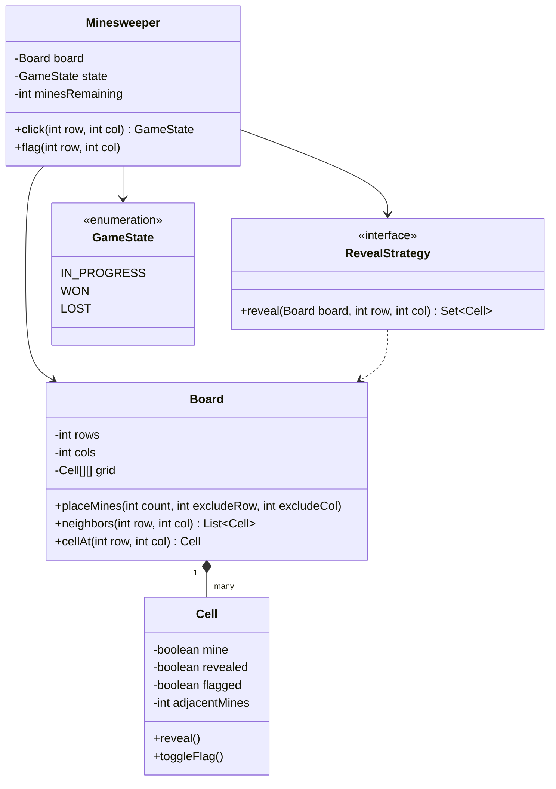
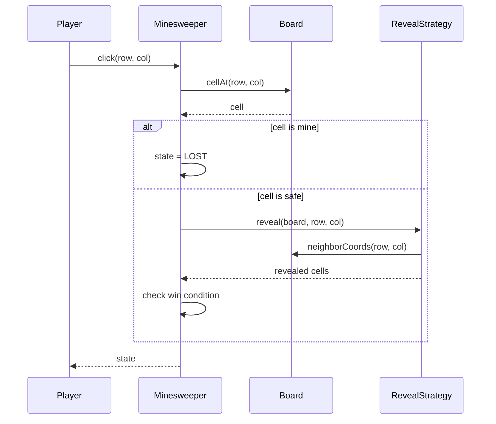

# Design a minesweeper game

**A minesweeper game places mines on a grid and lets a player reveal cells, flag suspected mines, and win by clearing every safe cell.**

## Requirements

### Functional requirements

1. The board is a grid of `rows` x `cols` cells. A fixed number of mines are placed at random at the start.
2. A player can reveal a cell. If it's a mine, the game ends in a loss.
3. If a revealed cell has no adjacent mines, the game auto-reveals its neighbors, and this repeats outward.
4. A revealed cell that isn't a mine shows the count of mines among its 8 neighbors.
5. A player can flag or unflag a cell instead of revealing it.
6. The game is won when every non-mine cell is revealed.

### Non-functional requirements

- The auto-reveal (flood fill) must not stack-overflow on large boards.
- Mine placement must be uniform random and must not place a mine on the player's first click.
- New win conditions or board shapes shouldn't force changes to the reveal logic.

### Out of scope

- A GUI or rendering layer. We model state and rules only.
- Multiplayer or timed competitive modes.

## Clarifying questions to ask

| Question | Assumption we make |
|---|---|
| Can the first click be a mine? | No. Mines are placed after the first click, excluding that cell. |
| What happens on a right-click / flag action on a revealed cell? | Ignored; only hidden cells can be flagged. |
| Is diagonal adjacency counted? | Yes, all 8 neighbors count. |
| Board size limits? | Reasonable desktop sizes, up to a few hundred cells per side. |

## Core entities

| Entity | Responsibility |
|---|---|
| `Cell` | Holds mine flag, revealed/flagged state, and adjacent mine count |
| `Board` | Grid of cells; places mines and computes adjacency counts |
| `RevealStrategy` | Performs the flood-fill reveal starting at a cell |
| `Minesweeper` | Entry point: tracks game state and applies player actions |
| `GameState` | Enum for in-progress, won, lost |

## Class diagram



*`Minesweeper` owns the board and delegates the flood-fill logic to a swappable strategy.*

## Key flows



*A click either ends the game on a mine or triggers a flood-fill reveal and a win check.*

## Design patterns used

| Pattern | Where | Why |
|---|---|---|
| Strategy | `RevealStrategy` | Swap flood-fill for a different reveal rule (for example, a "reveal one" hard mode) without touching `Minesweeper` |
| State | `GameState` | Keeps valid transitions (in-progress to won/lost) explicit and simple |
| Facade | `Minesweeper` | Player only calls `click` and `flag`; never touches `Board` directly |

## Implementation

The `Cell` holds per-cell state. It's a plain mutable class, since cells change often:

```java
public class Cell {
    private boolean mine;
    private boolean revealed;
    private boolean flagged;
    private int adjacentMines;

    public void setMine(boolean mine) { this.mine = mine; }
    public void reveal() { this.revealed = true; }
    public void toggleFlag() { if (!revealed) flagged = !flagged; }
    public void setAdjacentMines(int count) { this.adjacentMines = count; }

    public boolean isMine() { return mine; }
    public boolean isRevealed() { return revealed; }
    public boolean isFlagged() { return flagged; }
    public int adjacentMines() { return adjacentMines; }
}
```

`Board` places mines, avoiding the first-click cell, and computes each cell's adjacency count:

```java
public class Board {
    private final int rows, cols;
    private final Cell[][] grid;

    public Board(int rows, int cols) {
        this.rows = rows;
        this.cols = cols;
        this.grid = new Cell[rows][cols];
        for (int r = 0; r < rows; r++)
            for (int c = 0; c < cols; c++) grid[r][c] = new Cell();
    }

    public void placeMines(int count, int excludeRow, int excludeCol) {
        List<int[]> candidates = new ArrayList<>();
        for (int r = 0; r < rows; r++)
            for (int c = 0; c < cols; c++)
                if (r != excludeRow || c != excludeCol) candidates.add(new int[]{r, c});
        Collections.shuffle(candidates);
        for (int i = 0; i < count; i++) {
            int[] pos = candidates.get(i);
            grid[pos[0]][pos[1]].setMine(true);
        }
        for (int r = 0; r < rows; r++)
            for (int c = 0; c < cols; c++)
                grid[r][c].setAdjacentMines((int) neighbors(r, c).stream().filter(Cell::isMine).count());
    }

    public List<Cell> neighbors(int row, int col) {
        List<Cell> result = new ArrayList<>();
        for (int dr = -1; dr <= 1; dr++)
            for (int dc = -1; dc <= 1; dc++) {
                if (dr == 0 && dc == 0) continue;
                int nr = row + dr, nc = col + dc;
                if (nr >= 0 && nr < rows && nc >= 0 && nc < cols) result.add(grid[nr][nc]);
            }
        return result;
    }

    public Cell cellAt(int row, int col) { return grid[row][col]; }
    public int rows() { return rows; }
    public int cols() { return cols; }
    public List<int[]> neighborCoords(int row, int col) {
        List<int[]> coords = new ArrayList<>();
        for (int dr = -1; dr <= 1; dr++)
            for (int dc = -1; dc <= 1; dc++) {
                if (dr == 0 && dc == 0) continue;
                int nr = row + dr, nc = col + dc;
                if (nr >= 0 && nr < rows && nc >= 0 && nc < cols) coords.add(new int[]{nr, nc});
            }
        return coords;
    }
}
```

The flood-fill strategy uses an explicit queue, not recursion, so it never blows the call stack:

```java
public class FloodFillReveal implements RevealStrategy {
    public Set<Cell> reveal(Board board, int row, int col) {
        Set<Cell> revealedCells = new HashSet<>();
        Deque<int[]> queue = new ArrayDeque<>();
        queue.add(new int[]{row, col});

        while (!queue.isEmpty()) {
            int[] pos = queue.poll();
            Cell cell = board.cellAt(pos[0], pos[1]);
            if (cell.isRevealed() || cell.isFlagged()) continue;
            cell.reveal();
            revealedCells.add(cell);
            if (cell.adjacentMines() == 0) {
                for (int[] n : board.neighborCoords(pos[0], pos[1])) {
                    if (!board.cellAt(n[0], n[1]).isRevealed()) queue.add(n);
                }
            }
        }
        return revealedCells;
    }
}
```

`Minesweeper` ties the board and strategy together and tracks the win/loss state:

```java
public class Minesweeper {
    private final Board board;
    private final RevealStrategy revealStrategy;
    private final int totalMines;
    private GameState state = GameState.IN_PROGRESS;
    private boolean firstClickDone = false;
    private int revealedSafeCells = 0;

    public Minesweeper(int rows, int cols, int mines, RevealStrategy revealStrategy) {
        this.board = new Board(rows, cols);
        this.revealStrategy = revealStrategy;
        this.totalMines = mines;
    }

    public GameState click(int row, int col) {
        if (state != GameState.IN_PROGRESS) return state;
        if (!firstClickDone) {
            board.placeMines(totalMines, row, col);
            firstClickDone = true;
        }
        Cell cell = board.cellAt(row, col);
        if (cell.isFlagged()) return state;
        if (cell.isMine()) {
            state = GameState.LOST;
            return state;
        }
        revealedSafeCells += revealStrategy.reveal(board, row, col).size();
        int safeCells = board.rows() * board.cols() - totalMines;
        if (revealedSafeCells >= safeCells) state = GameState.WON;
        return state;
    }

    public void flag(int row, int col) {
        if (state == GameState.IN_PROGRESS) board.cellAt(row, col).toggleFlag();
    }

    public GameState state() { return state; }
}
```

## Handling concurrency

- Minesweeper is normally single-player and single-threaded, so no locking is needed for a typical desktop game.
- If you expose it over a server (for example, a shared spectator view), guard `click` and `flag` with a lock per game instance, since `revealedSafeCells` and `state` are read-modify-write.
- The flood fill uses an explicit queue, which avoids the stack depth problem a recursive version would hit on a large empty board.

## Extending the design

**How would you add a "chord" action (click a revealed number to reveal all unflagged neighbors)?**
Add a `chord(row, col)` method on `Minesweeper` that checks the flagged neighbor count equals the cell's `adjacentMines`, then calls `revealStrategy.reveal` on each unflagged neighbor.

**How would you support different board shapes, like hexagonal grids?**
Extract an `AdjacencyProvider` interface that `Board` and `RevealStrategy` use instead of the fixed 8-neighbor loop. A hex board supplies 6 neighbors instead of 8.

**How would you add a scoring or time-based leaderboard?**
Use the observer pattern. `Minesweeper` notifies listeners on state change to `WON`, and a `ScoreTracker` listener records elapsed time.

## Key takeaways

- Separate cell state, board layout, and reveal logic so each has one job.
- Use an explicit queue for flood fill instead of recursion to avoid stack overflow.
- Delay mine placement until the first click to guarantee a safe start.
- Keep game state in a small enum and check transitions in one place.
