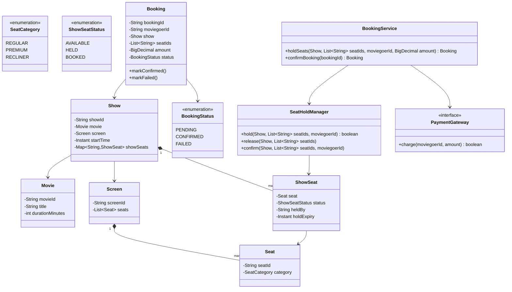
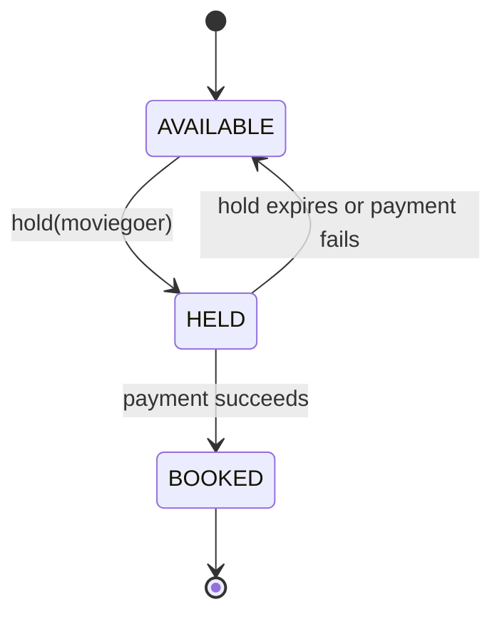

# Design a movie booking system

**A movie booking system lets a moviegoer pick a show, hold seats while they pay, and confirms a booking once payment succeeds.**

## Requirements

### Functional requirements

1. A theater has multiple screens. Each screen has a fixed seat layout.
2. A show schedules one movie on one screen at a specific start time.
3. A moviegoer can view seat availability for a show and select one or more seats.
4. Selected seats are held for a short window while the moviegoer pays. If payment doesn't complete, the hold expires and seats become free again.
5. A successful payment confirms the booking and marks the seats as booked for that show.

### Non-functional requirements

- Two moviegoers must never both book the same seat for the same show.
- A held seat that isn't paid for within the hold window must free up automatically, without a moviegoer action.
- Adding a new seat category (recliner, wheelchair-accessible) shouldn't require changing the booking flow.

### Out of scope

- Seat pricing by dynamic demand. We assume a fixed price per category.
- Payment gateway integration details; we assume a `PaymentGateway` interface.

## Clarifying questions to ask

| Question | Assumption we make |
|---|---|
| How long is a seat held before it's released? | A fixed 5-minute hold window. |
| Can a moviegoer hold seats for two different shows at once? | Yes, holds are scoped per show, not per moviegoer. |
| Do seat categories affect price? | Yes, each category has its own price for a show. |
| What if the payment gateway times out? | Treat it as a failure; release the hold. |

## Core entities

| Entity | Responsibility |
|---|---|
| `Movie` | Title and metadata |
| `Screen` | A physical room with a fixed set of `Seat`s |
| `Seat` | Position and category on a screen |
| `Show` | A movie scheduled on a screen at a start time |
| `ShowSeat` | The booking status of one seat for one show |
| `Booking` | A moviegoer's confirmed or pending purchase of show seats |
| `SeatHoldManager` | Places and expires temporary holds |
| `PaymentGateway` | Charges the moviegoer |
| `BookingService` | Entry point: hold seats, confirm, or cancel |

## Class diagram



*`Show` owns one `ShowSeat` per physical seat, which is where the hold and booked state actually lives.*

## Key flows



*Each `ShowSeat` moves through this cycle independently; a hold that times out drops the seat back to available.*

## Design patterns used

| Pattern | Where | Why |
|---|---|---|
| State | `ShowSeatStatus` transitions inside `ShowSeat` | Makes illegal moves, like booking an already-booked seat, impossible |
| Strategy | `PaymentGateway` | Swap payment providers without touching booking logic |
| Facade | `BookingService` | Callers hold and confirm through one service instead of touching `Show`, `ShowSeat`, and `SeatHoldManager` directly |
| Scheduled sweep (extension) | Periodic release of expired holds | Not implemented below (holds expire lazily on next access); see "Handling concurrency" for the sweep-based alternative |

## Implementation

`Seat`, `SeatCategory`, and `Screen` describe the physical layout, reused across every show on that screen:

```java
public enum SeatCategory { REGULAR, PREMIUM, RECLINER }

public record Seat(String seatId, SeatCategory category) {}

public class Screen {
    private final String screenId;
    private final List<Seat> seats;
    public Screen(String screenId, List<Seat> seats) { this.screenId = screenId; this.seats = seats; }
    public List<Seat> seats() { return seats; }
}

public record Movie(String movieId, String title, int durationMinutes) {}
```

`ShowSeat` carries per-show, per-seat status, including who holds it and when the hold expires:

```java
public enum ShowSeatStatus { AVAILABLE, HELD, BOOKED }

public class ShowSeat {
    private final Seat seat;
    private volatile ShowSeatStatus status = ShowSeatStatus.AVAILABLE;
    private String heldBy;
    private Instant holdExpiry;

    public ShowSeat(Seat seat) { this.seat = seat; }

    public synchronized boolean hold(String moviegoerId, Duration window) {
        releaseIfExpired();
        if (status != ShowSeatStatus.AVAILABLE) return false;
        status = ShowSeatStatus.HELD;
        heldBy = moviegoerId;
        holdExpiry = Instant.now().plus(window);
        return true;
    }

    public synchronized void confirm(String moviegoerId) {
        releaseIfExpired();
        if (status != ShowSeatStatus.HELD || !heldBy.equals(moviegoerId)) {
            throw new IllegalStateException("Seat not held by " + moviegoerId);
        }
        status = ShowSeatStatus.BOOKED;
    }

    public synchronized void release() {
        if (status == ShowSeatStatus.HELD) {
            status = ShowSeatStatus.AVAILABLE;
            heldBy = null;
        }
    }

    private void releaseIfExpired() {
        if (status == ShowSeatStatus.HELD && Instant.now().isAfter(holdExpiry)) {
            status = ShowSeatStatus.AVAILABLE;
            heldBy = null;
        }
    }
    public Seat seat() { return seat; }
    public ShowSeatStatus status() { return status; }
}
```

`Show` groups `ShowSeat`s for one screening; `SeatHoldManager` applies the hold window across a batch of seats:

```java
public class Show {
    private final String showId;
    private final Movie movie;
    private final Screen screen;
    private final Instant startTime;
    private final Map<String, ShowSeat> showSeats = new ConcurrentHashMap<>();

    public Show(String showId, Movie movie, Screen screen, Instant startTime) {
        this.showId = showId;
        this.movie = movie;
        this.screen = screen;
        this.startTime = startTime;
        screen.seats().forEach(s -> showSeats.put(s.seatId(), new ShowSeat(s)));
    }
    public ShowSeat seat(String seatId) { return showSeats.get(seatId); }
    public String showId() { return showId; }
}

public class SeatHoldManager {
    private static final Duration HOLD_WINDOW = Duration.ofMinutes(5);

    public boolean hold(Show show, List<String> seatIds, String moviegoerId) {
        List<ShowSeat> held = new ArrayList<>();
        for (String seatId : seatIds) {
            ShowSeat seat = show.seat(seatId);
            if (seat == null || !seat.hold(moviegoerId, HOLD_WINDOW)) {
                held.forEach(ShowSeat::release);
                return false;
            }
            held.add(seat);
        }
        return true;
    }

    public void confirm(Show show, List<String> seatIds, String moviegoerId) {
        seatIds.forEach(id -> show.seat(id).confirm(moviegoerId));
    }

    public void release(Show show, List<String> seatIds) {
        seatIds.forEach(id -> show.seat(id).release());
    }
}
```

`Booking` tracks one moviegoer's attempt to buy a set of seats, from pending through confirmed or failed:

```java
public enum BookingStatus { PENDING, CONFIRMED, FAILED }

public class Booking {
    private final String bookingId;
    private final String moviegoerId;
    private final Show show;
    private final List<String> seatIds;
    private final BigDecimal amount;
    private volatile BookingStatus status = BookingStatus.PENDING;

    public Booking(String bookingId, String moviegoerId, Show show, List<String> seatIds, BigDecimal amount) {
        this.bookingId = bookingId;
        this.moviegoerId = moviegoerId;
        this.show = show;
        this.seatIds = seatIds;
        this.amount = amount;
    }

    public void markConfirmed() { status = BookingStatus.CONFIRMED; }
    public void markFailed() { status = BookingStatus.FAILED; }
    public String bookingId() { return bookingId; }
    public String moviegoerId() { return moviegoerId; }
    public Show show() { return show; }
    public List<String> seatIds() { return seatIds; }
    public BigDecimal amount() { return amount; }
    public BookingStatus status() { return status; }
}
```

`BookingService` drives the flow: hold seats, then confirm on successful payment:

```java
public interface PaymentGateway {
    boolean charge(String moviegoerId, BigDecimal amount);
}

public class BookingService {
    private final SeatHoldManager holdManager;
    private final PaymentGateway paymentGateway;
    private final Map<String, Booking> bookings = new ConcurrentHashMap<>();

    public BookingService(SeatHoldManager holdManager, PaymentGateway paymentGateway) {
        this.holdManager = holdManager;
        this.paymentGateway = paymentGateway;
    }

    public Booking holdSeats(Show show, List<String> seatIds, String moviegoerId, BigDecimal amount) {
        if (!holdManager.hold(show, seatIds, moviegoerId)) {
            throw new IllegalStateException("One or more seats are no longer available");
        }
        Booking booking = new Booking(UUID.randomUUID().toString(), moviegoerId, show, seatIds, amount);
        bookings.put(booking.bookingId(), booking);
        return booking;
    }

    public Booking confirmBooking(String bookingId) {
        Booking booking = bookings.get(bookingId);
        if (paymentGateway.charge(booking.moviegoerId(), booking.amount())) {
            holdManager.confirm(booking.show(), booking.seatIds(), booking.moviegoerId());
            booking.markConfirmed();
        } else {
            holdManager.release(booking.show(), booking.seatIds());
            booking.markFailed();
        }
        return booking;
    }
}
```

## Handling concurrency

- **Two moviegoers hold the same seat.** `ShowSeat.hold` is `synchronized` on the seat instance and checks status before switching it, so only one caller wins the race.
- **A hold expires mid-confirmation.** `confirm` calls `releaseIfExpired` first, so a stale hold can't be confirmed even if the payment happened to succeed just after expiry.
- **Expiring holds without a moviegoer action.** Each `ShowSeat` checks its own expiry lazily on the next `hold` or `confirm` call, which avoids running a timer per seat. For very large systems, pair this with a periodic sweep that scans `HELD` seats and releases expired ones, so seats don't sit stale until someone happens to touch them.
- **Partial hold failure across multiple seats.** `SeatHoldManager.hold` releases every seat it already held in the same request if a later seat fails, so a moviegoer never ends up holding three of the five seats they asked for.

## Extending the design

**How do you support group discounts for booking many seats at once?**
Add a `PricingStrategy` that `BookingService` calls with the seat categories and count before charging, following the same pattern as strategy-based pricing in a shopping cart.

**How would you handle a waitlist for a sold-out show?**
Add a `Waitlist` per `Show` that `BookingService` checks when a `ShowSeat` releases back to `AVAILABLE` (via the observer pattern), and notifies the next waitlisted moviegoer.

**How do you support seat selection across a multiplex with many concurrent shows?**
`Show` already isolates its own `ShowSeat` map, so shows don't share lock contention. Shard `BookingService`'s in-memory bookings by `showId` if you move to a distributed store, so hot shows don't bottleneck others.

## Key takeaways

- Separate the physical seat (`Seat`) from its per-show booking state (`ShowSeat`); the same seat behaves differently across shows.
- Model seat status as an explicit state machine: available, held, booked, with expiry folded into the held state.
- Keep the hold-then-confirm two-step so payment failures cleanly release seats instead of leaving them stuck.
- Do seat locking at the individual `ShowSeat` level, not a lock over the whole show, so unrelated bookings don't block each other.
