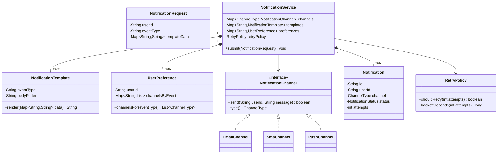
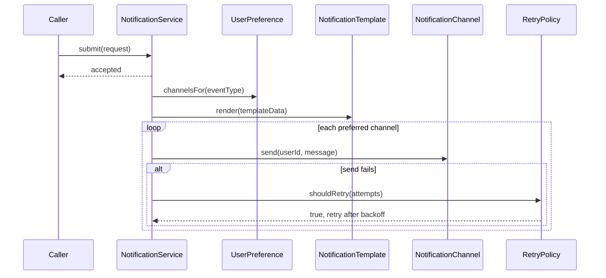

# Design a notification system

**A notification system takes an event from another part of an application and delivers it to a user through the right channel, such as email, SMS, or push.**

## Requirements

### Functional requirements

1. A calling service submits a notification request with a user, a message, and a type of event (for example, order shipped).
2. The system delivers the notification through one or more channels: email, SMS, and push.
3. A user can set a preference for which channels they want per event type.
4. If delivery on a channel fails, the system retries a limited number of times before giving up.
5. The system renders the message from a template, filling in event-specific data.

### Non-functional requirements

- Notification volume can spike (for example, a sale triggers thousands at once); sending must not block the caller.
- Adding a new channel (for example, WhatsApp) shouldn't require changing the request or template code.
- A failure sending to one channel for one user must not affect delivery to other users.

### Out of scope

- The actual email/SMS/push provider integration (assume an SDK call exists)
- Rich analytics on open and click rates
- In-app notification center UI

## Clarifying questions to ask

| Question | Assumption we make |
|---|---|
| Is delivery synchronous or can it be queued? | Queued; the caller gets an accepted response, delivery happens asynchronously. |
| What happens if a user has no preference set for an event type? | Fall back to a system default channel (email). |
| How many retries before giving up? | A fixed number, for example 3, with backoff; then mark as failed. |
| Can one event go to multiple channels at once? | Yes, based on the user's preference, which can list more than one channel. |

## Core entities

| Entity | Responsibility |
|---|---|
| `NotificationRequest` | Holds the event type, user, and template data submitted by a caller |
| `NotificationTemplate` | Renders a message body from event data |
| `UserPreference` | Holds which channels a user wants per event type |
| `NotificationChannel` | Interface for sending through one channel (email, SMS, push) |
| `Notification` | Tracks one delivery attempt's status per channel |
| `RetryPolicy` | Decides whether and when to retry a failed send |
| `NotificationService` | Entry point: accepts a request and dispatches it |

## Class diagram



*`NotificationService` looks up the user's preferred channels, renders the template once, and sends through each `NotificationChannel` independently.*

## Key flows



*The caller gets an immediate acknowledgment; rendering, channel fan-out, and retries all happen after that, off the caller's thread.*

## Design patterns used

| Pattern | Where | Why |
|---|---|---|
| Strategy | `NotificationChannel` implementations | New channels plug in without changing `NotificationService` |
| Registry | `channels` map keyed by `ChannelType` in `NotificationService` | Centralizes which instance handles which channel type; nothing constructs channels dynamically, so it's a lookup, not a factory |
| Decorator (extension) | Retry loop in `sendWithRetry` | Below, retry is a loop inside the service; wrap it as a `RetryingNotificationChannel implements NotificationChannel` around a real channel to make it a true decorator |
| Observer (extension) | The originating event triggering `submit` | Not shown below; a caller invokes `submit` directly. Wire event producers through a listener/event-bus so `NotificationService` doesn't need a direct reference to them |

## Implementation

`NotificationRequest` is what a caller submits:

```java
public record NotificationRequest(String userId, String eventType, Map<String, String> templateData) {}
```

`NotificationTemplate` does simple placeholder substitution; `UserPreference` maps event types to channels:

```java
public class NotificationTemplate {
    private final String eventType;
    private final String bodyPattern;

    public NotificationTemplate(String eventType, String bodyPattern) {
        this.eventType = eventType;
        this.bodyPattern = bodyPattern;
    }

    public String render(Map<String, String> data) {
        String result = bodyPattern;
        for (Map.Entry<String, String> entry : data.entrySet()) {
            result = result.replace("{" + entry.getKey() + "}", entry.getValue());
        }
        return result;
    }
}

public class UserPreference {
    private final String userId;
    private final Map<String, List<ChannelType>> channelsByEvent;

    public UserPreference(String userId, Map<String, List<ChannelType>> channelsByEvent) {
        this.userId = userId;
        this.channelsByEvent = channelsByEvent;
    }

    public List<ChannelType> channelsFor(String eventType) {
        return channelsByEvent.getOrDefault(eventType, List.of(ChannelType.EMAIL));
    }
}
```

`NotificationChannel` implementations are independent and don't know about each other:

```java
public enum ChannelType { EMAIL, SMS, PUSH }

public interface NotificationChannel {
    boolean send(String userId, String message);
    ChannelType type();
}

public class EmailChannel implements NotificationChannel {
    public boolean send(String userId, String message) {
        return EmailProviderSdk.send(userId, message);
    }
    public ChannelType type() { return ChannelType.EMAIL; }
}

public class SmsChannel implements NotificationChannel {
    public boolean send(String userId, String message) {
        return SmsProviderSdk.send(userId, message);
    }
    public ChannelType type() { return ChannelType.SMS; }
}

public class PushChannel implements NotificationChannel {
    public boolean send(String userId, String message) {
        return PushProviderSdk.send(userId, message);
    }
    public ChannelType type() { return ChannelType.PUSH; }
}
```

`RetryPolicy` centralizes retry rules so channels don't each implement their own:

```java
public class RetryPolicy {
    private static final int MAX_ATTEMPTS = 3;

    public boolean shouldRetry(int attempts) { return attempts < MAX_ATTEMPTS; }
    public long backoffSeconds(int attempts) { return (long) Math.pow(2, attempts); }
}

public enum NotificationStatus { PENDING, SENT, FAILED }

public class Notification {
    private final String id;
    private final String userId;
    private final ChannelType channel;
    private NotificationStatus status = NotificationStatus.PENDING;
    private int attempts = 0;

    public Notification(String id, String userId, ChannelType channel) {
        this.id = id;
        this.userId = userId;
        this.channel = channel;
    }

    public void recordAttempt(boolean success) {
        attempts++;
        status = success ? NotificationStatus.SENT : NotificationStatus.FAILED;
    }

    public int attempts() { return attempts; }
    public NotificationStatus status() { return status; }
}
```

`NotificationService` dispatches asynchronously and drives the retry loop per channel:

```java
public class NotificationService {
    private final Map<ChannelType, NotificationChannel> channels;
    private final Map<String, NotificationTemplate> templates;
    private final Map<String, UserPreference> preferences;
    private final RetryPolicy retryPolicy;
    private final ExecutorService executor = Executors.newFixedThreadPool(8);

    public NotificationService(Map<ChannelType, NotificationChannel> channels,
                               Map<String, NotificationTemplate> templates,
                               Map<String, UserPreference> preferences,
                               RetryPolicy retryPolicy) {
        this.channels = channels;
        this.templates = templates;
        this.preferences = preferences;
        this.retryPolicy = retryPolicy;
    }

    public void submit(NotificationRequest request) {
        executor.submit(() -> dispatch(request));
    }

    private void dispatch(NotificationRequest request) {
        String message = templates.get(request.eventType()).render(request.templateData());
        UserPreference pref = preferences.getOrDefault(request.userId(),
            new UserPreference(request.userId(), Map.of()));
        for (ChannelType type : pref.channelsFor(request.eventType())) {
            sendWithRetry(channels.get(type), request.userId(), message);
        }
    }

    private void sendWithRetry(NotificationChannel channel, String userId, String message) {
        Notification notification = new Notification(UUID.randomUUID().toString(), userId, channel.type());
        boolean success = false;
        while (!success && retryPolicy.shouldRetry(notification.attempts())) {
            success = channel.send(userId, message);
            notification.recordAttempt(success);
            if (!success && retryPolicy.shouldRetry(notification.attempts())) {
                sleepSeconds(retryPolicy.backoffSeconds(notification.attempts()));
            }
        }
    }

    private void sleepSeconds(long seconds) {
        try { Thread.sleep(seconds * 1000); } catch (InterruptedException e) { Thread.currentThread().interrupt(); }
    }
}
```

- `submit` returns immediately; the actual work runs on `executor`, matching the non-functional requirement that sending shouldn't block the caller.
- One channel failing (`sendWithRetry` for SMS) doesn't affect the email send for the same request; they're independent loop iterations.
- Missing preferences fall back to email, per the clarifying question's assumption.

## Handling concurrency

- **A spike of thousands of requests at once.** `submit` hands work to a bounded `ExecutorService` instead of an unbounded thread-per-request; the queue absorbs the spike and the thread pool caps concurrent sends.
- **Retrying one channel blocks the thread during backoff sleep.** That's acceptable inside a worker thread from a bounded pool, but for high volume, replace the blocking `sleep` with a scheduled retry (submit a delayed task) so worker threads aren't held idle.
- **Two notifications for the same user on different channels running in different threads.** They're independent `Notification` objects with no shared mutable state, so no locking is needed between them.
- **Duplicate submission of the same event (caller retries a network timeout).** Not handled above; add an idempotency key on `NotificationRequest` and check it against a recently-seen set before dispatching, so a caller's retry doesn't double-send.

## Extending the design

**How do you add a new channel like WhatsApp?**
Implement `NotificationChannel` for it and register it in the `channels` map passed to `NotificationService`; nothing else changes.

**How do you let a user opt out of all notifications temporarily (do not disturb)?**
Add a `doNotDisturbUntil` field to `UserPreference` and check it in `dispatch` before sending, independent of per-channel preferences.

**How do you prioritize urgent notifications (security alert) over marketing ones?**
Give `NotificationRequest` a priority field and route to separate executor queues, or a priority queue, so urgent ones aren't stuck behind a marketing spike.

**How would you avoid sending the same notification twice if the service restarts mid-retry?**
Persist `Notification` records with their `attempts` and `status` to a database instead of keeping them in memory, so a restart resumes from the last known state instead of restarting from zero.

## Key takeaways

- Keep the channel interface narrow (`send`, `type`) so new channels are additive, not invasive.
- Separate preference lookup, template rendering, and channel sending into distinct steps.
- Make submission asynchronous so a traffic spike doesn't block the calling service.
- Put retry rules in one `RetryPolicy` instead of duplicating backoff logic in every channel.
