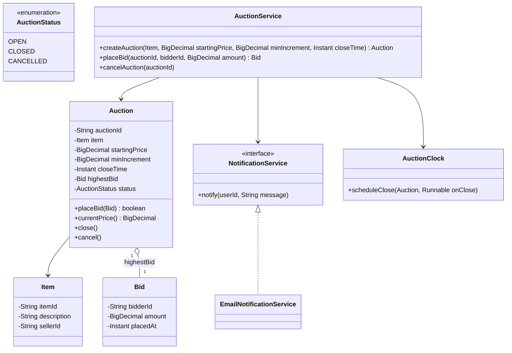
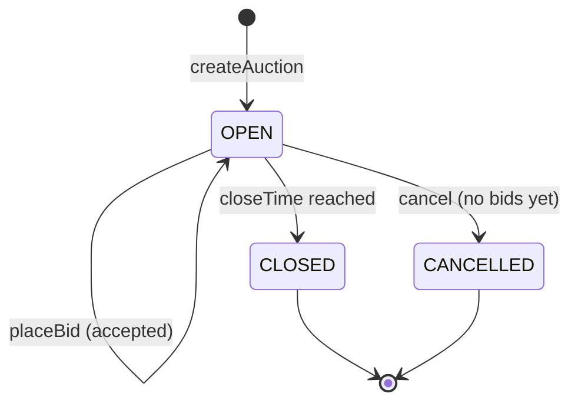

# Design an online auction system

**An online auction system lets a seller list an item for bidding, lets buyers place competing bids, and closes the auction in favor of the highest bidder.**

## Requirements

### Functional requirements

1. A seller creates an auction for an item with a starting price and a close time.
2. A buyer places a bid on an open auction. A bid must beat the current highest bid by at least a minimum increment.
3. The system rejects a bid that doesn't beat the current highest bid, and tells the bidder the current price.
4. When the close time passes, the auction closes automatically and the highest bidder wins.
5. Losing bidders and the seller are notified when the auction closes.

### Non-functional requirements

- Two bids placed at nearly the same instant must be resolved without both being accepted as the highest.
- A bid must never be accepted after the auction has closed.
- New notification channels (email, push) should plug in without changing bidding logic.

### Out of scope

- Payment collection from the winner and item delivery.
- Auto-bidding (proxy bids that increase automatically up to a max).

## Clarifying questions to ask

| Question | Assumption we make |
|---|---|
| Can a seller extend the close time if a bid comes in late? | Not in this version; close time is fixed at creation. |
| What is the minimum bid increment? | A fixed amount configured per auction, for example $1. |
| Can the seller cancel an auction with no bids? | Yes, before the close time and before any bid is placed. |
| What happens with zero bids at close time? | The auction closes with no winner. |

## Core entities

| Entity | Responsibility |
|---|---|
| `Item` | What's being sold: description and seller |
| `Auction` | One listing: item, price rules, current highest bid, status |
| `Bid` | A bidder, an amount, and a timestamp |
| `AuctionStatus` | The auction's lifecycle state |
| `NotificationService` | Notifies bidders and the seller of outcomes |
| `AuctionClock` | Closes auctions automatically when time is up |
| `AuctionService` | Entry point: create, bid, close, cancel |

## Class diagram



*`Auction` owns its highest bid and status directly, so accepting a bid and closing the auction are both single-object operations.*

## Key flows



*An auction stays `OPEN` while bids arrive and moves to a terminal state either at close time or on cancellation.*

## Design patterns used

| Pattern | Where | Why |
|---|---|---|
| State | `AuctionStatus` transitions inside `Auction` | Rejects bids on a closed auction and blocks cancelling one with existing bids |
| Observer | `NotificationService` calls on close | New channels (email, push, SMS) subscribe without `Auction` knowing about them |
| Strategy (extension) | Bid validation rule (`amount >= highestBid + minIncrement`) | Inlined in `Auction.placeBid` below; extract it to a `BidValidationStrategy` interface if a "percentage increment" rule needs to replace the flat one |
| Facade | `AuctionService` | Callers create auctions and place bids through one entry point |

## Implementation

`Item` and `Bid` are simple value holders; `Bid` is immutable once placed:

```java
public record Item(String itemId, String description, String sellerId) {}
public record Bid(String bidderId, BigDecimal amount, Instant placedAt) {}
public enum AuctionStatus { OPEN, CLOSED, CANCELLED }
```

`Auction` guards its own highest bid and status under a lock, so `placeBid` and `close` can't interleave badly:

```java
public class Auction {
    private final String auctionId;
    private final Item item;
    private final BigDecimal startingPrice;
    private final BigDecimal minIncrement;
    private final Instant closeTime;
    private volatile Bid highestBid;
    private volatile AuctionStatus status = AuctionStatus.OPEN;

    public Auction(String auctionId, Item item, BigDecimal startingPrice, BigDecimal minIncrement, Instant closeTime) {
        this.auctionId = auctionId;
        this.item = item;
        this.startingPrice = startingPrice;
        this.minIncrement = minIncrement;
        this.closeTime = closeTime;
    }

    public synchronized boolean placeBid(Bid bid) {
        if (status != AuctionStatus.OPEN || Instant.now().isAfter(closeTime)) return false;
        BigDecimal currentPrice = highestBid == null ? startingPrice : highestBid.amount();
        BigDecimal minAcceptable = currentPrice.add(minIncrement);
        if (bid.amount().compareTo(minAcceptable) < 0) return false;
        highestBid = bid;
        return true;
    }

    public synchronized void close() {
        if (status != AuctionStatus.OPEN) return;
        status = AuctionStatus.CLOSED;
    }

    public synchronized void cancel() {
        if (status != AuctionStatus.OPEN || highestBid != null) {
            throw new IllegalStateException("Cannot cancel an auction that has bids");
        }
        status = AuctionStatus.CANCELLED;
    }

    public Bid highestBid() { return highestBid; }
    public BigDecimal currentPrice() { return highestBid == null ? startingPrice : highestBid.amount(); }
    public AuctionStatus status() { return status; }
    public Instant closeTime() { return closeTime; }
    public String auctionId() { return auctionId; }
    public Item item() { return item; }
}
```

`NotificationService` is an interface so channels can vary; `AuctionClock` schedules the automatic close:

```java
public interface NotificationService {
    void notify(String userId, String message);
}

public class AuctionClock {
    private final ScheduledExecutorService scheduler = Executors.newScheduledThreadPool(2);

    public void scheduleClose(Auction auction, Runnable onClose) {
        long delayMs = Duration.between(Instant.now(), auction.closeTime()).toMillis();
        scheduler.schedule(onClose, Math.max(0, delayMs), TimeUnit.MILLISECONDS);
    }
}
```

`AuctionService` creates auctions, validates and records bids, and notifies participants on close:

```java
public class AuctionService {
    private final Map<String, Auction> auctions = new ConcurrentHashMap<>();
    private final Map<String, Set<String>> biddersByAuction = new ConcurrentHashMap<>();
    private final AuctionClock clock;
    private final NotificationService notifications;

    public AuctionService(AuctionClock clock, NotificationService notifications) {
        this.clock = clock;
        this.notifications = notifications;
    }

    public Auction createAuction(Item item, BigDecimal startingPrice, BigDecimal minIncrement, Instant closeTime) {
        Auction auction = new Auction(UUID.randomUUID().toString(), item, startingPrice, minIncrement, closeTime);
        auctions.put(auction.auctionId(), auction);
        biddersByAuction.put(auction.auctionId(), ConcurrentHashMap.newKeySet());
        clock.scheduleClose(auction, () -> closeAuction(auction.auctionId()));
        return auction;
    }

    public Bid placeBid(String auctionId, String bidderId, BigDecimal amount) {
        Auction auction = auctions.get(auctionId);
        Bid bid = new Bid(bidderId, amount, Instant.now());
        if (!auction.placeBid(bid)) {
            throw new IllegalStateException("Bid rejected; current price is " + auction.currentPrice());
        }
        biddersByAuction.get(auctionId).add(bidderId);
        return bid;
    }

    public void closeAuction(String auctionId) {
        Auction auction = auctions.get(auctionId);
        auction.close();
        Bid winning = auction.highestBid();
        for (String bidderId : biddersByAuction.get(auctionId)) {
            boolean won = winning != null && winning.bidderId().equals(bidderId);
            notifications.notify(bidderId, won ? "You won the auction" : "Auction closed; you did not win");
        }
        notifications.notify(auction.item().sellerId(),
            winning == null ? "Auction closed with no bids" : "Auction sold for " + winning.amount());
    }

    public void cancelAuction(String auctionId) { auctions.get(auctionId).cancel(); }
}
```

## Handling concurrency

- **Two bids arrive at nearly the same instant.** `placeBid` is `synchronized` on the `Auction` instance, so the read of `highestBid` and the write of a new one happen atomically. Whichever thread enters second sees the first bid's amount and must beat it.
- **A bid arrives right as the auction closes.** Both `placeBid` and `close` are `synchronized` on the same instance, and `placeBid` also rechecks `Instant.now()` against `closeTime`, so a bid can't sneak in after closing even if the scheduled close hasn't fired yet.
- **Scaling beyond one process.** A single `synchronized` block works within one JVM. Across multiple servers, move the highest-bid check into a database transaction (`UPDATE ... WHERE amount < :newAmount`) or a distributed lock keyed by `auctionId`, so the atomic compare-and-set moves to the shared store.
- **Notification fan-out blocking the close.** `closeAuction` notifies synchronously here for clarity; in practice, push notifications onto a queue so a slow notification channel doesn't delay marking the auction closed.

## Extending the design

**How do you support proxy (auto-increment) bidding?**
Add a `maxAmount` to `Bid` and change `placeBid` to, when a new bid arrives, compare it against the current highest bidder's `maxAmount` and auto-raise if it's still under that ceiling, only asking the new bidder to beat the effective price.

**How would you extend the close time if a bid lands in the last minute?**
Add an `antiSnipeWindow` to `Auction`. In `placeBid`, if the bid is accepted within that window of `closeTime`, push `closeTime` forward and reschedule the `AuctionClock` entry.

**How do you support reserve prices (minimum price the seller will accept)?**
Add a `reservePrice` to `Auction`. In `close`, only declare a winner if `highestBid.amount().compareTo(reservePrice) >= 0`; otherwise notify the seller and bidders that the reserve wasn't met.

**How would you show bidders live updates as new bids come in?**
Use the observer pattern: `Auction` publishes a `BidPlaced` event on each accepted bid, and a `LiveUpdateService` subscribes and pushes it to connected clients over a WebSocket.

## Key takeaways

- Keep the highest-bid check and update atomic on the `Auction` instance; that's the only contested resource.
- Recheck the close time inside `placeBid` itself, not just in the scheduler, to close the last-second race.
- Model status as a small state machine: open, closed, cancelled, with clear rules for which bids or cancels are legal.
- Keep notification delivery behind an interface and off the critical bidding path.
