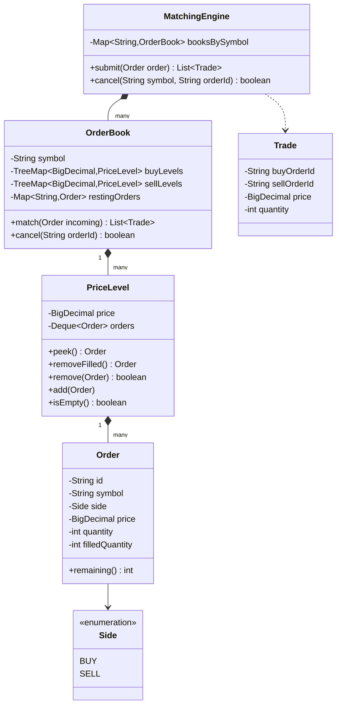
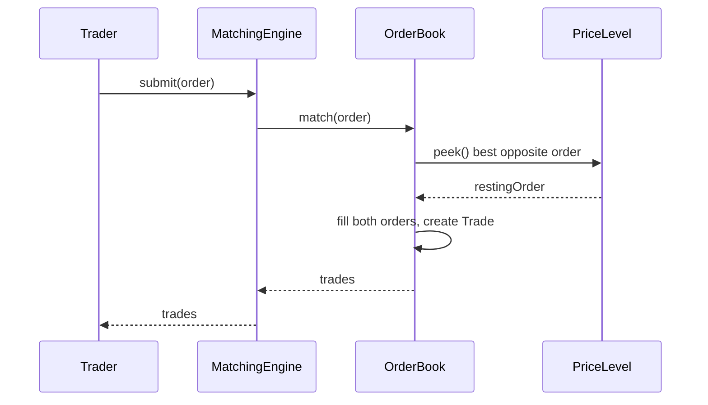

# Design an online stock exchange

**A stock exchange accepts buy and sell orders for symbols, matches compatible orders, and executes trades at a fair price.**

## Requirements

### Functional requirements

1. A trader submits a buy or sell order for a symbol: quantity, price (limit order), and side.
2. The exchange matches a new order against resting orders on the opposite side, best price first.
3. When quantities differ, a partial fill happens and the remainder stays on the book.
4. Matching within a price level is first-come, first-served (price-time priority).
5. A trader can cancel an unfilled or partially filled order.

### Non-functional requirements

- Orders for the same symbol must be matched strictly in the order they arrive.
- Orders for different symbols must be able to match concurrently, without one symbol blocking another.
- Adding a new order type (market order, stop order) shouldn't change the matching core.

### Out of scope

- Settlement, clearing, and account balance verification.
- Market data distribution (order book snapshots, ticker feeds).

## Clarifying questions to ask

| Question | Assumption we make |
|---|---|
| Only limit orders, or also market orders? | Limit orders for the core design; market orders covered as an extension. |
| How is price-time priority enforced? | Each price level holds a FIFO queue of orders. |
| Can one order match against multiple resting orders? | Yes, it keeps matching until filled or no more compatible orders exist. |
| How many symbols run concurrently? | Many; each symbol has its own independent order book and lock. |

## Core entities

| Entity | Responsibility |
|---|---|
| `Order` | A trader's buy or sell request: symbol, side, price, quantity |
| `Trade` | Records one execution: matched orders, price, and quantity |
| `PriceLevel` | FIFO queue of orders resting at one price |
| `OrderBook` | Holds all price levels for one symbol and runs matching |
| `MatchingEngine` | Entry point: routes orders to the right book and returns trades |

## Class diagram



*Each `OrderBook` is independent per symbol, so matching one symbol never blocks another.*

## Key flows



*A new order walks opposite-side price levels, best price first, until it's filled or no compatible order remains.*

## Design patterns used

| Pattern | Where | Why |
|---|---|---|
| Facade | `MatchingEngine` | Traders submit and cancel through one entry point, unaware of per-symbol books |
| Strategy (implicit) | Matching rule in `OrderBook.match` | Price-time priority is isolated so it can be swapped for pro-rata matching |
| Command (order as a value object) | `Order` | Each order fully describes the action to apply; easy to log, replay, or queue |

## Implementation

`Order` and `Trade` are the core value types; quantity tracking lives on the order itself:

```java
public enum Side { BUY, SELL }

public class Order {
    private final String id;
    private final String symbol;
    private final Side side;
    private final BigDecimal price;
    private final int quantity;
    private int filledQuantity;

    public Order(String symbol, Side side, BigDecimal price, int quantity) {
        this.id = UUID.randomUUID().toString();
        this.symbol = symbol;
        this.side = side;
        this.price = price;
        this.quantity = quantity;
    }

    public int remaining() { return quantity - filledQuantity; }
    public void fill(int qty) { filledQuantity += qty; }
    public boolean isFilled() { return remaining() == 0; }

    public String id() { return id; }
    public Side side() { return side; }
    public BigDecimal price() { return price; }
}

public record Trade(String buyOrderId, String sellOrderId, BigDecimal price, int quantity) {}
```

`PriceLevel` is a FIFO queue; first order in is first order matched at that price. `removeFilled` hands back the removed order so the book can drop it from its cancel index too:

```java
public class PriceLevel {
    private final BigDecimal price;
    private final Deque<Order> orders = new ArrayDeque<>();

    public PriceLevel(BigDecimal price) { this.price = price; }

    public void add(Order order) { orders.addLast(order); }
    public Order peek() { return orders.peekFirst(); }

    public Order removeFilled() {
        if (!orders.isEmpty() && orders.peekFirst().isFilled()) return orders.pollFirst();
        return null;
    }

    public boolean remove(Order order) { return orders.remove(order); }
    public boolean isEmpty() { return orders.isEmpty(); }
    public BigDecimal price() { return price; }
}
```

`OrderBook` matches incoming orders against the best opposite price levels:

```java
public class OrderBook {
    private final String symbol;
    // Buy side: highest price first. Sell side: lowest price first.
    private final TreeMap<BigDecimal, PriceLevel> buyLevels = new TreeMap<>(Comparator.reverseOrder());
    private final TreeMap<BigDecimal, PriceLevel> sellLevels = new TreeMap<>();
    // Lets cancel() find a resting order in O(1) instead of scanning every price level.
    private final Map<String, Order> restingOrders = new HashMap<>();
    private final Object lock = new Object();

    public OrderBook(String symbol) { this.symbol = symbol; }

    public List<Trade> match(Order incoming) {
        synchronized (lock) {
            List<Trade> trades = new ArrayList<>();
            TreeMap<BigDecimal, PriceLevel> opposite = incoming.side() == Side.BUY ? sellLevels : buyLevels;

            while (incoming.remaining() > 0 && !opposite.isEmpty()) {
                Map.Entry<BigDecimal, PriceLevel> best = opposite.firstEntry();
                if (!priceCrosses(incoming, best.getKey())) break;

                PriceLevel level = best.getValue();
                Order resting = level.peek();
                int qty = Math.min(incoming.remaining(), resting.remaining());
                incoming.fill(qty);
                resting.fill(qty);
                trades.add(toTrade(incoming, resting, best.getKey(), qty));

                Order removed = level.removeFilled();
                if (removed != null) restingOrders.remove(removed.id());
                if (level.isEmpty()) opposite.remove(best.getKey());
            }

            if (incoming.remaining() > 0) rest(incoming);
            return trades;
        }
    }

    public boolean cancel(String orderId) {
        synchronized (lock) {
            Order order = restingOrders.remove(orderId);
            if (order == null) return false;

            TreeMap<BigDecimal, PriceLevel> side = order.side() == Side.BUY ? buyLevels : sellLevels;
            PriceLevel level = side.get(order.price());
            if (level != null) {
                level.remove(order);
                if (level.isEmpty()) side.remove(order.price());
            }
            return true;
        }
    }

    private boolean priceCrosses(Order incoming, BigDecimal restingPrice) {
        return incoming.side() == Side.BUY
            ? incoming.price().compareTo(restingPrice) >= 0
            : incoming.price().compareTo(restingPrice) <= 0;
    }

    private Trade toTrade(Order incoming, Order resting, BigDecimal price, int qty) {
        return incoming.side() == Side.BUY
            ? new Trade(incoming.id(), resting.id(), price, qty)
            : new Trade(resting.id(), incoming.id(), price, qty);
    }

    private void rest(Order order) {
        TreeMap<BigDecimal, PriceLevel> side = order.side() == Side.BUY ? buyLevels : sellLevels;
        side.computeIfAbsent(order.price(), PriceLevel::new).add(order);
        restingOrders.put(order.id(), order);
    }
}
```

`MatchingEngine` routes each order to its symbol's book:

```java
public class MatchingEngine {
    private final Map<String, OrderBook> booksBySymbol = new ConcurrentHashMap<>();

    public List<Trade> submit(Order order) {
        OrderBook book = booksBySymbol.computeIfAbsent(order.symbol(), OrderBook::new);
        return book.match(order);
    }

    public boolean cancel(String symbol, String orderId) {
        OrderBook book = booksBySymbol.get(symbol);
        return book != null && book.cancel(orderId);
    }
}
```

## Handling concurrency

- **Orders for the same symbol arriving concurrently.** `OrderBook.match` runs its whole matching pass inside one `synchronized` block, so orders for that symbol are matched strictly in submission order. This preserves price-time priority.
- **Orders for different symbols.** Each `OrderBook` has its own lock, so matching on `AAPL` never waits on matching for `GOOG`. `computeIfAbsent` on the engine's map safely creates a book once per symbol.
- **Cancelling while a match is in progress.** `cancel` synchronizes on the same `lock` as `match`, so a cancel can never run concurrently with a fill of that exact order; it either removes the order before matching sees it, or matching finishes first and `restingOrders.remove` simply finds nothing to cancel.

## Extending the design

**How do you add market orders?**
A market order matches at whatever price is available instead of a limit. In `priceCrosses`, treat a market order as always crossing; give it no resting behavior since it should fully fill or be rejected, never rest on the book.

**How do you add stop orders?**
Hold stop orders in a separate watch list per symbol. On every trade, check if the last trade price crosses a stop's trigger price, and if so, submit it into the book as a regular order.

**How would you support pro-rata matching instead of strict FIFO within a price level?**
Replace `PriceLevel`'s deque with a list, and change the fill logic to split the incoming quantity proportionally across all resting orders at that price, instead of always filling the first one.

**How do you scale matching to very high order rates per symbol?**
Pin each `OrderBook` to run on a single dedicated thread with an incoming order queue, removing lock contention entirely; other symbols get their own thread, so the system as a whole still scales with symbol count.

## Key takeaways

- Give each symbol its own order book and lock, so throughput scales with the number of symbols.
- Enforce price-time priority with per-price FIFO queues and matching against the best price first.
- Keep order state (filled quantity) on the order itself so partial fills are simple to track.
- New order types (market, stop) extend the matching rule, not the book's data structure.
