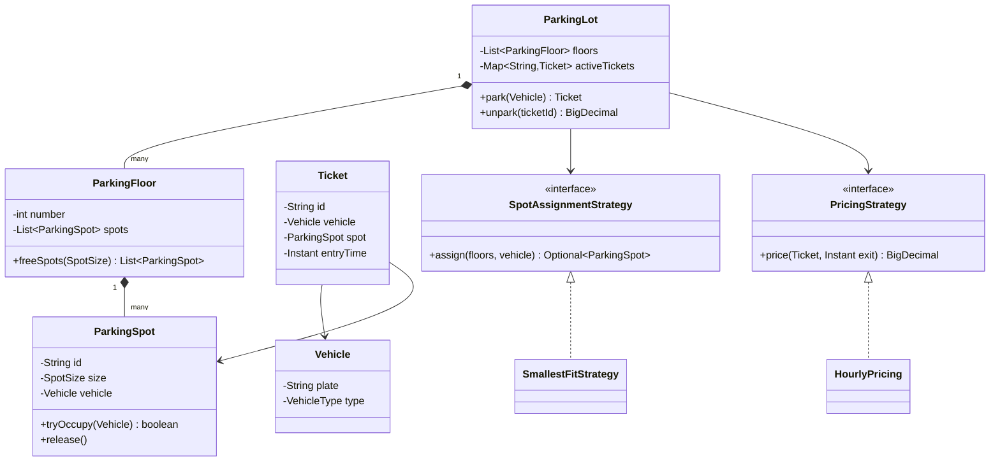
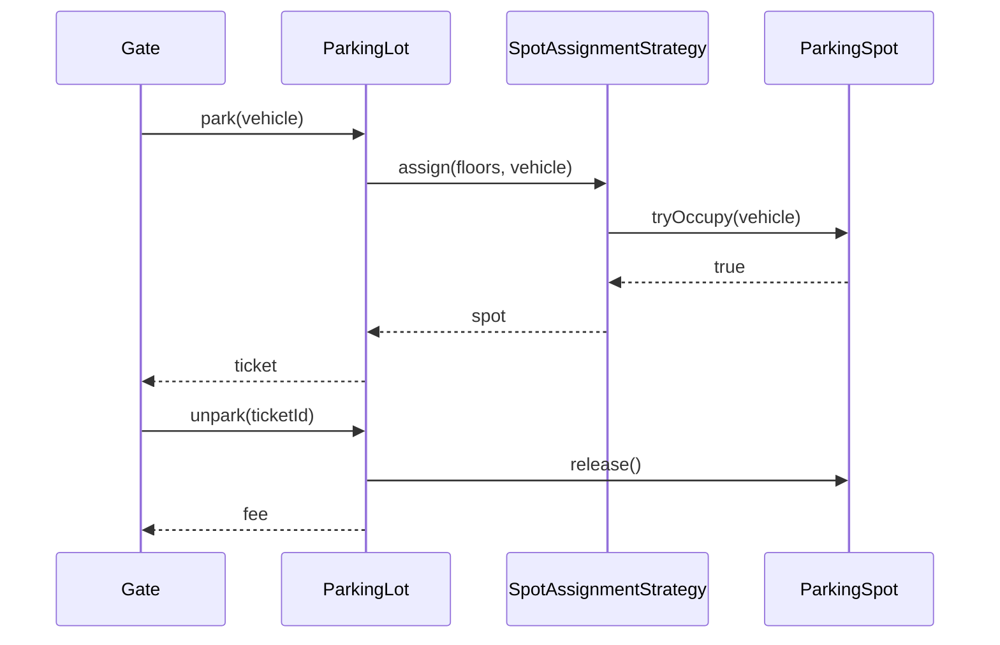

# Design a parking lot

**A parking lot system assigns spots to arriving vehicles, issues tickets, and charges a fee when the vehicle leaves.**

## Requirements

### Functional requirements

1. The lot has multiple floors. Each floor has spots of three sizes: small, medium, and large.
2. A motorcycle fits any spot. A car fits medium or large. A truck fits only large.
3. When a vehicle enters, the system finds a free spot that fits and issues a ticket.
4. When a vehicle leaves, the system calculates the fee from the time parked and frees the spot.
5. The system shows how many free spots of each size exist on each floor.

### Non-functional requirements

- Several entry gates work at the same time. Two gates must never assign the same spot.
- Adding a new pricing rule or spot-assignment rule shouldn't change existing classes.

### Out of scope

- Online reservations
- Payment processing details (card, cash). We only compute the amount.

## Clarifying questions to ask

| Question | Assumption we make |
|---|---|
| Can a car take a large spot if no medium spots are free? | Yes. Use the smallest spot that fits. |
| How is the fee calculated? | Hourly rate by vehicle type, rounded up to the next hour. |
| How many entry and exit gates? | Several. Treat each as a separate thread. |
| Do we need to handle a full lot? | Yes. Reject entry with a clear message. |

## Core entities

| Entity | Responsibility |
|---|---|
| `Vehicle` | Holds license plate and vehicle type |
| `ParkingSpot` | Knows its size and whether it's occupied |
| `ParkingFloor` | Holds spots and finds a free one that fits |
| `Ticket` | Records vehicle, spot, and entry time |
| `SpotAssignmentStrategy` | Decides which free spot to use |
| `PricingStrategy` | Calculates the fee for a ticket |
| `ParkingLot` | Entry point: parks and unparks vehicles |

## Class diagram



*`ParkingLot` owns the floors and delegates spot choice and pricing to strategies.*

## Key flows



*Entry asks the strategy for a spot; exit frees the spot and returns the fee.*

## Design patterns used

| Pattern | Where | Why |
|---|---|---|
| Strategy | `SpotAssignmentStrategy`, `PricingStrategy` | Swap assignment or pricing rules without editing `ParkingLot` |
| Singleton (optional) | `ParkingLot` | One lot per process; mention it, but prefer passing the instance in |
| Facade | `ParkingLot` | Gates call two methods and never touch floors or spots |

## Implementation

Enums define sizes and which spots each vehicle fits:

```java
public enum SpotSize { SMALL, MEDIUM, LARGE }

public enum VehicleType {
    MOTORCYCLE(SpotSize.SMALL), CAR(SpotSize.MEDIUM), TRUCK(SpotSize.LARGE);

    private final SpotSize minSize;
    VehicleType(SpotSize minSize) { this.minSize = minSize; }

    public boolean fits(SpotSize size) {
        return size.ordinal() >= minSize.ordinal();
    }
}

public record Vehicle(String plate, VehicleType type) {}
public record Ticket(String id, Vehicle vehicle, ParkingSpot spot, Instant entryTime) {}
```

A spot claims itself atomically, so two gates can't take the same one:

```java
public class ParkingSpot {
    private final String id;
    private final SpotSize size;
    private final AtomicReference<Vehicle> vehicle = new AtomicReference<>();

    public ParkingSpot(String id, SpotSize size) { this.id = id; this.size = size; }

    public boolean tryOccupy(Vehicle v) {
        return v.type().fits(size) && vehicle.compareAndSet(null, v);
    }

    public void release() { vehicle.set(null); }
    public boolean isFree() { return vehicle.get() == null; }
    public SpotSize size() { return size; }
}

public class ParkingFloor {
    private final List<ParkingSpot> spots;
    public ParkingFloor(List<ParkingSpot> spots) { this.spots = spots; }

    public List<ParkingSpot> spots() { return spots; }

    public long freeCount(SpotSize size) {
        return spots.stream().filter(s -> s.size() == size && s.isFree()).count();
    }
}
```

The strategies hold the rules that are most likely to change:

```java
public interface SpotAssignmentStrategy {
    Optional<ParkingSpot> assign(List<ParkingFloor> floors, Vehicle vehicle);
}

public class SmallestFitStrategy implements SpotAssignmentStrategy {
    public Optional<ParkingSpot> assign(List<ParkingFloor> floors, Vehicle vehicle) {
        for (SpotSize size : SpotSize.values()) {
            for (ParkingFloor floor : floors) {
                for (ParkingSpot spot : floor.spots()) {
                    if (spot.size() == size && spot.tryOccupy(vehicle)) {
                        return Optional.of(spot);
                    }
                }
            }
        }
        return Optional.empty();
    }
}

public interface PricingStrategy {
    BigDecimal price(Ticket ticket, Instant exit);
}

public class HourlyPricing implements PricingStrategy {
    private final Map<VehicleType, BigDecimal> ratePerHour;
    public HourlyPricing(Map<VehicleType, BigDecimal> ratePerHour) { this.ratePerHour = ratePerHour; }

    public BigDecimal price(Ticket ticket, Instant exit) {
        long minutes = Duration.between(ticket.entryTime(), exit).toMinutes();
        long hours = Math.max(1, (minutes + 59) / 60);
        return ratePerHour.get(ticket.vehicle().type()).multiply(BigDecimal.valueOf(hours));
    }
}
```

`ParkingLot` ties everything together:

```java
public class ParkingLot {
    private final List<ParkingFloor> floors;
    private final SpotAssignmentStrategy assigner;
    private final PricingStrategy pricing;
    private final Map<String, Ticket> activeTickets = new ConcurrentHashMap<>();

    public ParkingLot(List<ParkingFloor> floors, SpotAssignmentStrategy assigner,
                      PricingStrategy pricing) {
        this.floors = floors;
        this.assigner = assigner;
        this.pricing = pricing;
    }

    public Ticket park(Vehicle vehicle) {
        ParkingSpot spot = assigner.assign(floors, vehicle)
            .orElseThrow(() -> new IllegalStateException("Lot is full for " + vehicle.type()));
        Ticket ticket = new Ticket(UUID.randomUUID().toString(), vehicle, spot, Instant.now());
        activeTickets.put(ticket.id(), ticket);
        return ticket;
    }

    public BigDecimal unpark(String ticketId) {
        Ticket ticket = activeTickets.remove(ticketId);
        if (ticket == null) throw new IllegalArgumentException("Unknown ticket");
        ticket.spot().release();
        return pricing.price(ticket, Instant.now());
    }
}
```

## Handling concurrency

- **Two gates pick the same spot.** `tryOccupy` uses `compareAndSet`, so only one gate wins. The loser moves to the next spot. No global lock is needed.
- **Same ticket used at two exits.** `activeTickets.remove` is atomic on `ConcurrentHashMap`. The second call gets `null` and fails.
- **Scan cost.** The strategy scans every spot, which is O(n). For large lots, keep a queue of free spots per size and floor, and poll from it.

## Extending the design

**How do you add electric vehicle charging spots?**
Add `EV` to `SpotSize` or add a `hasCharger` flag to `ParkingSpot`. Write a new `SpotAssignmentStrategy` that prefers charger spots for electric vehicles.

**How do you support weekend pricing?**
Add a `WeekendPricing` class that wraps `HourlyPricing` and applies a multiplier. `ParkingLot` doesn't change.

**How do you show a live display board?**
Use the observer pattern. `ParkingSpot` notifies listeners on occupy and release. The display board listens and updates counts.

## Key takeaways

- Model spots, floors, tickets, and the lot as separate classes with one job each.
- Put rules that change (assignment, pricing) behind strategy interfaces.
- Make spot claiming atomic at the spot level to avoid a global lock.
- State your assumptions early; the interviewer cares about them as much as the code.
