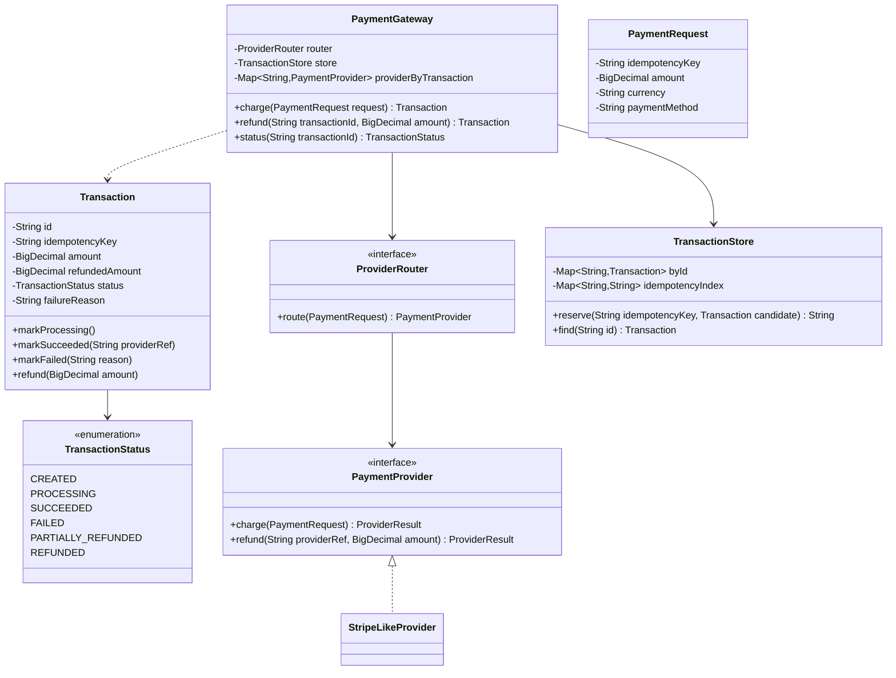
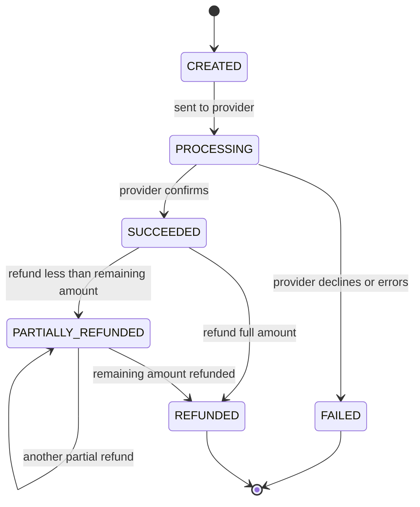

# Design a payment gateway

**A payment gateway takes a merchant's charge request, routes it to a payment provider, and tracks the transaction through to a final success or failure state.**

## Requirements

### Functional requirements

1. A merchant submits a payment request with an amount, currency, and a payment method (card, wallet).
2. The gateway validates the request, routes it to a provider, and returns a transaction id immediately.
3. The transaction moves through states: created, processing, succeeded, failed, refunded.
4. A merchant can query a transaction's current status by id.
5. A merchant can request a full or partial refund on a succeeded transaction.

### Non-functional requirements

- The same request retried by a flaky client must not charge the customer twice (idempotency).
- Provider calls are slow (network); they must not block the thread accepting new requests.
- Adding a new provider (Stripe-like, PayPal-like) shouldn't change the core transaction logic.

### Out of scope

- PCI-compliant card storage and tokenization details.
- Actual network integration with a real payment provider; we model it as an interface.

## Clarifying questions to ask

| Question | Assumption we make |
|---|---|
| How do we prevent double-charging on retries? | Merchant supplies an idempotency key; the gateway dedupes on it. |
| Is provider selection dynamic (routing, failover)? | Yes, model it behind a strategy so it can change. |
| Are refunds processed synchronously? | No, refunds are async, same state-machine pattern as a charge. |
| What happens if the provider times out? | Transaction stays PROCESSING; a reconciliation job resolves it later. Out of scope for code. |

## Core entities

| Entity | Responsibility |
|---|---|
| `PaymentRequest` | Merchant's charge request: amount, currency, method, idempotency key |
| `Transaction` | Tracks one payment attempt's state and amount |
| `PaymentProvider` | Adapter to one external processor (charge and refund calls) |
| `ProviderRouter` | Chooses which provider handles a request |
| `TransactionStore` | Persists transactions and enforces idempotency |
| `PaymentGateway` | Entry point: charges, refunds, and status lookups |

## Class diagram



*`PaymentGateway` never talks to a provider directly; `ProviderRouter` picks one, and `TransactionStore` guards idempotency.*

## Key flows



*A transaction only ever moves forward; a retried charge with the same idempotency key returns the existing transaction instead of creating a new state machine.*

## Design patterns used

| Pattern | Where | Why |
|---|---|---|
| Strategy | `ProviderRouter`, `PaymentProvider` | Swap providers or routing rules without touching `PaymentGateway` |
| Adapter | `StripeLikeProvider` and similar | Each provider's own API shape is normalized to one `ProviderResult` |
| State | `TransactionStatus` transitions | Keeps valid state changes explicit and centralized in `Transaction` |

## Implementation

The status enum and request/result types are the shared vocabulary:

```java
public enum TransactionStatus { CREATED, PROCESSING, SUCCEEDED, FAILED, PARTIALLY_REFUNDED, REFUNDED }

public record PaymentRequest(String idempotencyKey, BigDecimal amount, String currency, String paymentMethod) {}

public record ProviderResult(boolean success, String providerRef, String failureReason) {}
```

`Transaction` owns its own state transitions and its refund bookkeeping, rejecting invalid moves:

```java
public class Transaction {
    private final String id;
    private final String idempotencyKey;
    private final BigDecimal amount;
    private BigDecimal refundedAmount = BigDecimal.ZERO;
    private volatile TransactionStatus status;
    private String providerRef;
    private String failureReason;

    public Transaction(String idempotencyKey, BigDecimal amount) {
        this.id = UUID.randomUUID().toString();
        this.idempotencyKey = idempotencyKey;
        this.amount = amount;
        this.status = TransactionStatus.CREATED;
    }

    public synchronized void markProcessing() {
        requireStatus(TransactionStatus.CREATED);
        status = TransactionStatus.PROCESSING;
    }

    public synchronized void markSucceeded(String providerRef) {
        requireStatus(TransactionStatus.PROCESSING);
        this.providerRef = providerRef;
        status = TransactionStatus.SUCCEEDED;
    }

    public synchronized void markFailed(String reason) {
        requireStatus(TransactionStatus.PROCESSING);
        this.failureReason = reason;
        status = TransactionStatus.FAILED;
    }

    public synchronized void refund(BigDecimal refundAmount) {
        if (status != TransactionStatus.SUCCEEDED && status != TransactionStatus.PARTIALLY_REFUNDED) {
            throw new IllegalStateException("Cannot refund from status " + status);
        }
        BigDecimal remaining = amount.subtract(refundedAmount);
        if (refundAmount.compareTo(remaining) > 0) {
            throw new IllegalArgumentException("Refund exceeds remaining amount " + remaining);
        }
        refundedAmount = refundedAmount.add(refundAmount);
        status = refundedAmount.compareTo(amount) == 0
            ? TransactionStatus.REFUNDED
            : TransactionStatus.PARTIALLY_REFUNDED;
    }

    private void requireStatus(TransactionStatus expected) {
        if (status != expected) {
            throw new IllegalStateException("Expected " + expected + " but was " + status);
        }
    }

    public String id() { return id; }
    public String idempotencyKey() { return idempotencyKey; }
    public BigDecimal amount() { return amount; }
    public TransactionStatus status() { return status; }
    public String providerRef() { return providerRef; }
    public String failureReason() { return failureReason; }
}
```

`TransactionStore` is where idempotency is enforced, using one map keyed by the client's key:

```java
public class TransactionStore {
    private final Map<String, Transaction> byId = new ConcurrentHashMap<>();
    private final ConcurrentHashMap<String, String> idempotencyIndex = new ConcurrentHashMap<>();

    // Returns the winning transaction id for this key; caller checks if it's new.
    public String reserve(String idempotencyKey, Transaction candidate) {
        String existingId = idempotencyIndex.putIfAbsent(idempotencyKey, candidate.id());
        if (existingId == null) {
            byId.put(candidate.id(), candidate);
            return candidate.id();
        }
        return existingId;
    }

    public Transaction find(String id) { return byId.get(id); }
}
```

Providers implement one interface; the router picks one per request:

```java
public interface PaymentProvider {
    ProviderResult charge(PaymentRequest request);
    ProviderResult refund(String providerRef, BigDecimal amount);
}

public interface ProviderRouter {
    PaymentProvider route(PaymentRequest request);
}

public class RoundRobinRouter implements ProviderRouter {
    private final List<PaymentProvider> providers;
    private final AtomicInteger index = new AtomicInteger();

    public RoundRobinRouter(List<PaymentProvider> providers) { this.providers = providers; }

    public PaymentProvider route(PaymentRequest request) {
        int i = Math.floorMod(index.getAndIncrement(), providers.size());
        return providers.get(i);
    }
}
```

`PaymentGateway` runs the provider call asynchronously and updates the transaction when it completes:

```java
public class PaymentGateway {
    private final ProviderRouter router;
    private final TransactionStore store;
    private final Map<String, PaymentProvider> providerByTransaction = new ConcurrentHashMap<>();
    private final ExecutorService pool = Executors.newCachedThreadPool();

    public PaymentGateway(ProviderRouter router, TransactionStore store) {
        this.router = router;
        this.store = store;
    }

    public Transaction charge(PaymentRequest request) {
        Transaction candidate = new Transaction(request.idempotencyKey(), request.amount());
        String winningId = store.reserve(request.idempotencyKey(), candidate);
        Transaction transaction = store.find(winningId);
        if (winningId.equals(candidate.id())) {
            processAsync(transaction, request);
        } else if (transaction.amount().compareTo(request.amount()) != 0) {
            // Same idempotency key reused with a different amount: reject, don't silently reuse.
            throw new IllegalArgumentException(
                "Idempotency key " + request.idempotencyKey() + " already used with a different amount");
        }
        return transaction; // caller polls status(); retries just return the same transaction
    }

    private void processAsync(Transaction transaction, PaymentRequest request) {
        transaction.markProcessing();
        pool.submit(() -> {
            PaymentProvider provider = router.route(request);
            providerByTransaction.put(transaction.id(), provider);
            ProviderResult result = provider.charge(request);
            if (result.success()) {
                transaction.markSucceeded(result.providerRef());
            } else {
                transaction.markFailed(result.failureReason());
            }
        });
    }

    public Transaction refund(String transactionId, BigDecimal amount) {
        Transaction transaction = store.find(transactionId);
        if (transaction == null) {
            throw new IllegalArgumentException("Unknown transaction: " + transactionId);
        }
        PaymentProvider provider = providerByTransaction.get(transactionId);
        if (provider == null) {
            throw new IllegalStateException("Transaction " + transactionId + " has no completed charge to refund");
        }
        ProviderResult result = provider.refund(transaction.providerRef(), amount);
        if (!result.success()) {
            throw new IllegalStateException("Refund declined: " + result.failureReason());
        }
        transaction.refund(amount);
        return transaction;
    }

    public TransactionStatus status(String transactionId) {
        Transaction transaction = store.find(transactionId);
        if (transaction == null) {
            throw new IllegalArgumentException("Unknown transaction: " + transactionId);
        }
        return transaction.status();
    }
}
```

## Handling concurrency

- **Same request retried by the client.** `store.reserve` uses `putIfAbsent`, so only the first call for an idempotency key creates a transaction; every retry gets the same transaction back and no second charge happens. If the retry's amount doesn't match the original, `charge` rejects it instead of silently reusing the transaction.
- **State transitions racing.** `Transaction`'s mark methods and `refund` are all `synchronized` and check the current status first, so two threads can't push the same transaction through conflicting transitions.
- **Two concurrent partial refunds.** Both calls synchronize on the same `Transaction` instance, so the second refund sees the first one's updated `refundedAmount` and is checked against the correct remaining balance, instead of both reading a stale value.
- **Provider calls block the caller.** `charge` returns as soon as the transaction is created; the actual provider call runs on a pool thread, so submitting many charges doesn't queue up on network latency.

## Extending the design

**How do you add a new provider without touching existing code?**
Implement `PaymentProvider` for it and register it with the `ProviderRouter`. Nothing in `PaymentGateway` or `Transaction` changes.

**How do you route based on lowest fee or provider health instead of round robin?**
Write a new `ProviderRouter` implementation that scores providers by fee or recent success rate, and swap it in at construction.

**How do you handle a provider that never responds (stuck in PROCESSING)?**
Add a reconciliation job that queries the provider's status API for old PROCESSING transactions and resolves them, since providers are truthful once queried, even if the initial callback was lost.

**How do you avoid losing money to floating-point rounding across many transactions?**
`BigDecimal` already avoids binary floating-point error; pair it with a fixed `setScale` per currency (2 decimal places for USD, 0 for JPY) applied consistently at every arithmetic step.

## Key takeaways

- Make idempotency the first check in the charge path, enforced by a single atomic map operation.
- Model transaction state as an explicit state machine that rejects invalid transitions.
- Keep provider integration behind an adapter interface so routing and new providers don't touch core logic.
- Run slow provider calls off the request thread so throughput isn't limited by external latency.
