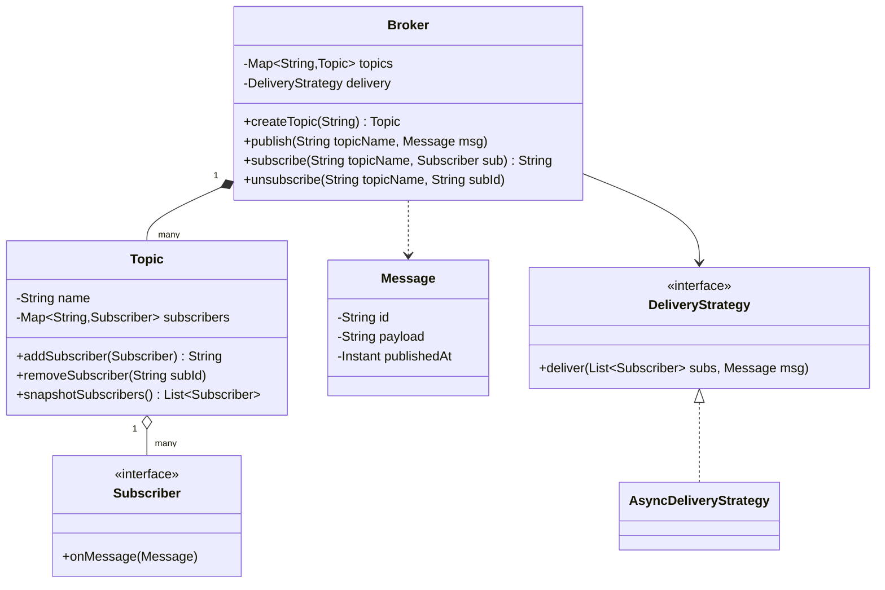
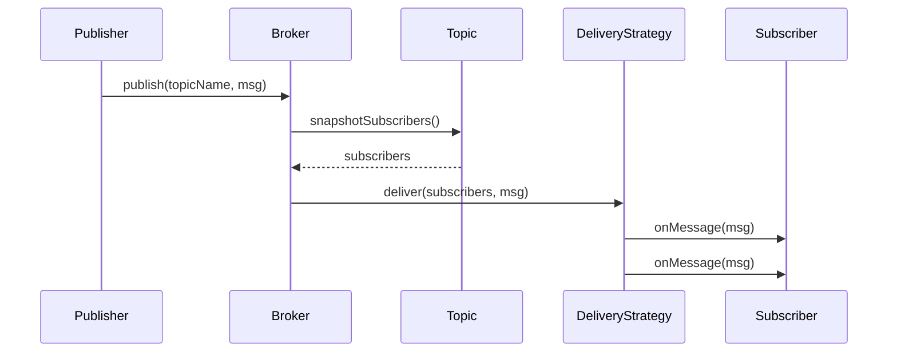

# Design a pub-sub system

**A publish-subscribe (pub-sub) system lets publishers send messages to named topics, and delivers each message to every subscriber of that topic, without publisher and subscriber knowing about each other.**

## Requirements

### Functional requirements

1. A publisher can create a topic and publish a message to it.
2. A subscriber can subscribe to a topic and receive every message published to it after subscribing.
3. A subscriber can unsubscribe at any time and stop receiving messages.
4. The system supports multiple topics, each with multiple publishers and subscribers.
5. If a subscriber's handler throws an error, delivery to other subscribers still continues.

### Non-functional requirements

- Publishing must not block on slow subscribers. A slow subscriber shouldn't delay others.
- The system must support many topics and subscribers without one global lock serializing everything.
- New delivery guarantees (at-most-once today, at-least-once later) should plug in without rewriting the broker.

### Out of scope

- Cross-process or cross-machine delivery (Kafka-style brokers, network protocols).
- Message persistence and replay from a durable log.

## Clarifying questions to ask

| Question | Assumption we make |
|---|---|
| In-process or distributed? | In-process, single JVM. We model the core abstractions only. |
| Ordering guarantee? | Messages on one topic are delivered in publish order per subscriber. |
| What happens to messages published before a subscriber joins? | They're missed. No replay in this design. |
| How are slow subscribers handled? | Each subscriber gets delivered on its own worker thread. |

## Core entities

| Entity | Responsibility |
|---|---|
| `Topic` | A named channel that holds its list of subscribers |
| `Message` | Immutable payload with an id and a timestamp |
| `Subscriber` | Callback that processes a delivered message |
| `DeliveryStrategy` | Decides how a message reaches subscribers (sync, async, retry) |
| `Broker` | Entry point: creates topics, and routes publish and subscribe calls |

## Class diagram



*`Broker` owns all topics and delegates the actual fan-out to a `DeliveryStrategy`.*

## Key flows



*The broker takes a snapshot of subscribers before delivery, so a concurrent subscribe or unsubscribe never affects a publish in flight.*

## Design patterns used

| Pattern | Where | Why |
|---|---|---|
| Observer | `Topic`, `Subscriber` | Subscribers register once and get notified on every future publish |
| Strategy | `DeliveryStrategy` | Swap sync, async, or retrying delivery without touching `Broker` |
| Facade | `Broker` | Callers only see `publish`, `subscribe`, `unsubscribe` |

## Implementation

`Message` and `Subscriber` are the two types every other class depends on:

```java
public record Message(String id, String payload, Instant publishedAt) {
    public static Message of(String payload) {
        return new Message(UUID.randomUUID().toString(), payload, Instant.now());
    }
}

public interface Subscriber {
    void onMessage(Message message);
}
```

`Topic` holds subscribers in a thread-safe map, keyed by a generated subscription id:

```java
public class Topic {
    private final String name;
    private final Map<String, Subscriber> subscribers = new ConcurrentHashMap<>();

    public Topic(String name) { this.name = name; }

    public String addSubscriber(Subscriber sub) {
        String id = UUID.randomUUID().toString();
        subscribers.put(id, sub);
        return id;
    }

    public void removeSubscriber(String subId) { subscribers.remove(subId); }

    // Snapshot so publish() iterates a fixed list, not the live map.
    public List<Subscriber> snapshotSubscribers() {
        return List.copyOf(subscribers.values());
    }

    public String name() { return name; }
}
```

The delivery strategy isolates each subscriber call, so one bad subscriber can't block or crash the rest:

```java
public interface DeliveryStrategy {
    void deliver(List<Subscriber> subs, Message message);
}

public class AsyncDeliveryStrategy implements DeliveryStrategy {
    private final ExecutorService pool;

    public AsyncDeliveryStrategy(ExecutorService pool) { this.pool = pool; }

    public void deliver(List<Subscriber> subs, Message message) {
        for (Subscriber sub : subs) {
            pool.submit(() -> {
                try {
                    sub.onMessage(message);
                } catch (RuntimeException e) {
                    // ponytail: log and move on; retry policy is a future extension
                    System.err.println("Subscriber failed: " + e.getMessage());
                }
            });
        }
    }
}
```

`Broker` ties topics and delivery together and is the only class callers use directly:

```java
public class Broker {
    private final Map<String, Topic> topics = new ConcurrentHashMap<>();
    private final DeliveryStrategy delivery;

    public Broker(DeliveryStrategy delivery) { this.delivery = delivery; }

    public Topic createTopic(String name) {
        return topics.computeIfAbsent(name, Topic::new);
    }

    public void publish(String topicName, Message message) {
        Topic topic = topics.get(topicName);
        if (topic == null) throw new IllegalArgumentException("Unknown topic: " + topicName);
        delivery.deliver(topic.snapshotSubscribers(), message);
    }

    public String subscribe(String topicName, Subscriber sub) {
        return createTopic(topicName).addSubscriber(sub);
    }

    public void unsubscribe(String topicName, String subId) {
        Topic topic = topics.get(topicName);
        if (topic != null) topic.removeSubscriber(subId);
    }
}
```

## Handling concurrency

- **Publish races with subscribe or unsubscribe.** `snapshotSubscribers()` copies the subscriber list before delivery starts. A subscriber added mid-publish simply misses that one message; one removed mid-publish may still receive it. Both are acceptable for at-most-once delivery.
- **Two threads create the same topic.** `computeIfAbsent` on `ConcurrentHashMap` guarantees only one `Topic` object is created, even under concurrent calls.
- **A slow or failing subscriber.** Delivery runs each subscriber's callback on a pooled thread and catches exceptions per subscriber, so one slow or broken subscriber never blocks the publisher or the others.

## Extending the design

**How would you add at-least-once delivery with retries?**
Write a `RetryingDeliveryStrategy` that wraps calls in a retry loop with backoff, and only drops a message after a max attempt count. `Broker` doesn't change.

**How would you support wildcard topic subscriptions, like `orders.*`?**
Store topics in a trie keyed by dot-separated segments instead of a flat map, and have `publish` walk from the exact topic up to matching wildcard nodes.

**How would you scale this across multiple machines?**
Replace the in-memory `Topic` map with a shared broker (Kafka, RabbitMQ) and keep `Publisher`/`Subscriber` as thin adapters over its client library. The interfaces in this design stay the same.

**How do you guarantee ordered delivery per subscriber under async delivery?**
Give each subscriber its own single-threaded executor instead of a shared pool, so messages to that subscriber run in submission order while different subscribers still run in parallel.

## Key takeaways

- Model the broker as an Observer: subscribers register interest, and publishing notifies them without either side knowing the other's type.
- Take a snapshot of subscribers before fan-out so publish never blocks on the subscription list's lock.
- Isolate each subscriber's callback so one failure or slow handler doesn't affect delivery to the rest.
- Keep delivery semantics (sync, async, retrying) behind a strategy interface so guarantees can change independently of the broker.
