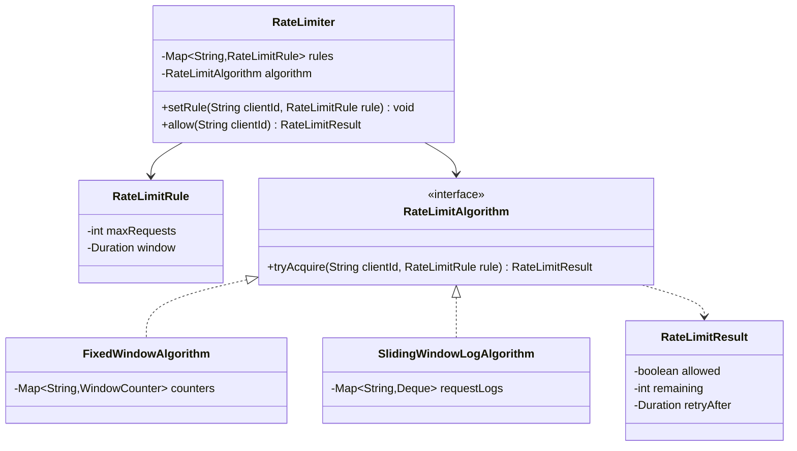
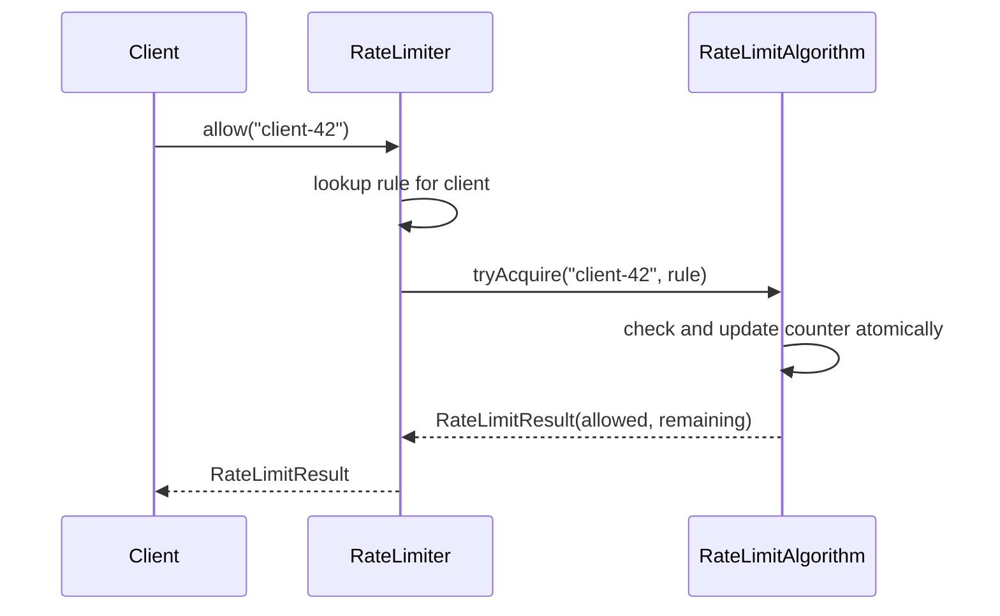

# Design a rate limiter

**A rate limiter decides whether to allow or reject a request from a client, based on how many requests that client has made recently.**

## Requirements

### Functional requirements

1. Each client (identified by an API key or user ID) gets its own limit, such as 100 requests per minute.
2. A request over the limit is rejected with a clear reason.
3. The system supports at least two algorithms: fixed window and sliding window.
4. A client's limit can be changed without restarting the service.
5. The limiter reports how many requests remain in the current window.

### Non-functional requirements

- Many threads check the limit for the same client at once; the check must be accurate under concurrency.
- Checking a limit should be fast (no blocking I/O on the hot path).
- Adding a new algorithm shouldn't change how callers invoke the limiter.

### Out of scope

- Distributed rate limiting across multiple service instances (assume a single process; mention the extension).
- Billing or quota reset on a monthly cycle.

## Clarifying questions to ask

| Question | Assumption we make |
|---|---|
| What identifies a client? | A string key, such as an API key or user ID. |
| What happens at the exact window boundary? | Fixed window resets sharply; sliding window smooths it out. |
| Should the limiter block until a slot is free, or reject immediately? | Reject immediately with a retry-after hint. |
| Is the limit the same for every client? | No, each client can have its own configured limit. |

## Core entities

| Entity | Responsibility |
|---|---|
| `RateLimitRule` | Holds a client's max requests and window size |
| `RateLimitResult` | Holds the allow/deny decision and remaining count |
| `RateLimitAlgorithm` | Decides allow or deny for one client |
| `RateLimiter` | Entry point: looks up the rule and algorithm, returns a result |

## Class diagram



*`RateLimiter` looks up the client's rule and hands the decision to a swappable algorithm.*

## Key flows



*Every check goes through one atomic update inside the algorithm, so concurrent callers see a consistent count.*

## Design patterns used

| Pattern | Where | Why |
|---|---|---|
| Strategy | `RateLimitAlgorithm` | Swap fixed window, sliding window, or token bucket without changing `RateLimiter` |
| Facade | `RateLimiter` | Callers call one `allow` method regardless of the algorithm underneath |

## Implementation

Rules and results are simple immutable records:

```java
public record RateLimitRule(int maxRequests, Duration window) {}
public record RateLimitResult(boolean allowed, int remaining, Duration retryAfter) {}
```

The fixed-window algorithm counts requests in a bucket keyed by window start, resetting when the window rolls over:

```java
public interface RateLimitAlgorithm {
    RateLimitResult tryAcquire(String clientId, RateLimitRule rule);
}

public class FixedWindowAlgorithm implements RateLimitAlgorithm {
    private static class WindowCounter {
        volatile long windowStartMillis;
        final AtomicInteger count = new AtomicInteger();
    }

    private final Map<String, WindowCounter> counters = new ConcurrentHashMap<>();

    public RateLimitResult tryAcquire(String clientId, RateLimitRule rule) {
        WindowCounter counter = counters.computeIfAbsent(clientId, k -> new WindowCounter());
        long now = System.currentTimeMillis();
        long windowMillis = rule.window().toMillis();

        synchronized (counter) {
            if (now - counter.windowStartMillis >= windowMillis) {
                counter.windowStartMillis = now;
                counter.count.set(0);
            }
            int current = counter.count.incrementAndGet();
            if (current > rule.maxRequests()) {
                long retryMs = windowMillis - (now - counter.windowStartMillis);
                return new RateLimitResult(false, 0, Duration.ofMillis(retryMs));
            }
            return new RateLimitResult(true, rule.maxRequests() - current, Duration.ZERO);
        }
    }
}
```

The sliding-window-log algorithm keeps timestamps and evicts ones outside the window, which avoids the fixed-window's burst-at-the-boundary problem:

```java
public class SlidingWindowLogAlgorithm implements RateLimitAlgorithm {
    private final Map<String, Deque<Instant>> requestLogs = new ConcurrentHashMap<>();

    public RateLimitResult tryAcquire(String clientId, RateLimitRule rule) {
        Deque<Instant> log = requestLogs.computeIfAbsent(clientId, k -> new ArrayDeque<>());
        Instant now = Instant.now();
        Instant windowStart = now.minus(rule.window());

        synchronized (log) {
            while (!log.isEmpty() && log.peekFirst().isBefore(windowStart)) {
                log.pollFirst();
            }
            if (log.size() >= rule.maxRequests()) {
                Duration retryAfter = Duration.between(now, log.peekFirst().plus(rule.window()));
                return new RateLimitResult(false, 0, retryAfter);
            }
            log.addLast(now);
            return new RateLimitResult(true, rule.maxRequests() - log.size(), Duration.ZERO);
        }
    }
}
```

`RateLimiter` ties a per-client rule lookup to the chosen algorithm:

```java
public class RateLimiter {
    private final Map<String, RateLimitRule> rules = new ConcurrentHashMap<>();
    private final RateLimitRule defaultRule;
    private final RateLimitAlgorithm algorithm;

    public RateLimiter(RateLimitRule defaultRule, RateLimitAlgorithm algorithm) {
        this.defaultRule = defaultRule;
        this.algorithm = algorithm;
    }

    public void setRule(String clientId, RateLimitRule rule) {
        rules.put(clientId, rule);
    }

    public RateLimitResult allow(String clientId) {
        RateLimitRule rule = rules.getOrDefault(clientId, defaultRule);
        return algorithm.tryAcquire(clientId, rule);
    }
}
```

## Handling concurrency

- **Two threads checking the same client at once.** Both algorithms synchronize on the per-client counter or log, so the check-then-increment is atomic. The lock is per client, not global, so different clients don't contend.
- **Window boundary races (fixed window).** The window reset check and the increment happen inside the same synchronized block, so a request can't slip through during the reset.
- **Memory growth from many clients.** `ConcurrentHashMap` entries for inactive clients accumulate; evict entries whose window hasn't been touched recently with a periodic sweep.
- **Scaling to multiple service instances.** A per-process lock isn't enough once traffic is spread across instances; move the counter to a shared store like Redis and use its atomic `INCR` with expiry instead of a Java `synchronized` block.

## Extending the design

**How do you support a token bucket algorithm for bursty traffic?**
Add a `TokenBucketAlgorithm` implementing `RateLimitAlgorithm` that refills tokens over time and decrements on each request. `RateLimiter` doesn't change.

**How do you rate-limit across multiple service instances?**
Replace the in-memory `Map` in each algorithm with calls to a shared store (Redis `INCR` with `EXPIRE`, or a Lua script for atomicity). The `RateLimitAlgorithm` interface stays the same.

**How do you apply different limits per endpoint, not just per client?**
Change the rule lookup key from `clientId` to a composite of `clientId` and endpoint. `RateLimitRule` and the algorithms don't need to change, only the key used in `rules` and the internal maps.

## Key takeaways

- Put the counting logic behind a `RateLimitAlgorithm` interface so algorithms are interchangeable.
- Keep locks scoped per client, never global, so unrelated clients don't block each other.
- Sliding window avoids the fixed window's burst at the boundary, at the cost of more memory per client.
- A single-process design maps cleanly to a distributed one by swapping the storage, not the interface.
