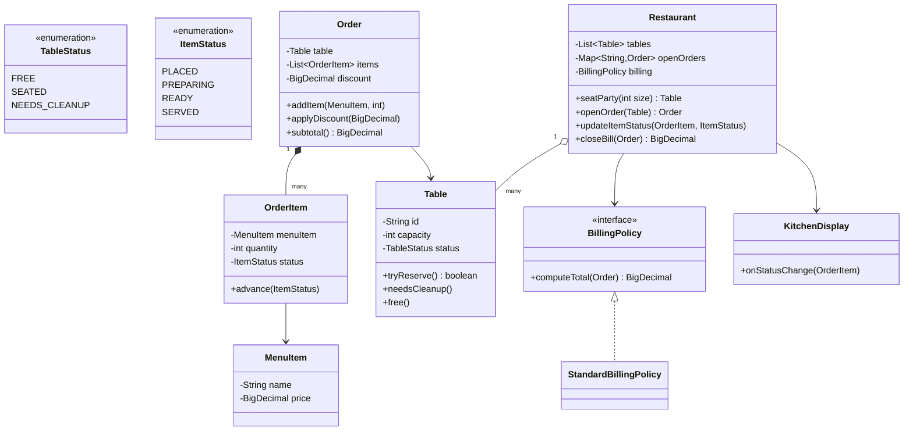
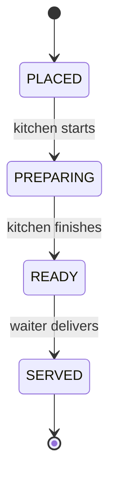

# Design a restaurant management system

**A restaurant management system seats guests at tables, takes orders, routes items to the kitchen, and produces a bill.**

## Requirements

### Functional requirements

1. The restaurant has tables of different sizes. A host seats a party at a free table that fits its size.
2. A waiter opens an order for a seated table and adds menu items to it.
3. Each item in an order moves through its own status: placed, preparing, ready, served.
4. When the party is done, the system generates a bill totaling the order's items, with tax and an optional discount applied.
5. The system shows which tables are currently free, seated, or awaiting cleanup.

### Non-functional requirements

- Two hosts seating parties at the same time must never assign the same table twice.
- The kitchen display updates as soon as an item's status changes, without polling the whole order.
- Adding a new discount rule (happy hour, loyalty) shouldn't require changing `Order` or `Bill`.

### Out of scope

- Payment processing details (card, cash, split payment).
- Online reservations ahead of arrival.
- Inventory checks for whether the kitchen has ingredients for a menu item.

## Clarifying questions to ask

| Question | Assumption we make |
|---|---|
| Can a party be seated at a table larger than needed? | Yes, if no exact-fit table is free; use the smallest table that fits. |
| Can items be added to an order after it's sent to the kitchen? | Yes, each new item starts its own status independently. |
| Who marks an item "ready"? | The kitchen display, through the same `OrderItem` status update used elsewhere. |
| Is tax a fixed rate? | Yes, a fixed percentage for this design, applied by the same policy that handles discounts. |

## Core entities

| Entity | Responsibility |
|---|---|
| `MenuItem` | Name and price of something orderable |
| `Table` | Seating capacity and current status |
| `OrderItem` | One menu item on an order, with its own preparation status |
| `Order` | All items ordered for one seated table |
| `BillingPolicy` | Computes tax and discount on an order's subtotal |
| `KitchenDisplay` | Listens for item status changes and shows them |
| `Restaurant` | Entry point: seats parties, opens orders, updates item status, bills tables |

## Class diagram



*`Restaurant` is the single entry point; `Order` and `Table` never talk to each other directly.*

## Key flows



*Each `OrderItem` tracks its own status, so one dish being ready doesn't block another still preparing.*

## Design patterns used

| Pattern | Where | Why |
|---|---|---|
| State | `ItemStatus` transitions inside `OrderItem` | Kitchen and waiter actions only make sense from specific prior statuses |
| Strategy | `BillingPolicy` | Swap tax or discount rules without touching `Order` |
| Observer | `KitchenDisplay` listens for `OrderItem` status changes | The display updates instantly without polling every order |

## Implementation

`Table` claims itself atomically, and `MenuItem`/`OrderItem` model what's ordered:

```java
public enum TableStatus { FREE, SEATED, NEEDS_CLEANUP }
public enum ItemStatus { PLACED, PREPARING, READY, SERVED }

public class Table {
    private final String id;
    private final int capacity;
    private final AtomicReference<TableStatus> status = new AtomicReference<>(TableStatus.FREE);

    public Table(String id, int capacity) { this.id = id; this.capacity = capacity; }

    public boolean tryReserve() {
        return status.compareAndSet(TableStatus.FREE, TableStatus.SEATED);
    }

    public void needsCleanup() { status.set(TableStatus.NEEDS_CLEANUP); }
    public void free() { status.set(TableStatus.FREE); }
    public int capacity() { return capacity; }
    public TableStatus status() { return status.get(); }
    public String id() { return id; }
}

public record MenuItem(String name, BigDecimal price) {}

public class OrderItem {
    private final MenuItem menuItem;
    private final int quantity;
    private volatile ItemStatus status = ItemStatus.PLACED;

    public OrderItem(MenuItem menuItem, int quantity) { this.menuItem = menuItem; this.quantity = quantity; }

    // Only the next status in the sequence is valid; this is what makes it a real state machine.
    public synchronized void advance(ItemStatus next) {
        if (next.ordinal() != status.ordinal() + 1) {
            throw new IllegalStateException("Cannot move from " + status + " to " + next);
        }
        status = next;
    }

    public BigDecimal lineTotal() { return menuItem.price().multiply(BigDecimal.valueOf(quantity)); }
    public ItemStatus status() { return status; }
    public MenuItem menuItem() { return menuItem; }
}
```

`Order` holds items for one table and computes a subtotal; `KitchenDisplay` is a minimal observer:

```java
public class Order {
    private final Table table;
    private final List<OrderItem> items = new CopyOnWriteArrayList<>();
    private volatile BigDecimal discount = BigDecimal.ZERO;

    public Order(Table table) { this.table = table; }

    public OrderItem addItem(MenuItem menuItem, int quantity) {
        OrderItem item = new OrderItem(menuItem, quantity);
        items.add(item);
        return item;
    }

    // A waiter can apply a one-off discount (comp, coupon) before the bill is closed.
    public void applyDiscount(BigDecimal amount) { this.discount = amount; }
    public BigDecimal discount() { return discount; }

    public BigDecimal subtotal() {
        return items.stream().map(OrderItem::lineTotal).reduce(BigDecimal.ZERO, BigDecimal::add);
    }

    public Table table() { return table; }
    public List<OrderItem> items() { return items; }
}

public class KitchenDisplay {
    public void onStatusChange(OrderItem item) {
        System.out.println(item.menuItem().name() + " -> " + item.status());
    }
}
```

The billing policy and `Restaurant` complete the workflow:

```java
public interface BillingPolicy {
    BigDecimal computeTotal(Order order);
}

public class StandardBillingPolicy implements BillingPolicy {
    private final BigDecimal taxRate;
    public StandardBillingPolicy(BigDecimal taxRate) { this.taxRate = taxRate; }

    public BigDecimal computeTotal(Order order) {
        BigDecimal taxable = order.subtotal().subtract(order.discount()).max(BigDecimal.ZERO);
        return taxable.add(taxable.multiply(taxRate));
    }
}

public class Restaurant {
    private final List<Table> tables;
    private final Map<String, Order> openOrders = new ConcurrentHashMap<>();
    private final BillingPolicy billing;
    private final KitchenDisplay display;

    public Restaurant(List<Table> tables, BillingPolicy billing, KitchenDisplay display) {
        this.tables = tables;
        this.billing = billing;
        this.display = display;
    }

    public Table seatParty(int partySize) {
        return tables.stream()
            .filter(t -> t.capacity() >= partySize)
            .sorted(Comparator.comparingInt(Table::capacity))
            .filter(Table::tryReserve)
            .findFirst()
            .orElseThrow(() -> new IllegalStateException("No table available for party of " + partySize));
    }

    public Order openOrder(Table table) {
        Order order = new Order(table);
        openOrders.put(table.id(), order);
        return order;
    }

    public void updateItemStatus(OrderItem item, ItemStatus next) {
        item.advance(next);
        display.onStatusChange(item);
    }

    public BigDecimal closeBill(Order order) {
        BigDecimal total = billing.computeTotal(order);
        openOrders.remove(order.table().id());
        order.table().needsCleanup();
        return total;
    }
}
```

## Handling concurrency

- **Two hosts seat different parties at once.** `tryReserve` uses `compareAndSet`, so only one host claims a given table; the loser's stream moves to the next table that fits.
- **Kitchen and waiter update different items at once.** Each `OrderItem.status` is guarded by its own `synchronized advance`, so marking one dish ready never blocks or corrupts another dish's status.
- **A status update arrives out of order or twice.** `advance` checks that `next` is exactly one step past the current status and throws otherwise, so a duplicate or skipped update is rejected instead of silently corrupting the item.
- **Adding items while billing runs.** `Order.items` is a `CopyOnWriteArrayList`, so `subtotal()` iterates a stable snapshot even if a waiter adds a late item concurrently; that late item is simply excluded from a bill already in progress.

## Extending the design

**How do you add split billing per guest?**
Add a `guestTag` field to `OrderItem` and a `BillingPolicy` variant that groups items by tag before computing each guest's total, instead of one total for the table.

**How do you support happy-hour pricing?**
Wrap `StandardBillingPolicy` in a `HappyHourBillingPolicy` that discounts `subtotal()` based on the current time before adding tax. `Restaurant` doesn't change.

**How would you notify a waiter specifically when their table's food is ready, instead of the whole kitchen display?**
Give `OrderItem` a list of listeners instead of one shared `KitchenDisplay`, and register the assigned waiter's device as a listener when the order opens.

## Key takeaways

- Give each `OrderItem` its own status so dishes prepare and serve independently within one order.
- Claim tables atomically with compare-and-set instead of a lock across the whole seating chart.
- Keep tax and discount rules behind a `BillingPolicy` strategy, since pricing promotions change often.
- Use an observer for the kitchen display so status updates push out immediately instead of being polled.
