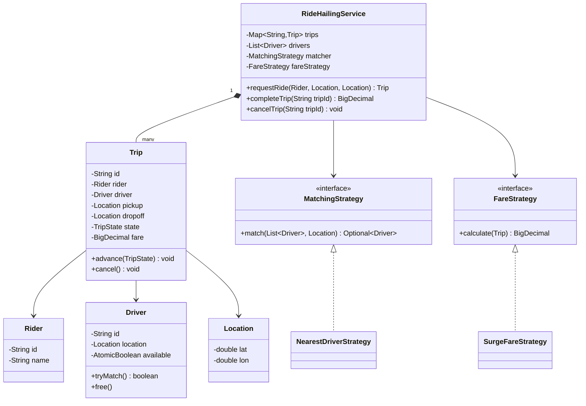
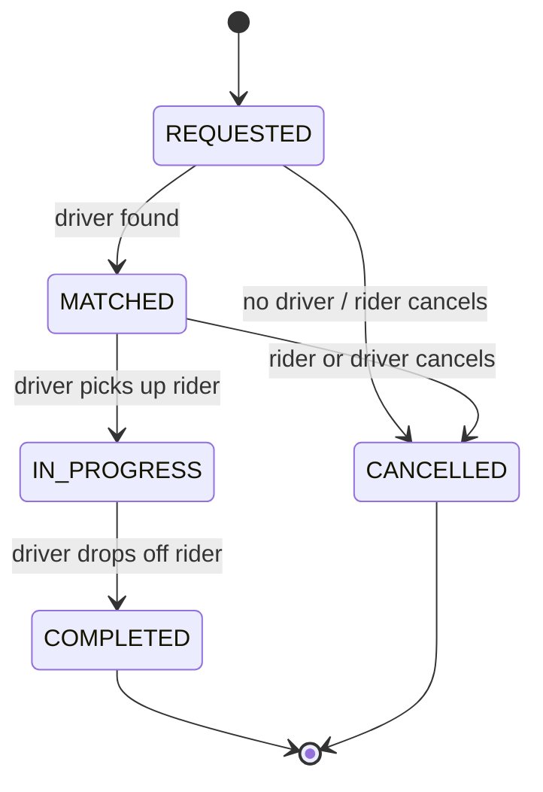

# Design a ride-hailing service

**A ride-hailing service matches a rider requesting a trip with a nearby driver, tracks the trip, and calculates the fare.**

## Requirements

### Functional requirements

1. A rider requests a ride from a pickup location to a drop-off location.
2. The system finds a nearby available driver and matches them to the rider.
3. The trip moves through states: requested, matched, in progress, completed.
4. The fare is calculated from distance, time, and a surge multiplier.
5. Either party can cancel before the trip starts.

### Non-functional requirements

- Many ride requests arrive at once; two riders must never be matched to the same driver.
- Matching should be swappable (nearest driver, highest-rated driver) without changing the trip flow.
- Fare calculation should be swappable per city or time of day.

### Out of scope

- Payment capture and driver payouts.
- Turn-by-turn navigation and map rendering.

## Clarifying questions to ask

| Question | Assumption we make |
|---|---|
| How is a driver matched? | Nearest available driver, swappable via a strategy. |
| Does surge pricing apply? | Yes, a multiplier looked up by zone and time. |
| Can a rider cancel after matching? | Yes, before pickup, with no fee in this design. |
| Do we support ride sharing (multiple riders)? | No, out of scope for this version. |

## Core entities

| Entity | Responsibility |
|---|---|
| `Rider` | Requests a trip |
| `Driver` | Holds location and availability |
| `Trip` | Tracks rider, driver, route, state, and fare |
| `MatchingStrategy` | Picks a driver for a trip request |
| `FareStrategy` | Calculates the fare for a completed trip |
| `RideHailingService` | Entry point: requests, matches, and completes trips |

## Class diagram



*`RideHailingService` coordinates trips and delegates driver choice and fare math to strategies.*

## Key flows



*A trip moves through a fixed set of states; cancellation is only allowed before pickup.*

## Design patterns used

| Pattern | Where | Why |
|---|---|---|
| Strategy | `MatchingStrategy`, `FareStrategy` | Swap matching or pricing rules without editing `RideHailingService` |
| State | `TripState` transitions in `Trip` | Enforces valid trip lifecycle in one place |
| Observer (extension) | Driver location updates | Lets the service track drivers without polling; see "Extending the design" |

## Implementation

The state enum encodes which transitions are legal:

```java
public enum TripState {
    REQUESTED, MATCHED, IN_PROGRESS, COMPLETED, CANCELLED;

    private static final Map<TripState, Set<TripState>> NEXT = Map.of(
        REQUESTED, Set.of(MATCHED, CANCELLED),
        MATCHED, Set.of(IN_PROGRESS, CANCELLED),
        IN_PROGRESS, Set.of(COMPLETED)
    );

    public boolean canMoveTo(TripState next) {
        return NEXT.getOrDefault(this, Set.of()).contains(next);
    }
}
```

Core records and a driver that claims itself atomically:

```java
public record Location(double lat, double lon) {}
public record Rider(String id, String name) {}

public class Driver {
    private final String id;
    private final Location location;
    private final AtomicBoolean available = new AtomicBoolean(true);

    public Driver(String id, Location location) {
        this.id = id;
        this.location = location;
    }

    public boolean tryMatch() { return available.compareAndSet(true, false); }
    public void free() { available.set(true); }
    public boolean isAvailable() { return available.get(); }
    public Location location() { return location; }
    public String id() { return id; }
}
```

`Trip` guards its own transitions and stores the fare once computed:

```java
public class Trip {
    private final String id;
    private final Rider rider;
    private final Location pickup;
    private final Location dropoff;
    private volatile Driver driver;
    private volatile TripState state = TripState.REQUESTED;
    private volatile BigDecimal fare;

    public Trip(String id, Rider rider, Location pickup, Location dropoff) {
        this.id = id;
        this.rider = rider;
        this.pickup = pickup;
        this.dropoff = dropoff;
    }

    public synchronized void advance(TripState next) {
        if (!state.canMoveTo(next)) {
            throw new IllegalStateException("Cannot move from " + state + " to " + next);
        }
        state = next;
    }

    public synchronized void assignDriver(Driver d) {
        this.driver = d;
        advance(TripState.MATCHED);
    }

    public synchronized void cancel() {
        advance(TripState.CANCELLED);
        if (driver != null) driver.free();
    }

    public void setFare(BigDecimal fare) { this.fare = fare; }
    public Driver driver() { return driver; }
    public Location pickup() { return pickup; }
    public Location dropoff() { return dropoff; }
    public TripState state() { return state; }
    public String id() { return id; }
}
```

The matching strategy and a surge-aware fare strategy:

```java
public interface MatchingStrategy {
    Optional<Driver> match(List<Driver> drivers, Location pickup);
}

public class NearestDriverStrategy implements MatchingStrategy {
    public Optional<Driver> match(List<Driver> drivers, Location pickup) {
        return drivers.stream()
            .filter(Driver::isAvailable)
            .sorted(Comparator.comparingDouble(d -> distance(d.location(), pickup)))
            .filter(Driver::tryMatch)
            .findFirst();
    }

    private double distance(Location a, Location b) {
        return Math.hypot(a.lat() - b.lat(), a.lon() - b.lon());
    }
}

public interface FareStrategy {
    BigDecimal calculate(Trip trip);
}

public class SurgeFareStrategy implements FareStrategy {
    private final BigDecimal baseRatePerKm;
    private final BigDecimal surgeMultiplier;

    public SurgeFareStrategy(BigDecimal baseRatePerKm, BigDecimal surgeMultiplier) {
        this.baseRatePerKm = baseRatePerKm;
        this.surgeMultiplier = surgeMultiplier;
    }

    public BigDecimal calculate(Trip trip) {
        double km = Math.hypot(
            trip.pickup().lat() - trip.dropoff().lat(),
            trip.pickup().lon() - trip.dropoff().lon()) * 111;
        return baseRatePerKm
            .multiply(BigDecimal.valueOf(km))
            .multiply(surgeMultiplier)
            .setScale(2, RoundingMode.HALF_UP);
    }
}
```

`RideHailingService` wires matching, trip state, and fare together:

```java
public class RideHailingService {
    private final Map<String, Trip> trips = new ConcurrentHashMap<>();
    private final List<Driver> drivers;
    private final MatchingStrategy matcher;
    private final FareStrategy fareStrategy;

    public RideHailingService(List<Driver> drivers, MatchingStrategy matcher, FareStrategy fareStrategy) {
        this.drivers = drivers;
        this.matcher = matcher;
        this.fareStrategy = fareStrategy;
    }

    public Trip requestRide(Rider rider, Location pickup, Location dropoff) {
        Trip trip = new Trip(UUID.randomUUID().toString(), rider, pickup, dropoff);
        trips.put(trip.id(), trip);
        matcher.match(drivers, pickup).ifPresentOrElse(
            trip::assignDriver,
            () -> trip.advance(TripState.CANCELLED));
        return trip;
    }

    public BigDecimal completeTrip(String tripId) {
        Trip trip = trips.get(tripId);
        if (trip == null) throw new IllegalArgumentException("Unknown trip");
        if (trip.driver() == null) throw new IllegalStateException("Trip has no driver");
        trip.advance(TripState.IN_PROGRESS);
        trip.advance(TripState.COMPLETED);
        BigDecimal fare = fareStrategy.calculate(trip);
        trip.setFare(fare);
        trip.driver().free();
        return fare;
    }

    public void cancelTrip(String tripId) {
        Trip trip = trips.get(tripId);
        if (trip == null) throw new IllegalArgumentException("Unknown trip");
        trip.cancel();
    }
}
```

## Handling concurrency

- **Two ride requests matching the same driver.** `tryMatch` uses `compareAndSet`, so only one trip wins; the strategy moves to the next driver for the rest.
- **Concurrent state updates on one trip.** `advance` is `synchronized` per trip and checks `canMoveTo` first, so out-of-order updates are rejected rather than corrupting state.
- **Trip lookup under load.** `ConcurrentHashMap` lets many riders check trip status without blocking each other.
- **Driver location updates during matching.** Update `Driver.location` behind its own lock or with an atomic reference so a location write never interleaves with a distance read.

## Extending the design

**How do you support scheduled rides booked in advance?**
Add a `scheduledAt` field to the request and a separate queue that triggers `requestRide` at that time. `Trip` and the strategies don't change.

**How do you add ride pooling for multiple riders?**
Introduce a `PooledTrip` that holds a list of riders and stops. Keep `Trip` as the base case and add a new matching strategy that groups compatible requests.

**How do you let a rider choose a ride tier (economy, premium)?**
Add a `RideTier` enum on the request and filter `drivers` by tier before matching. `FareStrategy` implementations read the tier to apply a different base rate.

## Key takeaways

- Model the trip lifecycle as an explicit state machine to prevent invalid transitions.
- Keep driver matching and fare calculation behind strategy interfaces since both change often.
- Make driver matching atomic (`compareAndSet`) to avoid double-booking without a global lock.
- Keep `RideHailingService` a thin coordinator; the rules live in `Trip` and the strategies.
