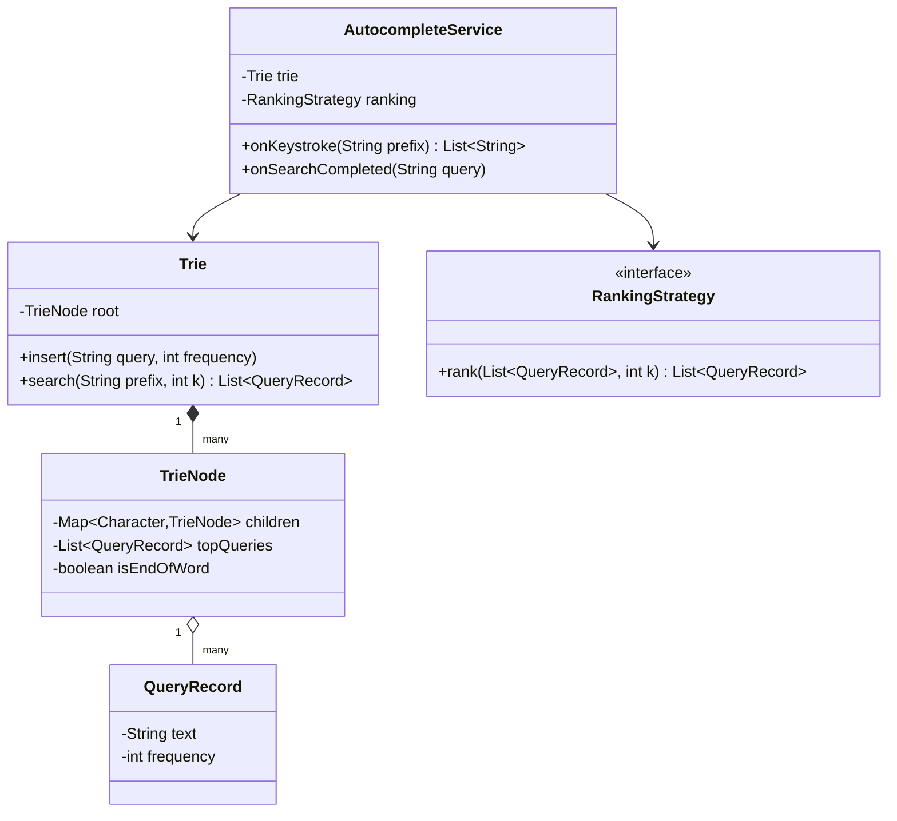
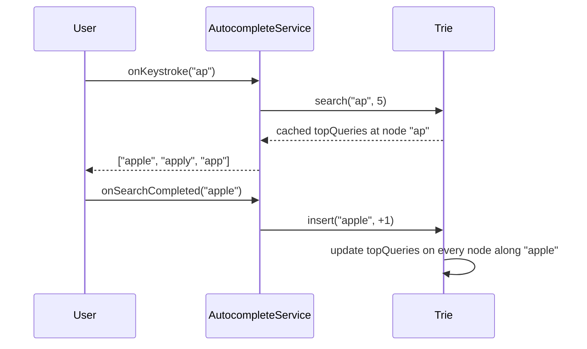

# Design a search autocomplete system

**An autocomplete system suggests the top completions for a partial query as the user types, ranked by how often each full query was searched before.**

## Requirements

### Functional requirements

1. As a user types a prefix, the system returns the top `k` matching past queries, ranked by search frequency.
2. When a user finishes a search (presses enter), that query's frequency count increases by one.
3. Suggestions are sorted by frequency, highest first; ties break alphabetically.
4. The system supports adding brand-new queries that have never been searched before.
5. Prefix matching is case-insensitive.

### Non-functional requirements

- Lookup for a prefix must be fast, since it runs on every keystroke.
- The system should handle a large corpus of historical queries (millions) without scanning all of them per keystroke.
- New queries should become searchable without rebuilding the whole index.

### Out of scope

- Personalization per user or geographic ranking.
- Typo correction or fuzzy matching.

## Clarifying questions to ask

| Question | Assumption we make |
|---|---|
| How many suggestions are shown at once? | Top 5, configurable. |
| Is ranking purely by historical frequency? | Yes; no recency decay for this version. |
| How is "query typed" different from "query searched"? | Only a completed search (enter pressed) increments frequency; typing alone doesn't. |
| Can frequency counts be approximate under high load? | Yes, eventual consistency is fine for the counter. |

## Core entities

| Entity | Responsibility |
|---|---|
| `TrieNode` | One character of the trie; holds children and cached top completions |
| `Trie` | Inserts queries and looks up completions for a prefix |
| `QueryRecord` | A historical query and its frequency count |
| `RankingStrategy` | Orders candidate queries for display |
| `AutocompleteService` | Entry point: handles keystrokes and search-completed events |

## Class diagram



*Each `TrieNode` caches its own top completions so a lookup doesn't rescan the whole subtree.*

## Key flows



*A keystroke reads a precomputed cache; a completed search updates that cache along the query's path.*

## Design patterns used

| Pattern | Where | Why |
|---|---|---|
| Strategy | `RankingStrategy` | Swap frequency-only ranking for a weighted or personalized ranking later |
| Composite | `TrieNode` | Each node is built from smaller nodes of the same type, giving a uniform prefix structure |
| Facade | `AutocompleteService` | Callers only see `onKeystroke` and `onSearchCompleted`, never the trie internals |

## Implementation

`QueryRecord` is a small immutable-ish holder used for both storage and cached results:

```java
public class QueryRecord {
    private final String text;
    private int frequency;

    public QueryRecord(String text, int frequency) {
        this.text = text;
        this.frequency = frequency;
    }

    public void incrementFrequency() { frequency++; }
    public String text() { return text; }
    public int frequency() { return frequency; }
}
```

`TrieNode` caches its top-k completions, refreshed on every insert:

```java
public class TrieNode {
    private final Map<Character, TrieNode> children = new HashMap<>();
    private final List<QueryRecord> topQueries = new ArrayList<>();
    private boolean isEndOfWord;

    public TrieNode child(char c) { return children.get(c); }
    public TrieNode getOrCreateChild(char c) { return children.computeIfAbsent(c, k -> new TrieNode()); }
    public void markEndOfWord() { isEndOfWord = true; }

    public void updateTopQueries(QueryRecord record, int maxCached) {
        topQueries.removeIf(r -> r.text().equals(record.text()));
        topQueries.add(record);
        topQueries.sort(Comparator.comparingInt(QueryRecord::frequency).reversed()
            .thenComparing(QueryRecord::text));
        if (topQueries.size() > maxCached) topQueries.remove(topQueries.size() - 1);
    }

    public List<QueryRecord> topQueries() { return topQueries; }
}
```

`Trie` inserts a query along its character path, updating every ancestor node's cache:

```java
public class Trie {
    private final TrieNode root = new TrieNode();
    private final Map<String, QueryRecord> allQueries = new ConcurrentHashMap<>();
    private final int maxCachedPerNode;

    public Trie(int maxCachedPerNode) { this.maxCachedPerNode = maxCachedPerNode; }

    public void insert(String query, int frequencyDelta) {
        String normalized = query.toLowerCase();
        QueryRecord record = allQueries.computeIfAbsent(normalized, q -> new QueryRecord(q, 0));
        for (int i = 0; i < frequencyDelta; i++) record.incrementFrequency();

        TrieNode node = root;
        for (char c : normalized.toCharArray()) {
            node = node.getOrCreateChild(c);
            node.updateTopQueries(record, maxCachedPerNode);
        }
        node.markEndOfWord();
    }

    public List<QueryRecord> search(String prefix, int k) {
        String normalized = prefix.toLowerCase();
        TrieNode node = root;
        for (char c : normalized.toCharArray()) {
            node = node.child(c);
            if (node == null) return List.of();
        }
        return node.topQueries().stream().limit(k).toList();
    }
}
```

`AutocompleteService` is the entry point the UI layer calls:

```java
public class AutocompleteService {
    private final Trie trie;
    private final RankingStrategy ranking;
    private final int suggestionsPerKeystroke;

    public AutocompleteService(Trie trie, RankingStrategy ranking, int suggestionsPerKeystroke) {
        this.trie = trie;
        this.ranking = ranking;
        this.suggestionsPerKeystroke = suggestionsPerKeystroke;
    }

    public List<String> onKeystroke(String prefix) {
        List<QueryRecord> candidates = trie.search(prefix, suggestionsPerKeystroke * 2);
        return ranking.rank(candidates, suggestionsPerKeystroke).stream()
            .map(QueryRecord::text)
            .toList();
    }

    public void onSearchCompleted(String query) {
        trie.insert(query, 1);
    }
}

public class FrequencyRanking implements RankingStrategy {
    public List<QueryRecord> rank(List<QueryRecord> candidates, int k) {
        return candidates.stream()
            .sorted(Comparator.comparingInt(QueryRecord::frequency).reversed()
                .thenComparing(QueryRecord::text))
            .limit(k)
            .toList();
    }
}
```

## Handling concurrency

- **Concurrent search completions on the same query.** `allQueries` is a `ConcurrentHashMap`, but `incrementFrequency` on a shared `QueryRecord` still needs to be atomic; back it with an `AtomicInteger` in a production version.
- **Reads during a write.** A search can run while an insert is updating a node's `topQueries`. Since exact real-time counts aren't required, a read seeing a slightly stale cached list is acceptable; guard `updateTopQueries` with a lock per node if you need strict consistency.
- **Cost of insert.** Insert touches one node per character of the query, so it's O(query length x maxCachedPerNode log maxCachedPerNode). This stays cheap because `maxCachedPerNode` is small (for example, 5 to 10).
- **Scale beyond one machine.** Shard the trie by first character or by hash of the prefix, and merge partial top-k lists from each shard at query time.

## Extending the design

**How would you refresh rankings without live inserts blocking reads (a batch model)?**
Build the trie offline from a log of searches on a schedule, then swap the active trie reference atomically. Reads always see a consistent, fully built trie.

**How would you add recency, so trending queries rank higher than old popular ones?**
Replace `RankingStrategy` with one that scores by a decayed frequency, for example `frequency * exp(-age / halfLife)`, recomputed periodically instead of on every insert.

**How would you personalize suggestions per user?**
Add a small per-user trie or reranker that boosts the user's own past queries, then merge with the global trie's results in `AutocompleteService`.

## Key takeaways

- Cache the top-k completions at each trie node so a keystroke lookup is O(prefix length), not a subtree scan.
- Separate the trie's structural role from `RankingStrategy` so ranking rules can evolve independently.
- Treat "typed" and "searched" as different events; only completed searches update frequency.
- For scale, shard the trie and merge results, or rebuild it in batch to decouple writes from reads.
