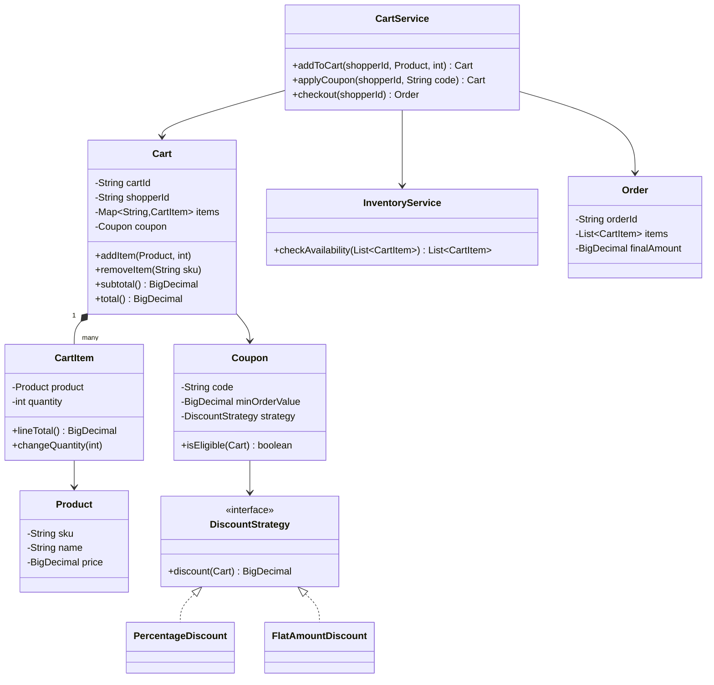
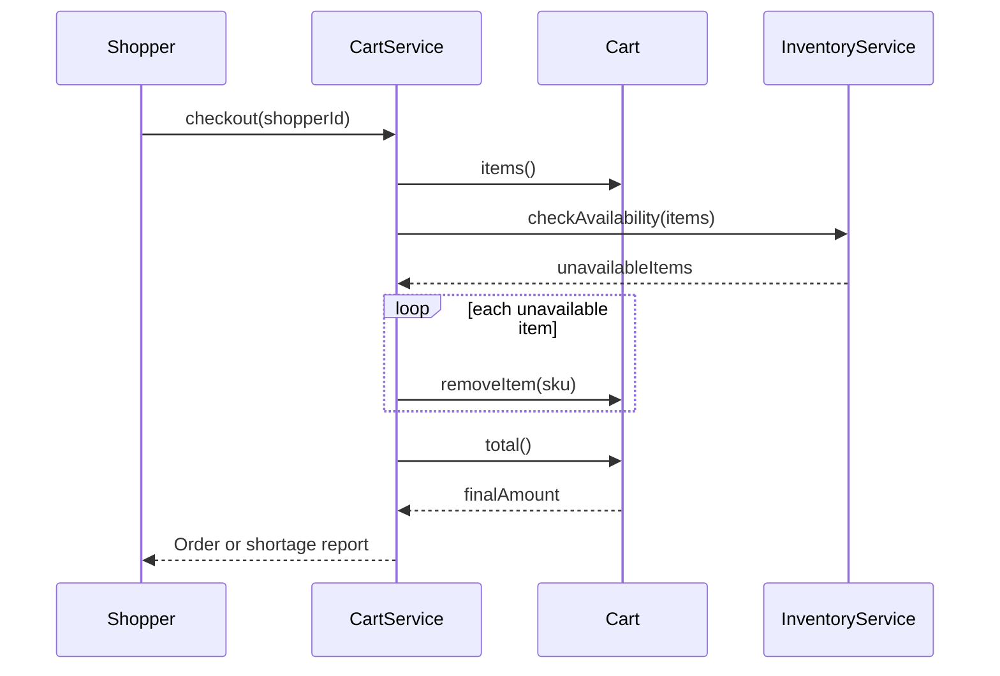

# Design a shopping cart

**A shopping cart holds the items a shopper wants to buy, applies discounts, and hands off a final total when they check out.**

## Requirements

### Functional requirements

1. A shopper can add a product to the cart, remove a product, or change its quantity.
2. The cart shows a subtotal, any discounts applied, and a grand total.
3. A shopper can apply a coupon code. Some coupons need a minimum order value.
4. The cart checks stock before checkout and rejects items that went out of stock.
5. Checkout turns the cart into an order and clears the cart.

### Non-functional requirements

- The same shopper may edit the cart from two open tabs. The final state must be consistent.
- New discount types (percentage off, buy-one-get-one, flat amount) must plug in without touching cart code.
- Cart lookups must be fast; a shopper may have hundreds of catalog items to browse.

### Out of scope

- Product search and recommendations.
- Payment processing. We stop at producing an `Order` with a final amount.

## Clarifying questions to ask

| Question | Assumption we make |
|---|---|
| Can a shopper have more than one cart? | No, one active cart per shopper. |
| Do prices change while items sit in the cart? | Yes, we re-price from the catalog at checkout, not at add-time. |
| Can multiple coupons stack? | No, only one coupon per cart at a time. |
| What happens if stock runs out at checkout? | Remove that item from the cart and report it to the shopper. |

## Core entities

| Entity | Responsibility |
|---|---|
| `Product` | Catalog item with a current price and SKU |
| `CartItem` | A product plus the quantity chosen |
| `Cart` | Holds items for one shopper and computes totals |
| `DiscountStrategy` | Calculates the discount for a cart or coupon |
| `Coupon` | A code that maps to a discount and eligibility rule |
| `InventoryService` | Confirms stock before checkout |
| `Order` | The immutable result of a completed checkout |
| `CartService` | Entry point: add, remove, apply coupon, checkout |

## Class diagram



*`Cart` owns its items and delegates discount math to a strategy chosen by the applied coupon.*

## Key flows



*Checkout re-checks stock before pricing, so the shopper never pays for an item that vanished.*

## Design patterns used

| Pattern | Where | Why |
|---|---|---|
| Strategy | `DiscountStrategy` | Add new discount types without editing `Cart` or `Coupon` |
| Facade | `CartService` | Callers use one service instead of wiring `Cart`, `Coupon`, and `InventoryService` themselves |
| Value object | `Order` | An order snapshot is immutable data with no identity beyond its fields |

## Implementation

`Product` and `CartItem` model what sits in the cart. A line total is quantity times the current unit price:

```java
public record Product(String sku, String name, BigDecimal price) {}

public class CartItem {
    private final Product product;
    private int quantity;

    public CartItem(Product product, int quantity) {
        this.product = product;
        this.quantity = quantity;
    }

    public BigDecimal lineTotal() { return product.price().multiply(BigDecimal.valueOf(quantity)); }
    public void changeQuantity(int qty) {
        if (qty <= 0) throw new IllegalArgumentException("Quantity must be positive");
        this.quantity = qty;
    }
    public Product product() { return product; }
    public int quantity() { return quantity; }
}
```

`Cart` keeps items in a thread-safe map so concurrent edits from two tabs don't corrupt state:

```java
public class Cart {
    private final String cartId;
    private final String shopperId;
    private final Map<String, CartItem> items = new ConcurrentHashMap<>();
    private volatile Coupon coupon;

    public Cart(String cartId, String shopperId) {
        this.cartId = cartId;
        this.shopperId = shopperId;
    }

    public synchronized void addItem(Product product, int quantity) {
        items.merge(product.sku(), new CartItem(product, quantity),
            (existing, added) -> {
                existing.changeQuantity(existing.quantity() + added.quantity());
                return existing;
            });
    }

    public void removeItem(String sku) { items.remove(sku); }
    public Collection<CartItem> items() { return items.values(); }

    public BigDecimal subtotal() {
        return items.values().stream().map(CartItem::lineTotal).reduce(BigDecimal.ZERO, BigDecimal::add);
    }

    public BigDecimal total() {
        BigDecimal discount = (coupon != null && coupon.isEligible(this)) ? coupon.discount(this) : BigDecimal.ZERO;
        return subtotal().subtract(discount).max(BigDecimal.ZERO);
    }

    public void applyCoupon(Coupon coupon) { this.coupon = coupon; }
    public String shopperId() { return shopperId; }
}
```

Discount rules live behind a strategy interface, and a coupon wraps one with an eligibility check:

```java
public interface DiscountStrategy {
    BigDecimal discount(Cart cart);
}

public class PercentageDiscount implements DiscountStrategy {
    private final BigDecimal percent;
    public PercentageDiscount(BigDecimal percent) { this.percent = percent; }
    public BigDecimal discount(Cart cart) {
        return cart.subtotal().multiply(percent).divide(BigDecimal.valueOf(100), 2, RoundingMode.HALF_UP);
    }
}

public class FlatAmountDiscount implements DiscountStrategy {
    private final BigDecimal amount;
    public FlatAmountDiscount(BigDecimal amount) { this.amount = amount; }
    public BigDecimal discount(Cart cart) { return amount; }
}

public class Coupon {
    private final String code;
    private final BigDecimal minOrderValue;
    private final DiscountStrategy strategy;

    public Coupon(String code, BigDecimal minOrderValue, DiscountStrategy strategy) {
        this.code = code;
        this.minOrderValue = minOrderValue;
        this.strategy = strategy;
    }

    public boolean isEligible(Cart cart) { return cart.subtotal().compareTo(minOrderValue) >= 0; }
    public BigDecimal discount(Cart cart) { return strategy.discount(cart); }
    public String code() { return code; }
}
```

`CartService` ties inventory checks, pricing, and checkout together:

```java
public class CartService {
    private final Map<String, Cart> cartsByShopper = new ConcurrentHashMap<>();
    private final InventoryService inventory;

    public CartService(InventoryService inventory) { this.inventory = inventory; }

    public Cart cartFor(String shopperId) {
        return cartsByShopper.computeIfAbsent(shopperId, id -> new Cart(UUID.randomUUID().toString(), id));
    }

    public Order checkout(String shopperId) {
        Cart cart = cartFor(shopperId);
        List<CartItem> unavailable = inventory.checkAvailability(new ArrayList<>(cart.items()));
        unavailable.forEach(item -> cart.removeItem(item.product().sku()));
        if (!unavailable.isEmpty()) {
            throw new IllegalStateException("Removed " + unavailable.size() + " out-of-stock item(s)");
        }
        Order order = new Order(UUID.randomUUID().toString(), List.copyOf(cart.items()), cart.total());
        cartsByShopper.remove(shopperId);
        return order;
    }
}

public record Order(String orderId, List<CartItem> items, BigDecimal finalAmount) {}
```

## Handling concurrency

- **Two tabs edit the same cart.** `Cart` uses a `ConcurrentHashMap` for items and `synchronized` on `addItem` so a merge of quantity never loses an update.
- **Price changes between add and checkout.** We store the `Product` reference at add-time but read `lineTotal()` fresh at checkout, so a price bump before checkout is reflected. If you need to lock the price in, snapshot it into `CartItem` on add instead.
- **Checkout runs twice for the same shopper.** `checkout` removes the cart from `cartsByShopper` before returning, so a repeated call finds no cart and fails fast rather than double-charging.

## Extending the design

**How do you support buy-one-get-one offers?**
Add a `BogoDiscount implements DiscountStrategy` that inspects `cart.items()` for a matching SKU and quantity, and computes the discount as the price of the free unit. No change to `Cart` or `Coupon`.

**How do you let a shopper save items for later without losing their cart?**
Add a `SavedForLater` list next to `items` on `Cart`, with `moveToSaved(sku)` and `moveToCart(sku)`. It's a second bucket on the same object, not a new entity.

**How would you support multiple currencies?**
Store `Product` price in a base currency and add a `CurrencyConverter` the `CartService` calls before returning totals. Keep `Cart` math in the base currency so discounts stay simple.

## Key takeaways

- Keep `Cart` a plain aggregate of `CartItem`s; push pricing rules into `DiscountStrategy` implementations.
- Re-check stock and re-price at checkout time, not at add-to-cart time.
- A `ConcurrentHashMap` plus a narrow `synchronized` block is often enough for cart-level concurrency; you rarely need a distributed lock.
- Model the completed purchase as a separate immutable `Order`, so the cart can be cleared safely after checkout.
