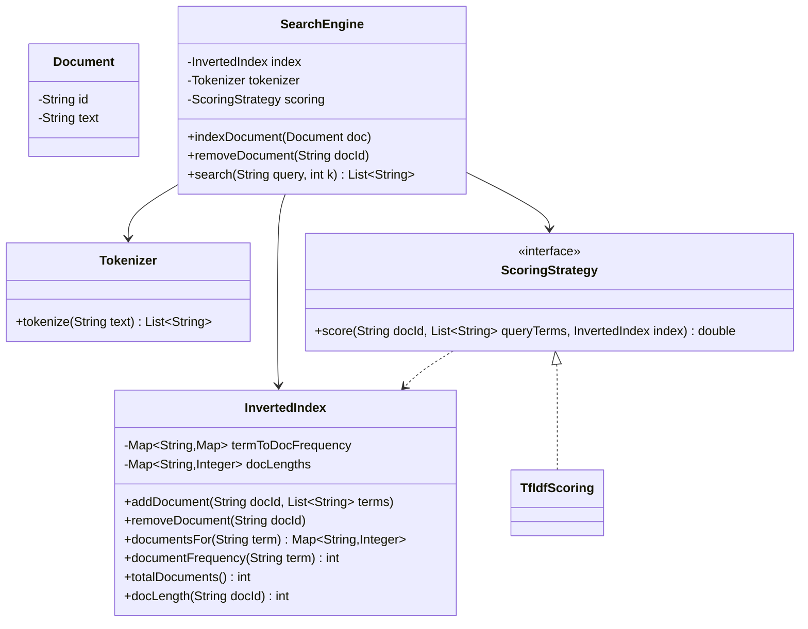
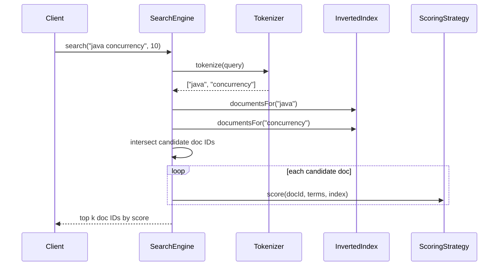

# Design a simple search engine

**A simple search engine indexes a set of text documents and returns the documents most relevant to a keyword query, ranked by relevance.**

## Requirements

### Functional requirements

1. The system can index a new document, given its ID and text content.
2. Given a query of one or more words, the system returns matching document IDs ranked by relevance.
3. Relevance is based on term frequency and how many documents contain the term (fewer documents with the term means higher weight).
4. The system supports multi-word queries as an implicit AND (a document must contain every term to match).
5. A document can be re-indexed (content update) or removed.

### Non-functional requirements

- Query time should not scan every document; it should use an inverted index.
- Indexing a new document shouldn't require rebuilding the whole index.
- The scoring formula should be swappable without changing the indexing or query pipeline.

### Out of scope

- Web crawling and link-based ranking (like PageRank).
- Fuzzy or typo-tolerant matching, and query autocomplete.

## Clarifying questions to ask

| Question | Assumption we make |
|---|---|
| How is relevance scored? | TF-IDF: term frequency times inverse document frequency. |
| Is search case-sensitive? | No; all text is lowercased and tokenized on non-letters. |
| Do stop words (the, a, is) get filtered? | Yes, via a configurable stop-word list. |
| Is the corpus static or does it grow over time? | Grows over time; indexing must be incremental. |

## Core entities

| Entity | Responsibility |
|---|---|
| `Document` | Holds document ID and raw text |
| `Tokenizer` | Splits text into normalized terms, removing stop words |
| `InvertedIndex` | Maps each term to the documents and term counts it appears in |
| `ScoringStrategy` | Computes a relevance score for a document given a query |
| `SearchEngine` | Entry point: indexes documents and answers queries |

## Class diagram



*`InvertedIndex` is the core data structure; `ScoringStrategy` reads it but never mutates it.*

## Key flows



*The engine intersects candidate documents from the index, then scores only that smaller set.*

## Design patterns used

| Pattern | Where | Why |
|---|---|---|
| Strategy | `ScoringStrategy` | Swap TF-IDF for BM25 or another formula without touching indexing or query logic |
| Facade | `SearchEngine` | Callers only call `indexDocument`, `removeDocument`, and `search` |
| Single responsibility split | `Tokenizer`, `InvertedIndex`, `ScoringStrategy` | Each piece (text processing, storage, ranking) changes for its own reason |

## Implementation

`Tokenizer` normalizes text and drops stop words:

```java
public class Tokenizer {
    private static final Set<String> STOP_WORDS = Set.of("the", "a", "an", "is", "of", "and", "to");

    public List<String> tokenize(String text) {
        String[] rawWords = text.toLowerCase().split("[^a-z0-9]+");
        List<String> terms = new ArrayList<>();
        for (String word : rawWords) {
            if (!word.isBlank() && !STOP_WORDS.contains(word)) terms.add(word);
        }
        return terms;
    }
}
```

`InvertedIndex` maps each term to the documents it appears in, with a per-document count:

```java
public class InvertedIndex {
    private final Map<String, Map<String, Integer>> termToDocFrequency = new ConcurrentHashMap<>();
    private final Map<String, Integer> docLengths = new ConcurrentHashMap<>();

    public void addDocument(String docId, List<String> terms) {
        docLengths.put(docId, terms.size());
        Map<String, Integer> counts = new HashMap<>();
        for (String term : terms) counts.merge(term, 1, Integer::sum);
        counts.forEach((term, count) ->
            termToDocFrequency.computeIfAbsent(term, t -> new ConcurrentHashMap<>()).put(docId, count));
    }

    public void removeDocument(String docId) {
        docLengths.remove(docId);
        termToDocFrequency.values().forEach(docMap -> docMap.remove(docId));
    }

    public Map<String, Integer> documentsFor(String term) {
        return termToDocFrequency.getOrDefault(term, Map.of());
    }

    public int documentFrequency(String term) { return documentsFor(term).size(); }
    public int totalDocuments() { return docLengths.size(); }
    public int docLength(String docId) { return docLengths.getOrDefault(docId, 0); }
}
```

`TfIdfScoring` computes a relevance score by summing TF-IDF across query terms:

```java
public class TfIdfScoring implements ScoringStrategy {
    public double score(String docId, List<String> queryTerms, InvertedIndex index) {
        double score = 0.0;
        int docLength = Math.max(1, index.docLength(docId));
        for (String term : queryTerms) {
            int termCount = index.documentsFor(term).getOrDefault(docId, 0);
            if (termCount == 0) continue;
            double tf = (double) termCount / docLength;
            int df = index.documentFrequency(term);
            double idf = Math.log((double) index.totalDocuments() / (1 + df));
            score += tf * idf;
        }
        return score;
    }
}
```

`SearchEngine` ties tokenizing, indexing, candidate selection, and scoring together:

```java
public class SearchEngine {
    private final InvertedIndex index = new InvertedIndex();
    private final Tokenizer tokenizer;
    private final ScoringStrategy scoring;

    public SearchEngine(Tokenizer tokenizer, ScoringStrategy scoring) {
        this.tokenizer = tokenizer;
        this.scoring = scoring;
    }

    public void indexDocument(Document doc) {
        index.removeDocument(doc.id()); // clear any previous version's terms before re-indexing
        index.addDocument(doc.id(), tokenizer.tokenize(doc.text()));
    }

    public void removeDocument(String docId) {
        index.removeDocument(docId);
    }

    public List<String> search(String query, int k) {
        List<String> queryTerms = tokenizer.tokenize(query);
        if (queryTerms.isEmpty()) return List.of();

        Set<String> candidates = new HashSet<>(index.documentsFor(queryTerms.get(0)).keySet());
        for (String term : queryTerms.subList(1, queryTerms.size())) {
            candidates.retainAll(index.documentsFor(term).keySet());
        }

        return candidates.stream()
            .sorted(Comparator.comparingDouble((String docId) -> scoring.score(docId, queryTerms, index)).reversed())
            .limit(k)
            .toList();
    }
}

public record Document(String id, String text) {}
```

## Handling concurrency

- **Concurrent indexing and querying.** `termToDocFrequency` and `docLengths` use `ConcurrentHashMap`, so reads during a write see either the old or new state per term, never a corrupted map.
- **Read consistency across terms.** A query that reads two terms mid-update to a third document may see a slightly inconsistent snapshot (one term updated, another not yet). This is acceptable for a simple engine; for strict consistency, index documents under a per-document lock and publish all term updates atomically.
- **Removal races with scoring.** `removeDocument` can run while `search` is scoring that same document. Since maps are concurrent, the worst case is a document briefly appearing in results with a zero score for the removed term; the client-visible list still stays valid.
- **Cost of the AND intersection.** Intersecting candidate sets is fastest when you start from the term with the smallest posting list; sort query terms by `documentFrequency` ascending before intersecting.

## Extending the design

**How would you support OR queries or phrase queries ("exact phrase")?**
For OR, union instead of intersect candidate sets. For phrases, store term positions in `InvertedIndex` and check that positions are consecutive across the phrase's terms.

**How would you scale the index beyond one machine?**
Shard `InvertedIndex` by term (each shard owns a range of terms) or by document (each shard indexes a subset of documents), and merge scored results from each shard at query time.

**How would you swap in a better ranking formula, like BM25?**
Add a `Bm25Scoring implements ScoringStrategy` that also uses `docLength` and average document length. `SearchEngine` only needs the new strategy injected; no other class changes.

## Key takeaways

- An inverted index turns "scan every document" into "look up candidate documents per term."
- Keep tokenizing, storage, and scoring in separate classes so each can change independently.
- Intersect small candidate sets before scoring, and scope scoring to only those candidates.
- `ScoringStrategy` behind an interface makes it easy to try TF-IDF, then BM25, without touching indexing.
