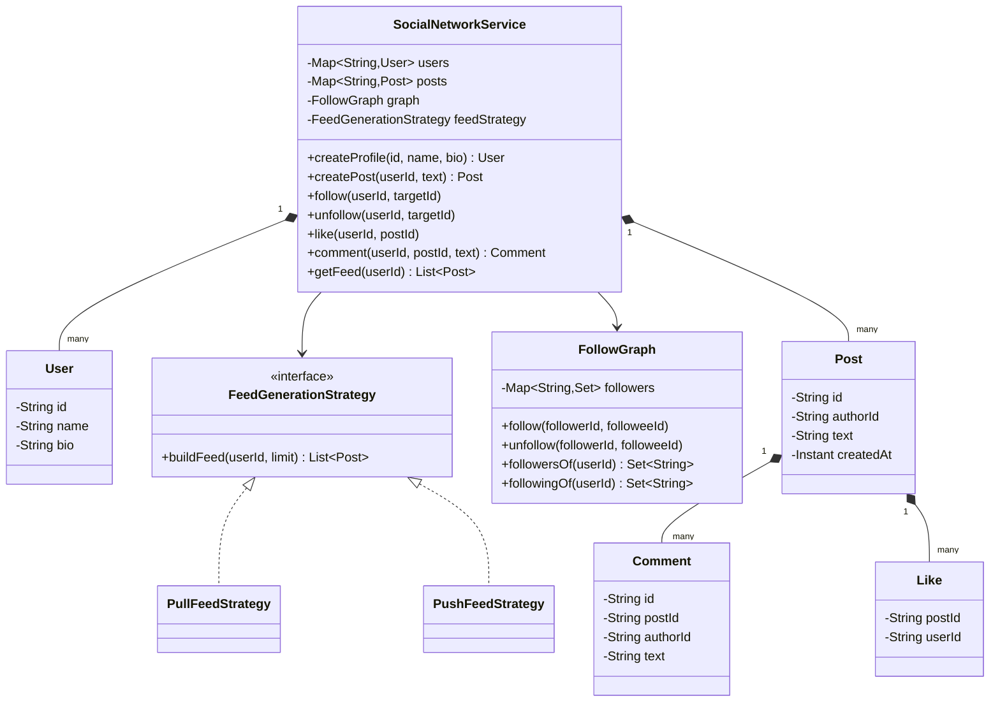
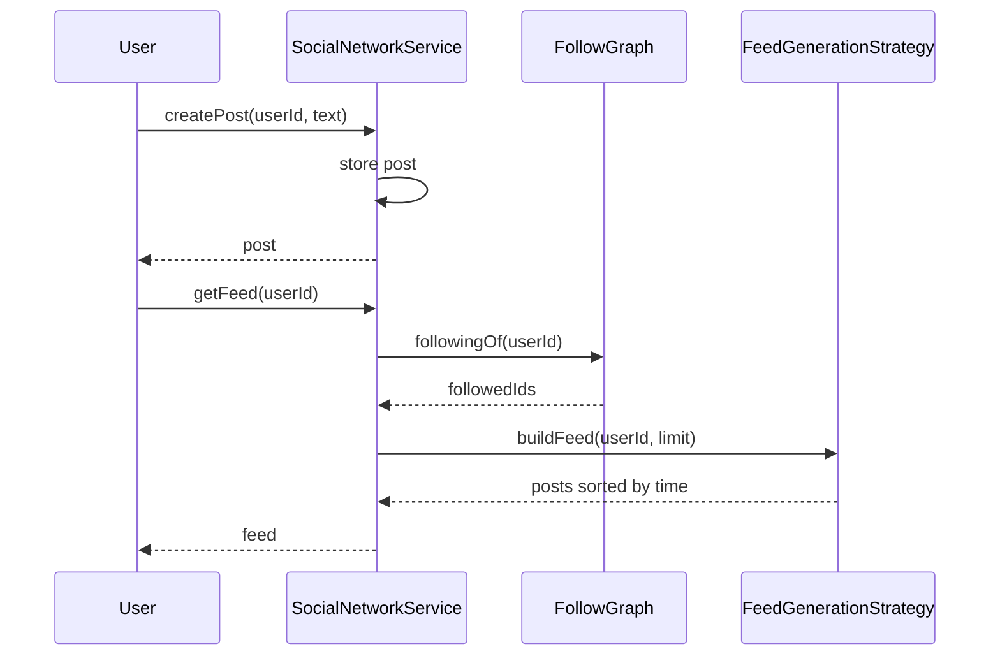

# Design a social network

**A social network lets users create profiles, follow other users, post updates, and see a feed built from the people they follow.**

## Requirements

### Functional requirements

1. A user can create a profile with a name and bio.
2. A user can follow and unfollow another user. Following doesn't need approval.
3. A user can create a post containing text.
4. A user can like and comment on a post.
5. A user can view a news feed made of posts from the people they follow, newest first.

### Non-functional requirements

- Most users read their feed far more often than they post. Reads must be fast.
- A popular user can have millions of followers. Posting shouldn't block on updating every follower's feed.
- Adding a new feed-ranking rule shouldn't require changing the posting code.

### Out of scope

- Direct messaging
- Media storage (images, video) beyond a URL reference
- Search and discovery of new users

## Clarifying questions to ask

| Question | Assumption we make |
|---|---|
| Does the feed need to be perfectly real-time? | No. A few seconds of delay after posting is fine. |
| Should the feed be sorted by time or by relevance? | Time for the base design; mention relevance ranking as an extension. |
| How many followers can one user have? | Anywhere from zero to millions. Design for both. |
| Can a user see their own posts in their feed? | Yes, include the user's own posts. |

## Core entities

| Entity | Responsibility |
|---|---|
| `User` | Holds profile data and the set of users they follow |
| `Post` | Holds the text content, author, and timestamp of a post |
| `Comment` | Holds a reply to a post |
| `Like` | Records that a user liked a post |
| `FollowGraph` | Tracks who follows whom |
| `FeedGenerationStrategy` | Decides how a user's feed is built |
| `SocialNetworkService` | Entry point: post, follow, like, comment, get feed |

## Class diagram



*`SocialNetworkService` owns users and posts, and delegates feed assembly to a strategy.*

## Key flows



*Posting stores the post directly; reading a feed asks the strategy to assemble it from followed users.*

## Design patterns used

| Pattern | Where | Why |
|---|---|---|
| Strategy | `FeedGenerationStrategy` | Swap between pull-based and push-based feed assembly without touching `SocialNetworkService` |
| Observer | Notifying followers on a new post (push model) | Followers' feed caches react to a post event; the poster doesn't know who's listening |
| Facade | `SocialNetworkService` | Callers use one entry point instead of wiring `FollowGraph`, posts, and the feed strategy themselves |

## Implementation

Core models are simple value holders. `FollowGraph` keeps the follow relationships in both directions for fast lookups:

```java
public record User(String id, String name, String bio) {}
public record Post(String id, String authorId, String text, Instant createdAt) {}
public record Comment(String id, String postId, String authorId, String text) {}
public record Like(String postId, String userId) {}

public class FollowGraph {
    private final Map<String, Set<String>> following = new ConcurrentHashMap<>();
    private final Map<String, Set<String>> followers = new ConcurrentHashMap<>();

    public void follow(String followerId, String followeeId) {
        following.computeIfAbsent(followerId, k -> ConcurrentHashMap.newKeySet()).add(followeeId);
        followers.computeIfAbsent(followeeId, k -> ConcurrentHashMap.newKeySet()).add(followerId);
    }

    public void unfollow(String followerId, String followeeId) {
        following.getOrDefault(followerId, Set.of()).remove(followeeId);
        followers.getOrDefault(followeeId, Set.of()).remove(followerId);
    }

    public Set<String> followingOf(String userId) {
        return following.getOrDefault(userId, Set.of());
    }

    public Set<String> followersOf(String userId) {
        return followers.getOrDefault(userId, Set.of());
    }
}
```

The feed strategy is where the two common designs diverge. The pull strategy scans posts at read time:

```java
public interface FeedGenerationStrategy {
    List<Post> buildFeed(String userId, int limit);
}

public class PullFeedStrategy implements FeedGenerationStrategy {
    private final FollowGraph graph;
    private final Map<String, Post> posts;

    public PullFeedStrategy(FollowGraph graph, Map<String, Post> posts) {
        this.graph = graph;
        this.posts = posts;
    }

    public List<Post> buildFeed(String userId, int limit) {
        Set<String> authors = new HashSet<>(graph.followingOf(userId));
        authors.add(userId);
        return posts.values().stream()
            .filter(p -> authors.contains(p.authorId()))
            .sorted(Comparator.comparing(Post::createdAt).reversed())
            .limit(limit)
            .toList();
    }
}
```

The push strategy fans a new post out to each follower's precomputed feed cache when the post is created, so reads are just a lookup. A `PostCreatedListener` interface lets any number of listeners react to a new post:

```java
public interface PostCreatedListener {
    void onPostCreated(Post post, Set<String> followerIds);
}

public class PushFeedCacheUpdater implements PostCreatedListener {
    private final Map<String, Deque<Post>> feedCache = new ConcurrentHashMap<>();
    private static final int MAX_CACHE_SIZE = 500;

    public void onPostCreated(Post post, Set<String> followerIds) {
        for (String followerId : followerIds) {
            Deque<Post> feed = feedCache.computeIfAbsent(followerId, k -> new ConcurrentLinkedDeque<>());
            feed.addFirst(post);
            while (feed.size() > MAX_CACHE_SIZE) feed.removeLast();
        }
    }

    public List<Post> readCache(String userId, int limit) {
        return feedCache.getOrDefault(userId, new ConcurrentLinkedDeque<>())
            .stream().limit(limit).toList();
    }
}

public class PushFeedStrategy implements FeedGenerationStrategy {
    private final PushFeedCacheUpdater cache;
    public PushFeedStrategy(PushFeedCacheUpdater cache) { this.cache = cache; }

    public List<Post> buildFeed(String userId, int limit) {
        return cache.readCache(userId, limit);
    }
}
```

`SocialNetworkService` ties everything together and notifies listeners after storing a post:

```java
public class SocialNetworkService {
    private final Map<String, User> users = new ConcurrentHashMap<>();
    private final Map<String, Post> posts = new ConcurrentHashMap<>();
    private final FollowGraph graph = new FollowGraph();
    private final FeedGenerationStrategy feedStrategy;
    private final List<PostCreatedListener> listeners = new ArrayList<>();
    private final List<Like> likes = new CopyOnWriteArrayList<>();
    private final List<Comment> comments = new CopyOnWriteArrayList<>();

    public SocialNetworkService(FeedGenerationStrategy feedStrategy) {
        this.feedStrategy = feedStrategy;
    }

    public void addListener(PostCreatedListener listener) { listeners.add(listener); }

    public User createProfile(String id, String name, String bio) {
        User user = new User(id, name, bio);
        users.put(id, user);
        return user;
    }

    public Post createPost(String userId, String text) {
        Post post = new Post(UUID.randomUUID().toString(), userId, text, Instant.now());
        posts.put(post.id(), post);
        Set<String> followerIds = graph.followersOf(userId);
        listeners.forEach(l -> l.onPostCreated(post, followerIds));
        return post;
    }

    public void follow(String userId, String targetId) { graph.follow(userId, targetId); }
    public void unfollow(String userId, String targetId) { graph.unfollow(userId, targetId); }

    public void like(String userId, String postId) { likes.add(new Like(postId, userId)); }

    public Comment comment(String userId, String postId, String text) {
        Comment comment = new Comment(UUID.randomUUID().toString(), postId, userId, text);
        comments.add(comment);
        return comment;
    }

    public List<Post> getFeed(String userId) { return feedStrategy.buildFeed(userId, 50); }
}
```

- `SocialNetworkService` doesn't know whether the feed is pulled or pushed; `PushFeedStrategy` just reads what `PushFeedCacheUpdater` already wrote.
- `like` and `comment` append to simple lists here; a real system would index them by post for fast lookup.
- The pull strategy is simplest to reason about but scans every post at read time.
- The push strategy trades write-time cost for cheap reads, which fits since reads dominate.
- A celebrity account with millions of followers makes a pure push model too slow to write; in practice, systems mix both: push for regular users, pull-on-read for accounts with huge follower counts.

## Handling concurrency

- **Concurrent follow and unfollow of the same pair.** `ConcurrentHashMap.newKeySet()` gives each add/remove atomicity per entry, so no external lock is needed.
- **A post fanning out to millions of followers.** Do the fan-out asynchronously on a worker queue, not inline inside `createPost`. The caller gets a fast response; feed caches update a few seconds later.
- **Two feed reads during a fan-out in progress.** Reads may briefly miss the newest post. That's acceptable under the non-functional requirement that a short delay is fine.
- **Race between `unfollow` and an in-flight fan-out.** The follower set is read once at fan-out time; a follower who unfollows mid-fan-out might get one extra post in their cache. Treat this as a rare, harmless inconsistency rather than something to lock around.

## Extending the design

**How do you rank the feed by relevance instead of time?**
Write a new `FeedGenerationStrategy` that scores posts by engagement and recency, and inject it into `SocialNetworkService` instead of `PullFeedStrategy`.

**How do you support blocking a user?**
Add a `BlockList` similar to `FollowGraph`. Filter blocked authors out in the feed strategy and reject likes/comments from blocked users.

**How do you handle a celebrity with 50 million followers?**
Switch that user's posts to pull-at-read-time instead of push, and merge the pulled posts with the pushed feed cache when building the final feed.

**How would you add notifications for likes and comments?**
Reuse the observer pattern: `Like` and `Comment` creation fire events that a `NotificationListener` picks up, independent of feed generation.

## Key takeaways

- Separate the follow graph, posts, and feed assembly into their own classes.
- Put feed assembly behind a `FeedGenerationStrategy` so pull and push can be swapped or mixed.
- Favor push (fan-out on write) when reads vastly outnumber writes, and fall back to pull for high-fan-out accounts.
- Treat small, temporary feed staleness as acceptable rather than a bug to eliminate.
