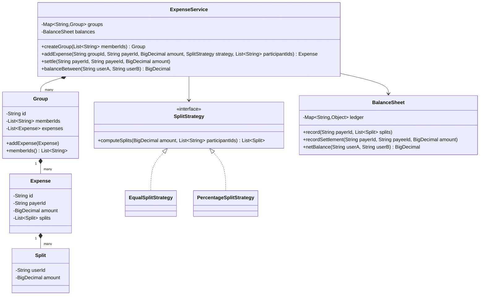
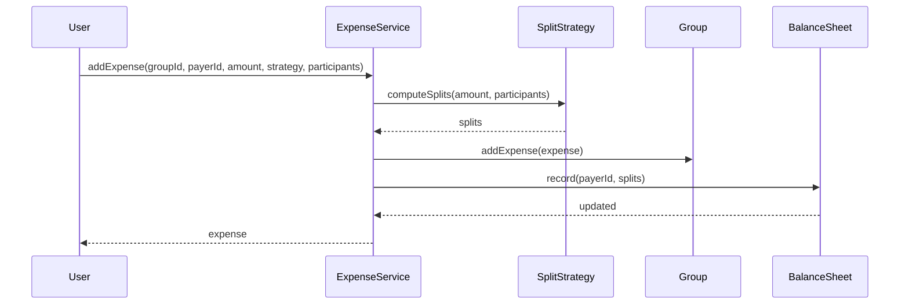

# Design an expense-sharing app like Splitwise

**An expense-sharing app lets a group of people log shared expenses and tracks who owes whom, so the group can settle up with the fewest payments.**

## Requirements

### Functional requirements

1. A user can create a group and add members to it.
2. A user can add an expense to a group: amount, who paid, and how it's split among members.
3. Splits can be equal, exact amounts, or by percentage.
4. The system shows the net balance between any two users, and each user's overall balance in a group.
5. A user can record a settlement payment, which reduces the balance between two users.

### Non-functional requirements

- Balance calculations must be consistent even if two expenses are added at the same time.
- Adding a new split type (equal, exact, percentage) shouldn't require changing balance logic.
- Balances must never leave the group's total in an inconsistent state (money created or lost).

### Out of scope

- Actual money transfer (bank/UPI integration). We only track who owes whom.
- Multi-currency conversion.

## Clarifying questions to ask

| Question | Assumption we make |
|---|---|
| Can an expense involve people outside the group? | No. All split participants must be group members. |
| How is "net balance" computed? | Sum of all expenses and settlements between the two users, sign shows direction. |
| Should we simplify debts, like A owes B owes C into A owes C? | Yes, mention it as a graph simplification, cover it in extension questions. |
| What happens if percentages don't add up to 100? | Reject the expense with a validation error. |

## Core entities

| Entity | Responsibility |
|---|---|
| `User` | A person who can owe or be owed money |
| `Group` | Holds members and the list of expenses |
| `Expense` | Amount, payer, and the list of splits for that expense |
| `Split` | One member's share of one expense |
| `SplitStrategy` | Computes each member's share given the split type |
| `BalanceSheet` | Tracks net amount owed between every pair of users |
| `ExpenseService` | Entry point: adds expenses and settlements, reports balances |

## Class diagram



*`BalanceSheet` is the single source of truth for who owes whom; `SplitStrategy` only decides how one expense is divided.*

## Key flows



*Every expense flows through one ledger update, so balances stay consistent regardless of split type.*

## Design patterns used

| Pattern | Where | Why |
|---|---|---|
| Strategy | `SplitStrategy` | Add equal, exact, or percentage splits without touching `BalanceSheet` |
| Facade | `ExpenseService` | Callers add expenses and read balances through one entry point |
| Factory method | `SplitStrategies` | Creates the right `SplitStrategy` without callers touching concrete classes |

## Implementation

`Split`, `Expense`, and `Group` are simple value holders. All money is `BigDecimal`, never `double`, to avoid binary rounding error:

```java
public record Split(String userId, BigDecimal amount) {}

public class Expense {
    private final String id;
    private final String payerId;
    private final BigDecimal amount;
    private final List<Split> splits;

    public Expense(String payerId, BigDecimal amount, List<Split> splits) {
        this.id = UUID.randomUUID().toString();
        this.payerId = payerId;
        this.amount = amount;
        this.splits = splits;
    }

    public String payerId() { return payerId; }
    public List<Split> splits() { return splits; }
    public BigDecimal amount() { return amount; }
}

public class Group {
    private final String id;
    private final List<String> memberIds;
    private final List<Expense> expenses = new ArrayList<>();

    public Group(String id, List<String> memberIds) {
        this.id = id;
        this.memberIds = memberIds;
    }

    public void addExpense(Expense expense) { expenses.add(expense); }
    public List<String> memberIds() { return memberIds; }
    public String id() { return id; }
}
```

Each split type is its own strategy, so validation lives with the rule it belongs to. `EqualSplitStrategy` hands out the leftover cents one at a time instead of just truncating, so the shares always add back up to the original amount exactly:

```java
public interface SplitStrategy {
    List<Split> computeSplits(BigDecimal amount, List<String> participantIds);
}

public class EqualSplitStrategy implements SplitStrategy {
    private static final BigDecimal CENT = BigDecimal.valueOf(1, 2);

    public List<Split> computeSplits(BigDecimal amount, List<String> participantIds) {
        int n = participantIds.size();
        BigDecimal base = amount.divide(BigDecimal.valueOf(n), 2, RoundingMode.DOWN);
        BigDecimal leftover = amount.subtract(base.multiply(BigDecimal.valueOf(n)));

        List<Split> splits = new ArrayList<>();
        for (String id : participantIds) {
            BigDecimal share = base;
            if (leftover.compareTo(BigDecimal.ZERO) > 0) {
                share = share.add(CENT);
                leftover = leftover.subtract(CENT);
            }
            splits.add(new Split(id, share));
        }
        return splits; // shares always sum to exactly `amount`, no cent lost or created
    }
}

public class PercentageSplitStrategy implements SplitStrategy {
    private final Map<String, BigDecimal> percentByUser;

    public PercentageSplitStrategy(Map<String, BigDecimal> percentByUser) {
        BigDecimal total = percentByUser.values().stream().reduce(BigDecimal.ZERO, BigDecimal::add);
        if (total.compareTo(BigDecimal.valueOf(100)) != 0) {
            throw new IllegalArgumentException("Percentages must add up to 100");
        }
        this.percentByUser = percentByUser;
    }

    public List<Split> computeSplits(BigDecimal amount, List<String> participantIds) {
        return participantIds.stream()
            .map(id -> new Split(id, amount.multiply(percentByUser.get(id))
                .divide(BigDecimal.valueOf(100), 2, RoundingMode.HALF_UP)))
            .toList();
    }
}

// Factory method: callers ask for a strategy by intent, never construct one directly.
public final class SplitStrategies {
    private SplitStrategies() {}

    public static SplitStrategy equal() { return new EqualSplitStrategy(); }

    public static SplitStrategy percentage(Map<String, BigDecimal> percentByUser) {
        return new PercentageSplitStrategy(percentByUser);
    }
}
```

`BalanceSheet` stores a signed amount per ordered pair, and always updates both directions together:

```java
public class BalanceSheet {
    // ledger.get(A).get(B) = how much B owes A. Negative means A owes B.
    private final Map<String, Map<String, BigDecimal>> ledger = new ConcurrentHashMap<>();
    private final Object lock = new Object();

    public void record(String payerId, List<Split> splits) {
        synchronized (lock) {
            for (Split split : splits) {
                if (split.userId().equals(payerId)) continue;
                adjust(payerId, split.userId(), split.amount());
            }
        }
    }

    public void recordSettlement(String payerId, String payeeId, BigDecimal amount) {
        synchronized (lock) {
            adjust(payeeId, payerId, amount); // payerId paid off what they owed payeeId
        }
    }

    private void adjust(String creditor, String debtor, BigDecimal amount) {
        ledger.computeIfAbsent(creditor, k -> new ConcurrentHashMap<>())
              .merge(debtor, amount, BigDecimal::add);
        ledger.computeIfAbsent(debtor, k -> new ConcurrentHashMap<>())
              .merge(creditor, amount.negate(), BigDecimal::add);
    }

    public BigDecimal netBalance(String userA, String userB) {
        return ledger.getOrDefault(userA, Map.of()).getOrDefault(userB, BigDecimal.ZERO);
    }
}
```

`ExpenseService` wires groups, strategies, and the ledger together:

```java
public class ExpenseService {
    private final Map<String, Group> groups = new ConcurrentHashMap<>();
    private final BalanceSheet balances = new BalanceSheet();

    public Group createGroup(List<String> memberIds) {
        Group group = new Group(UUID.randomUUID().toString(), memberIds);
        groups.put(group.id(), group);
        return group;
    }

    public Expense addExpense(String groupId, String payerId, BigDecimal amount,
                               SplitStrategy strategy, List<String> participantIds) {
        Group group = groups.get(groupId);
        if (group == null) throw new IllegalArgumentException("Unknown group");
        if (!group.memberIds().containsAll(participantIds)) {
            throw new IllegalArgumentException("All participants must be group members");
        }
        List<Split> splits = strategy.computeSplits(amount, participantIds);
        Expense expense = new Expense(payerId, amount, splits);
        group.addExpense(expense);
        balances.record(payerId, splits);
        return expense;
    }

    public void settle(String payerId, String payeeId, BigDecimal amount) {
        balances.recordSettlement(payerId, payeeId, amount);
    }

    public BigDecimal balanceBetween(String userA, String userB) {
        return balances.netBalance(userA, userB);
    }
}
```

## Handling concurrency

- **Two expenses added at the same time.** `BalanceSheet.record` and `recordSettlement` run under one lock, so ledger updates from concurrent expenses never interleave and leave a half-applied pair.
- **Both directions of a pair must stay symmetric.** `adjust` writes both `ledger[A][B]` and `ledger[B][A]` inside the same locked block, so a reader never observes only one side updated.
- **Reading balances during a write.** `ConcurrentHashMap` reads are safe without the lock; a reader might see a slightly stale value mid-update, which is acceptable since a full recompute always converges to the same totals.

## Extending the design

**How do you simplify debts across a group, so A owes B owes C becomes A owes C?**
Build a graph of net balances per pair, then run a min-cash-flow algorithm: repeatedly match the largest creditor with the largest debtor until all balances are zero.

**How do you support splitting by exact custom amounts instead of equal or percentage?**
Add an `ExactSplitStrategy` that validates the given amounts sum to the total expense, no changes to `BalanceSheet` or `ExpenseService`.

**Can percentage splits also lose a cent to rounding?**
Yes, if percentages don't divide the amount evenly. Apply the same leftover-cent distribution used in `EqualSplitStrategy`: round each share down, then hand out the remaining cents to the largest fractional remainders first.

**How do you support multiple currencies?**
Store amount and currency together in `Expense` and `Split`, and convert to a base currency inside `BalanceSheet.adjust` using an exchange-rate service passed in at construction.

**How would you notify users when their balance changes?**
Add an observer interface that `ExpenseService` calls after `balances.record` and `recordSettlement`, similar to the pub-sub pattern used elsewhere in this series.

## Key takeaways

- Keep one `BalanceSheet` as the source of truth; every expense and settlement flows through it.
- Put split logic behind a `SplitStrategy` interface so new split types don't touch balance code.
- Update both directions of a balance pair atomically, under one lock, to avoid partial updates.
- Model settlements as just another ledger adjustment, not a special case.
