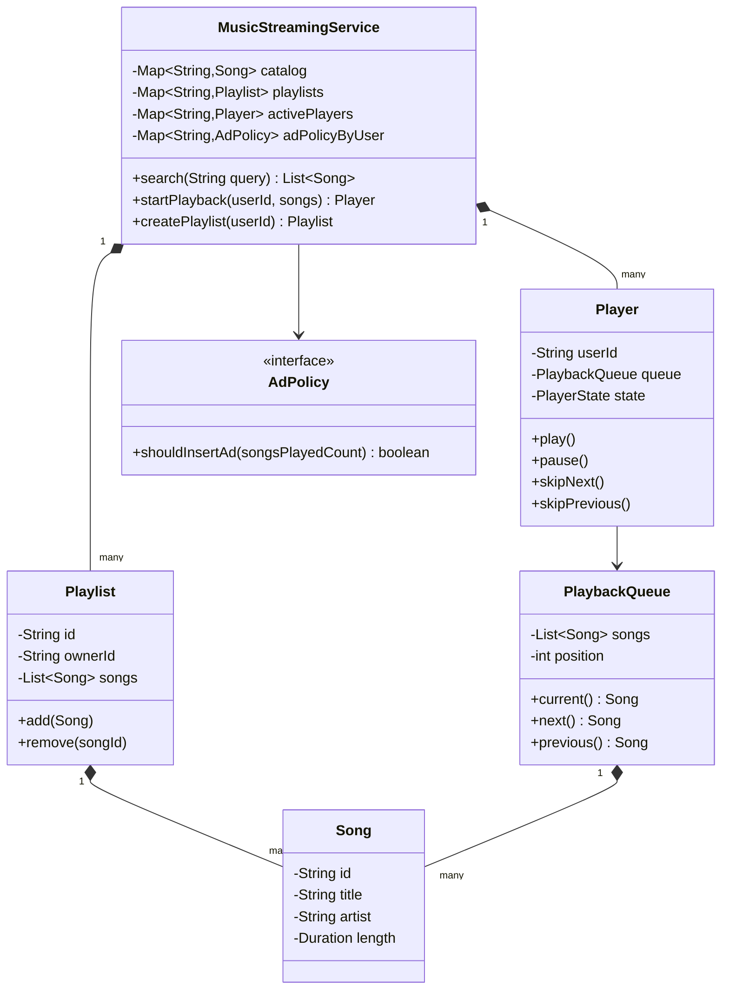
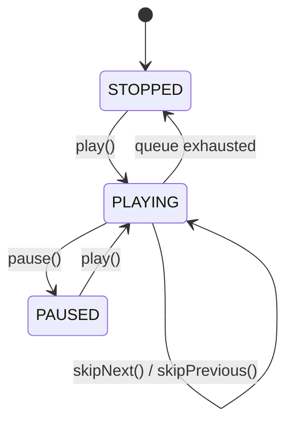

# Design a music streaming service like Spotify

**A music streaming service lets a user search for songs, play them through a single player, build playlists, and enforces limits based on subscription tier.**

## Requirements

### Functional requirements

1. A user can search for a song by title or artist.
2. A user can play, pause, skip to next, and skip to previous within a queue of songs.
3. A user can create a playlist and add or remove songs from it.
4. A free-tier user hears an ad after every few songs; a premium user doesn't.
5. The system tracks what's currently playing and lets the client poll or receive updates on player state.

### Non-functional requirements

- One user's player is inherently sequential (one song plays at a time), but many users stream at once.
- Adding a new subscription tier or a new player feature (for example, shuffle) shouldn't require rewriting the playback core.
- Playlist edits by the owner and playback reads by any listener shouldn't corrupt playlist state.

### Out of scope

- Actual audio encoding, streaming protocol, and CDN delivery
- Payment processing for subscriptions
- Recommendation and discovery algorithms

## Clarifying questions to ask

| Question | Assumption we make |
|---|---|
| Can multiple devices for the same user play at once? | No, one active player per user; starting playback on a new device stops the old one. |
| Should ads interrupt playback mid-song? | No, ads are inserted between songs, never mid-track. |
| Can a playlist be shared and edited by more than one user? | Out of scope; assume one owner per playlist. |
| Does skip-previous replay the same song or go to the prior one? | Goes to the prior song in the queue, matching common player behavior. |

## Core entities

| Entity | Responsibility |
|---|---|
| `Song` | Holds title, artist, and duration |
| `Playlist` | Holds an ordered list of songs owned by a user |
| `PlaybackQueue` | Holds the songs queued for playback and the current position |
| `Player` | Tracks play/pause/stopped state for one user's active session |
| `AdPolicy` | Decides whether to insert an ad before the next song |
| `MusicStreamingService` | Entry point: search, play, playlist management |

## Class diagram



*`Player` owns one user's `PlaybackQueue`; `AdPolicy` is consulted by the service, not by the player itself, so tier rules stay outside playback logic.*

## Key flows



*The player has three states; skipping within the queue doesn't change the state, only the current song.*

## Design patterns used

| Pattern | Where | Why |
|---|---|---|
| State | `PlayerState` (`STOPPED`/`PLAYING`/`PAUSED`) | Keeps valid transitions explicit instead of boolean flags |
| Strategy | `AdPolicy` | Free vs. premium ad rules swap without touching `Player` or `MusicStreamingService` |
| Iterator (implicit in `PlaybackQueue`) | Moving through queued songs | `next()`/`previous()` hide the underlying list and position tracking |

## Implementation

`Song` and `Playlist` are simple; `Playlist` synchronizes mutation since one owner can edit from multiple devices:

```java
public record Song(String id, String title, String artist, Duration length) {}

public class Playlist {
    private final String id;
    private final String ownerId;
    private final List<Song> songs = new ArrayList<>();

    public Playlist(String id, String ownerId) {
        this.id = id;
        this.ownerId = ownerId;
    }

    public synchronized void add(Song song) { songs.add(song); }
    public synchronized void remove(String songId) {
        songs.removeIf(s -> s.id().equals(songId));
    }
    public synchronized List<Song> songs() { return List.copyOf(songs); }
    public String id() { return id; }
}
```

`PlaybackQueue` tracks position and hands back the current song:

```java
public class PlaybackQueue {
    private final List<Song> songs;
    private int position = 0;

    public PlaybackQueue(List<Song> songs) {
        if (songs.isEmpty()) throw new IllegalArgumentException("Queue can't be empty");
        this.songs = new ArrayList<>(songs);
    }

    public Song current() { return songs.get(position); }

    public Optional<Song> next() {
        if (position + 1 >= songs.size()) return Optional.empty();
        position++;
        return Optional.of(current());
    }

    public Optional<Song> previous() {
        if (position == 0) return Optional.empty();
        position--;
        return Optional.of(current());
    }
}
```

`Player` wraps the queue with play/pause state and enforces valid transitions:

```java
public enum PlayerState { STOPPED, PLAYING, PAUSED }

public class Player {
    private final String userId;
    private PlaybackQueue queue;
    private PlayerState state = PlayerState.STOPPED;
    private int songsPlayedCount = 0;

    public Player(String userId, PlaybackQueue queue) {
        this.userId = userId;
        this.queue = queue;
    }

    public void play() {
        if (state == PlayerState.STOPPED) songsPlayedCount++;
        state = PlayerState.PLAYING;
    }

    public void pause() {
        if (state != PlayerState.PLAYING) throw new IllegalStateException("Not playing");
        state = PlayerState.PAUSED;
    }

    public void skipNext() {
        queue.next().ifPresentOrElse(s -> songsPlayedCount++, () -> state = PlayerState.STOPPED);
    }

    public void skipPrevious() { queue.previous(); }

    public PlayerState state() { return state; }
    public int songsPlayedCount() { return songsPlayedCount; }
    public String userId() { return userId; }
}
```

`AdPolicy` and `MusicStreamingService` tie playback to subscription rules:

```java
public interface AdPolicy {
    boolean shouldInsertAd(int songsPlayedCount);
}

public class FreeTierAdPolicy implements AdPolicy {
    private static final int SONGS_BETWEEN_ADS = 3;
    public boolean shouldInsertAd(int songsPlayedCount) {
        return songsPlayedCount > 0 && songsPlayedCount % SONGS_BETWEEN_ADS == 0;
    }
}

public class PremiumAdPolicy implements AdPolicy {
    public boolean shouldInsertAd(int songsPlayedCount) { return false; }
}

public class MusicStreamingService {
    private final Map<String, Song> catalog = new ConcurrentHashMap<>();
    private final Map<String, Playlist> playlists = new ConcurrentHashMap<>();
    private final Map<String, Player> activePlayers = new ConcurrentHashMap<>();
    private final Map<String, AdPolicy> adPolicyByUser = new ConcurrentHashMap<>();

    public Playlist createPlaylist(String userId) {
        Playlist playlist = new Playlist(UUID.randomUUID().toString(), userId);
        playlists.put(playlist.id(), playlist);
        return playlist;
    }

    public List<Song> search(String query) {
        String lower = query.toLowerCase();
        return catalog.values().stream()
            .filter(s -> s.title().toLowerCase().contains(lower) || s.artist().toLowerCase().contains(lower))
            .toList();
    }

    public Player startPlayback(String userId, List<Song> songs) {
        Player player = new Player(userId, new PlaybackQueue(songs));
        activePlayers.put(userId, player);
        player.play();
        return player;
    }

    public boolean nextSongNeedsAd(String userId) {
        Player player = activePlayers.get(userId);
        AdPolicy policy = adPolicyByUser.getOrDefault(userId, new FreeTierAdPolicy());
        return policy.shouldInsertAd(player.songsPlayedCount());
    }
}
```

- `startPlayback` replaces any existing entry in `activePlayers` for that user, matching "one active player per user."
- `Player` doesn't know about ads; `MusicStreamingService` asks the `AdPolicy` separately, keeping tier logic out of playback state.
- `PlaybackQueue` never throws on `next()`/`previous()` at the edges; it returns `Optional.empty()` instead, so the player can react by stopping.

## Handling concurrency

- **Two devices for the same user start playback at once.** `activePlayers.put` simply overwrites; the second call wins and the first device's session becomes stale. For strict single-device enforcement, have the client poll player state and disconnect on mismatch.
- **Playlist edited while it's being read to build a queue.** `Playlist.add`/`remove`/`songs()` are all `synchronized` on the playlist instance, so a queue build sees a consistent snapshot rather than a partial edit.
- **Many users streaming simultaneously.** Each user's `Player` and `PlaybackQueue` are separate objects behind `ConcurrentHashMap`, so playback for one user never blocks another; there's no shared mutable state across users.
- **Play/pause called rapidly from a flaky client connection.** State transitions are simple field writes guarded by the state check; for stricter correctness under concurrent calls from the same user, wrap `Player`'s methods in `synchronized` the way `Playlist` does.

## Extending the design

**How do you add shuffle mode?**
Give `PlaybackQueue` a shuffled index list built from the original song order; `next()`/`previous()` walk that index list instead of the raw list, so `Player` doesn't change.

**How do you support offline downloads for premium users?**
Add a `DownloadPolicy` strategy similar to `AdPolicy`, checked before allowing a download request; playback itself doesn't need to know if a song came from cache or stream.

**How would you support collaborative playlists edited by several users?**
Change `Playlist.ownerId` to a set of editor IDs and keep the existing `synchronized` methods; the locking already handles concurrent edits, only the authorization check changes.

**How do you add a "currently playing" push update to a friend's activity feed?**
Add an observer hook in `Player.play()`/`skipNext()` that publishes a playback event; a feed service subscribes without `Player` depending on it.

## Key takeaways

- Separate the playback state machine (`Player`) from catalog and playlist data; they change for different reasons.
- Keep queue navigation (`PlaybackQueue`) independent of play/pause state, so features like shuffle only touch the queue.
- Put subscription-tier rules behind a strategy (`AdPolicy`) instead of branching on tier inside the player.
- Lock at the object that's actually shared (a playlist between a user's devices), not globally across all users.
