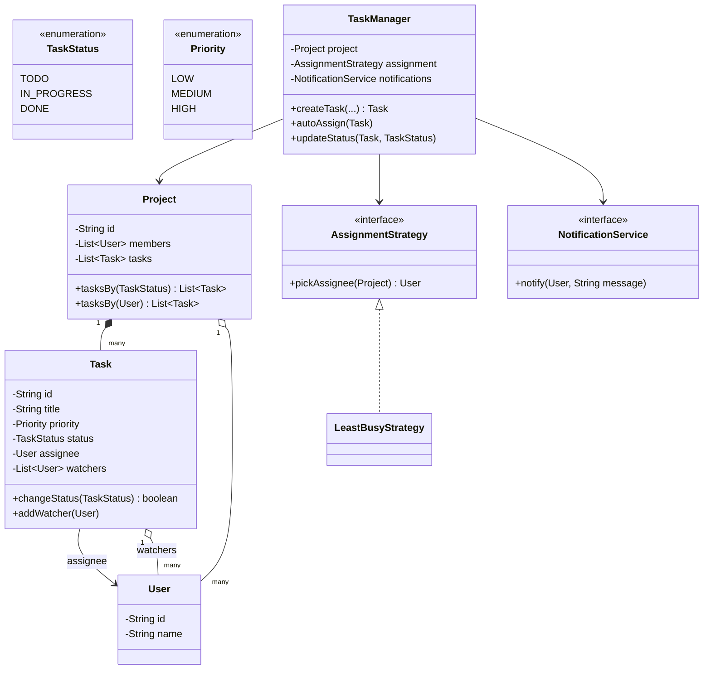
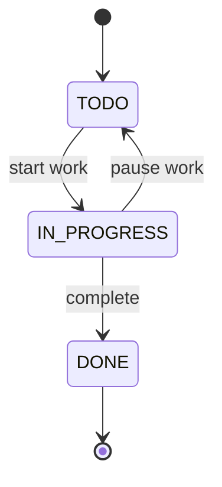

# Design a task management system

**A task management system lets users create tasks inside a project, assign them, move them through a workflow, and get notified when a task they care about changes.**

## Requirements

### Functional requirements

1. A project holds many tasks. Each task has a title, description, priority, due date, and an assignee.
2. A task moves through a fixed workflow: `TODO` to `IN_PROGRESS` to `DONE`. A task can also move back to `TODO`, but never directly from `TODO` to `DONE`.
3. A task can be assigned to a user manually, or auto-assigned to whichever user on the project currently has the fewest open tasks.
4. Users can watch a task. When its status changes, every watcher gets notified.
5. The system lists tasks in a project filtered by status or assignee.

### Non-functional requirements

- Two users updating the same task's status at the same time must not leave it in an inconsistent state.
- Adding a new workflow status, or a new auto-assignment rule, shouldn't require changing `Task` or `Project`.
- Notification delivery (email, in-app, chat) is pluggable.

### Out of scope

- Subtasks, comments, and attachments.
- Permission checks (who is allowed to edit a task).
- The actual transport for notifications (SMTP, push service).

## Clarifying questions to ask

| Question | Assumption we make |
|---|---|
| Can a task skip a status, like `TODO` straight to `DONE`? | No. Only the transitions in the workflow diagram are valid. |
| What does "fewest open tasks" mean for auto-assignment? | Count of tasks assigned to a user that aren't `DONE`, within that project. |
| Who gets notified on a status change? | Anyone in the task's watcher list, which always includes the assignee. |
| Can a task be unassigned? | Yes, assignee is optional; auto-assignment only applies to tasks explicitly requesting it. |

## Core entities

| Entity | Responsibility |
|---|---|
| `TaskStatus` | The current stage of a task's workflow |
| `Task` | Title, description, priority, due date, assignee, current status, watchers |
| `Project` | Holds tasks and members |
| `User` | A project member who can be assigned tasks and watch them |
| `AssignmentStrategy` | Decides who a task is assigned to |
| `NotificationService` | Sends a message to a user when notified |
| `TaskManager` | Entry point: creates tasks, changes status, wires notifications |

## Class diagram



*`TaskManager` coordinates `Project`, `AssignmentStrategy`, and `NotificationService`; `Task` enforces its own valid transitions.*

## Key flows



*A task can move forward one step, or fall back from `IN_PROGRESS` to `TODO`, but never jump straight to `DONE`.*

## Design patterns used

| Pattern | Where | Why |
|---|---|---|
| State | Valid transitions checked inside `Task.changeStatus` | The next allowed status depends only on the current one |
| Strategy | `AssignmentStrategy` | Swap auto-assignment rules without touching `Task` or `Project` |
| Observer | `Task` watchers, notified through `NotificationService` | Any number of interested users can watch a task without `Task` depending on them |

## Implementation

The status enum, with its own map of valid next states, keeps transition rules in one place:

```java
public enum TaskStatus {
    TODO(Set.of()), IN_PROGRESS(Set.of()), DONE(Set.of());

    // Filled in below since enum constants can't reference each other during construction.
    private Set<TaskStatus> allowedNext;
    TaskStatus(Set<TaskStatus> allowedNext) { this.allowedNext = allowedNext; }

    static {
        TODO.allowedNext = Set.of(IN_PROGRESS);
        IN_PROGRESS.allowedNext = Set.of(DONE, TODO);
        DONE.allowedNext = Set.of();
    }

    public boolean canMoveTo(TaskStatus next) { return allowedNext.contains(next); }
}

public enum Priority { LOW, MEDIUM, HIGH }
```

`Task` owns its status and watcher list, and only changes status through a checked method:

```java
public class Task {
    private final String id;
    private final String title;
    private final Priority priority;
    private volatile TaskStatus status = TaskStatus.TODO;
    private volatile User assignee;
    private final List<User> watchers = new CopyOnWriteArrayList<>();

    public Task(String id, String title, Priority priority) {
        this.id = id; this.title = title; this.priority = priority;
    }

    public synchronized boolean changeStatus(TaskStatus next) {
        if (!status.canMoveTo(next)) return false;
        status = next;
        return true;
    }

    public void assignTo(User user) {
        this.assignee = user;
        addWatcher(user);
    }

    public void addWatcher(User user) { if (!watchers.contains(user)) watchers.add(user); }
    public TaskStatus status() { return status; }
    public User assignee() { return assignee; }
    public List<User> watchers() { return watchers; }
    public String id() { return id; }
}
```

`Project` groups tasks and members, and answers simple filtered queries:

```java
public class Project {
    private final String id;
    private final List<User> members = new ArrayList<>();
    private final List<Task> tasks = new CopyOnWriteArrayList<>();

    public Project(String id) { this.id = id; }

    public void addMember(User user) { members.add(user); }
    public void addTask(Task task) { tasks.add(task); }

    public List<Task> tasksBy(TaskStatus status) {
        return tasks.stream().filter(t -> t.status() == status).toList();
    }

    public List<Task> tasksBy(User user) {
        return tasks.stream().filter(t -> user.equals(t.assignee())).toList();
    }

    public List<User> members() { return members; }
}
```

The assignment strategy and `TaskManager` tie everything together:

```java
public interface AssignmentStrategy {
    User pickAssignee(Project project);
}

public class LeastBusyStrategy implements AssignmentStrategy {
    public User pickAssignee(Project project) {
        return project.members().stream()
            .min(Comparator.comparingInt(u ->
                (int) project.tasksBy(u).stream().filter(t -> t.status() != TaskStatus.DONE).count()))
            .orElseThrow(() -> new IllegalStateException("Project has no members"));
    }
}

public interface NotificationService {
    void notify(User user, String message);
}

public class TaskManager {
    private final Project project;
    private final AssignmentStrategy assignment;
    private final NotificationService notifications;

    public TaskManager(Project project, AssignmentStrategy assignment, NotificationService notifications) {
        this.project = project;
        this.assignment = assignment;
        this.notifications = notifications;
    }

    public Task createTask(String id, String title, Priority priority) {
        Task task = new Task(id, title, priority);
        project.addTask(task);
        return task;
    }

    public void autoAssign(Task task) {
        task.assignTo(assignment.pickAssignee(project));
    }

    public void updateStatus(Task task, TaskStatus next) {
        if (task.changeStatus(next)) {
            String message = task.id() + " moved to " + next;
            task.watchers().forEach(w -> notifications.notify(w, message));
        }
    }
}
```

## Handling concurrency

- **Two users change the same task's status at once.** `Task.changeStatus` is `synchronized`, so the transitions apply one at a time. The second caller's check runs against the already-updated status, and an invalid transition is rejected instead of silently overwritten.
- **Reading status while it changes.** `status` is `volatile`, so `tasksBy(TaskStatus)` never sees a torn write, only the value before or after a change.
- **Adding watchers while notifying.** `watchers` is a `CopyOnWriteArrayList`, so a watcher added during an in-flight notification loop doesn't throw a `ConcurrentModificationException`; it's simply included in the next notification.

## Extending the design

**How do you add a `BLOCKED` status?**
Add it to `TaskStatus` and update the static block with its allowed transitions (for example, `IN_PROGRESS` to `BLOCKED` and back). No other class changes.

**How do you support due-date reminders?**
Add a scheduled job that scans tasks nearing their due date and calls `notifications.notify` for each assignee. It only needs read access to `Project`.

**How would you support custom workflows per project?**
Move the transition rules out of the `TaskStatus` enum and into a per-project `WorkflowStrategy` interface that `Task.changeStatus` consults instead of the enum's own map.

## Key takeaways

- Keep workflow rules next to the status itself, so an invalid transition is rejected at the source.
- Put status changes behind one synchronized method so concurrent updates can't corrupt a task.
- Use a strategy for auto-assignment and an observer for notifications, so both can evolve independently of `Task` and `Project`.
- Model watchers as a first-class list, not a side effect of assignment, so anyone can subscribe to a task's changes.
