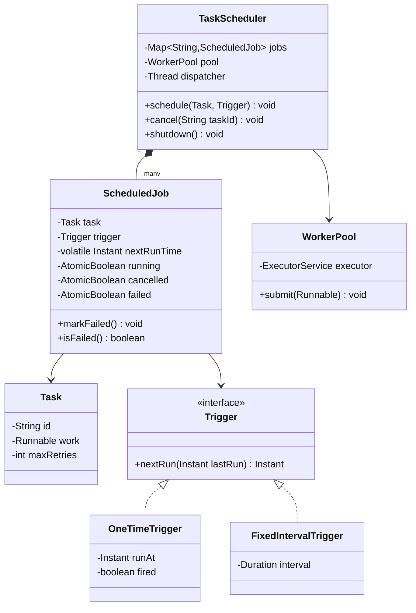
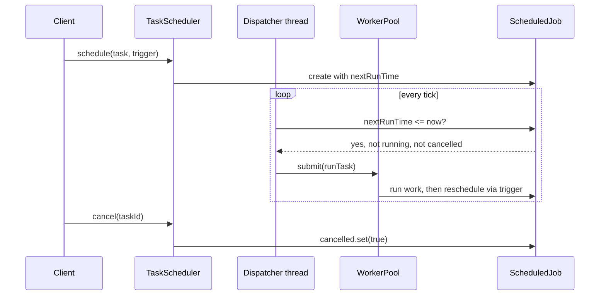

# Design a task scheduler

**A task scheduler runs submitted jobs at a specified time or on a recurring interval, using a pool of worker threads.**

## Requirements

### Functional requirements

1. Submit a job to run once at a specific time.
2. Submit a job to run repeatedly on a fixed interval.
3. Cancel a scheduled job before it runs (or before its next run).
4. A fixed pool of workers executes jobs; jobs don't spawn unbounded threads.
5. A failed job is retried a limited number of times before being marked failed.

### Non-functional requirements

- Jobs due at the same time must not block each other if one takes a long time.
- Cancelling a job must be safe even if it's about to run.
- Adding a new trigger type (cron-like schedule) shouldn't change the worker pool code.

### Out of scope

- Distributed scheduling across multiple machines.
- Persisting jobs across a process restart.

## Clarifying questions to ask

| Question | Assumption we make |
|---|---|
| How many worker threads run jobs? | A fixed, configurable pool size. |
| What happens if a job is still running when its next interval fires? | Skip that run; don't queue overlapping executions of the same job. |
| How many retries on failure? | A fixed max, configurable per job, with no backoff for simplicity. |
| Can two jobs have the same ID? | No, job IDs are unique; resubmission with the same ID replaces the job. |

## Core entities

| Entity | Responsibility |
|---|---|
| `Task` | The unit of work: an ID, a `Runnable`, and retry policy |
| `Trigger` | Decides when a task's next run is due |
| `ScheduledJob` | Binds a task to a trigger and tracks its next run time |
| `WorkerPool` | Fixed pool of threads that execute due jobs |
| `TaskScheduler` | Entry point: schedules, cancels, and drives execution |

## Class diagram



*`TaskScheduler` polls jobs for their next run time and hands due ones to the worker pool; each job knows how to compute its own next run through its `Trigger`.*

## Key flows



*A single dispatcher thread scans due jobs; actual work runs on the pool, so a long job never blocks scanning.*

## Design patterns used

| Pattern | Where | Why |
|---|---|---|
| Strategy | `Trigger` | Swap one-time, fixed-interval, or cron-like scheduling without changing `TaskScheduler` |
| Command | `Task` wrapping a `Runnable` | Treats a unit of work as a first-class object that can be queued and retried |
| Thread pool | `WorkerPool` | Bounds concurrent execution instead of spawning a thread per job |

## Implementation

`Task` wraps the work and its retry budget; triggers compute the next run time:

```java
public class Task {
    private final String id;
    private final Runnable work;
    private final int maxRetries;

    public Task(String id, Runnable work, int maxRetries) {
        this.id = id;
        this.work = work;
        this.maxRetries = maxRetries;
    }

    public String id() { return id; }
    public Runnable work() { return work; }
    public int maxRetries() { return maxRetries; }
}

public interface Trigger {
    Instant nextRun(Instant lastRun);
}

public class OneTimeTrigger implements Trigger {
    private final Instant runAt;
    private boolean fired = false;

    public OneTimeTrigger(Instant runAt) { this.runAt = runAt; }

    public synchronized Instant nextRun(Instant lastRun) {
        if (fired) return null;
        fired = true;
        return runAt;
    }
}

public class FixedIntervalTrigger implements Trigger {
    private final Duration interval;
    public FixedIntervalTrigger(Duration interval) { this.interval = interval; }

    public Instant nextRun(Instant lastRun) {
        return lastRun.plus(interval);
    }
}
```

`ScheduledJob` tracks its own run state so the dispatcher can check it without a lock on the whole scheduler:

```java
public class ScheduledJob {
    private final Task task;
    private final Trigger trigger;
    private volatile Instant nextRunTime;
    private final AtomicBoolean running = new AtomicBoolean(false);
    private final AtomicBoolean cancelled = new AtomicBoolean(false);
    private final AtomicBoolean failed = new AtomicBoolean(false);

    public ScheduledJob(Task task, Trigger trigger, Instant firstRun) {
        this.task = task;
        this.trigger = trigger;
        this.nextRunTime = firstRun;
    }

    public boolean isDue(Instant now) {
        return !cancelled.get() && nextRunTime != null && !nextRunTime.isAfter(now);
    }

    public boolean tryStart() { return running.compareAndSet(false, true); }

    public void finishAndReschedule() {
        Instant next = trigger.nextRun(Instant.now());
        nextRunTime = next;
        running.set(false);
    }

    public void cancel() { cancelled.set(true); }
    public void markFailed() { failed.set(true); }
    public boolean isFailed() { return failed.get(); }
    public Task task() { return task; }
}
```

The worker pool wraps a fixed `ExecutorService`, and `TaskScheduler` runs a lightweight dispatcher loop:

```java
public class WorkerPool {
    private final ExecutorService executor;
    public WorkerPool(int size) { this.executor = Executors.newFixedThreadPool(size); }
    public void submit(Runnable task) { executor.submit(task); }
    public void shutdown() { executor.shutdown(); }
}

public class TaskScheduler {
    private final Map<String, ScheduledJob> jobs = new ConcurrentHashMap<>();
    private final WorkerPool pool;
    private final ScheduledExecutorService dispatcher = Executors.newSingleThreadScheduledExecutor();

    public TaskScheduler(WorkerPool pool) {
        this.pool = pool;
        dispatcher.scheduleWithFixedDelay(this::dispatchDueJobs, 0, 200, TimeUnit.MILLISECONDS);
    }

    public void schedule(Task task, Trigger trigger) {
        Instant firstRun = trigger.nextRun(Instant.now());
        jobs.put(task.id(), new ScheduledJob(task, trigger, firstRun));
    }

    public void cancel(String taskId) {
        ScheduledJob job = jobs.get(taskId);
        if (job != null) job.cancel();
    }

    public void shutdown() {
        dispatcher.shutdown();
        pool.shutdown();
    }

    private void dispatchDueJobs() {
        Instant now = Instant.now();
        for (ScheduledJob job : jobs.values()) {
            if (job.isDue(now) && job.tryStart()) {
                pool.submit(() -> runWithRetry(job));
            }
        }
    }

    private void runWithRetry(ScheduledJob job) {
        int attempts = 0;
        while (attempts <= job.task().maxRetries()) {
            try {
                job.task().work().run();
                break;
            } catch (RuntimeException e) {
                attempts++;
                if (attempts > job.task().maxRetries()) {
                    job.markFailed();
                    // ponytail: no logger wired up; log the exception via a real logger in production
                }
            }
        }
        job.finishAndReschedule();
    }
}
```

## Handling concurrency

- **A job still running when its interval fires again.** `tryStart` uses `compareAndSet`, so the dispatcher only submits a job that isn't already running; the next check picks it up once `finishAndReschedule` clears the flag.
- **Cancelling a job that's about to run.** `isDue` checks `cancelled` before dispatch, and `cancel` is safe to call any time; an in-flight execution still finishes, but no further run is scheduled.
- **Dispatcher scanning many jobs.** The scan reads `volatile` fields and atomics only, no locks, so it stays fast even with many jobs; `ConcurrentHashMap.values()` gives a weakly consistent snapshot that's safe to iterate while jobs are added or removed.
- **Retry storms blocking a worker.** Retries happen inline on the same pool thread here for simplicity; for production, resubmit a retry as a new pool task with backoff instead of looping in place.

## Extending the design

**How do you support cron-like schedules (e.g., "every weekday at 9am")?**
Add a `CronTrigger implements Trigger` that parses a cron expression and computes the next matching `Instant`. `ScheduledJob` and `TaskScheduler` don't change.

**How do you persist jobs across a restart?**
Add a `JobStore` interface that `TaskScheduler` writes to on `schedule` and `cancel`, and replay from on startup. Keep `ScheduledJob` as the in-memory runtime representation.

**How do you prioritize some jobs over others when many are due at once?**
Replace the plain iteration in `dispatchDueJobs` with a priority queue ordered by `nextRunTime` and a priority field, and submit in that order instead of map iteration order.

## Key takeaways

- Split "when to run" (`Trigger`) from "what to run" (`Task`) so scheduling rules change independently of job logic.
- Use a lightweight dispatcher to find due jobs and a separate worker pool to run them, so scanning never blocks on slow work.
- Track running and cancelled state per job with atomics, avoiding a scheduler-wide lock.
- Guard against overlapping runs of the same job with a compare-and-set start flag.
