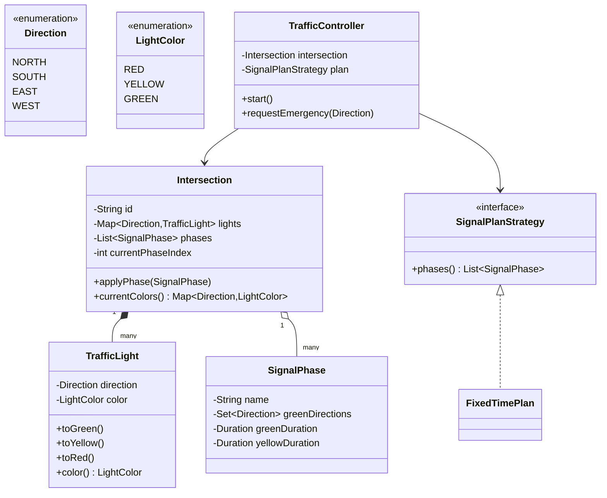
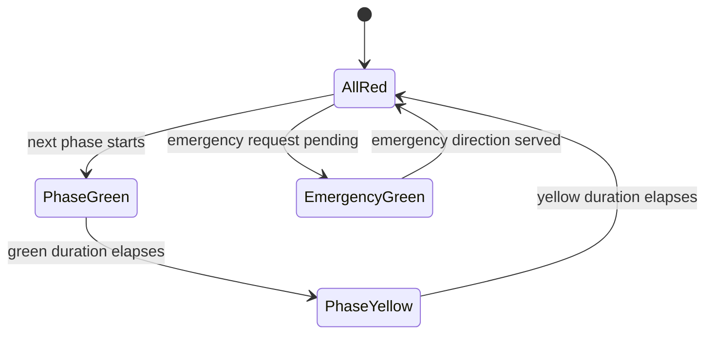

# Design a traffic control system

**A traffic control system cycles the signal lights at an intersection through safe, non-conflicting phases, and lets an emergency vehicle preempt the cycle.**

## Requirements

### Functional requirements

1. An intersection has roads coming from the north, south, east, and west. Each road has its own signal light.
2. Only certain combinations of directions may show green at the same time (for example, north-south together, but never north-east together).
3. The system moves through a fixed sequence of phases. Each phase holds a set of directions green for a duration, then switches to yellow, then red, before the next phase starts.
4. An emergency vehicle approaching from one direction can request priority. The system safely brings that direction to green ahead of its normal turn.
5. The system reports the current color of every direction's light at any time.

### Non-functional requirements

- Multiple intersections run independently, each on its own timer, without blocking each other.
- Switching from one phase to the next never produces a state where conflicting directions are both green.
- Adding a new phase plan (for example, an adaptive plan that reacts to traffic volume) shouldn't require changing the light or intersection classes.

### Out of scope

- Reading real sensor hardware or camera feeds. We assume a method call reports "high traffic" or "emergency vehicle detected".
- Coordinating timing across multiple intersections (a "green wave").
- Pedestrian button hardware, though we mention how to add pedestrian signals.

## Clarifying questions to ask

| Question | Assumption we make |
|---|---|
| How many directions does an intersection support? | Four: north, south, east, west. The design generalizes to more. |
| Can two non-conflicting directions be green at once? | Yes, that's what a phase is: a set of directions safe together. |
| What happens between two green phases? | Every phase passes through yellow, then all-red briefly, before the next phase goes green. |
| How does an emergency override work safely? | The controller finishes the current phase's yellow-and-red transition, then jumps to the requested direction, instead of switching directly from green to green. |
| Is timing fixed or adaptive? | Fixed by default, with a strategy interface so an adaptive plan can be swapped in. |

## Core entities

| Entity | Responsibility |
|---|---|
| `Direction` | One of the four approaches to the intersection |
| `LightColor` | RED, YELLOW, or GREEN |
| `TrafficLight` | Holds the current color for one direction |
| `SignalPhase` | A named set of directions that may be green together, with a duration |
| `Intersection` | Holds the lights and the ordered list of phases; knows the current phase |
| `SignalPlanStrategy` | Decides the phase order and durations |
| `TrafficController` | Runs the timer loop for one intersection and handles emergency requests |

## Class diagram



*`TrafficController` drives one `Intersection` using the phase list from a `SignalPlanStrategy`.*

## Key flows



*Every normal phase passes through an all-red gap; an emergency request is served from that same gap so no direction jumps straight from green to green.*

## Design patterns used

| Pattern | Where | Why |
|---|---|---|
| State | `LightColor` transitions guarded inside `TrafficLight` | The light rejects a transition that doesn't follow from its current color |
| Strategy | `SignalPlanStrategy` | Swap a fixed-time plan for an adaptive one without touching `Intersection` |
| Observer | `Intersection` notifies listeners on phase change | A display board or logging system can watch phase changes without `Intersection` knowing about them |

## Implementation

Enums and the phase definition:

```java
public enum Direction { NORTH, SOUTH, EAST, WEST }
public enum LightColor { RED, YELLOW, GREEN }

public record SignalPhase(String name, Set<Direction> greenDirections,
                           Duration greenDuration, Duration yellowDuration) {}
```

A light only exposes safe transitions and rejects an out-of-order call, so a caller can't skip a phase:

```java
public class TrafficLight {
    private final Direction direction;
    private volatile LightColor color = LightColor.RED;

    public TrafficLight(Direction direction) { this.direction = direction; }

    public synchronized void toGreen() {
        if (color != LightColor.RED) throw new IllegalStateException("Can only go green from red");
        color = LightColor.GREEN;
    }

    public synchronized void toYellow() {
        if (color != LightColor.GREEN) throw new IllegalStateException("Can only go yellow from green");
        color = LightColor.YELLOW;
    }

    // Red is the safe fallback from any color: used for the all-red gap and for startup.
    public synchronized void toRed() { color = LightColor.RED; }

    public Direction direction() { return direction; }
    public LightColor color() { return color; }
}
```

`Intersection` owns the lights and applies a phase across all of them, plus a small observer hook:

```java
public class Intersection {
    private final String id;
    private final Map<Direction, TrafficLight> lights = new EnumMap<>(Direction.class);
    private final List<Consumer<SignalPhase>> listeners = new ArrayList<>();

    public Intersection(String id, List<Direction> directions) {
        this.id = id;
        for (Direction d : directions) lights.put(d, new TrafficLight(d));
    }

    public void allRed() {
        lights.values().forEach(TrafficLight::toRed);
    }

    public void applyPhase(SignalPhase phase) {
        for (TrafficLight light : lights.values()) {
            if (phase.greenDirections().contains(light.direction())) light.toGreen();
        }
        listeners.forEach(l -> l.accept(phase));
    }

    public void allYellowExcept(SignalPhase phase) {
        for (TrafficLight light : lights.values()) {
            if (phase.greenDirections().contains(light.direction())) light.toYellow();
        }
    }

    public void onPhaseChange(Consumer<SignalPhase> listener) { listeners.add(listener); }

    public Map<Direction, LightColor> currentColors() {
        Map<Direction, LightColor> snapshot = new EnumMap<>(Direction.class);
        lights.forEach((d, light) -> snapshot.put(d, light.color()));
        return snapshot;
    }
}
```

The plan strategy holds the rule most likely to change: how long each phase runs, and in what order:

```java
public interface SignalPlanStrategy {
    List<SignalPhase> phases();
}

public class FixedTimePlan implements SignalPlanStrategy {
    private final List<SignalPhase> phases;
    public FixedTimePlan(List<SignalPhase> phases) { this.phases = phases; }
    public List<SignalPhase> phases() { return phases; }
}
```

`TrafficController` runs the timer loop and handles emergency preemption:

```java
public class TrafficController {
    private final Intersection intersection;
    private final SignalPlanStrategy plan;
    private final ScheduledExecutorService timer = Executors.newSingleThreadScheduledExecutor();
    private final AtomicReference<Direction> emergencyRequest = new AtomicReference<>();
    private int phaseIndex = 0;

    public TrafficController(Intersection intersection, SignalPlanStrategy plan) {
        this.intersection = intersection;
        this.plan = plan;
    }

    public void start() {
        intersection.allRed();
        timer.schedule(this::runNextPhase, 1, TimeUnit.SECONDS);
    }

    public void requestEmergency(Direction direction) {
        emergencyRequest.set(direction);
    }

    private void runNextPhase() {
        SignalPhase phase = nextPhase();
        intersection.applyPhase(phase);
        timer.schedule(() -> endPhase(phase), phase.greenDuration().toSeconds(), TimeUnit.SECONDS);
    }

    private void endPhase(SignalPhase phase) {
        intersection.allYellowExcept(phase);
        timer.schedule(() -> {
            intersection.allRed();
            timer.schedule(this::runNextPhase, 1, TimeUnit.SECONDS);
        }, phase.yellowDuration().toSeconds(), TimeUnit.SECONDS);
    }

    private SignalPhase nextPhase() {
        Direction requested = emergencyRequest.getAndSet(null);
        if (requested != null) {
            return plan.phases().stream()
                .filter(p -> p.greenDirections().contains(requested))
                .findFirst().orElse(plan.phases().get(phaseIndex));
        }
        SignalPhase phase = plan.phases().get(phaseIndex);
        phaseIndex = (phaseIndex + 1) % plan.phases().size();
        return phase;
    }
}
```

## Handling concurrency

- **Emergency request arrives mid-green.** `requestEmergency` only stores the direction in an `AtomicReference`. It never changes lights directly. `nextPhase` reads and clears it only when the controller reaches the safe all-red gap, so a direction never switches straight from green to green.
- **Multiple intersections.** Each `TrafficController` has its own `ScheduledExecutorService`. Intersections share no mutable state, so they never block each other.
- **Reading current colors while a phase changes.** `TrafficLight.color` is `volatile`, so a reader always sees the latest committed color, never a half-applied phase.
- **A bug in the controller calls a transition out of order.** `toGreen` and `toYellow` are `synchronized` and check the current color before changing it, so a coding mistake fails fast with an exception instead of silently producing an unsafe state.

## Extending the design

**How do you add pedestrian signals?**
Add a `PedestrianLight` keyed by `Direction`, and set it to walk only during the phase where the crossing direction's vehicle lights are red. Reuse the existing phase-change listener.

**How do you make the plan adaptive to traffic volume?**
Write an `AdaptivePlan implements SignalPlanStrategy` that reads a traffic sensor before returning the next phase's duration. `TrafficController` doesn't change.

**How would you coordinate a green wave across intersections?**
Add a shared clock and let a `SignalPlanStrategy` accept an offset per intersection, so downstream lights turn green a fixed number of seconds after upstream ones.

**What if two emergency vehicles request different directions at once?**
Keep a small priority queue instead of a single `AtomicReference`, and serve requests in arrival order at each all-red gap.

## Key takeaways

- Model each phase as a named set of directions that are safe together, not as individual light colors.
- Force every phase change through yellow and all-red, so conflicting directions can never both be green.
- Keep the phase order and durations behind a strategy interface, since that's the part most likely to change.
- Handle emergency preemption by queuing a request and applying it only at a safe transition point, not by mutating lights directly.
