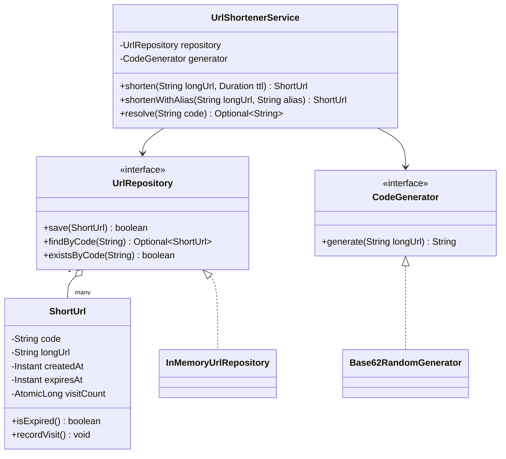
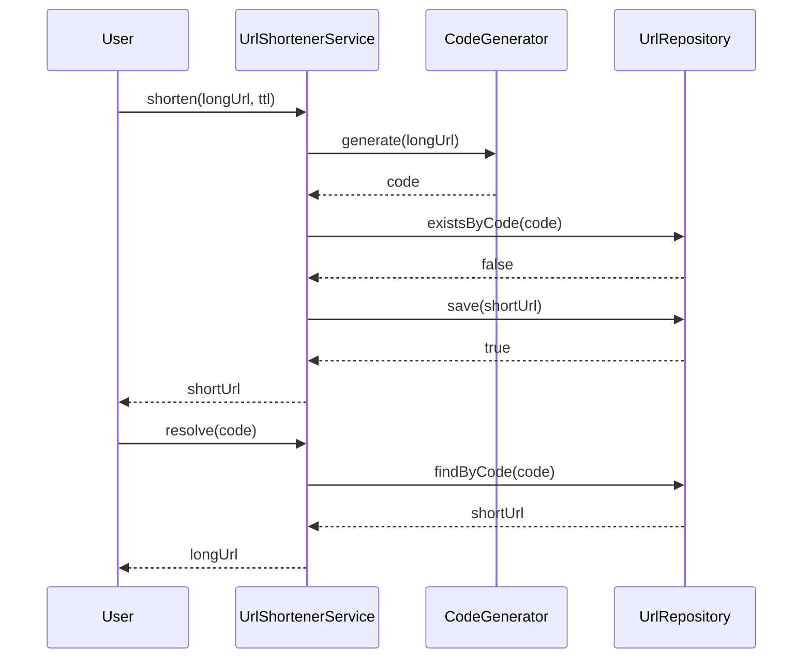

# Design a URL shortener

**A URL shortener takes a long URL and returns a short code that redirects back to it when visited.**

## Requirements

### Functional requirements

1. A user submits a long URL and gets back a short code (and full short URL).
2. Visiting the short URL redirects to the original long URL.
3. A short code can optionally expire after a set time.
4. A user can request a custom alias instead of a generated code.
5. The system tracks how many times each short code was visited.

### Non-functional requirements

- Code generation must not produce two different long URLs under the same code.
- Reads (redirects) vastly outnumber writes (new shortens); reads must be fast.
- Adding a new code-generation strategy shouldn't change the redirect path.

### Out of scope

- User accounts and authentication.
- Analytics beyond a visit counter (no geo or referrer breakdown).

## Clarifying questions to ask

| Question | Assumption we make |
|---|---|
| How long is a short code? | 7 characters from a base-62 alphabet. |
| What happens on a custom alias collision? | Reject with an error; the caller picks another. |
| Should shortening the same URL twice return the same code? | No, each request gets a new code unless a custom alias is given. |
| What happens when a code expires? | The redirect returns "not found" instead of the long URL. |

## Core entities

| Entity | Responsibility |
|---|---|
| `ShortUrl` | Holds the code, original URL, creation time, and expiry |
| `CodeGenerator` | Produces a short code for a new entry |
| `UrlRepository` | Stores and looks up `ShortUrl` by code |
| `UrlShortenerService` | Entry point: shortens and resolves URLs |

## Class diagram



*`UrlShortenerService` delegates code creation and storage, keeping both swappable behind interfaces.*

## Key flows



*Shortening retries generation on a collision; resolving is a single lookup plus an expiry check.*

## Design patterns used

| Pattern | Where | Why |
|---|---|---|
| Strategy | `CodeGenerator` | Swap random, sequential, or hash-based generation without touching the service |
| Repository | `UrlRepository` | Hide storage (in-memory, SQL, key-value store) behind one interface |
| Facade | `UrlShortenerService` | Callers use two methods and never touch storage or generation directly |

## Implementation

`ShortUrl` tracks its own expiry and visit count:

```java
public class ShortUrl {
    private final String code;
    private final String longUrl;
    private final Instant createdAt;
    private final Instant expiresAt;
    private final AtomicLong visitCount = new AtomicLong();

    public ShortUrl(String code, String longUrl, Instant createdAt, Instant expiresAt) {
        this.code = code;
        this.longUrl = longUrl;
        this.createdAt = createdAt;
        this.expiresAt = expiresAt;
    }

    public boolean isExpired() {
        return expiresAt != null && Instant.now().isAfter(expiresAt);
    }

    public void recordVisit() { visitCount.incrementAndGet(); }
    public long visitCount() { return visitCount.get(); }
    public String code() { return code; }
    public String longUrl() { return longUrl; }
}
```

The generator produces a random base-62 code; the repository is an in-memory stand-in for a real store:

```java
public interface CodeGenerator {
    String generate(String longUrl);
}

public class Base62RandomGenerator implements CodeGenerator {
    private static final String ALPHABET =
        "ABCDEFGHIJKLMNOPQRSTUVWXYZabcdefghijklmnopqrstuvwxyz0123456789";
    private static final int LENGTH = 7;
    private final SecureRandom random = new SecureRandom();

    public String generate(String longUrl) {
        StringBuilder sb = new StringBuilder(LENGTH);
        for (int i = 0; i < LENGTH; i++) {
            sb.append(ALPHABET.charAt(random.nextInt(ALPHABET.length())));
        }
        return sb.toString();
    }
}

public interface UrlRepository {
    boolean save(ShortUrl shortUrl);
    Optional<ShortUrl> findByCode(String code);
    boolean existsByCode(String code);
}

public class InMemoryUrlRepository implements UrlRepository {
    private final Map<String, ShortUrl> store = new ConcurrentHashMap<>();

    public boolean save(ShortUrl shortUrl) {
        return store.putIfAbsent(shortUrl.code(), shortUrl) == null;
    }

    public Optional<ShortUrl> findByCode(String code) {
        return Optional.ofNullable(store.get(code));
    }

    public boolean existsByCode(String code) {
        return store.containsKey(code);
    }
}
```

`UrlShortenerService` retries on a code collision and checks expiry on resolve:

```java
public class UrlShortenerService {
    private final UrlRepository repository;
    private final CodeGenerator generator;
    private static final int MAX_ATTEMPTS = 5;

    public UrlShortenerService(UrlRepository repository, CodeGenerator generator) {
        this.repository = repository;
        this.generator = generator;
    }

    public ShortUrl shorten(String longUrl, Duration ttl) {
        for (int attempt = 0; attempt < MAX_ATTEMPTS; attempt++) {
            String code = generator.generate(longUrl);
            ShortUrl candidate = buildShortUrl(code, longUrl, ttl);
            if (repository.save(candidate)) return candidate;
        }
        throw new IllegalStateException("Could not generate a unique code");
    }

    public ShortUrl shortenWithAlias(String longUrl, String alias) {
        if (repository.existsByCode(alias)) {
            throw new IllegalArgumentException("Alias already in use: " + alias);
        }
        ShortUrl shortUrl = buildShortUrl(alias, longUrl, null);
        if (!repository.save(shortUrl)) {
            throw new IllegalArgumentException("Alias already in use: " + alias);
        }
        return shortUrl;
    }

    public Optional<String> resolve(String code) {
        return repository.findByCode(code)
            .filter(s -> !s.isExpired())
            .map(s -> { s.recordVisit(); return s.longUrl(); });
    }

    private ShortUrl buildShortUrl(String code, String longUrl, Duration ttl) {
        Instant now = Instant.now();
        Instant expiry = ttl == null ? null : now.plus(ttl);
        return new ShortUrl(code, longUrl, now, expiry);
    }
}
```

## Handling concurrency

- **Two requests generating the same random code.** `save` uses `putIfAbsent`, which is atomic, so only one write wins; the loser retries with a new code.
- **Custom alias race.** `existsByCode` followed by `save` has a small race window; in production, rely on `putIfAbsent`'s atomicity as the real guard and treat the `existsByCode` check as a fast pre-check only.
- **High-volume redirects.** `resolve` is a read from `ConcurrentHashMap`, which scales well under concurrent reads; `recordVisit` uses `AtomicLong` so counting doesn't need a lock.
- **Code space exhaustion.** With a 7-character base-62 code, the space is large enough that collisions stay rare; `MAX_ATTEMPTS` protects against the rare case without an infinite loop.

## Extending the design

**How do you scale beyond a single in-memory store?**
Swap `InMemoryUrlRepository` for one backed by a distributed key-value store, keyed by code, with the same interface. `UrlShortenerService` doesn't change.

**How do you avoid random-code collisions at very large scale?**
Replace `Base62RandomGenerator` with a strategy that encodes a globally unique counter (for example, a database sequence or Snowflake ID) into base 62, removing the need to retry.

**How do you add click analytics beyond a raw count?**
Add a `VisitEvent` record and publish one on each `resolve` call. A separate analytics service consumes the events; `ShortUrl` keeps only the counter.

## Key takeaways

- Keep code generation and storage behind interfaces so either can change independently.
- Use atomic, single-operation writes (`putIfAbsent`) to avoid collisions without a global lock.
- Optimize the read path (`resolve`) since redirects dominate traffic.
- Treat a custom alias as a special case of the same save path, not a separate system.
