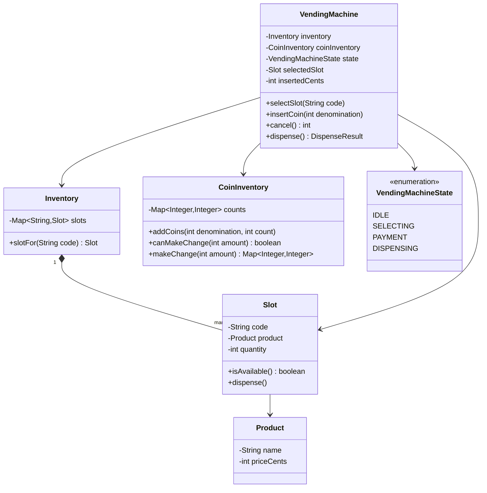
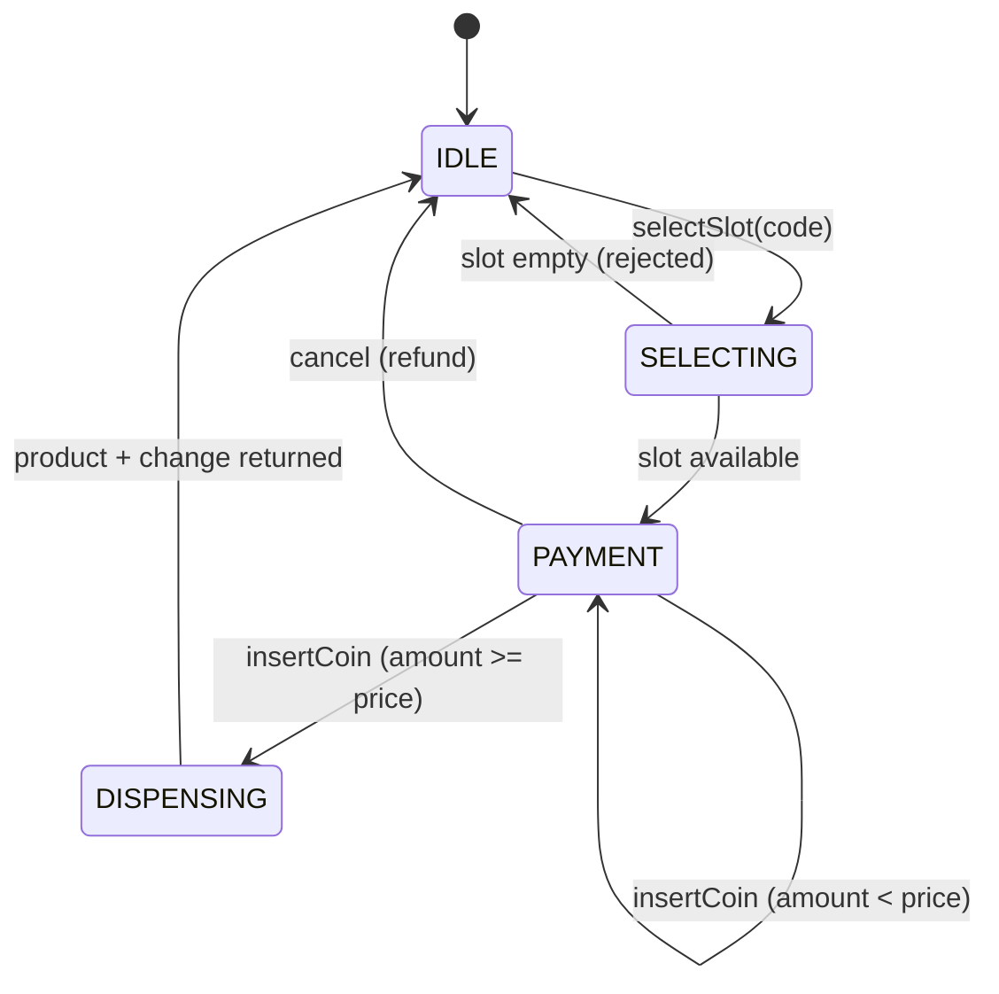

# Design a vending machine

**A vending machine accepts payment, lets a customer select a product, dispenses it if in stock, and returns change.**

## Requirements

### Functional requirements

1. Each slot holds one product type, a price, and a quantity.
2. A customer inserts coins or notes before or after selecting a product.
3. Once payment covers the price, the machine dispenses the product and returns any change.
4. If a selected slot is out of stock, the machine rejects the selection and refunds inserted money on request.
5. A customer can cancel the transaction at any point before dispensing, and get a full refund.

### Non-functional requirements

- The machine serves one customer transaction at a time; it must not mix money or selections between overlapping attempts.
- Adding a new payment method (card, mobile pay) shouldn't require changing the core dispensing logic.
- Change-making must use available coin inventory only; it must never promise change it can't make.

### Out of scope

- Physical currency validation (counterfeit detection).
- Remote inventory restocking and telemetry.

## Clarifying questions to ask

| Question | Assumption we make |
|---|---|
| Can a customer select before or after inserting money? | Either order works; the machine tracks both independently until both are ready. |
| What happens if exact change can't be made? | The transaction is rejected before dispensing, and inserted money is refunded. |
| Are multiple payment methods needed? | Model cash now; add card via the same interface later. |
| Can a customer add more money after an initial insert? | Yes, insertions accumulate until cancel or dispense. |

## Core entities

| Entity | Responsibility |
|---|---|
| `Product` | Name and price |
| `Slot` | Holds a product, its quantity, and a code (like "A3") |
| `Inventory` | Collection of slots; looks up and decrements stock |
| `CoinInventory` | Tracks coin/note counts and computes change |
| `VendingMachineState` | Enum for the transaction lifecycle |
| `VendingMachine` | Entry point: drives selection, payment, and dispensing |

## Class diagram



*`VendingMachine` coordinates `Inventory` for stock and `CoinInventory` for money; neither knows about the other.*

## Key flows



*Selection and payment can happen in either order in practice; the state machine gates dispensing on both being satisfied.*

## Design patterns used

| Pattern | Where | Why |
|---|---|---|
| State | `VendingMachineState` | Keeps selection, payment, and dispensing steps from happening out of order |
| Strategy (extension) | Payment handling | Lets cash and card share one `PaymentMethod` interface; see Extending the design |
| Facade | `VendingMachine` | Customer-facing API is `selectSlot`, `insertCoin`, `cancel`, `dispense` |

## Implementation

Core value types:

```java
public record Product(String name, int priceCents) {}

public class Slot {
    private final String code;
    private final Product product;
    private int quantity;

    public Slot(String code, Product product, int quantity) {
        this.code = code;
        this.product = product;
        this.quantity = quantity;
    }

    public boolean isAvailable() { return quantity > 0; }
    public void dispense() {
        if (!isAvailable()) throw new IllegalStateException("Slot " + code + " is empty");
        quantity--;
    }

    public String code() { return code; }
    public Product product() { return product; }
}

public enum VendingMachineState { IDLE, SELECTING, PAYMENT, DISPENSING }
public record DispenseResult(Product product, Map<Integer, Integer> change) {}
```

`Inventory` is a thin lookup over slots:

```java
public class Inventory {
    private final Map<String, Slot> slots;

    public Inventory(List<Slot> slotList) {
        this.slots = slotList.stream().collect(Collectors.toMap(Slot::code, s -> s));
    }

    public Slot slotFor(String code) {
        Slot slot = slots.get(code);
        if (slot == null) throw new IllegalArgumentException("No such slot: " + code);
        return slot;
    }
}
```

`CoinInventory` tracks denominations and makes change greedily, same idea as the ATM's dispenser:

```java
public class CoinInventory {
    private final TreeMap<Integer, Integer> counts = new TreeMap<>(Comparator.reverseOrder());

    public void addCoins(int denomination, int count) {
        counts.merge(denomination, count, Integer::sum);
    }

    public boolean canMakeChange(int amount) { return computeChange(amount) != null; }

    public synchronized Map<Integer, Integer> makeChange(int amount) {
        Map<Integer, Integer> plan = computeChange(amount);
        if (plan == null) throw new IllegalStateException("Cannot make change for " + amount);
        plan.forEach((denom, count) -> counts.merge(denom, -count, Integer::sum));
        return plan;
    }

    private Map<Integer, Integer> computeChange(int amount) {
        Map<Integer, Integer> plan = new LinkedHashMap<>();
        int remaining = amount;
        for (Map.Entry<Integer, Integer> entry : counts.entrySet()) {
            int denom = entry.getKey();
            int used = Math.min(remaining / denom, entry.getValue());
            if (used > 0) {
                plan.put(denom, used);
                remaining -= used * denom;
            }
        }
        return remaining == 0 ? plan : null;
    }
}
```

`VendingMachine` drives the state machine and coordinates the two subsystems:

```java
public class VendingMachine {
    private final Inventory inventory;
    private final CoinInventory coinInventory;
    private VendingMachineState state = VendingMachineState.IDLE;
    private Slot selectedSlot;
    private int insertedCents = 0;

    public VendingMachine(Inventory inventory, CoinInventory coinInventory) {
        this.inventory = inventory;
        this.coinInventory = coinInventory;
    }

    public synchronized void selectSlot(String code) {
        Slot slot = inventory.slotFor(code);
        if (!slot.isAvailable()) throw new IllegalStateException("Slot " + code + " is out of stock");
        selectedSlot = slot;
        if (state == VendingMachineState.IDLE) state = VendingMachineState.SELECTING;
        tryAdvanceToPayment();
    }

    public synchronized void insertCoin(int denomination) {
        if (state == VendingMachineState.IDLE) state = VendingMachineState.PAYMENT;
        insertedCents += denomination;
        tryAdvanceToPayment();
    }

    private void tryAdvanceToPayment() {
        if (selectedSlot != null && insertedCents > 0) state = VendingMachineState.PAYMENT;
    }

    public synchronized int cancel() {
        int refund = insertedCents;
        resetTransaction();
        return refund;
    }

    public synchronized DispenseResult dispense() {
        if (selectedSlot == null) {
            throw new IllegalStateException("No product selected");
        }
        int priceCents = selectedSlot.product().priceCents();
        if (insertedCents < priceCents) {
            throw new IllegalStateException("Payment incomplete");
        }
        int changeDue = insertedCents - priceCents;
        if (!coinInventory.canMakeChange(changeDue)) {
            throw new IllegalStateException("Cannot make exact change; transaction cancelled");
        }
        state = VendingMachineState.DISPENSING;
        selectedSlot.dispense();
        Map<Integer, Integer> change = coinInventory.makeChange(changeDue);
        DispenseResult result = new DispenseResult(selectedSlot.product(), change);
        resetTransaction();
        return result;
    }

    private void resetTransaction() {
        selectedSlot = null;
        insertedCents = 0;
        state = VendingMachineState.IDLE;
    }
}
```

## Handling concurrency

- **One transaction at a time.** All public methods are `synchronized` on the machine instance, so selection, payment, and dispensing for one customer can't interleave with another's.
- **Change-making commitment order.** `dispense()` checks `canMakeChange` before mutating slot quantity or coin counts, so a failed change check never leaves the machine having taken a product without giving change.
- **Stock decrement race.** `Slot.dispense()` is only called while holding the machine's lock via `dispense()`, so two near-simultaneous calls for the last unit can't both succeed.
- **Coin inventory growth.** `addCoins` (from a technician refilling, or from accepted payments) also happens under the machine's lock in a full implementation, to avoid a lost update on the counts map.

## Extending the design

**How would you add card payment alongside cash?**
Introduce a `PaymentMethod` interface with `insert(...)`/`amountCovered()` implementations for `CashPayment` and `CardPayment`. `VendingMachine` depends on the interface, not on coins directly.

**How would you support a machine with weight-sensor fault detection (product stuck)?**
Add a `DispenseSensor` that `dispense()` checks after physically triggering release; if the sensor doesn't confirm removal, refund the customer and flag the slot as faulty rather than decrementing stock.

**How would you support promotions like "buy 2 get 1 free"?**
Add a `PricingRule` interface that `VendingMachine` consults when computing `priceCents`, so pricing logic doesn't live inside the core dispensing flow.

## Key takeaways

- Use one lock (or a single-threaded actor) per machine, since a vending machine genuinely serves one customer at a time.
- Verify both stock and exact change are available before mutating any state, so a failure never leaves a half-completed transaction.
- Keep coin/change math in its own class; it's the same "greedy denomination breakdown" as a cash dispenser.
- A small state machine keeps selection and payment order-independent while still gating dispensing correctly.
